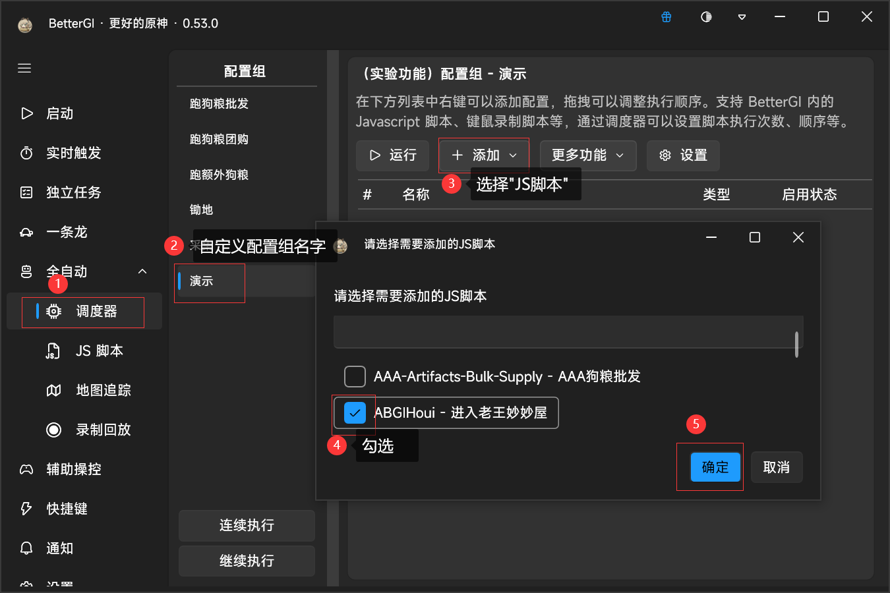
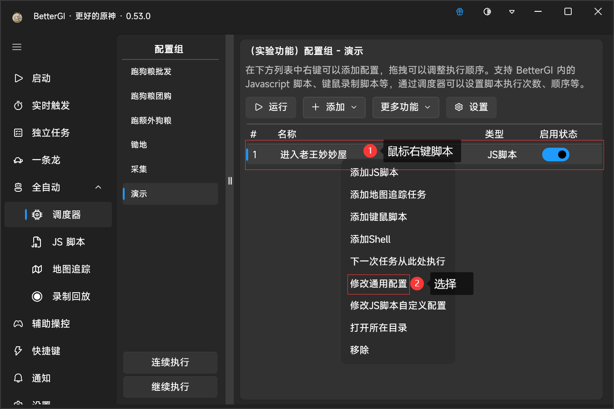
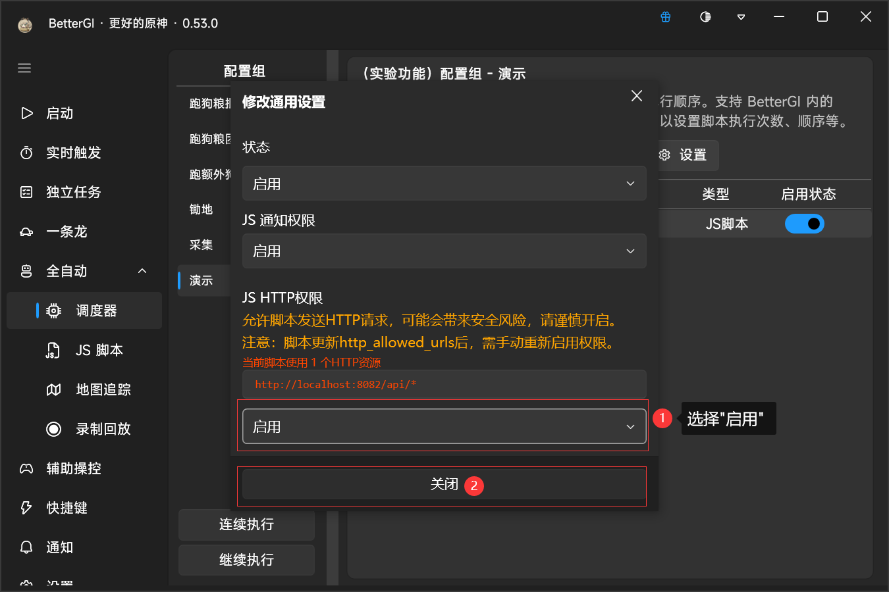
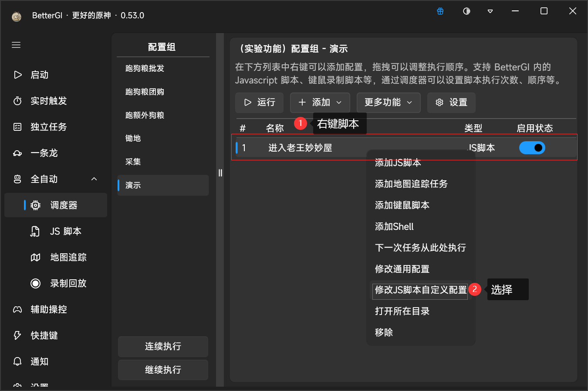
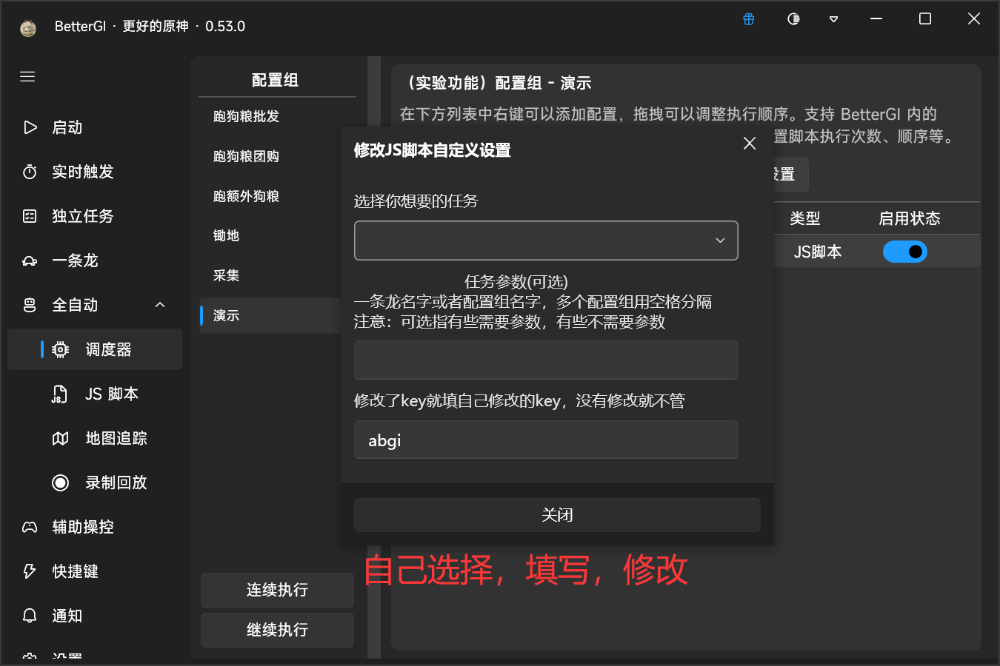
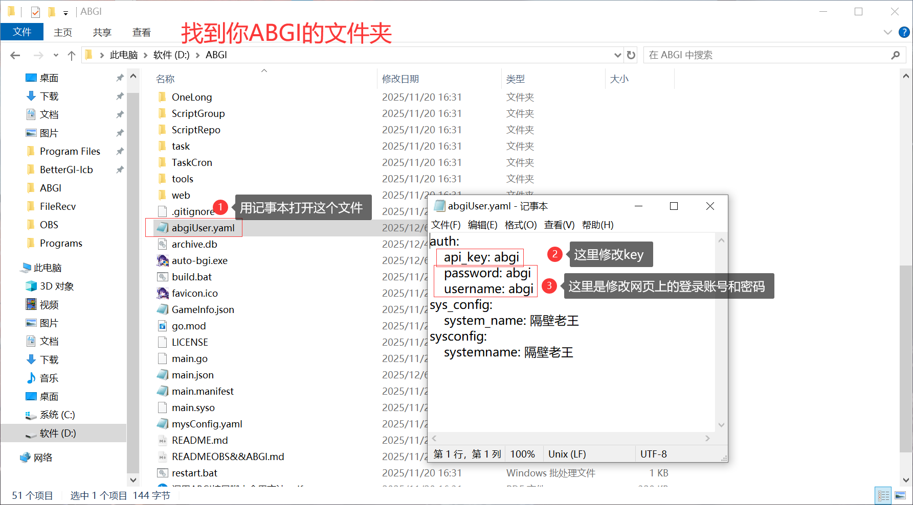

# ABGIHoui

## 介绍
#### 该脚本是搭配auto-bgi软件使用的
#### 不了解的可以去BetterGI的QQ频道搜索【auto-bgi】
#### 也可以电脑点击【[ABGI](https://gitee.com/wangjian0327/auto-bgi/blob/ginVue/README.md)】，进行学习，了解
##### 可调用的功能有      
      "—条龙",
      "米游社签到",
      "备份user",
      "脚本自动更新",
      "指定脚本更新",
      "今日配置组执行情况通知",
      "关闭原神和关闭bgi",
      "电脑静音",
      "狗粮联机上线",
      "狗粮联机调试上线",
      "联机下线",
      "开始obs录制",
      "结束obs录制",
      "配置组",
      "定时关机", 
      "启动bat脚本"

------

 ## 注意
 #### 使用`ABGIHoui`脚本时，`ABGI`最低版本为【3.2】

------

## 使用方法

#### 在`调度器`中新建`配置组`，`配置组`添加`ABGIHoui`右键脚本名字，找到【修改通用配置】将里面的【JS HTTP权限】下的`禁用`选择`启用`，在【修改JS脚本自定义设置】，选or填相关内容，最后一张图是修改key以及网页登录账号和密码

------

#### 图文教程步骤一：

#### 图文教程步骤二：

#### 图文教程步骤三：

#### 图文教程步骤四：

#### 图文教程步骤五

#### 图文教程步骤六

------

## 版本
#### 0.0.1
有不懂的加QQ群：215053644

