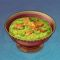

# 🍽️ 一只爱可菲脚本功能说明
主要功能：料理制作、全自动解锁自动烹饪、特殊料理制作、食材加工、~~不可制作的料理获取~~

食材加工系统可实现 **自动化批量加工**、**按需求计算目标产量**、**智能选择鱼类** 、**是否等待加工完成**、**矿石加速暂**等功能。

基于 **地图追踪 · OCR · 模板匹配** 的自动烹饪脚本，可实现 **一键刷满所有料理熟练度**。

实力派「技术料理」大师，芙宁娜亲封「甜点大校」，[前]德波大饭店主厨 爱可菲，向你致以问候。ヾ(≧▽≦*)o

---

## ⚠️（重要）时延设置
若需要使用手动烹饪，必须正确调整该参数，才能最大可能保证料理结果为“完美”。

---

## 🛠️ 时延设置方法

### **1. 初始准备**
- 确保 JS 脚本配置中的第一个设置项 **「启用脚本」未勾选**
- 确保 `时延` 为默认值 **86**

### **2. 打开烹饪界面**
进入任意料理的 **烹饪界面**（底部有“手动烹饪”按钮）。  
建议选择材料充足且不重要的料理，因为调试过程中可能会产出几个不完美料理。

### **3. 启动截图器**
打开 BGI → 左侧菜单 **“启动”** → 启动 BetterGI 截图器  
（若已启动，无需重复）

### **4. 在调度器运行脚本**
运行后 BGI 会自动打开游戏并开始手动烹饪。

### **5. 根据滑块位置调整时延**
观察滑块最终停留的位置，并调整 JS 脚本配置中的 `时延` 数值  
（建议每次调整 **1–20**）：

- 滑块停在完美区域 **左侧** → **增大** `时延`
- 滑块停在完美区域 **右侧** → **减小** `时延`

### **6. 调节成功标准**
- **1–3 星料理**：滑块停在完美区域的左侧或中间
- **4/5 星料理**：滑块停在完美区域的正中间

### **7. 启用脚本**
在认真阅读完整 README 后，勾选 JS 脚本配置中的 **「启用脚本」**。

---

## ⭐ 刷满熟练度功能
启用该功能后，已选择的料理和数量将不会生效。  
脚本会默认刷取 **所有未满熟练度的料理**。  
启用前请确保所有原料充足。

默认刷取次数：**料理星级 × 5**，如果检测到自动烹饪解锁，则会提前终止刷取

---

## ✨ 特殊料理

### **选择烹饪数量的应用对象**

```烹饪次数```：根据填入的```烹饪数量```，填入多少次就烹饪多少次

```预期的特殊料理数```：根据填入的```烹饪数量```，计算出“必出”概率

 - 假设10%的概率出特殊料理，那么```烹饪数量```为5的情况下就烹饪 10 * 5 = 50次
 - 内置的特殊料理爆率如下（游戏内具体爆率未知，以下表格仅供参考）
   <details>
     <summary> 点击展开 </summary>
   
     | 星级	 | 奇怪    | 普通    | 美味   |
     |-----|-------|-------|------|
     | 1	  | 0.1	  | 0.15	 | 0.2  |
     | 2	  | 0.1	  | 0.1	  | 0.15 |
     | 3	  | 0.05	 | 0.1	  | 0.15 |
     | 4	  | 0.05	 | 0.05	 | 0.1  |
      注：爱可菲美味15%
     
   </details>

---

## ⚙️ 食材加工模式

### **选择加工数量的应用对象**

```食材加工次数```  
根据填写的 **加工数量**，脚本会执行对应次数的加工操作。  
适用于：你已经明确知道要加工多少次。

```预期的食材数量（持有总量）```  
根据填写的 **加工数量**，脚本会计算需要加工的次数，以达到目标持有量。  
适用于：你希望最终持有某个食材达到指定数量。

> 例如：
> - 你已有 20 份面粉，想要总共 100 份
> - 则填写 `100`，脚本会自动计算需要加工 80 次
>
> 若为鱼肉加工，则按 **加工数量 × 产出倍率** 计算（不同鱼类产量不同）。

### **加工数量（1–9999）**

- 若填写 **单个数字** → 应用于所有已勾选的食材
- 若填写 **多个数字（空格分隔）** → 按顺序对应每个食材
- 若数量不足，则未指定的食材默认视为 `0`

示例：
```
10 5 0 20
```
表示：
- 第 1 个食材加工 10 次
- 第 2 个加工 5 次
- 第 3 个不加工
- 第 4 个加工 20 次  
  （依此类推）

## 可加工食材列表

可勾选的加工项目包括：

- 面粉
- 兽肉
- 鱼肉（特殊规则见下）
- 神秘的肉加工产物
- 奶油
- 熏禽肉
- 黄油
- 火腿
- 糖
- 香辛料
- 蟹黄
- 果酱
- 奶酪
- 培根
- 香肠

> **注意：鱼肉加工的默认单位为 1 条鱼 → 1 份鱼肉**  
> 若选择特定鱼类，则按其产出倍率计算。

## 鱼类选择（用于鱼肉加工）

若勾选了 **鱼肉** 加工，则可进一步选择用于加工的鱼类。

- 若 **未选择任何鱼类** → 使用游戏默认鱼类
- 若 **选择了鱼类** → 按选择顺序依次使用
- 若为 **预期的食材数量模式** → 按 `加工数量 × 产出倍率` 计算所需鱼类数量

可选鱼类包括（部分示例）：

- 花鳉、琉璃花鳉、甜甜花鳉、蓝染花鳉（默认）
- 擒霞客、水晶宴、肺棘鱼、斗棘鱼、鸩棘鱼
- 赤魔王、雪中君、金赤假龙、锖假龙
- …（完整列表见配置项）

## 使用矿石加速

支持勾选用于加速加工的矿石类型，例如：

- 铁块：-20s
- 白铁块：-40s
- 水晶块：-60s
- 魔晶块：-60s
- 星银矿石：-40s
- 紫晶块：-60s
- 萃凝晶：-60s
- 虹滴晶：-60s

> 若未选择或矿石耗尽，则脚本会自动等待加工完成。

## 矿石保留数量

该值能确保持有的矿石不会低于此数

---

## ⭐ 全局设置

### **检测到食材不足时**

```跳过此料理```：如果检测到食材不足，则不进行烹饪操作，直接跳过当前料理，继续烹饪下一个料理

```用尽食材```：与```禁用```类似，但是会根据已有食材动态计算实际的料理次数，留出1份料理所需的食材，然后继续烹饪下一个料理

```禁用```：会关闭检测步骤，节省时间，用尽食材后会跳过当前料理继续烹饪下一个料理

### **自动烹饪未解锁时**

如果勾选了```刷满熟练度```，则该项无效

### **[烹饪]角色加成**

如果没要找到指定的角色加成，则默认选择12%概率产出2倍料理，否则不做选择（保留游戏默认角色）

### **[加工]等待食材加工完成**

勾选后，将在制作料理后等待全部完成再退出，未勾选则直接退出不等待（例如，设置加工200次，在第一轮设置完99次[加工次数上限]加工后直接退出）

---

## 🛠️ 其他说明

1. 如果在```选择料理```处选择了重复的料理，仍视作选择1次
2. 对应的```烹饪数量```设置单个数值将应用到所有选择的料理，如果使用空格隔开数值设置多个料理的数量，需要确保数值的数量等于实际选择的料理数（若出现重复项，只计入出现的第一个重复项）
   - 例：选择的料理 A B C A B D 设置的数值 1 2 3 4 ，分别代表A: 1, B: 2, C: 3, D: 4
   - 注意：```烹饪数量```的顺序为对应的```选择料理```处从左到右、从上到下
3. JS脚本配置的食谱顺序与游戏内基本一致（可以使用游戏内的筛选功能，快速找到料理）
4. 运行前确保料理不会超过2000上限
5. 若料理已解锁自动烹饪，则不会使用手动烹饪。
6. 请务必确保材料充足（如果材料不足有可能导致卡死）

---

## 🍱 脚本内置料理一览
<details>
  <summary> 点击展开 </summary>

| 图标 | 名称 | 稀有度 | 类别 | 类型 | 效果说明 | 获取方式 | 所属地区 | 所需食材 |
| - | - | - | - | - | - | - | - | - |
|  | 如同焦炭的蘑幻之菇 | 3 | 不可制作,视觉效果 | 探索获取 | <div>不吃为妙！</div> | <div>在挪德卡莱·皮拉米达城正西方的一处哨站与NPC别蕾娜对话并完成她的委托后，与一旁的大烤炉交互并提交一份  蘑幻之菇  所需的食材后，等待大烤炉将食材彻底烤焦后获得。</div> | 挪德卡莱 |  |
|  | 蘑幻之菇 | 3 | 复活 | 正常料理 | <div>复苏选中的角色，为其恢复1200点生命值。</div> | <div>烹饪获得</div><div></div><div>【食谱】在挪德卡莱·皮拉米达城正西方的一处哨站与NPC别蕾娜对话并完成她的委托后获得该食谱。</div> | 挪德卡莱 | 蘑菇(3),黑麦粉(3),洋葱(2),夏槲果(2) |
|  | 蔬菜罐罐汤 | 3 | 恢复血量 | 正常料理 | <div>为选中的角色恢复生命值上限的32%，并额外恢复1250点生命值。</div> | <div>烹饪获得</div><div></div><div>【食谱】挪德卡莱·皮拉米达城西南方的钢铁大桥桥墩处击败2波怪物后开启精致的宝箱获得该食谱。</div> | 挪德卡莱 | 卷心菜(3),胡萝卜(3),土豆(2),酸奶油(2) |
|  | 篝火边的欢腾 | 3 | 提升暴击 | 正常料理 | <div>队伍中所有角色暴击率提升15%，持续300秒。多人游戏时，仅对自己的角色生效。</div> | <div>烹饪获得</div><div></div><div>【食谱】在挪德卡莱·皮拉米达城正西方的一处哨站与NPC别蕾娜对话并完成她的委托后，开启精致的宝箱获得该食谱。</div> | 挪德卡莱 | 兽肉(2),火腿(1),香肠(1),胡椒(1) |
|  | 花果草糖 | 3 | 生命上限提升 | 正常料理 | <div>队伍中所有角色生命值上限提升22%，持续300秒。多人游戏时，仅对自己的角色生效。</div> | <div>烹饪获得</div><div></div><div>【食谱】那夏镇「斯佩兰扎」购买</div> | 挪德卡莱 | 宿影花(2),冬凌草(2),夏槲果(2),白灵果(2) |
|  | 皎月渺渺 | 3 | 生命上限提升 | 特殊料理 | <div>队伍中所有角色生命值上限提升30%，持续300秒。多人游戏时，仅对自己的角色生效。</div> | <div>烹饪获得</div><div>【角色】  哥伦比娅  </div><div>【食谱】  花果草糖  </div> | 挪德卡莱 | 宿影花(2),冬凌草(2),夏槲果(2),白灵果(2) |
|  | 香辛炸鸡块 | 4 | 持续恢复 | 正常料理 | <div>立即为选中的角色恢复生命值上限的32%，并在之后的30秒内，每5秒恢复730点生命值。</div> | <div>烹饪获得</div><div></div><div>【食谱】「原神×Duolingo」联动活动第二期连续完成3天任务获取（国际服限定）</div> | 其他 | 禽肉(4),面粉(3),香辛料(2),薄荷(2) |
|  | 苹果焖肉（初试版） | 3 | 恢复血量 | 特殊料理 | <div>为选中的角色恢复生命值上限的40%，并额外恢复2350点生命值。</div> | <div>烹饪获得</div><div>【角色】  杜林  </div><div>【食谱】  北地苹果焖肉  </div> | 蒙德 | 兽肉(3),苹果(3),黄油(1),胡椒(1) |
|  | 「课后作业」 | 3 | 恢复血量 | 特殊料理 | <div>为选中的角色恢复生命值上限的40%，并额外恢复2350点生命值。</div> | <div>烹饪获得</div><div>【角色】  雅珂达  </div><div>【食谱】  双果卷  </div> | 挪德卡莱 | 面粉(3),夏槲果(2),白灵果(2),糖(1) |
|  | 糖雕·月灵 | 2 | 其他,不可制作 | 探索获取,限时 | <div>好看又好吃，但是几乎没什么用。</div> | <div>完成魔神任务：空月之歌·第六幕「散于晨雾的月芒」后，与那夏镇乌娜亚塔对话获得（每日仅能获得一种糖雕）</div> | 挪德卡莱 |  |
|  | 糖雕·雅珂达 | 2 | 其他,不可制作 | 探索获取,限时 | <div>好看又好吃，但是几乎没什么用。</div> | <div>队伍中有  雅珂达  时与那夏镇乌娜亚塔对话获得（每日仅能获得一种糖雕）</div> | 挪德卡莱 |  |
|  | 白灵果派 | 3 | 恢复体力 | 正常料理 | <div>恢复85点体力。</div> | <div>烹饪获得</div><div></div><div>【食谱】那夏镇「斯佩兰扎」购买</div> | 挪德卡莱 | 白灵果(3),夏槲果(3),黑麦粉(2),酸奶油(1) |
|  | 糖雕·奈芙尔 | 2 | 其他,不可制作 | 探索获取,限时 | <div>好看又好吃，但是几乎没什么用。</div> | <div>队伍中有  奈芙尔  时与那夏镇乌娜亚塔对话获得（每日仅能获得一种糖雕）</div> | 挪德卡莱 |  |
|  | 奶油鲑鱼汤 | 2 | 持续恢复 | 正常料理 | <div>立即为选中的角色恢复生命值上限的20%，并在之后的30秒内，每5秒恢复390点生命值。</div> | <div>烹饪获得</div><div></div><div>【食谱】那夏镇「斯佩兰扎」购买</div> | 挪德卡莱 | 鱼肉(2),土豆(1),胡萝卜(1),奶油(1) |
|  | 「秘闻交易」 | 2 | 复活 | 特殊料理 | <div>复苏选中的角色，为其恢复生命值上限的15%，并额外恢复550点生命值。</div> | <div>烹饪获得</div><div>【角色】  奈芙尔  </div><div>【食谱】  绿汁脆球  </div> | 须弥 | 土豆(2),秃秃豆(2),香辛料(1) |
|  | 边陲之地 | 2 | 不可制作,恢复体力 | 饮品 | <div>恢复80点体力。</div> | <div>挪德卡莱「旗舰」购买</div> | 挪德卡莱 |  |
|  | 野浆果之路 | 2 | 不可制作,持续恢复 | 饮品 | <div>立即为选中的角色恢复生命值上限的26%，并在之后的30秒内，每5秒恢复570点生命值。</div> | <div>挪德卡莱「旗舰」购买</div> | 挪德卡莱 |  |
|  | 「皮拉米达的夜莺」 | 2 | 不可制作,恢复血量 | 饮品 | <div>为选中的角色恢复生命值上限的30%，并额外恢复1750点生命值。</div> | <div>挪德卡莱「旗舰」购买</div> | 挪德卡莱 |  |
|  | 转盘特调 | 3 | 减少体力消耗 | 正常料理,饮品 | <div>队伍中所有角色攀爬和冲刺消耗的体力降低20%，持续900秒。多人游戏时，仅对自己的角色生效。</div> | <div>烹饪获得</div><div></div><div>【食谱】在挪德卡莱·那夏镇地区「旗舰」酒吧里面与NPC德米安对话购买该食谱。</div> | 挪德卡莱 | 白灵果(3),夏槲果(3),宿影花(2),薄荷(1) |
|  | 夏槲蛋糕 | 3 | 复活 | 正常料理 | <div>复苏选中的角色，为其恢复1200点生命值。</div> | <div>烹饪获得</div><div>那夏镇「斯佩兰扎」购买获得</div><div></div><div>【食谱】那夏镇「斯佩兰扎」购买</div> | 挪德卡莱 | 夏槲果(3),面粉(3),鸟蛋(2),酸奶油(1) |
|  | 双果卷 | 3 | 恢复血量 | 正常料理 | <div>为选中的角色恢复生命值上限的32%，并额外恢复1250点生命值。</div> | <div>烹饪获得</div><div>挪德卡莱·那夏镇NPC林布处购买获得</div><div></div><div>【食谱】挪德卡莱·那夏镇NPC林布处购买获得</div> | 挪德卡莱 | 面粉(3),夏槲果(2),白灵果(2),糖(1) |
|  | 今日收获 | 3 | 持续恢复 | 正常料理 | <div>立即为选中的角色恢复生命值上限的28%。并在之后的30秒内，每5秒恢复620点生命值。</div> | <div>烹饪获得</div><div></div><div>【食谱】挪德卡莱·希汐岛霜月之坊地区附近的屋内开启精致的宝箱获得该食谱。</div> | 挪德卡莱 | 夏槲果(3),白灵果(2),宿影花(2),蘑菇(1) |
|  | 白灵蛋卷 | 3 | 提升护盾 | 正常料理 | <div>队伍中所有角色护盾强效提升25%，持续300秒。多人游戏时，仅对自己的角色生效。</div> | <div>烹饪获得</div><div></div><div>【食谱】  伊涅芙  逸闻伊涅芙·事关蛋卷获取</div> | 挪德卡莱 | 白灵果(3),面粉(3),鸟蛋(2),酸奶油(1) |
|  | 脆脆烤肉 | 3 | 提升攻击 | 正常料理 | <div>队伍中所有角色攻击力提高194点，持续300秒。多人游戏时，仅对自己的角色生效。</div> | <div>烹饪获得</div><div>那夏镇「斯佩兰扎」购买获得</div><div></div><div>【食谱】那夏镇「斯佩兰扎」购买</div> | 挪德卡莱 | 兽肉(4),土豆(3),盐(2),酸奶油(1) |
|  | 嘎吱嘎吱甜甜杯 | 3 | 复活 | 特殊料理 | <div>复苏选中的角色，为其恢复生命值上限的20%，并额外恢复1500点生命值。</div> | <div>烹饪获得</div><div>【角色】  爱诺  </div><div>【食谱】  夏槲蛋糕  </div> | 挪德卡莱 | 夏槲果(3),面粉(3),鸟蛋(2),酸奶油(1) |
|  | 林间低语 | 3 | 持续恢复 | 特殊料理 | <div>立即为选中的角色恢复生命值上限的34%，并在之后的30秒内，每5秒恢复980点生命值。</div> | <div>烹饪获得</div><div>【角色】  菈乌玛  </div><div>【食谱】  今日收获  </div> | 挪德卡莱 | 夏槲果(3),白灵果(2),宿影花(2),蘑菇(1) |
|  | 「轰雷电光斩！」 | 3 | 提升护盾 | 特殊料理 | <div>队伍中所有角色护盾强效提升35%，持续300秒。多人游戏时，仅对自己的角色生效。</div> | <div>烹饪获得</div><div>【角色】  伊涅芙  </div><div>【食谱】  白灵蛋卷  </div> | 挪德卡莱 | 白灵果(3),面粉(3),鸟蛋(3),酸奶油(1) |
|  | 糖雕·菲林斯 | 2 | 其他,不可制作 | 探索获取,限时 | <div>好看又好吃，但是几乎没什么用。</div> | <div>队伍中有  菲林斯  时与那夏镇乌娜亚塔对话获得（每日仅能获得一种糖雕）</div> | 挪德卡莱 |  |
|  | 糖雕·菈乌玛 | 2 | 其他,不可制作 | 探索获取,限时 | <div>好看又好吃，但是几乎没什么用。</div> | <div>队伍中有  菈乌玛  时与那夏镇乌娜亚塔对话获得（每日仅能获得一种糖雕）</div> | 挪德卡莱 |  |
|  | 糖雕·伊涅芙 | 2 | 其他,不可制作 | 探索获取,限时 | <div>好看又好吃，但是几乎没什么用。</div> | <div>队伍中有  伊涅芙  时与那夏镇乌娜亚塔对话获得（每日仅能获得一种糖雕）</div> | 挪德卡莱 |  |
|  | 糖雕·爱诺 | 2 | 其他,不可制作 | 探索获取,限时 | <div>好看又好吃，但是几乎没什么用。</div> | <div>队伍中有  爱诺  时与那夏镇乌娜亚塔对话获得（每日仅能获得一种糖雕）</div> | 挪德卡莱 |  |
|  | 糖雕·霜鳍鲸 | 2 | 其他,不可制作 | 探索获取,限时 | <div>好看又好吃，但是几乎没什么用。</div> | <div>与那夏镇乌娜亚塔对话获得（每日仅能获得一种糖雕）</div> | 挪德卡莱 |  |
|  | 糖雕·凛角鹿 | 2 | 其他,不可制作 | 探索获取,限时 | <div>好看又好吃，但是几乎没什么用。</div> | <div>与那夏镇乌娜亚塔对话获得（每日仅能获得一种糖雕）</div> | 挪德卡莱 |  |
|  | 糖雕·海崖鹦 | 2 | 其他,不可制作 | 探索获取,限时 | <div>好看又好吃，但是几乎没什么用。</div> | <div>与那夏镇乌娜亚塔对话获得（每日仅能获得一种糖雕）</div> | 挪德卡莱 |  |
|  | 糖雕·帔髦獾 | 2 | 其他,不可制作 | 探索获取,限时 | <div>好看又好吃，但是几乎没什么用。</div> | <div>与那夏镇乌娜亚塔对话获得（每日仅能获得一种糖雕）</div> | 挪德卡莱 |  |
|  | 糖雕·双辉长翎鹮 | 2 | 其他,不可制作 | 探索获取,限时 | <div>好看又好吃，但是几乎没什么用。</div> | <div>与那夏镇乌娜亚塔对话获得（每日仅能获得一种糖雕）</div> | 挪德卡莱 |  |
|  | 浆果煎肉 | 2 | 复活 | 正常料理 | <div>复苏选中的角色，为其恢复400点生命值。</div> | <div>烹饪获得</div><div></div><div>【食谱】在挪德卡莱·那夏镇地区「旗舰」酒吧里面与NPC德米安对话购买该食谱。</div> | 挪德卡莱 | 兽肉(1),土豆(1),夏槲果(1),白灵果(1) |
|  | 白灵果酿鸡 | 2 | 恢复血量 | 正常料理 | <div>为选中的角色恢复生命值上限的22%，并额外恢复1200点生命值。</div> | <div>烹饪获得</div><div>那夏镇「斯佩兰扎」购买获得</div><div></div><div>【食谱】那夏镇「斯佩兰扎」购买</div> | 挪德卡莱 | 禽肉(1),白灵果(1),酸奶油(1) |
|  | 挪德卡莱热狗 | 2 | 提升暴击 | 正常料理 | <div>队伍中所有角色暴击率提升9%，持续300秒。</div><div>多人游戏时，仅对自己的角色生效。</div> | <div>烹饪获得</div><div>那夏镇「斯佩兰扎」购买获得</div><div></div><div>【食谱】那夏镇「斯佩兰扎」购买</div> | 挪德卡莱 | 面粉(1),洋葱(1),番茄(1),香肠(1) |
|  | 边地薄饼 | 2 | 提升防御 | 正常料理 | <div>队伍中所有角色防御力提高107点持续300秒。多人游戏时，仅对自己的角色生效。</div> | <div>烹饪获得</div><div></div><div>【食谱】在挪德卡莱·蓝珀湖地区完成寻回方块机器人解密后，在「铁鲸上校」底部船舱开启精致的宝箱获得该食谱。</div> | 挪德卡莱 | 黑麦粉(3),盐(2),寒涌石(2) |
|  | 苹果酿（米卡逸闻） | 2 | 持续恢复,不可制作 | 饮品 | <div>立即为选中的角色恢复生命值上限的26%，并在之后的30秒内，每5秒恢复570点生命值。</div> | <div>完成游逸旅闻米卡·为信而来获得</div> | 蒙德 |  |
|  | 烟熏鱼排 | 1 | 恢复血量 | 正常料理 | <div>为选中的角色恢复生命值上限的9%，并额外恢复1000点生命值。</div> | <div>烹饪获得</div><div></div><div>【食谱】在挪德卡莱·终夜长茔地区完成隐藏世界任务「厨子的诉说」后，开启精致的宝箱获得该食谱。</div> | 挪德卡莱 | 鱼肉(1),盐(1) |
|  | 长夜燃火 | 1 | 恢复血量 | 特殊料理 | <div>为选中的角色恢复生命值上限的16%，并额外回复1350点生命值。</div> | <div>烹饪获得</div><div>【角色】  菲林斯  </div><div>【食谱】  烟熏鱼排  </div> | 挪德卡莱 | 鱼肉(1),盐(1) |
|  | 小小阿夏包 | 4 | 持续恢复,其他 | 正常料理,视觉效果 | <div>来自悠悠度假村的小小惊喜。</div><div>彩蛋效果：每8秒恢复1点生命值，共计回复5点生命值。</div> | <div>烹饪获得</div><div></div><div>【食谱】在纳塔悠悠度假村·悠悠集市地区完成「七色悠悠像」挑战后开启华丽的宝箱获得该食谱。</div> | 纳塔 | 禽肉(1),洋葱(1),面粉(1),奶酪(1) |
|  | 徐徐海风吹 | 3 | 减少体力消耗 | 正常料理,饮品 | <div>队伍中所有角色攀爬和冲刺消耗的体力降低20%，持续900秒。多人游戏时，仅对自己的角色生效。</div> | <div>烹饪获得</div><div></div><div>【食谱】在纳塔悠悠度假村·浪浪湾地区与NPC哈雅库对话选择「需要帮忙吗？」接取外卖委托，然后与目标位置一位身体埋在沙滩里的NPC对话完成委托，开启精致的宝箱获得该食谱。</div> | 纳塔 | 青蜜莓(2),薄荷(2),糖(1) |
|  | 娜娜丝梨饼 | 3 | 提升攻击 | 正常料理 | <div>队伍中所有角色攻击力提高194点，持续300秒。多人游戏时，仅对自己的角色生效。</div> | <div>烹饪获得</div><div></div><div>【食谱】完成传说任务「绘夏！烈日？度假村！」其四·「收幕！将夏夜染作缤纷！」后获得该食谱。</div> | 纳塔 | 鸟蛋(4),苦种(2),面粉(2),糖(1) |
|  | 虾肉浓汤 | 3 | 提升治疗效果 | 正常料理 | <div>队伍中所有角色治疗加成提升17%，持续300秒。多人游戏时，仅对自己的角色生效。</div> | <div>烹饪获得</div><div>纳塔悠悠度假村悠悠集市「鱼群之家」购买获得</div><div></div><div>【食谱】在纳塔悠悠度假村·悠悠集市地区先与NPC拉威亚对话选择「新鲜的气息？」后，再与NPC特乌兹特利对话获得该食谱。</div> | 纳塔 | 虾仁(4),洋葱(3),土豆(3),颗粒果(2) |
|  | 肉肉盛宴餐 | 4 | 提升攻击,提升暴击 | 正常料理,活动料理 | <div>队伍中所有角色攻击力提高272点，暴击率提升8%，持续300秒。</div><div>多人游戏时，仅对自己的角色生效。</div> | <div>烹饪获得</div><div></div><div>【食谱】肯德基×原神「夺堡奇兵」联动活动邮件获取</div> | 其他 | 禽肉(5),虾仁(4),咖啡豆(3),面粉(3) |
|  | 九果甘露饮 | 3 | 提升暴击 | 正常料理 | <div>队伍中所有角色暴击率提升15%，持续300秒。多人游戏时，仅对自己的角色生效。</div> | <div>烹饪获得</div><div></div><div>【食谱】肯德基×原神「夺堡奇兵」联动活动邮件获取</div> | 其他 | 墩墩桃(2),日落果(2),苹果(2),树莓(2) |
|  | 鲜奶珠珠派 | 3 | 提升防御 | 正常料理 | <div>队伍中所有角色防御力提高200点，持续300秒。多人游戏时，仅对自己的角色生效。</div> | <div>烹饪获得</div><div></div><div>【食谱】肯德基×原神「夺堡奇兵」联动活动邮件获取</div> | 其他 | 牛奶(4),面粉(2),黄油(2),糖(1) |
|  | 「欢夜畅谈」 | 3 | 持续恢复 | 特殊料理 | <div>立即为选中的角色恢复生命值上限的34%，并在之后的30秒内，每5秒恢复980点生命值。</div> | <div>烹饪获得</div><div>【角色】  塔利雅  </div><div>【食谱】  鲜虾脆薯盏  </div> | 蒙德 | 薄荷(4),虾仁(4),土豆(3),树莓(2) |
|  | 「暗渊之获」 | 1 | 恢复血量 | 特殊料理 | <div>为选中的角色恢复生命值上限的16%，并额外回复1350点生命值。</div> | <div>烹饪获得</div><div>【角色】  丝柯克  </div><div>【食谱】  薄荷酱烤鱼  </div> | 纳塔 | 鱼肉(1),薄荷(1) |
|  | 鎏金殿堂 | 5 | 提升攻击,提升暴击伤害,不可制作 | 角色技能获取 | <div>队伍中所有角色攻击力提高372点，暴击伤害提升24%，持续300秒。多人游戏时，仅对自己的角色生效。</div> | <div>通过  爱可菲  的生活天赋「时时刻刻的即兴料理」获得</div> | 枫丹 |  |
|  | 贝壳彩糖 | 4 | 提升防御,提升护盾 | 正常料理,活动料理 | <div>队伍中所有角色护盾强效提升30%，防御力提高200点，持续300秒。多人游戏时，仅对自己的角色生效。</div> | <div>烹饪获得</div><div></div><div>【食谱】在5.6版本「和旋舞剧」活动中，「乐园经营」玩法达成指定累计营收后获得该食谱</div> | 枫丹 | 汐藻(3),泡泡桔(3),薄荷(3),糖(2) |
|  | 德波小蛋糕·改良型 | 4 | 提升攻击,提升暴击 | 正常料理 | <div>队伍中所有角色攻击力提高272点，暴击率提升8%，持续300秒。多人游戏时，仅对自己的角色生效。</div> | <div>烹饪获得</div><div></div><div>【食谱】完成爱可菲的传说任务「香糕塔之章·第一幕」-「珍上至珍」后获得该食谱。</div> | 枫丹 | 海露花(3),鸟蛋(3),面粉(2),奶油(2) |
|  | 德波大蛋糕·绚丽型 | 4 | 提升攻击,提升暴击 | 特殊料理 | <div>队伍中所有角色攻击力提高384点，暴击率提升14%，持续300秒。多人游戏时，仅对自己的角色生效。</div> | <div>烹饪获得</div><div>【角色】  爱可菲  </div><div>【食谱】  德波小蛋糕·改良型  </div> | 枫丹 | 海露花(3),鸟蛋(3),面粉(2),奶油(2) |
|  | 一捧绿野 | 4 | 提升攻击,提升暴击,不可制作 | 角色技能获取 | <div>队伍中所有角色攻击力提高320点，暴击率提升10%，持续300秒。多人游戏时，仅对自己的角色生效。</div> | <div>通过  爱可菲  的生活天赋「时时刻刻的即兴料理」获得</div> | 枫丹 |  |
|  | 雾凇秋分 | 4 | 恢复血量,不可制作 | 角色技能获取 | <div>为选中的角色恢复生命值上限的42%，并额外恢复2850点生命值。</div> | <div>通过  爱可菲  的生活天赋「时时刻刻的即兴料理」获得</div> | 枫丹 |  |
|  | 「情感支持」 | 3 | 提升防御 | 特殊料理 | <div>队伍中所有角色防御力提高282点，持续300秒。多人游戏时，仅对自己的角色生效。</div> | <div>烹饪获得</div><div>【角色】  伊法  </div><div>【食谱】  苦水  </div> | 纳塔 | 苦种(3),薄荷(3),牛奶(3),糖(1) |
|  | 白浪拂沙 | 3 | 减少体力消耗,不可制作 | 角色技能获取 | <div>队伍中所有角色冲刺消耗的体力和水中消耗的耐力降低25%，持续900秒。多人游戏时，仅对自己的角色生效。</div> | <div>通过  爱可菲  的生活天赋「时时刻刻的即兴料理」获得</div> | 枫丹 |  |
|  | 酪香蟹蟹锅 | 5 | 生命上限提升,元素充能效率提升 | 正常料理 | <div>队伍中所有角色生命值上限提升25%，元素充能效率提升17%，持续300秒。多人游戏时，仅对自己的角色生效。</div> | <div>烹饪获得</div><div>纳塔悠悠度假村悠悠集市「鱼群之家」购买获得</div><div></div><div>【食谱】纳塔地区声望“「话事处」的赠礼”中，有6个部族声望等级达到上限后获得该食谱。</div> | 纳塔 | 螃蟹(6),面粉(5),牛奶(4),奶酪(4) |
|  | 丰稔之赐 | 4 | 持续恢复,其他 | 正常料理,视觉效果 | <div>来自沃陆之邦部族的小小惊喜。</div><div>彩蛋效果：每8秒恢复1点生命值，共计回复5点生命值。</div> | <div>烹饪获得</div><div></div><div>【食谱】纳塔·沃陆之邦部族声望系统2级奖励</div> | 纳塔 | 颗粒果(1),兽肉(1),鸟蛋(1),牛奶(1) |
|  | 455特饮 | 3 | 复活 | 饮品,正常料理 | <div>复苏选中的角色，为其恢复1200点生命值。</div> | <div>烹饪获得</div><div>「脉动×原神」联动活动概率获取</div><div></div><div>【食谱】「脉动×原神」联动活动邮件获取</div> | 其他 | 绯樱绣球(2),薄荷(2),盐(1) |
|  | 沃陆果饮 | 3 | 持续恢复 | 正常料理 | <div>立即为选中的角色恢复生命值上限的28%。并在之后的30秒内，每5秒恢复620点生命值。</div> | <div>烹饪获得</div><div></div><div>【食谱】纳塔安饶之野果园内或是「沃陆之邦」最北侧房屋旁「运转机器」放入食材后，化身突角龙或使用沃陆之邦角色撞击按钮后获得食谱。</div> | 纳塔 | 苦种(3),颗粒果(2),青蜜莓(1),鸟蛋(1) |
|  | 粒果膨膨棒 | 2 | 恢复血量 | 正常料理 | <div>为选中的角色恢复生命值上限的22%，并额外恢复1200点生命值。</div> | <div>烹饪获得/使用阿托力旁的机器，运转机器获得</div><div></div><div>【食谱】纳塔沃陆之邦部族营地「豪宴热斗」比赛会场与NPC加莫莉对话获得该食谱。</div> | 纳塔 | 颗粒果(2),糖(1) |
|  | 酪烤菇菇串 | 2 | 提升暴击 | 正常料理 | <div>队伍中所有角色暴击率提升9%，持续300秒。</div><div>多人游戏时，仅对自己的角色生效。</div> | <div>烹饪获得</div><div></div><div>【食谱】部族任务 蘑境菌奇第二幕：果园小憩 获得</div> | 纳塔 | 红果果菇(2),颗粒果(1),奶酪(1) |
|  | 金牌健康餐 | 2 | 复活 | 特殊料理 | <div>复苏选中的角色，为其恢复生命值上限的15%，并额外恢复550点生命值。</div> | <div>烹饪获得</div><div>【角色】  伊安珊  </div><div>【食谱】  多彩之森  </div> | 纳塔 | 颗粒果(2),番茄(1),洋葱(1),薄荷(1) |
|  | 菇菇山脉（单人份） | 2 | 提升暴击 | 特殊料理 | <div>队伍中所有角色暴击率提升16%，持续300秒。多人游戏时，仅对自己的角色生效。</div> | <div>烹饪获得</div><div>【角色】  瓦雷莎  </div><div>【食谱】  酪烤菇菇串  </div> | 纳塔 | 红果果菇(2),颗粒果(1),奶酪(1) |
|  | 乌乌黑蛋 | 1 | 恢复血量,其他 | 正常料理,视觉效果 | <div>为选中的角色恢复生命值上限的9%，并额外恢复1000点生命值。</div> | <div>烹饪获得</div><div></div><div>【食谱】纳塔安饶之野地区「图兰大火山」左下角的地上传送锚点附近，与站在珍贵的宝箱旁的NPC伦图对话并完成他的「火山蛋挑战」后，再次与他对话获得该食谱。</div> | 纳塔 | 鸟蛋(2) |
|  | 钱汤馒头 | 3 | 恢复体力 | 正常料理 | <div>恢复85点体力。</div> | <div>烹饪获得</div><div></div><div>【食谱】稻妻城志村屋购买获得</div> | 稻妻 | 面粉(4),堇瓜(3),糖(2) |
|  | 「一梦治愈」 | 3 | 恢复体力 | 特殊料理 | <div>恢复130点体力。</div> | <div>烹饪获得</div><div>【角色】  梦见月瑞希  </div><div>【食谱】  钱汤馒头  </div> | 稻妻 | 面粉(4),堇瓜(3),糖(2) |
|  | 梅落雪间醉 | 4 | 提升防御,提升治疗效果 | 正常料理,活动料理 | <div>队伍中所有角色防御力提高261点，治疗效果提升8%，持续300秒。多人游戏时，仅对自己的角色生效。</div> | <div>烹饪获得</div><div></div><div>【食谱】5.3版本限时活动「春曦画桃符」完成第一幕「璃月港佳节兴，八奇现瘴疠隐」后获得该食谱。</div> | 璃月 | 螃蟹(2),火腿(2),蟹黄(1),鸟蛋(1) |
|  | 炎岩之颂 | 3 | 提升暴击 | 正常料理 | <div>队伍中所有角色暴击率提升15%，持续300秒。多人游戏时，仅对自己的角色生效。</div> | <div>烹饪获得</div><div></div><div>【食谱】纳塔圣火竞技场·楚汶市集扎坎小吃摊购买获得</div> | 纳塔 | 颗粒果(4),土豆(2),洋葱(2),鱼肉(2) |
|  | 「独门秘法」 | 3 | 复活 | 特殊料理 | <div>复苏选中的角色，为其恢复生命值上限的20%，并额外恢复1500点生命值。</div> | <div>烹饪获得</div><div>【角色】  茜特菈莉  </div><div>【食谱】  塔塔可  </div> | 纳塔 | 颗粒果(3),虾仁(2),奶酪(2),洋葱(1) |
|  | 「簇火赞歌」 | 3 | 提升暴击,提升暴击伤害 | 特殊料理 | <div>队伍中所有角色暴击率提升20%，暴击伤害提升20%，持续300秒。多人游戏时，仅对自己的角色生效。</div> | <div>烹饪获得</div><div>【角色】  玛薇卡  </div><div>【食谱】  炎岩之颂  </div> | 纳塔 | 颗粒果(4),土豆(2),洋葱(2),鱼肉(2) |
|  | 清心花饼 | 2 | 恢复体力 | 正常料理 | <div>恢复50点体力。</div> | <div>烹饪获得</div><div></div><div>【食谱】璃月沉玉谷遗珑埠小吃摊购买获得</div> | 璃月 | 清心(1),面粉(1),糖(1) |
|  | 玉剪着花 | 2 | 恢复体力 | 特殊料理 | <div>恢复80点体力。</div> | <div>烹饪获得</div><div>【角色】  蓝砚  </div><div>【食谱】  清心花饼  </div> | 璃月 | 清心(1),面粉(1),糖(1) |
|  | 纵声欢唱 | 4 | 持续恢复,其他 | 正常料理,视觉效果 | <div>来自花羽会部族的小小惊喜。</div><div>彩蛋效果：每8秒恢复1点生命值，共计回复5点生命值。</div> | <div>烹饪获得</div><div></div><div>【食谱】纳塔·花羽会部族声望系统2级奖励</div> | 纳塔 | 薄荷(1),烬芯花(1),糖(1),果酱(1) |
|  | 奇瑰之汤 | 4 | 持续恢复,其他 | 正常料理,视觉效果 | <div>来自烟谜主部族的小小惊喜。</div><div>彩蛋效果：每8秒恢复1点生命值，共计回复5点生命值。</div> | <div>烹饪获得</div><div></div><div>【食谱】纳塔·烟谜主部族声望系统2级奖励</div> | 纳塔 | 颗粒果(1),烬芯花(1),糖(1),果酱(1) |
|  | 山与海与天空 | 3 | 减少体力消耗 | 正常料理 | <div>队伍中所有角色滑翔和冲刺消耗的体力降低20%，持续900秒。多人游戏时，仅对自己的角色生效。</div> | <div>烹饪获得</div><div></div><div>【食谱】先完成纳塔地区大型系列任务「流灰之国的迷旅人」·第二章「遥望苍天之梦」的「启程，苍天航路」任务，接着在浮空岛上的「源火祭坛」旁边完成限时挑战开启精致的宝箱后获得该食谱。</div> | 纳塔 | 禽肉(2),兽肉(2),鱼肉(2),颗粒果(2) |
|  | 火山蛋糕 | 3 | 复活 | 正常料理 | <div>复苏选中的角色，为其恢复1200点生命值。</div> | <div>烹饪获得</div><div></div><div>【食谱】纳塔野外「烟谜主」地区西南方的山底海边处完成火元素方碑解谜并击败随之出现的怪物，开启精致的宝箱后获得该食谱。</div> | 纳塔 | 苦种(2),糖(2),鸟蛋(1),面粉(1) |
|  | 歇止一刻 | 3 | 减少体力消耗 | 特殊料理 | <div>队伍中所有角色滑翔和冲刺消耗的体力降低25%，持续1800秒。多人游戏时，仅对自己的角色生效。</div> | <div>烹饪获得</div><div>【角色】  恰斯卡  </div><div>【食谱】  山与海与天空  </div> | 纳塔 | 禽肉(2),兽肉(2),鱼肉(2),颗粒果(2) |
|  | 粒果裹裹 | 2 | 提升防御 | 正常料理 | <div>队伍中所有角色防御力提高107点，持续300秒。多人游戏时，仅对自己的角色生效。</div> | <div>烹饪获得</div><div></div><div>【食谱】纳塔地区「烟谜主」部族主城的山底的一处部族营地开启普通的宝箱后获得该食谱。</div> | 纳塔 | 颗粒果(2),禽肉(2) |
|  | 蜜汁腌鱼 | 2 | 提升攻击 | 特殊料理 | <div>队伍中所有角色攻击力提高114点，持续300秒。多人游戏时，仅对自己的角色生效。</div> | <div>烹饪获得</div><div>【角色】  欧洛伦  </div><div>【食谱】  酸汁腌鱼  </div> | 纳塔 | 鱼肉(2),洋葱(2),番茄(2) |
|  | 苦水 | 3 | 提升防御 | 正常料理 | <div>队伍中所有角色防御力提高200点，持续300秒。多人游戏时，仅对自己的角色生效。</div> | <div>烹饪获得</div><div></div><div>【食谱】纳塔圣火竞技场·楚汶市集扎坎小吃摊处购买食谱</div> | 纳塔 | 苦种(3),薄荷(3),牛奶(3),糖(1) |
|  | 果味奶糖 | 3 | 恢复体力 | 特殊料理 | <div>恢复130点体力。</div> | <div>烹饪获得</div><div>【角色】  希诺宁  </div><div>【食谱】  巧克力  </div> | 纳塔 | 苦种(4),牛奶(3),糖(1) |
|  | 串烤牛心 | 2 | 恢复体力 | 正常料理 | <div>恢复50点体力。</div> | <div>烹饪获得</div><div></div><div>【食谱】纳塔圣火竞技场·楚汶市集西帕克处购买食谱</div> | 纳塔 | 兽肉(2),土豆(2),颗粒果(1) |
|  | 咚咚嘭嘭 | 4 | 持续恢复,其他 | 正常料理,视觉效果 | <div>来自悬木人部族的小小惊喜。</div><div>彩蛋效果：每8秒恢复1点生命值，共计回复5点生命值。</div> | <div>烹饪获得</div><div></div><div>【食谱】纳塔·悬木人部族声望系统2级奖励</div> | 纳塔 | 颗粒果(1),糖(1),盐(1),胡椒(1) |
|  | 宝石闪闪 | 4 | 持续恢复,其他 | 正常料理,视觉效果 | <div>来自回声之子部族的小小惊喜。</div><div>彩蛋效果：每8秒恢复1点生命值，共计回复5点生命值。</div> | <div>烹饪获得</div><div></div><div>【食谱】纳塔·回声之子部族声望系统2级奖励</div> | 纳塔 | 苦种(1),澄晶实(1),颗粒果(1),薄荷(1) |
|  | 温泉时光 | 4 | 持续恢复,其他 | 正常料理,视觉效果 | <div>来自流泉之众部族的小小惊喜。</div><div>彩蛋效果：每8秒恢复1点生命值，共计回复5点生命值。</div> | <div>烹饪获得</div><div></div><div>【食谱】纳塔·流泉之众部族声望系统2级奖励</div> | 纳塔 | 面粉(1),颗粒果(1),苦种(1),奶酪(1) |
|  | 苹果金条条 | 4 | 提升攻击,提升暴击 | 正常料理,活动料理 | <div>队伍中所有角色攻击力提高272点，暴击率提升8%，持续300秒。多人游戏时，仅对自己的角色生效。</div> | <div>烹饪获得</div><div></div><div>【食谱】美国「原神×麦当劳」联动活动购买指定联动餐品获取兑换码兑换该食谱（国际服限定）</div> | 其他 | 苹果(4),面粉(3),黄油(2),糖(2) |
|  | 塔塔可 | 3 | 复活 | 正常料理 | <div>复苏选中的角色，为其恢复1200点生命值。</div> | <div>烹饪获得</div><div>纳塔圣火竞技场·楚汶市集扎坎小吃摊购买获得</div><div></div><div>【食谱】纳塔圣火竞技场·楚汶市集与NPC夏安卡对话获得</div> | 纳塔 | 颗粒果(3),虾仁(2),奶酪(2),洋葱(1) |
|  | 巧克力 | 3 | 恢复体力 | 正常料理 | <div>恢复85点体力。</div> | <div>烹饪获得</div><div></div><div>【食谱】纳塔野外「回声之子」地区七天神像南方池塘的一处部族营地开启精致的宝箱后获得该食谱</div> | 纳塔 | 苦种(4),牛奶(3),糖(1) |
|  | 奇旅馔匣 | 3 | 恢复血量 | 正常料理 | <div>为选中的角色恢复生命值上限的32%，并额外恢复1250点生命值</div> | <div>烹饪获得</div><div></div><div>【食谱】5.0版本限时网页活动「提瓦特心意速递」完成6份快递后获得该食谱</div> | 其他 | 面粉(1),鸟蛋(1),黄油(1),果酱(1) |
|  | 龙龙饼干 | 3 | 恢复血量 | 正常料理 | <div>为选中的角色恢复生命值上限的32%，并额外恢复1250点生命值</div> | <div>烹饪获得</div><div>纳塔圣火竞技场·楚汶市集NPC西帕克处购买获得</div><div></div><div>【食谱】纳塔野外圣遗物秘境「虹灵的净土」东北方的传送锚点，传送至该锚点后经旁边的洞穴隧道抵达一处峭壁上的部族营地开启精致的宝箱后获得该食谱</div> | 纳塔 | 面粉(3),苦种(3),颗粒果(2),黄油(1) |
|  | 夹心土豆泥 | 3 | 持续恢复 | 正常料理 | <div>立即为选中的角色恢复生命值上限的28%。并在之后的30秒内，每5秒恢复620点生命值。</div> | <div>烹饪获得</div><div></div><div>【食谱】纳塔野外「硫晶支脉」地区东南方的一处部族营地的哨塔上开启精致的宝箱后获得该食谱</div> | 纳塔 | 土豆(4),鱼肉(3),禽肉(2),洋葱(2) |
|  | 炸虾豆球 | 3 | 提升护盾 | 正常料理 | <div>队伍中所有角色护盾强效提升25%，持续300秒。多人游戏时，仅对自己的角色生效。</div> | <div>烹饪获得</div><div>纳塔圣火竞技场·楚汶市集NPC西帕克处购买获得</div><div></div><div>【食谱】纳塔野外武器材料秘境「深古瞭望所」南方山头上的一处部族营地的哨塔上开启精致的宝箱后获得该食谱</div> | 纳塔 | 秃秃豆(4),面粉(4),虾仁(3),洋葱(3) |
|  | 火焰炖肉 | 3 | 提升暴击 | 正常料理 | <div>队伍中所有角色暴击率提升15%，持续300秒。多人游戏时，仅对自己的角色生效。</div> | <div>烹饪获得</div><div>纳塔圣火竞技场·楚汶市集扎坎小吃摊购买获得</div><div></div><div>【食谱】纳塔野外「柴薪之丘」地区北部山底的一处部族营地开启精致的宝箱后获得该食谱</div> | 纳塔 | 兽肉(4),秃秃豆(3),番茄(3),洋葱(2) |
|  | 苹果卷卷 | 3 | 环境交互恢复 | 正常料理 | <div>激活石化古树、地脉衍出，或者开启宝箱后，为队伍中所有角色恢复18%生命值，并额外恢复900点生命值，此效果每5秒至多触发一次，持续900秒。多人游戏时，仅对自己的角色生效。</div> | <div>烹饪获得</div><div></div><div>【食谱】蒙德城猎鹿人购买获得</div> | 蒙德 | 苹果(4),面粉(2),鸟蛋(2),黄油(1) |
|  | 兽肉旋风 | 3 | 环境交互恢复 | 正常料理 | <div>队伍中任意角色击败敌人后，恢复20点体力，此效果每3秒至多触发一次，持续900秒。多人游戏时，仅对自己的角色生效。</div> | <div>烹饪获得</div><div></div><div>【食谱】蒙德城猎鹿人购买获得</div> | 蒙德 | 兽肉(2),培根(2),土豆(1),洋葱(1) |
|  | 好运传递 | 3 | 提升护盾 | 特殊料理 | <div>队伍中所有角色护盾强效提升35%，持续300秒。多人游戏时，仅对自己的角色生效。</div> | <div>烹饪获得</div><div>【角色】  玛拉妮  </div><div>【食谱】  炸虾豆球  </div> | 纳塔 | 秃秃豆(4),面粉(4),虾仁(3),洋葱(3) |
|  | 猎龙者的犒赏 | 3 | 提升暴击,提升暴击伤害 | 特殊料理 | <div>队伍中所有角色暴击率提升20%，暴击伤害提升20%，持续300秒。多人游戏时，仅对自己的角色生效。</div> | <div>烹饪获得</div><div>【角色】  基尼奇  </div><div>【食谱】  火焰炖肉  </div> | 纳塔 | 兽肉(4),秃秃豆(3),番茄(3),洋葱(2) |
|  | 「强水」 | 3 | 提升暴击,提升伤害 | 饮品 | <div>队伍中所有角色物理伤害提升45%，暴击率提升10%，受到的伤害提升20%，持续30秒。多人游戏时，仅对自己的角色生效。</div> | <div>炼金台合成获得</div><div></div><div>【食谱】完成纳塔世界任务「合成台疑案」后，于游戏内夜间在纳塔圣火竞技场东北方的传送锚点下方与NPC桑科约克对话获得</div> | 纳塔 | 烛伞蘑菇(2),肉龙掌(1) |
|  | 多彩之森 | 2 | 复活 | 正常料理 | <div>复苏选中的角色，为其恢复400点生命值。</div> | <div>烹饪获得</div><div></div><div>【食谱】纳塔·祖遗庙宇接取世界任务「将夜晚放还于夜晚」，任务过程中在NPC雷格巴的营地开启珍贵的宝箱获得该食谱</div> | 纳塔 | 颗粒果(2),番茄(1),洋葱(1),薄荷(1) |
|  | 粒果肉汤 | 2 | 恢复血量 | 正常料理 | <div>为选中的角色恢复生命值上限的22%，并额外恢复1200点生命值。</div> | <div>烹饪获得</div><div>纳塔圣火竞技场·楚汶市集扎坎小吃摊购买获得</div><div></div><div>【食谱】纳塔圣火竞技场·楚汶市集扎坎小吃摊购买</div> | 纳塔 | 颗粒果(2),洋葱(1),禽肉(1),卷心菜(1) |
|  | 粒果片片 | 2 | 持续恢复 | 正常料理 | <div>立即为选中的角色恢复生命值上限的20%，并在之后的30秒内，每5秒恢复390点生命值。</div> | <div>烹饪获得</div><div>纳塔圣火竞技场·楚汶市集西帕克处购买</div><div></div><div>【食谱】纳塔圣火竞技场·楚汶市集西帕克处购买</div> | 纳塔 | 颗粒果(2),禽肉(1),奶酪(1) |
|  | 酸汁腌鱼 | 2 | 提升攻击 | 正常料理 | <div>队伍中所有角色攻击力提高81点，持续300秒。多人游戏时，仅对自己的角色生效。</div> | <div>烹饪获得</div><div>纳塔悠悠度假村悠悠集市「鱼群之家」购买获得</div><div></div><div>【食谱】纳塔地区世界任务「爱龙人的平凡生活」完成后获得该食谱</div> | 纳塔 | 鱼肉(2),洋葱(2),番茄(2) |
|  | 齐齐整整 | 2 | 持续恢复 | 特殊料理 | <div>立即为选中的角色恢复生命值上限的26%，并在之后的30秒内，每5秒恢复570点生命值。</div> | <div>烹饪获得</div><div>【角色】  卡齐娜  </div><div>【食谱】  粒果片片  </div> | 纳塔 | 颗粒果(2),禽肉(1),奶酪(1) |
|  | 薄荷酱烤鱼 | 1 | 恢复血量 | 正常料理 | <div>为选中的角色恢复生命值上限的9%，并额外恢复1000点生命值。</div> | <div>烹饪获得</div><div>纳塔悠悠度假村悠悠集市「鱼群之家」购买获得</div><div></div><div>【食谱】纳塔圣火竞技场·楚汶市集NPC西帕克处购买</div> | 纳塔 | 鱼肉(1),薄荷(1) |
|  | 粒果杯 | 1 | 恢复血量,持续恢复 | 正常料理 | <div>立即为选中的角色恢复生命值上限的9%，并在之后的30秒内，每5秒恢复260点生命值。</div> | <div>烹饪获得</div><div>纳塔圣火竞技场·楚汶市集扎坎小吃摊购买获得</div><div></div><div>【食谱】纳塔圣火竞技场·楚汶市集扎坎小吃摊购买</div> | 纳塔 | 颗粒果(1),烬芯花(1) |
|  | 膨膨冰淇淋 | 4 | 提升防御,提升治疗效果 | 正常料理,活动料理 | <div>队伍中所有角色防御力提高261点，治疗效果提升8%，持续300秒。</div><div>多人游戏时，仅对自己的角色生效。</div> | <div>烹饪获得</div><div></div><div>【食谱】肯德基×原神「奇迹瞬间 美味再现」联动活动邮件获取</div> | 其他 | 牛奶(4),糖(4),盐(2),奶油(2) |
|  | 酥酥羊角包 | 3 | 减少体力消耗 | 正常料理,活动料理 | <div>队伍中所有角色攀爬和冲刺消耗的体力降低20%，持续900秒。</div><div>多人游戏时，仅对自己的角色生效。</div> | <div>烹饪获得</div><div></div><div>【食谱】肯德基×原神「奇迹瞬间 美味再现」联动活动邮件获取</div> | 其他 | 面粉(3),黄油(2),咖啡豆(2),糖(2) |
|  | 奶油炖鸡 | 3 | 提升攻击 | 正常料理 | <div>队伍中所有角色攻击力提高194点，持续300秒。多人游戏时，仅对自己的角色生效。</div> | <div>烹饪获得</div><div></div><div>【食谱】枫丹廷德波大饭店内购买食谱</div> | 枫丹 | 禽肉(4),发酵果实汁(3),洋葱(3),奶油(2) |
|  | 香馥繁味 | 3 | 提升攻击 | 特殊料理 | <div>队伍中所有角色攻击力提高274点，持续300秒。多人游戏时，仅对自己的角色生效。</div> | <div>烹饪获得</div><div>【角色】  艾梅莉埃  </div><div>【食谱】  奶油炖鸡  </div> | 枫丹 | 禽肉(4),发酵果实汁(3),洋葱(3),奶油(2) |
|  | 魔术特调 | 3 | 其他,不可制作,持续恢复 | 饮品,视觉效果 | <div>立即为选中角色恢复1点生命值，并在之后的20秒左右内，每秒恢复1点生命值。</div> | <div>肯德基×原神「奇迹瞬间 美味再现」联动活动邮件获取</div> | 其他 |  |
|  | 膳食均衡餐 | 3 | 持续恢复 | 特殊料理 | <div>立即为选中的角色恢复生命值上限的34%，并在之后的30秒内，每5秒恢复980点生命值。</div> | <div>烹饪获得</div><div>【角色】  希格雯  </div><div>【食谱】  泡泡舒芙蕾  </div> | 枫丹 | 泡泡桔(3),鸟蛋(2),牛奶(2),糖(1) |
|  | 桔香鸭胸肉 | 2 | 恢复体力 | 正常料理 | <div>恢复50点体力。</div> | <div>烹饪获得</div><div></div><div>【食谱】枫丹廷德波大饭店内购买食谱</div> | 枫丹 | 泡泡桔(2),禽肉(2) |
|  | 「猎获」 | 2 | 恢复体力 | 特殊料理 | <div>恢复80点体力。</div> | <div>烹饪获得</div><div>【角色】  克洛琳德  </div><div>【食谱】  桔香鸭胸肉  </div> | 枫丹 | 泡泡桔(2),禽肉(2) |
|  | 烤肉香香香卷 | 2 | 提升攻击 | 特殊料理 | <div>队伍中所有角色攻击力提高114点，持续300秒。多人游戏时，仅对自己的角色生效。</div> | <div>烹饪获得</div><div>【角色】  赛索斯  </div><div>【食谱】  烤肉卷  </div> | 须弥 | 兽肉(2),面粉(2),香辛料(1) |
|  | 泡泡舒芙蕾 | 3 | 持续恢复 | 正常料理 | <div>立即为选中的角色恢复生命值上限的28%。并在之后的30秒内，每5秒恢复620点生命值。</div> | <div>烹饪获得</div><div></div><div>【食谱】枫丹廷瓦萨里回廊「咖啡厅·露泽」购买食谱</div> | 枫丹 | 泡泡桔(3),鸟蛋(2),牛奶(2),糖(1) |
|  | 炉火的往迹 | 3 | 恢复血量 | 特殊料理 | <div>为选中的角色恢复生命值上限的40%，并额外恢复2350点生命值。</div> | <div>烹饪获得</div><div>【角色】  阿蕾奇诺  </div><div>【食谱】  生肉塔塔  </div> | 枫丹 | 兽肉(3),鸟蛋(3),洋葱(2),茉洁草(2) |
|  | 摇滚团子牛奶 | 2 | 持续恢复,不可制作 | 活动料理 | <div>立即为选中的角色恢复生命值上限的26%，并在之后的30秒内，每5秒恢复570点生命值。</div> | <div>4.6版本「荒泷生命摇滚虹色大巡回」活动期间NPC智树处限时购买</div> | 稻妻 |  |
|  | 肉满满寿司 | 3 | 恢复血量 | 正常料理,活动料理 | <div>为选中的角色恢复生命值上限的32%，并额外恢复1250点生命值。</div> | <div>烹饪获得</div><div></div><div>【食谱】5.3版本邮件获取</div><div>「原神×寿司郎」联动活动获取（国际服限定）</div> | 稻妻 | 兽肉(4),稻米(3),白萝卜(2) |
|  | 「时装秀」 | 3 | 持续恢复 | 特殊料理 | <div>立即为选中的角色恢复生命值上限的34%，并在之后的30秒内，每5秒恢复980点生命值。</div> | <div>烹饪获得</div><div>【角色】  千织  </div><div>【食谱】  日落鲷鱼烧  </div> | 稻妻 | 日落果(3),牛奶(3),面粉(2),糖(2) |
|  | 八宝福禄鸭 | 4 | 提升防御,提升护盾 | 正常料理,活动料理 | <div>队伍中所有角色护盾强效提升30%，防御力提高200点，持续300秒。</div><div>多人游戏时，仅对自己的角色生效。</div> | <div>烹饪获得</div><div></div><div>【食谱】在4.4版本「彩鹞栉春风」活动中，完成纸影寻肴·浇汁恰点晴后获得</div> | 璃月 | 禽肉(4),鱼肉(3),松茸(2),火腿(1) |
|  | 茶好月圆 | 3 | 恢复血量 | 正常料理 | <div>为选中的角色恢复生命值上限的32%，并额外恢复1250点生命值</div> | <div>烹饪获得</div><div></div><div>【食谱】完成世界任务「仙山有茗，名以翘英」获得</div> | 璃月 | 沉玉仙茗(3),鸟蛋(2),面粉(1),糖(1) |
|  | 知足常乐 | 3 | 持续恢复 | 正常料理,活动料理 | <div>立即为选中的角色恢复生命值上限的28%。并在之后的30秒内，每5秒恢复620点生命值。</div> | <div>烹饪获得</div><div></div><div>【食谱】4.4版本限时活动「有朋自远方来」第三日任务「有朋自远方来·其三」完成后获得</div> | 璃月 | 豆腐(2),绝云椒椒(2),面粉(1),糖(1) |
|  | 红烧肉圆 | 3 | 提升攻击 | 正常料理 | <div>队伍中所有角色攻击力提高194点，持续300秒。</div><div>多人游戏时，仅对自己的角色生效。</div> | <div>烹饪获得</div><div></div><div>【食谱】璃月港琉璃亭购买获得</div> | 璃月 | 兽肉(4),竹笋(2),鸟蛋(2),盐(1) |
|  | 繁弦急管 | 3 | 提升暴击 | 正常料理,活动料理 | <div>队伍中所有角色暴击率提升15%，持续300秒。</div><div>多人游戏时，仅对自己的角色生效。</div> | <div>烹饪获得</div><div></div><div>【食谱】4.4版本限时活动「有朋自远方来」第二日任务「有朋自远方来·其二」完成后获得</div> | 璃月 | 兽肉(2),火腿(2),禽肉(1),胡椒(1) |
|  | 宾至如归 | 3 | 提升防御 | 正常料理,活动料理 | <div>队伍中所有角色防御力提高200点，持续300秒。</div><div>多人游戏时，仅对自己的角色生效。</div> | <div>烹饪获得</div><div></div><div>【食谱】4.4版本限时活动「有朋自远方来」第四日任务「有朋自远方来·其四」完成后获得</div> | 璃月 | 稻米(2),火腿(2),鸟蛋(1),竹笋(1) |
|  | 金玉满堂 | 3 | 生命上限提升 | 正常料理,活动料理 | <div>队伍中所有角色生命值上限提升22%，持续300秒。</div><div>多人游戏时，仅对自己的角色生效。</div> | <div>烹饪获得</div><div></div><div>【食谱】4.4版本限时活动「有朋自远方来」第一日任务「有朋自远方来·其一」完成后获得</div> | 璃月 | 虾仁(3),蟹黄(1),金鱼草(1),盐(1) |
|  | 四喜圆满 | 3 | 提升攻击 | 特殊料理 | <div>队伍中所有角色攻击力提高274点，持续300秒。</div><div>多人游戏时，仅对自己的角色生效。</div> | <div>烹饪获得</div><div>【角色】  闲云  </div><div>【食谱】  红烧肉圆  </div> | 璃月 | 兽肉(4),竹笋(2),鸟蛋(3),盐(1) |
|  | 茶熏乳鸽 | 2 | 恢复血量 | 正常料理 | <div>为选中的角色恢复生命值上限的22%，并额外恢复1200点生命值。</div> | <div>烹饪获得</div><div></div><div>【食谱】璃月沉玉谷遗珑埠小吃摊购买获得</div> | 璃月 | 沉玉仙茗(2),禽肉(2) |
|  | 油爆双脆 | 2 | 提升暴击 | 正常料理 | <div>队伍中所有角色暴击率提升9%，持续300秒。</div><div>多人游戏时，仅对自己的角色生效。</div> | <div>烹饪获得</div><div></div><div>【食谱】璃月港琉璃亭购买获得</div> | 璃月 | 禽肉(2),兽肉(2) |
|  | 古华鱼羊鲜 | 2 | 提升防御 | 正常料理 | <div>队伍中所有角色防御力提高107点，持续300秒。</div><div>多人游戏时，仅对自己的角色生效。</div> | <div>烹饪获得</div><div></div><div>【食谱】完成世界任务「秘谷侠隐」获得</div> | 璃月 | 兽肉(2),鱼肉(2) |
|  | 玉纹茶叶蛋 | 1 | 复活 | 正常料理 | <div>复苏选中的角色，为其恢复100点生命值。</div> | <div>烹饪获得</div><div></div><div>【食谱】璃月沉玉谷遗珑埠小吃摊购买获得</div> | 璃月 | 沉玉仙茗(1),鸟蛋(1) |
|  | 沉玉茶露 | 1 | 持续恢复 | 正常料理,饮品 | <div>立即为选中的角色恢复生命值上限的9%，并在之后的30秒内，每5秒恢复255点生命值。</div> | <div>烹饪获得</div><div></div><div>【食谱】璃月沉玉谷遗珑埠小吃摊购买获得</div> | 璃月 | 沉玉仙茗(2) |
|  | 蜜汁叉烧 | 1 | 持续恢复 | 正常料理 | <div>立即为选中的角色恢复生命值上限的9%，并在之后的30秒内，每5秒恢复260点生命值。</div> | <div>烹饪获得</div><div></div><div>【食谱】璃月港万民堂购买获得</div> | 璃月 | 兽肉(1),糖(1) |
|  | 得闲饮茶 | 1 | 持续恢复 | 特殊料理 | <div>立即为选中的角色恢复生命值上限的14%，并在之后的30秒内，每5秒恢复350点生命值。</div> | <div>烹饪获得</div><div>【角色】  嘉明  </div><div>【食谱】  蜜汁叉烧  </div> | 璃月 | 兽肉(1),糖(1) |
|  | 千灵慕斯 | 4 | 提升攻击,提升暴击 | 正常料理,活动料理 | <div>队伍中所有角色攻击力提高272点，暴击率提升8%，持续300秒。</div><div>多人游戏时，仅对自己的角色生效。</div> | <div>烹饪获得</div><div></div><div>【食谱】4.3版本限时活动「蔷薇与铳枪」剧情任务「划破宁静的枪响」中获得</div> | 枫丹 | 鸟蛋(3),奶油(2),糖(1),果酱(1) |
|  | 缤纷马卡龙 | 3 | 减少体力消耗 | 正常料理 | <div>队伍中所有角色攀爬和冲刺消耗的体力降低20%，持续900秒。</div><div>多人游戏时，仅对自己的角色生效。</div> | <div>烹饪获得</div><div>纳塔悠悠度假村悠悠集市富尼耶处购买获得</div><div></div><div>【食谱】枫丹廷德波大饭店购买获得</div> | 枫丹 | 鸟蛋(3),糖(2),杏仁(2),泡泡桔(1) |
|  | 圈圈圆圆 | 3 | 提升治疗效果 | 正常料理 | <div>队伍中所有角色治疗加成提升17%，持续300秒。</div><div>多人游戏时，仅对自己的角色生效。</div> | <div>烹饪获得</div><div></div><div>【食谱】枫丹廷瓦萨里回廊小吃店购买获得</div> | 枫丹 | 洋葱(3),禽肉(3),鱼肉(3),土豆(2) |
|  | 「选你喜欢的！」 | 3 | 减少体力消耗 | 特殊料理 | <div>队伍中所有角色攀爬和冲刺消耗的体力降低25%，持续1500秒。</div><div>多人游戏时，仅对自己的角色生效。</div> | <div>烹饪获得</div><div>【角色】  娜维娅  </div><div>【食谱】  缤纷马卡龙  </div> | 枫丹 | 鸟蛋(3),糖(2),杏仁(2),泡泡桔(1) |
|  | 罪恶·非必要处理型 | 3 | 提升治疗效果 | 特殊料理 | <div>队伍中所有角色治疗加成提升25%，持续300秒。</div><div>多人游戏时，仅对自己的角色生效。</div> | <div>烹饪获得</div><div>【角色】  夏沃蕾  </div><div>【食谱】  圈圈圆圆  </div> | 枫丹 | 洋葱(3),禽肉(3),鱼肉(3),土豆(2) |
|  | 致水神 | 3 | 生命上限提升 | 正常料理 | <div>队伍中所有角色生命值上限提升22%，持续300秒。</div><div>多人游戏时，仅对自己的角色生效。</div> | <div>烹饪获得</div><div>角色技能获取</div><div></div><div>【食谱】枫丹廷瓦萨里回廊「咖啡厅·露泽」购买获得</div> | 枫丹 | 鸟蛋(4),面粉(3),咖啡豆(3),杏仁(2) |
|  | 独家秘闻·美食专栏 | 3 | 恢复体力 | 特殊料理 | <div>恢复130点体力。</div> | <div>烹饪获得</div><div>【角色】  夏洛蒂  </div><div>【食谱】  炸鱼薯条  </div> | 枫丹 | 鱼肉(3),土豆(3),面粉(3),盐(1) |
|  | 「普茹斯蒂司」 | 3 | 生命上限提升 | 特殊料理 | <div>队伍中所有角色生命值上限提升30%，持续300秒。</div><div>多人游戏时，仅对自己的角色生效。</div> | <div>烹饪获得</div><div>【角色】  芙宁娜  </div><div>【食谱】  致水神  </div> | 枫丹 | 鸟蛋(4),面粉(3),咖啡豆(3),杏仁(2) |
|  | 羊杂哈吉斯 | 4 | 提升防御,提升治疗效果 | 正常料理 | <div>队伍中所有角色防御力提高261点，治疗效果提升8%，持续300秒。</div><div>多人游戏时，仅对自己的角色生效。</div> | <div>烹饪获得</div><div></div><div>【食谱】枫丹梅洛彼得堡特许食堂购买获得</div> | 枫丹 | 兽肉(4),土豆(3),白萝卜(3),茉洁草(2) |
|  | 桔桔薄饼 | 3 | 减少体力消耗 | 正常料理 | <div>队伍中所有角色滑翔和冲刺消耗的体力降低20%，持续900秒。</div><div>多人游戏时，仅对自己的角色生效。</div> | <div>烹饪获得</div><div></div><div>【食谱】枫丹廷瓦萨里回廊「咖啡厅·露泽」购买获得</div> | 枫丹 | 泡泡桔(2),奶油(1),果酱(1),面粉(1) |
|  | 港湾牛肚 | 3 | 复活 | 正常料理 | <div>复苏选中的角色，为其恢复1200点生命值。</div> | <div>烹饪获得</div><div></div><div>【食谱】枫丹廷德波大饭店购买获得</div> | 枫丹 | 兽肉(3),胡萝卜(3),洋葱(2),发酵果实汁(1) |
|  | 咖啡芭芭露 | 3 | 持续恢复 | 正常料理 | <div>立即为选中的角色恢复生命值上限的28%。并在之后的30秒内，每5秒恢复620点生命值。</div> | <div>烹饪获得</div><div></div><div>【食谱】枫丹梅洛彼得堡特许食堂购买获得</div> | 枫丹 | 咖啡豆(4),牛奶(3),鸟蛋(3),奶油(2) |
|  | 卡苏莱砂锅 | 3 | 提升护盾 | 正常料理 | <div>队伍中所有角色护盾强效提升25%，持续300秒。</div><div>多人游戏时，仅对自己的角色生效。</div> | <div>烹饪获得</div><div></div><div>【食谱】枫丹廷德波大饭店购买获得</div> | 枫丹 | 香肠(2),禽肉(1),秃秃豆(1),茉洁草(1) |
|  | 纳博内番茄盅 | 3 | 提升攻击 | 正常料理 | <div>队伍中所有角色攻击力提高194点，持续300秒。</div><div>多人游戏时，仅对自己的角色生效。</div> | <div>烹饪获得</div><div></div><div>【食谱】枫丹廷德波大饭店购买获得</div> | 枫丹 | 兽肉(3),番茄(3),培根(1),洋葱(1) |
|  | 百味一缕 | 3 | 提升暴击 | 正常料理 | <div>队伍中所有角色暴击率提升15%，持续300秒。</div><div>多人游戏时，仅对自己的角色生效。</div> | <div>烹饪获得</div><div></div><div>【食谱】枫丹廷德波大饭店购买获得</div> | 枫丹 | 禽肉(3),鸟蛋(3),胡萝卜(2),茉洁草(1) |
|  | 「缥雨一滴」 | 3 | 提升暴击,提升暴击伤害 | 特殊料理 | <div>队伍中所有角色暴击率提升20%，暴击伤害提升20%，持续300秒。</div><div>多人游戏时，仅对自己的角色生效。</div> | <div>烹饪获得</div><div>【角色】  那维莱特  </div><div>【食谱】  百味一缕  </div> | 枫丹 | 禽肉(3),鸟蛋(3),胡萝卜(2),茉洁草(1) |
|  | 「纯洁之水」 | 3 | 提升攻击,提升暴击 | 饮品 | <div>队伍中所有角色攻击力提高320点，暴击率提升10%，受到的伤害提升20%，持续30秒。</div><div>多人游戏时，仅对自己的角色生效。</div> | <div>炼金台合成获得</div><div>枫丹梅洛彼得堡「破烂骨头商店」购买获得</div><div></div><div>【食谱】完成枫丹世界任务「坏蛋们」获得</div> | 枫丹 | 小麦(3),松果(2),汐藻(1) |
|  | 苹果黑布丁 | 2 | 减少体力消耗 | 正常料理 | <div>队伍中所有角色冲刺消耗的体力降低20%，持续900秒。</div><div>多人游戏时，仅对自己的角色生效。</div> | <div>烹饪获得</div><div></div><div>【食谱】枫丹廷德波大饭店购买获得</div> | 枫丹 | 苹果(2),兽肉(1),黄油(1) |
|  | 香烤肋排 | 2 | 恢复血量 | 正常料理 | <div>为选中的角色恢复生命值上限的22%，并额外恢复1200点生命值。</div> | <div>烹饪获得</div><div></div><div>【食谱】枫丹梅洛彼得堡特许食堂购买获得</div> | 枫丹 | 兽肉(2),胡椒(2),茉洁草(1) |
|  | 秘烤肋排 | 2 | 恢复血量 | 特殊料理 | <div>为选中的角色恢复生命值上限的30%，并额外恢复1750点生命值。</div> | <div>烹饪获得</div><div>【角色】  莱欧斯利  </div><div>【食谱】  香烤肋排  </div> | 枫丹 | 兽肉(2),胡椒(2),茉洁草(1) |
|  | 杏仁鳟鱼 | 1 | 持续恢复 | 正常料理 | <div>立即为选中的角色恢复生命值上限的9%，并在之后的30秒内，每5秒恢复255点生命值。</div> | <div>烹饪获得</div><div></div><div>【食谱】枫丹梅洛彼得堡特许食堂购买获得</div> | 枫丹 | 鱼肉(1),杏仁(1) |
|  | 韦西鸡 | 4 | 提升伤害,提升暴击 | 正常料理 | <div>队伍中所有角色物理伤害提升35%，暴击率提升8%，持续300秒。</div><div>多人游戏时，仅对自己的角色生效。</div> | <div>烹饪获得</div><div></div><div>【食谱】枫丹廷声望系统6级奖励</div> | 枫丹 | 禽肉(4),兽肉(4),茉洁草(3),发酵果实汁(2) |
|  | 花果三重奏 | 3 | 减少体力消耗 | 正常料理 | <div>队伍中所有角色攀爬和冲刺消耗的体力降低20%，持续900秒。</div><div>多人游戏时，仅对自己的角色生效。</div> | <div>烹饪获得</div><div>纳塔悠悠度假村悠悠集市富尼耶处购买获得</div><div></div><div>【食谱】枫丹廷声望系统4级奖励</div> | 枫丹 | 茉洁草(2),泡泡桔(1),果酱(1),鸟蛋(1) |
|  | 鱼鱼咏唱派 | 3 | 复活 | 正常料理 | <div>复苏选中的角色，为其恢复1200点生命值。</div> | <div>烹饪获得</div><div></div><div>【食谱】完成海沫村隐藏任务瑟琳生日宴获得（相关成就：是鱼肉，我加了鱼肉）</div> | 枫丹 | 鱼肉(3),面粉(2),鸟蛋(1),培根(1) |
|  | 果果仙酪 | 3 | 复活 | 正常料理,饮品,活动料理 | <div>复苏选中的角色，为其恢复1200点生命值。</div> | <div>烹饪获得</div><div>纳塔悠悠度假村悠悠集市富尼耶处购买获得</div><div></div><div>【食谱】「喜茶×原神」第二期联动邮件获得</div> | 璃月 | 树莓(3),牛奶(3),清心(1),糖(1) |
|  | 炸鱼薯条 | 3 | 恢复体力 | 正常料理 | <div>恢复85点体力。</div> | <div>烹饪获得</div><div></div><div>【食谱】枫丹廷瓦萨里回廊小吃店购买获得</div> | 枫丹 | 鱼肉(3),土豆(3),面粉(3),盐(1) |
|  | 生肉塔塔 | 3 | 恢复血量 | 正常料理 | <div>为选中的角色恢复生命值上限的32%，并额外恢复1250点生命值。</div> | <div>烹饪获得</div><div></div><div>【食谱】枫丹廷声望系统1级奖励</div> | 枫丹 | 兽肉(3),鸟蛋(3),洋葱(2),茉洁草(2) |
|  | 肉酱千层面 | 3 | 恢复血量 | 正常料理 | <div>为选中的角色恢复生命值上限的32%，并额外恢复1250点生命值。</div> | <div>烹饪获得</div><div></div><div>【食谱】枫丹廷德波大饭店购买获得</div> | 枫丹 | 面粉(3),兽肉(2),奶酪(2),黄油(1) |
|  | 白淞鲜汤 | 3 | 持续恢复 | 正常料理 | <div>立即为选中的角色恢复生命值上限的28%。并在之后的30秒内，每5秒恢复620点生命值。</div> | <div>烹饪获得</div><div></div><div>【食谱】枫丹廷德波大饭店购买获得</div> | 枫丹 | 鱼肉(4),番茄(2),薄荷(2),茉洁草(2) |
|  | 膨膨泡芙 | 3 | 提升伤害 | 正常料理 | <div>队伍中所有角色物理伤害提升30%，持续300秒。</div><div>多人游戏时，仅对自己的角色生效。</div> | <div>烹饪获得</div><div></div><div>【食谱】枫丹廷瓦萨里回廊「咖啡厅·露泽」购买获得</div> | 枫丹 | 鸟蛋(4),牛奶(3),面粉(3),奶油(2) |
|  | 双果清露 | 3 | 提升攻击 | 正常料理,饮品,活动料理 | <div>队伍中所有角色攻击力提高194点，持续300秒。</div><div>多人游戏时，仅对自己的角色生效。</div> | <div>烹饪获得</div><div></div><div>【食谱】「喜茶×原神」第二期联动邮件获得</div> | 璃月 | 日落果(1),果酱(1),清心(1),糖(1) |
|  | 果果软糖 | 3 | 提升暴击 | 正常料理 | <div>队伍中所有角色暴击率提升15%，持续300秒。</div><div>多人游戏时，仅对自己的角色生效。</div> | <div>烹饪获得</div><div></div><div>【食谱】枫丹廷瓦萨里回廊小吃店购买获得</div> | 枫丹 | 泡泡桔(1),果酱(1),糖(1) |
|  | 晶螺糕 | 3 | 提升治疗效果 | 正常料理 | <div>队伍中所有角色治疗加成提升17%，持续300秒。</div><div>多人游戏时，仅对自己的角色生效。</div> | <div>烹饪获得</div><div></div><div>【食谱】枫丹廷瓦萨里回廊「咖啡厅·露泽」购买获得</div> | 枫丹 | 鸟蛋(3),面粉(2),黄油(2),糖(1) |
|  | 枫丹肥肝 | 3 | 提升防御 | 正常料理 | <div>队伍中所有角色防御力提高200点，持续300秒。</div><div>多人游戏时，仅对自己的角色生效。</div> | <div>烹饪获得</div><div></div><div>【食谱】枫丹廷德波大饭店购买获得</div> | 枫丹 | 禽肉(2),果酱(1),茉洁草(1) |
|  | 「海鸟的驻足」 | 3 | 持续恢复 | 特殊料理 | <div>立即为选中的角色恢复生命值上限的34%，并在之后的30秒内，每5秒恢复980点生命值。</div> | <div>烹饪获得</div><div>【角色】  菲米尼  </div><div>【食谱】  白淞鲜汤  </div> | 枫丹 | 鱼肉(4),番茄(2),薄荷(2),茉洁草(2) |
|  | 方块戏法 | 3 | 提升暴击,提升暴击伤害 | 特殊料理 | <div>队伍中所有角色暴击率提升20%，暴击伤害提升20%，持续300秒。</div><div>多人游戏时，仅对自己的角色生效。</div> | <div>烹饪获得</div><div>【角色】  林尼  </div><div>【食谱】  果果软糖  </div> | 枫丹 | 泡泡桔(1),果酱(1),糖(1) |
|  | 午后闲茶 | 3 | 提升治疗效果 | 特殊料理 | <div>队伍中所有角色治疗加成提升25%，持续300秒。</div><div>多人游戏时，仅对自己的角色生效。</div> | <div>烹饪获得</div><div>【角色】  琳妮特  </div><div>【食谱】  晶螺糕  </div> | 枫丹 | 鸟蛋(3),面粉(2),黄油(2),糖(1) |
|  | 奶油蘑菇汤 | 2 | 复活 | 正常料理 | <div>复苏选中的角色，为其恢复400点生命值。</div> | <div>烹饪获得</div><div></div><div>【食谱】枫丹廷德波大饭店购买获得</div> | 枫丹 | 蘑菇(3),奶油(3) |
|  | 塔塞斯杂烩 | 2 | 恢复血量 | 正常料理 | <div>为选中的角色恢复生命值上限的22%，并额外恢复1200点生命值。</div> | <div>烹饪获得</div><div></div><div>【食谱】世界任务「在开满鲜花的草地上」完成后获得</div> | 枫丹 | 番茄(3),洋葱(3),盐(2) |
|  | 浮露白霜 | 2 | 持续恢复 | 正常料理 | <div>立即为选中的角色恢复生命值上限的20%，并在之后的30秒内，每5秒恢复390点生命值。</div> | <div>烹饪获得</div><div>纳塔悠悠度假村悠悠集市富尼耶处购买获得</div><div></div><div>【食谱】枫丹廷瓦萨里回廊「咖啡厅·露泽」购买获得</div> | 枫丹 | 糖(2),鸟蛋(1) |
|  | 蒜香面包棍 | 2 | 提升攻击 | 正常料理 | <div>队伍中所有角色攻击力提高81点，持续300秒。</div><div>多人游戏时，仅对自己的角色生效。</div> | <div>烹饪获得</div><div></div><div>【食谱】枫丹廷瓦萨里回廊小吃店购买获得</div> | 枫丹 | 面粉(4),黄油(2) |
|  | 水乡肉冻 | 2 | 提升暴击 | 正常料理 | <div>队伍中所有角色暴击率提升9%，持续300秒。</div><div>多人游戏时，仅对自己的角色生效。</div> | <div>烹饪获得</div><div></div><div>【食谱】枫丹廷德波大饭店购买获得</div> | 枫丹 | 鱼肉(2),禽肉(2),奶油(1) |
|  | 枫丹洋葱汤 | 2 | 提升防御 | 正常料理 | <div>队伍中所有角色防御力提高107点，持续300秒。</div><div>多人游戏时，仅对自己的角色生效。</div> | <div>烹饪获得</div><div></div><div>【食谱】枫丹廷瓦萨里回廊小吃店购买获得</div> | 枫丹 | 洋葱(3),面粉(2),奶酪(1) |
|  | 枫达 | 2 | 其他,不可制作 | 饮品,视觉效果 | <div>清爽枫达，畅饮世界！</div> | <div>德波大饭店购买</div><div>「咖啡厅·露泽」购买</div><div>路易处购买</div><div>「达莫维百货」购买</div><div>「锈舵」船内自动贩卖机处购买</div> | 枫丹 |  |
|  | 油封鸭腿 | 1 | 恢复血量 | 正常料理 | <div>为选中的角色恢复生命值上限的9%，并额外恢复1000点生命值。</div> | <div>烹饪获得</div><div></div><div>【食谱】枫丹廷德波大饭店购买获得</div> | 枫丹 | 禽肉(1),土豆(1) |
|  | 朝气盒饭 | 3 | 持续恢复 | 特殊料理 | <div>立即为选中的角色恢复生命值上限的34%，并在之后的30秒内，每5秒恢复980点生命值。</div> | <div>烹饪获得</div><div>【角色】  绮良良  </div><div>【食谱】  活力喵饭  </div> | 稻妻 | 鱼肉(4),兽肉(2),海草(2),稻米(1) |
|  | 琼玉果汤 | 3 | 提升治疗效果 | 正常料理 | <div>队伍中所有角色治疗加成提升17%，持续300秒。</div><div>多人游戏时，仅对自己的角色生效。</div> | <div>烹饪获得</div><div></div><div>【食谱】璃月港不卜庐购买获得</div> | 璃月 | 日落果(3),糖(1),清心(1),琉璃袋(1) |
|  | 清热降火汤 | 3 | 提升治疗效果 | 特殊料理 | <div>队伍中所有角色治疗加成提升25%，持续300秒。</div><div>多人游戏时，仅对自己的角色生效。</div> | <div>烹饪获得</div><div>【角色】  白术  </div><div>【食谱】  琼玉果汤  </div> | 璃月 | 日落果(3),糖(1),清心(1),琉璃袋(1) |
|  | 脆饼珐提 | 2 | 复活 | 正常料理 | <div>复苏选中的角色，为其恢复400点生命值。</div> | <div>烹饪获得</div><div></div><div>【食谱】须弥城兰巴德酒馆购买获得</div> | 须弥 | 面粉(3),秃秃豆(2),牛奶(2),薄荷(1) |
|  | 悉心一作 | 2 | 复活 | 特殊料理 | <div>复苏选中的角色，为其恢复生命值上限的15%，并额外恢复550点生命值。</div> | <div>烹饪获得</div><div>【角色】  卡维  </div><div>【食谱】  脆饼珐提  </div> | 须弥 | 面粉(3),秃秃豆(2),牛奶(2),薄荷(1) |
|  | 超级至尊披萨 | 4 | 提升伤害,提升暴击 | 正常料理,活动料理 | <div>队伍中所有角色物理伤害提升35%，暴击率提升8%，持续300秒。</div><div>多人游戏时，仅对自己的角色生效。</div> | <div>烹饪获得</div><div></div><div>【食谱】「必胜邀约，风起之旅」第二期联动邮件获得</div> | 其他 | 兽肉(2),火腿(2),面粉(2),奶酪(2) |
|  | 蜜金泡果 | 3 | 减少体力消耗 | 正常料理 | <div>队伍中所有角色滑翔和冲刺消耗的体力降低20%，持续900秒。</div><div>多人游戏时，仅对自己的角色生效。</div> | <div>烹饪获得</div><div></div><div>【食谱】须弥城普斯帕咖啡馆购买获得</div> | 须弥 | 鸟蛋(3),面粉(2),糖(2),咖啡豆(1) |
|  | 薄荷曼果茶 | 3 | 提升防御 | 正常料理,饮品,活动料理 | <div>队伍中所有角色防御力提高200点，持续300秒。</div><div>多人游戏时，仅对自己的角色生效。</div> | <div>烹饪获得</div><div></div><div>【食谱】「必胜邀约，风起之旅」第二期联动邮件获得</div> | 其他 | 薄荷(3),日落果(3),树莓(3),糖(1) |
|  | 镀金锅 | 3 | 生命上限提升 | 正常料理 | <div>队伍中所有角色生命值上限提升22%，持续300秒。</div><div>多人游戏时，仅对自己的角色生效。</div> | <div>烹饪获得</div><div></div><div>【食谱】须弥阿如村NPC阿扎莱处购买获得</div> | 须弥 | 兽肉(2),帕蒂沙兰(2),香辛料(1),洋葱(1) |
|  | 测绘员蛋堡 | 3 | 提升攻击 | 特殊料理 | <div>队伍中所有角色攻击力提高274点，持续300秒。</div><div>多人游戏时，仅对自己的角色生效。</div> | <div>烹饪获得</div><div>【角色】  米卡  </div><div>【食谱】  冒险家蛋堡  </div> | 蒙德 | 鸟蛋(4),面粉(3),火腿(1) |
|  | 炽金之锅 | 3 | 生命上限提升 | 特殊料理 | <div>队伍中所有角色生命值上限提升30%，持续300秒。</div><div>多人游戏时，仅对自己的角色生效。</div> | <div>烹饪获得</div><div>【角色】  迪希雅  </div><div>【食谱】  镀金锅  </div> | 须弥 | 兽肉(2),帕蒂沙兰(2),香辛料(1),洋葱(1) |
|  | 萨布兹炖肉 | 3 | 恢复血量 | 正常料理 | <div>为选中的角色恢复生命值上限的32%，并额外恢复1250点生命值。</div> | <div>烹饪获得</div><div></div><div>【食谱】须弥城兰巴德酒馆购买获得</div> | 须弥 | 兽肉(2),金鱼草(2),洋葱(2),香辛料(1) |
|  | 秘香肉团 | 3 | 恢复血量 | 正常料理 | <div>以一定概率为选中角色恢复生命值上限的26%/32%/38%，并额外恢复950/1250/1550点生命值。</div> | <div>烹饪获得</div><div></div><div>【食谱】须弥城兰巴德酒馆购买获得</div> | 须弥 | 神秘的肉(3),小麦(2),洋葱(2),香辛料(2) |
|  | 「理想情况」 | 3 | 恢复血量 | 特殊料理 | <div>为选中的角色恢复生命值上限的40%，并额外恢复2350点生命值。</div> | <div>烹饪获得</div><div>【角色】  艾尔海森  </div><div>【食谱】  萨布兹炖肉  </div> | 须弥 | 兽肉(2),金鱼草(2),洋葱(2),香辛料(1) |
|  | 轻策家常菜 | 3 | 提升攻击 | 特殊料理 | <div>队伍中所有角色攻击力提高274点，持续300秒。</div><div>多人游戏时，仅对自己的角色生效。</div> | <div>烹饪获得</div><div>【角色】  瑶瑶  </div><div>【食谱】  轻策农家菜  </div> | 璃月 | 蘑菇(3),莲蓬(2),绝云椒椒(1),卷心菜(1) |
|  | 鳄鱼肉干 | 2 | 不可制作,提升攻击 | 探索获取 | <div>队伍中所有角色攻击力提高114点，持续300秒。</div><div>多人游戏时，仅对自己的角色生效。</div> | <div>塔尼特露营地NPC尤夫腾旁边拾取</div> | 须弥 |  |
|  | 古法秘制椰炭饼 | 3 | 复活 | 特殊料理 | <div>复苏选中的角色，为其恢复生命值上限的20%，并额外恢复1500点生命值。</div> | <div>烹饪获得</div><div>【角色】  珐露珊  </div><div>【食谱】  椰炭饼  </div> | 须弥 | 枣椰(2),面粉(1),果酱(1) |
|  | 真味茶泡饭 | 3 | 提升治疗效果 | 特殊料理 | <div>队伍中所有角色治疗加成提升25%，持续300秒。</div><div>多人游戏时，仅对自己的角色生效。</div> | <div>烹饪获得</div><div>【角色】  流浪者  </div><div>【食谱】  鳗肉茶泡饭  </div> | 稻妻 | 鳗肉(4),稻米(3),海草(3),盐(1) |
|  | 萨巴桑炸角 | 2 | 恢复血量 | 正常料理 | <div>为选中的角色恢复生命值上限的22%，并额外恢复1200点生命值。</div> | <div>烹饪获得</div><div></div><div>【食谱】须弥奥摩斯港NPC贾汉吉尔处购买获得</div> | 须弥 | 兽肉(2),面粉(1),香辛料(1) |
|  | 哈瓦玛玛兹 | 3 | 提升防御 | 特殊料理 | <div>队伍中所有角色防御力提高282点，持续300秒。</div><div>多人游戏时，仅对自己的角色生效。</div> | <div>烹饪获得</div><div>【角色】  纳西妲  </div><div>【食谱】  枣椰蜜糖  </div> | 须弥 | 枣椰(4),杏仁(2),黄油(2),须弥蔷薇(1) |
|  | 蔷薇奶糊 | 2 | 持续恢复 | 正常料理 | <div>立即为选中的角色恢复生命值上限的20%，并在之后的30秒内，每5秒恢复390点生命值。</div> | <div>烹饪获得</div><div></div><div>【食谱】须弥城普斯帕咖啡馆购买获得</div> | 须弥 | 牛奶(2),须弥蔷薇(2),糖(1) |
|  | 安眠奢想 | 2 | 持续恢复 | 特殊料理 | <div>立即为选中的角色恢复生命值上限的26%，并在之后的30秒内，每5秒恢复570点生命值。</div> | <div>烹饪获得</div><div>【角色】  莱依拉  </div><div>【食谱】  蔷薇奶糊  </div> | 须弥 | 牛奶(2),须弥蔷薇(2),糖(1) |
|  | 帕蒂沙兰布丁 | 3 | 减少体力消耗 | 正常料理 | <div>队伍中所有角色攀爬和冲刺消耗的体力降低20%，持续900秒。</div><div>多人游戏时，仅对自己的角色生效。</div> | <div>烹饪获得</div><div></div><div>【食谱】须弥城普斯帕咖啡馆购买获得</div> | 须弥 | 帕蒂沙兰(2),须弥蔷薇(1),牛奶(1),糖(1) |
|  | 椰炭饼 | 3 | 复活 | 正常料理 | <div>复苏选中的角色，为其恢复1200点生命值。</div> | <div>烹饪获得</div><div>须弥城兰巴德酒馆购买获得</div><div></div><div>【食谱】须弥城兰巴德酒馆购买获得</div> | 须弥 | 枣椰(2),面粉(1),果酱(1) |
|  | 千层酥酥 | 3 | 提升暴击 | 正常料理 | <div>队伍中所有角色暴击率提升15%，持续300秒。</div><div>多人游戏时，仅对自己的角色生效。</div> | <div>烹饪获得</div><div></div><div>【食谱】须弥城普斯帕咖啡馆购买获得</div> | 须弥 | 面粉(3),枣椰(2),黄油(2),糖(1) |
|  | 假日果酿 | 3 | 提升治疗效果 | 正常料理,饮品,活动料理 | <div>队伍中所有角色治疗加成提升17%，持续300秒。</div><div>多人游戏时，仅对自己的角色生效。</div> | <div>烹饪获得</div><div>3.1版本「杯中遥吟之歌」限时活动期间在清泉镇NPC格奥尔格处购买</div><div></div><div>【食谱】3.1版本「杯中遥吟之歌」限时活动期间在清泉镇NPC格奥尔格处购买</div><div>蒙德城天使的馈赠购买获得（注意：如果已经在活动中购买，再次购买不进入背包）</div> | 蒙德 | 钩钩果(2),日落果(2),糖(1) |
|  | 枣椰蜜糖 | 3 | 提升防御 | 正常料理 | <div>队伍中所有角色防御力提高200点，持续300秒。</div><div>多人游戏时，仅对自己的角色生效。</div> | <div>烹饪获得</div><div></div><div>【食谱】须弥城普斯帕咖啡馆购买获得</div> | 须弥 | 枣椰(4),杏仁(2),黄油(2),须弥蔷薇(1) |
|  | 婆娑一舞 | 3 | 减少体力消耗 | 特殊料理 | <div>队伍中所有角色攀爬和冲刺消耗的体力降低25%，持续1500秒。</div><div>多人游戏时，仅对自己的角色生效。</div> | <div>烹饪获得</div><div>【角色】  妮露  </div><div>【食谱】  帕蒂沙兰布丁  </div> | 须弥 | 帕蒂沙兰(2),须弥蔷薇(1),牛奶(1),糖(1) |
|  | 决斗之魂 | 3 | 持续恢复 | 特殊料理 | <div>立即为选中的角色恢复生命值上限的34%，并在之后的30秒内，每5秒恢复980点生命值。</div> | <div>烹饪获得</div><div>【角色】  赛诺  </div><div>【食谱】  米圆塔  </div> | 须弥 | 稻米(4),禽肉(2),鱼肉(2),帕蒂沙兰(1) |
|  | 阿如拌饭 | 2 | 恢复体力 | 正常料理 | <div>恢复50点体力。</div> | <div>烹饪获得</div><div></div><div>【食谱】须弥阿如村NPC阿扎莱处购买获得</div> | 须弥 | 稻米(3),面粉(2),秃秃豆(2),番茄(2) |
|  | 关怀备至 | 2 | 恢复体力 | 特殊料理 | <div>恢复80点体力。</div> | <div>烹饪获得</div><div>【角色】  坎蒂丝  </div><div>【食谱】  阿如拌饭  </div> | 须弥 | 稻米(3),面粉(2),秃秃豆(2),番茄(2) |
|  | 气泡酸莓汁 | 2 | 复活,不可制作 | 饮品 | <div>复苏选中的角色，为其恢复生命值上限的15%，并额外恢复550点生命值。</div> | <div>3.1版本「杯中遥吟之歌」活动期间在NPC格奥尔格处购买</div><div>蒙德城「天使的馈赠」购买</div> | 蒙德 |  |
|  | 唐杜尔烤鸡 | 4 | 提升攻击,提升暴击 | 正常料理 | <div>队伍中所有角色攻击力提高272点，暴击率提升8%，持续300秒。</div><div>多人游戏时，仅对自己的角色生效。</div> | <div>烹饪获得</div><div></div><div>【食谱】世界任务「全能美食队·收束」完成后获得</div> | 须弥 | 禽肉(3),树王圣体菇(2),帕蒂沙兰(1),香辛料(1) |
|  | 肉肉烤蘑菇披萨 | 4 | 提升攻击,提升暴击 | 正常料理,活动料理 | <div>队伍中所有角色攻击力提高272点，暴击率提升8%，持续300秒。</div><div>多人游戏时，仅对自己的角色生效。</div> | <div>烹饪获得</div><div></div><div>【食谱】「必胜邀约，风起之旅」联动邮件获得</div> | 其他 | 兽肉(4),面粉(4),蘑菇(3),奶酪(2) |
|  | 兽米香香 | 4 | 提升防御,提升治疗效果 | 正常料理 | <div>队伍中所有角色防御力提高261点，治疗效果提升8%，持续300秒。</div><div>多人游戏时，仅对自己的角色生效。</div> | <div>烹饪获得</div><div></div><div>【食谱】须弥城声望系统7级奖励</div> | 须弥 | 稻米(4),兽肉(3),香辛料(2),帕蒂沙兰(1) |
|  | 土豆船 | 3 | 复活 | 正常料理 | <div>复苏选中的角色，为其恢复1200点生命值。</div> | <div>烹饪获得</div><div></div><div>【食谱】世界任务「全能美食队·收束」完成后获得</div> | 须弥 | 土豆(4),树王圣体菇(2),奶酪(1) |
|  | 奶香菌菇脆塔 | 3 | 恢复血量 | 正常料理,活动料理 | <div>为选中的角色恢复生命值上限的32%，并额外恢复1250点生命值。</div> | <div>烹饪获得</div><div></div><div>【食谱】「必胜邀约，风起之旅」联动邮件获得</div> | 其他 | 面粉(4),蘑菇(3),奶酪(2),奶油(1) |
|  | 口袋饼 | 3 | 恢复血量 | 正常料理 | <div>为选中的角色恢复生命值上限的32%，并额外恢复1250点生命值。</div> | <div>烹饪获得</div><div></div><div>【食谱】完成魔神任务第三章第一幕「穿越烟帷与暗林」获得</div> | 须弥 | 兽肉(3),面粉(3),番茄(2),牛奶(2) |
|  | 米圆塔 | 3 | 持续恢复 | 正常料理 | <div>立即为选中的角色恢复生命值上限的28%。并在之后的30秒内，每5秒恢复620点生命值。</div> | <div>烹饪获得</div><div></div><div>【食谱】须弥城声望系统4级奖励</div> | 须弥 | 稻米(4),禽肉(2),鱼肉(2),帕蒂沙兰(1) |
|  | 黄油鸡 | 3 | 提升攻击 | 正常料理 | <div>队伍中所有角色攻击力提高194点，持续300秒。</div><div>多人游戏时，仅对自己的角色生效。</div> | <div>烹饪获得</div><div></div><div>【食谱】须弥城声望系统1级奖励</div> | 须弥 | 禽肉(3),番茄(3),黄油(1),香辛料(1) |
|  | 日落莓莓茶 | 3 | 提升攻击 | 正常料理,活动料理,饮品 | <div>队伍中所有角色攻击力提高194点，持续300秒。</div><div>多人游戏时，仅对自己的角色生效。</div> | <div>烹饪获得</div><div></div><div>【食谱】「必胜邀约，风起之旅」联动邮件获得</div> | 其他 | 日落果(3),树莓(3),糖(2) |
|  | 憧憬 | 3 | 恢复血量 | 特殊料理 | <div>为选中的角色恢复生命值上限的40%，并额外恢复2350点生命值。</div> | <div>烹饪获得</div><div>【角色】  柯莱  </div><div>【食谱】  口袋饼  </div> | 须弥 | 兽肉(3),面粉(3),番茄(2),牛奶(2) |
|  | 摩拉急速来 | 3 | 提升攻击 | 特殊料理 | <div>队伍中所有角色攻击力提高274点，持续300秒。</div><div>多人游戏时，仅对自己的角色生效。</div> | <div>烹饪获得</div><div>【角色】  多莉  </div><div>【食谱】  黄油鸡  </div> | 须弥 | 禽肉(3),番茄(3),黄油(1),香辛料(1) |
|  | 雨林沙拉 | 2 | 减少体力消耗 | 正常料理 | <div>队伍中所有角色冲刺消耗的体力降低20%，持续900秒。</div><div>多人游戏时，仅对自己的角色生效。</div> | <div>烹饪获得</div><div></div><div>【食谱】完成世界任务「料理是快乐的回忆」获得</div> | 须弥 | 墩墩桃(2),薄荷(2),须弥蔷薇(2) |
|  | 绿汁脆球 | 2 | 复活 | 正常料理 | <div>复苏选中的角色，为其恢复400点生命值。</div> | <div>烹饪获得</div><div></div><div>【食谱】须弥奥摩斯港NPC贾汉吉尔处购买获得</div> | 须弥 | 土豆(2),秃秃豆(2),香辛料(1) |
|  | 咖喱虾 | 2 | 恢复血量 | 正常料理 | <div>为选中的角色恢复生命值上限的22%，并额外恢复1200点生命值。</div> | <div>烹饪获得</div><div></div><div>【食谱】须弥奥摩斯港NPC贾汉吉尔处购买获得</div> | 须弥 | 虾仁(3),洋葱(2),香辛料(1) |
|  | 奶酱鲜鱼 | 2 | 持续恢复 | 正常料理 | <div>立即为选中的角色恢复生命值上限的20%。并在之后的30秒内，每5秒恢复390点生命值。</div> | <div>烹饪获得</div><div></div><div>【食谱】世界任务「全能美食队·收束」完成后获得</div> | 须弥 | 鱼肉(3),牛奶(2),薄荷(1) |
|  | 烤肉卷 | 2 | 提升攻击 | 正常料理 | <div>队伍中所有角色攻击力提高81点，持续300秒。</div><div>多人游戏时，仅对自己的角色生效。</div> | <div>烹饪获得</div><div></div><div>【食谱】须弥城兰巴德酒馆购买获得</div> | 须弥 | 兽肉(2),面粉(2),香辛料(1) |
|  | 马萨拉芝士球 | 2 | 提升暴击 | 正常料理 | <div>队伍中所有角色暴击率提升9%，持续300秒。</div><div>多人游戏时，仅对自己的角色生效。</div> | <div>烹饪获得</div><div></div><div>【食谱】完成世界任务「料理是思归的香气」获得</div> | 须弥 | 土豆(2),奶酪(1),香辛料(1) |
|  | 杂菇荟萃 | 2 | 提升防御 | 正常料理 | <div>队伍中所有角色防御力提高107点，持续300秒。</div><div>多人游戏时，仅对自己的角色生效。</div> | <div>烹饪获得</div><div></div><div>【食谱】完成世界任务「料理是自然的风味」获得</div> | 须弥 | 树王圣体菇(1),蘑菇(1),星蕈(1) |
|  | 巡林官精选 | 2 | 提升防御 | 特殊料理 | <div>队伍中所有角色防御力提高151点，持续300秒。</div><div>多人游戏时，仅对自己的角色生效。</div> | <div>烹饪获得</div><div>【角色】  提纳里  </div><div>【食谱】  杂菇荟萃  </div> | 须弥 | 树王圣体菇(1),蘑菇(1),星蕈(1) |
|  | 薄荷豆汤 | 1 | 复活 | 正常料理 | <div>复苏选中的角色，为其恢复100点生命值。</div> | <div>烹饪获得</div><div></div><div>【食谱】须弥城兰巴德酒馆购买获得</div> | 须弥 | 秃秃豆(2),薄荷(2) |
|  | 兰巴德鱼卷 | 1 | 恢复血量 | 正常料理 | <div>为选中的角色恢复生命值上限的9％，并额外恢复1000生命值。</div> | <div>烹饪获得</div><div></div><div>【食谱】须弥城兰巴德酒馆购买获得</div> | 须弥 | 鱼肉(1),须弥蔷薇(1) |
|  | 唯一的真相 | 2 | 提升攻击 | 特殊料理 | <div>队伍中所有角色攻击力提高114点，持续300秒。</div><div>多人游戏时，仅对自己的角色生效。</div> | <div>烹饪获得</div><div>【角色】  鹿野院平藏  </div><div>【食谱】  炸肉排三明治  </div> | 稻妻 | 面粉(3),兽肉(2),卷心菜(1) |
|  | 蛋包饭圆舞曲 | 3 | 减少体力消耗 | 特殊料理 | <div>队伍中所有角色攀爬和冲刺消耗的体力降低25%，持续1500秒。</div><div>多人游戏时，仅对自己的角色生效。</div> | <div>烹饪获得</div><div>【角色】  久岐忍  </div><div>【食谱】  蛋包饭  </div> | 稻妻 | 鸟蛋(4),稻米(3),番茄(2),糖(1) |
|  | 沾露虾仁 | 3 | 提升护盾 | 特殊料理 | <div>队伍中所有角色护盾强效提升35%，持续300秒。</div><div>多人游戏时，仅对自己的角色生效。</div> | <div>烹饪获得</div><div>【角色】  夜兰  </div><div>【食谱】  清炒虾仁  </div> | 璃月 | 虾仁(4),面粉(3),金鱼草(3) |
|  | 紫苑云霓 | 3 | 减少体力消耗 | 正常料理,饮品,活动料理 | <div>队伍中所有角色滑翔和冲刺消耗的体力降低20%，持续900秒。</div><div>多人游戏时，仅对自己的角色生效。</div> | <div>烹饪获得</div><div>2.6版本「堇庭华彩」限时活动期间可在稻妻离岛「远航之风」购买</div><div></div><div>【食谱】在2.6版本「堇庭华彩」限时活动中，完成祭典之行·之二「关于拯救狸猫合影板这件事」获得</div> | 稻妻 | 牛奶(3),堇瓜(2),嘟嘟莲(2),薄荷(1) |
|  | 「静寂闲雅」 | 3 | 提升护盾 | 特殊料理 | <div>队伍中所有角色护盾强效提升35%，持续300秒。</div><div>多人游戏时，仅对自己的角色生效。</div> | <div>烹饪获得</div><div>【角色】  神里绫人  </div><div>【食谱】  绯樱天妇罗  </div> | 稻妻 | 虾仁(4),堇瓜(2),绯樱绣球(2),面粉(1) |
|  | 炸肉排三明治 | 2 | 提升攻击 | 正常料理 | <div>队伍中所有角色攻击力提高81点，持续300秒。</div><div>多人游戏时，仅对自己的角色生效。</div> | <div>烹饪获得</div><div></div><div>【食谱】稻妻离岛小吃摊购买获得</div> | 稻妻 | 面粉(3),兽肉(2),卷心菜(1) |
|  | 山家烧 | 2 | 减少体力消耗 | 正常料理 | <div>队伍中所有角色冲刺消耗的体力降低20%，持续900秒。</div><div>多人游戏时，仅对自己的角色生效。</div> | <div>烹饪获得</div><div></div><div>【食谱】稻妻城志村屋购买获得</div> | 稻妻 | 鱼肉(2),金鱼草(2),盐(1) |
|  | 乌冬面 | 2 | 复活 | 正常料理 | <div>复苏选中的角色，为其恢复400点生命值。</div> | <div>烹饪获得</div><div></div><div>【食谱】稻妻城志村屋购买获得</div> | 稻妻 | 面粉(3),海草(1),鱼肉(1) |
|  | 福内乌冬 | 2 | 复活 | 特殊料理 | <div>复苏选中的角色，为其恢复生命值上限的15%，并额外恢复550点生命值。</div> | <div>烹饪获得</div><div>【角色】  八重神子  </div><div>【食谱】  乌冬面  </div> | 稻妻 | 面粉(3),海草(1),鱼肉(1) |
|  | 丰年有余 | 4 | 提升攻击,提升暴击 | 正常料理,活动料理 | <div>队伍中所有角色攻击力提高272点，暴击率提升8%，持续300秒。</div><div>多人游戏时，仅对自己的角色生效。</div> | <div>烹饪获得</div><div></div><div>【食谱】2.4版本限时活动「飞彩镌流年」玄壁云聚第Ⅲ幕，完成「纲举目张」挑战获得</div> | 璃月 | 鱼肉(4),胡萝卜(4),洋葱(2),琉璃袋(1) |
|  | 龙须面 | 3 | 提升攻击 | 正常料理 | <div>队伍中所有角色攻击力提高194点，持续300秒。</div><div>多人游戏时，仅对自己的角色生效。</div> | <div>烹饪获得</div><div></div><div>【食谱】璃月港万民堂购买获得（冒险等阶≥25级）</div> | 璃月 | 面粉(4),禽肉(2),蘑菇(2),火腿(1) |
|  | 连心面 | 3 | 提升攻击 | 特殊料理 | <div>队伍中所有角色攻击力提高274点，持续300秒。</div><div>多人游戏时，仅对自己的角色生效。</div> | <div>烹饪获得</div><div>【角色】  申鹤  </div><div>【食谱】  龙须面  </div> | 璃月 | 面粉(4),禽肉(2),蘑菇(2),火腿(1) |
|  | 云遮玉 | 2 | 减少体力消耗 | 特殊料理 | <div>队伍中所有角色冲刺消耗的体力降低25%，持续1500秒。</div><div>多人游戏时，仅对自己的角色生效。</div> | <div>烹饪获得</div><div>【角色】  云堇  </div><div>【食谱】  莲子禽蛋羹  </div> | 璃月 | 莲蓬(1),鸟蛋(1),糖(1) |
|  | 五宝腌菜 | 3 | 恢复体力 | 正常料理 | <div>恢复85点体力。</div> | <div>烹饪获得</div><div></div><div>【食谱】稻妻城志村屋购买获得</div> | 稻妻 | 白萝卜(2),胡萝卜(2),堇瓜(2),海草(2) |
|  | 鳗肉茶泡饭 | 3 | 提升治疗效果 | 正常料理 | <div>队伍中所有角色治疗加成提升17%，持续300秒。</div><div>多人游戏时，仅对自己的角色生效。</div> | <div>烹饪获得</div><div></div><div>【食谱】稻妻城志村屋购买获得</div> | 稻妻 | 鳗肉(4),稻米(3),海草(3),盐(1) |
|  | 绯樱虾仙贝 | 3 | 生命上限提升 | 正常料理 | <div>队伍中所有角色生命值上限提升22%，持续300秒。</div><div>多人游戏时，仅对自己的角色生效。</div> | <div>烹饪获得</div><div></div><div>【食谱】稻妻城志村屋购买获得</div> | 稻妻 | 虾仁(3),土豆(3),绯樱绣球(2) |
|  | 常胜传说 | 3 | 恢复血量 | 特殊料理 | <div>为选中的角色恢复生命值上限的40%，并额外恢复2350点生命值。</div> | <div>烹饪获得</div><div>【角色】  五郎  </div><div>【食谱】  兽骨拉面  </div> | 稻妻 | 兽肉(4),面粉(3),竹笋(2),鸟蛋(1) |
|  | 强者之道 | 2 | 复活 | 特殊料理 | <div>复苏选中的角色，为其恢复生命值上限的15%，并额外恢复550点生命值。</div> | <div>烹饪获得</div><div>【角色】  荒泷一斗  </div><div>【食谱】  什锦炒面  </div> | 稻妻 | 面粉(3),卷心菜(2),兽肉(1) |
|  | 树莓水馒头 | 2 | 持续恢复 | 正常料理 | <div>立即为选中的角色恢复生命值上限的20%，并在之后的30秒内，每5秒恢复390点生命值。</div> | <div>烹饪获得</div><div></div><div>【食谱】稻妻城木南料亭购买获得</div> | 稻妻 | 稻米(2),树莓(2),糖(1) |
|  | 鲜鱼炖萝卜 | 2 | 提升暴击 | 正常料理 | <div>队伍中所有角色暴击率提升9%，持续300秒。</div><div>多人游戏时，仅对自己的角色生效。</div> | <div>烹饪获得</div><div></div><div>【食谱】稻妻城木南料亭购买获得</div> | 稻妻 | 鱼肉(2),白萝卜(2),盐(1) |
|  | 若竹煮 | 2 | 提升防御 | 正常料理 | <div>队伍中所有角色防御力提高107点，持续300秒。</div><div>多人游戏时，仅对自己的角色生效。</div> | <div>烹饪获得</div><div></div><div>【食谱】稻妻城木南料亭购买获得</div> | 稻妻 | 竹笋(3),海草(2) |
|  | 荞麦面 | 1 | 持续恢复 | 正常料理 | <div>立即为选中的角色恢复生命值上限的9%，并在之后的30秒内，每5秒恢复260点生命值。</div> | <div>烹饪获得</div><div></div><div>【食谱】稻妻城木南料亭购买获得</div> | 稻妻 | 面粉(1),海草(1) |
|  | 「暖意」 | 1 | 持续恢复 | 特殊料理 | <div>立即为选中的角色恢复生命值上限的14%，并在之后的30秒内，每5秒恢复350点生命值。</div> | <div>烹饪获得</div><div>【角色】  托马  </div><div>【食谱】  味噌汤  </div> | 稻妻 | 豆腐(1),海草(1) |
|  | 辣肉窝窝头 | 4 | 提升防御,提升护盾 | 正常料理,活动料理 | <div>队伍中所有角色护盾强效提升30%，防御力提高200点，持续300秒。</div><div>多人游戏时，仅对自己的角色生效。</div> | <div>烹饪获得</div><div></div><div>【食谱】在「韶光抚月」活动中，完成六情通七仙贺八方飘香九霄得闻十分完满任务获得</div> | 璃月 | 兽肉(4),面粉(3),卷心菜(2),绝云椒椒(2) |
|  | 蛋包饭 | 3 | 减少体力消耗 | 正常料理 | <div>队伍中所有角色攀爬和冲刺消耗的体力降低20%，持续900秒。</div><div>多人游戏时，仅对自己的角色生效。</div> | <div>烹饪获得</div><div></div><div>【食谱】稻妻城志村屋购买获得</div> | 稻妻 | 鸟蛋(4),稻米(3),番茄(2),糖(1) |
|  | 米饭布丁 | 3 | 恢复体力 | 正常料理,活动料理 | <div>恢复85点体力。</div> | <div>烹饪获得</div><div></div><div>【食谱】在「韶光抚月」活动中，完成机关烹饪之法·之二任务获得</div> | 璃月 | 鸟蛋(3),稻米(2),牛奶(2),糖(2) |
|  | 文心豆腐 | 3 | 恢复体力 | 正常料理,活动料理 | <div>恢复85点体力。</div> | <div>烹饪获得</div><div></div><div>【食谱】在「韶光抚月」活动中，完成机关烹饪之法·之一任务获得</div> | 璃月 | 豆腐(4),竹笋(2),火腿(1),禽肉(1) |
|  | 活力喵饭 | 3 | 持续恢复 | 正常料理 | <div>立即为选中的角色恢复生命值上限的28%。并在之后的30秒内，每5秒恢复620点生命值。</div> | <div>烹饪获得</div><div></div><div>【食谱】在世界任务寝子是只猫·神社食谱中获得</div> | 稻妻 | 鱼肉(4),兽肉(2),海草(2),稻米(1) |
|  | 日落鲷鱼烧 | 3 | 持续恢复 | 正常料理 | <div>立即为选中的角色恢复生命值上限的28%。并在之后的30秒内，每5秒恢复620点生命值。</div> | <div>烹饪获得</div><div></div><div>【食谱】稻妻城木南料亭购买获得</div> | 稻妻 | 日落果(3),牛奶(3),面粉(2),糖(2) |
|  | 红烩兽肉 | 3 | 提升伤害 | 正常料理,活动料理 | <div>队伍中所有角色物理伤害提升30%，持续300秒。</div><div>多人游戏时，仅对自己的角色生效。</div> | <div>烹饪获得</div><div></div><div>【食谱】在「韶光抚月」活动中，完成机关烹饪之法·之三任务获得</div> | 璃月 | 兽肉(4),胡萝卜(2),土豆(2),洋葱(1) |
|  | 多多烧 | 3 | 提升伤害 | 正常料理 | <div>队伍中所有角色物理伤害提升30%，持续300秒。</div><div>多人游戏时，仅对自己的角色生效。</div> | <div>烹饪获得</div><div></div><div>【食谱】稻妻城木南料亭购买获得</div> | 稻妻 | 鱼肉(3),培根(2),堇瓜(1),面粉(1) |
|  | 蒲烧鳗肉 | 2 | 恢复血量 | 正常料理 | <div>为选中的角色恢复生命值上限的22%，并额外恢复1200点生命值。</div> | <div>烹饪获得</div><div></div><div>【食谱】稻妻城志村屋购买获得</div> | 稻妻 | 鳗肉(3),糖(1) |
|  | 团子牛奶 | 2 | 持续恢复,不可制作 | 饮品 | <div>立即为选中的角色恢复生命值上限的26%，并在之后的30秒内，每5秒恢复570点生命值。</div> | <div>完成雷电将军传说任务天下人之章第一幕后，在稻妻城NPC智树处购买</div> | 稻妻 |  |
|  | 甜虾寿司 | 1 | 复活 | 正常料理 | <div>复苏选中的角色，为其恢复100点生命值。</div> | <div>烹饪获得</div><div></div><div>【食谱】稻妻城志村屋购买获得</div> | 稻妻 | 虾仁(2),稻米(1) |
|  | 鸟蛋寿司 | 1 | 恢复血量 | 正常料理 | <div>为选中的角色恢复生命值上限的9%。并额外恢复1000点生命值。</div> | <div>烹饪获得</div><div></div><div>【食谱】稻妻城志村屋购买获得</div> | 稻妻 | 鸟蛋(1),稻米(1) |
|  | 永恒的信仰 | 1 | 复活 | 特殊料理 | <div>复苏选中的角色，为其恢复生命值上限的10%，并额外恢复150点生命值。</div> | <div>烹饪获得</div><div>【角色】  九条裟罗  </div><div>【食谱】  鸟蛋烧  </div> | 稻妻 | 鸟蛋(1),糖(1) |
|  | 「奇策」 | 1 | 恢复血量 | 特殊料理 | <div>为选中的角色恢复生命值上限的16%，并额外恢复1350点生命值。</div> | <div>烹饪获得</div><div>【角色】  珊瑚宫心海  </div><div>【食谱】  鸟蛋寿司  </div> | 稻妻 | 鸟蛋(1),稻米(1) |
|  | 饱腹感凝胶 | 1 | 恢复血量 | 特殊料理 | <div>为选中的角色恢复生命值上限的16%，并额外回复1350点生命值。</div> | <div>烹饪获得</div><div>【角色】  埃洛伊  </div><div>【食谱】  薄荷果冻  </div> | 蒙德 | 薄荷(1),糖(1) |
|  | 刺身拼盘 | 4 | 提升攻击,提升暴击 | 正常料理 | <div>队伍中所有角色攻击力提高272点，暴击率提升8%，持续300秒。</div><div>多人游戏时，仅对自己的角色生效。</div> | <div>烹饪获得</div><div></div><div>【食谱】世界任务「全能美食队·吃饱的重要性」完成后获得</div> | 稻妻 | 鱼肉(4),虾仁(4),螃蟹(4),白萝卜(2) |
|  | 黄油蟹蟹 | 4 | 提升防御,提升治疗效果 | 正常料理 | <div>队伍中所有角色防御力提高261点，治疗效果提升8%，持续300秒。</div><div>多人游戏时，仅对自己的角色生效。</div> | <div>烹饪获得</div><div></div><div>【食谱】稻妻城声望系统7级奖励</div> | 稻妻 | 黄油(4),螃蟹(4),海草(2),松茸(1) |
|  | 绀田煮 | 3 | 复活 | 正常料理 | <div>复苏选中的角色，为其恢复1200点生命值。</div> | <div>烹饪获得</div><div></div><div>【食谱】稻妻城声望系统1级奖励</div> | 稻妻 | 禽肉(3),金鱼草(2),堇瓜(2),蘑菇(1) |
|  | 绯樱饼 | 3 | 复活 | 正常料理 | <div>复苏选中的角色，为其恢复1200点生命值。</div> | <div>烹饪获得</div><div></div><div>【食谱】神里绫华传说任务雪鹤之章第一幕「鹤与白兔的诉说」任务期间获得</div> | 稻妻 | 稻米(4),糖(2),绯樱绣球(1) |
|  | 兽骨拉面 | 3 | 恢复血量 | 正常料理 | <div>为选中的角色恢复生命值上限的32%，并额外恢复1250点生命值。</div> | <div>烹饪获得</div><div></div><div>【食谱】稻妻城志村屋购买获得</div> | 稻妻 | 兽肉(4),面粉(3),竹笋(2),鸟蛋(1) |
|  | 三彩团子 | 3 | 恢复血量 | 正常料理 | <div>为选中的角色恢复生命值上限的32%，并额外恢复1250点生命值。</div> | <div>烹饪获得</div><div></div><div>【食谱】稻妻城木南料亭购买获得</div> | 稻妻 | 牛奶(2),金鱼草(2),绯樱绣球(2),稻米(1) |
|  | 绯樱天妇罗 | 3 | 提升护盾 | 正常料理 | <div>队伍中所有角色护盾强效提升25%，持续300秒。</div><div>多人游戏时，仅对自己的角色生效。</div> | <div>烹饪获得</div><div></div><div>【食谱】世界任务「全能美食队！」完成后获得</div> | 稻妻 | 虾仁(4),堇瓜(2),绯樱绣球(2),面粉(1) |
|  | 串串三味 | 3 | 提升攻击 | 正常料理 | <div>队伍中所有角色攻击力提高194点，持续300秒。</div><div>多人游戏时，仅对自己的角色生效。</div> | <div>烹饪获得</div><div></div><div>【食谱】稻妻城木南料亭购买获得</div> | 稻妻 | 兽肉(4),鸟蛋(2),面粉(2),金鱼草(2) |
|  | 渡来禽肉 | 3 | 提升暴击 | 正常料理 | <div>队伍中所有角色暴击率提升15%，持续300秒。</div><div>多人游戏时，仅对自己的角色生效。</div> | <div>烹饪获得</div><div></div><div>【食谱】世界任务「执望三千里」获得</div> | 稻妻 | 禽肉(4),堇瓜(3),面粉(2),鸟蛋(2) |
|  | 市井杂煮 | 3 | 提升防御 | 正常料理 | <div>队伍中所有角色防御力提高200点，持续300秒。</div><div>多人游戏时，仅对自己的角色生效。</div> | <div>烹饪获得</div><div>稻妻城木南料亭购买获得</div><div></div><div>【食谱】稻妻城声望系统4级奖励</div> | 稻妻 | 香肠(2),豆腐(1),鱼肉(1),堇瓜(1) |
|  | 「红炉一点雪」 | 3 | 复活 | 特殊料理 | <div>复苏选中的角色，为其恢复生命值上限的20%，并额外恢复1500点生命值。</div> | <div>烹饪获得</div><div>【角色】  神里绫华  </div><div>【食谱】  绯樱饼  </div> | 稻妻 | 稻米(4),糖(2),绯樱绣球(1) |
|  | 夏祭游鱼 | 3 | 恢复血量 | 特殊料理 | <div>为选中的角色恢复生命值上限的40%，并额外恢复2350点生命值。</div> | <div>烹饪获得</div><div>【角色】  宵宫  </div><div>【食谱】  三彩团子  </div> | 稻妻 | 牛奶(2),金鱼草(2),绯樱绣球(2),稻米(1) |
|  | 特制风味烤蘑菇披萨 | 3 | 持续恢复,不可制作 | 购买料理 | <div>立即为选中的角色恢复生命值上限的28%，并在之后的30秒内，每5秒恢复620点生命值。</div> | <div>完成神里绫华传说任务「鹤与白兔的诉说」后，在稻妻城木南料亭购买获得</div> | 稻妻 |  |
|  | 什锦炒面 | 2 | 复活 | 正常料理 | <div>复苏选中的角色，为其恢复400点生命值。</div> | <div>烹饪获得</div><div></div><div>【食谱】稻妻城志村屋购买获得</div> | 稻妻 | 面粉(3),卷心菜(2),兽肉(1) |
|  | 金枪鱼寿司 | 2 | 恢复血量 | 正常料理 | <div>为选中的角色恢复生命值上限的22%，并额外恢复1200点生命值。</div> | <div>烹饪获得</div><div></div><div>【食谱】稻妻城木南料亭购买获得</div> | 稻妻 | 鱼肉(3),稻米(3) |
|  | 饭团 | 2 | 持续恢复 | 正常料理 | <div>立即为选中的角色恢复生命值上限的20%，并在之后的30秒内，每5秒恢复390点生命值。</div> | <div>烹饪获得</div><div></div><div>【食谱】世界任务「全能美食队·深潜者」完成后获得</div> | 稻妻 | 鱼肉(2),海草(2),稻米(1) |
|  | 蟹黄壳壳烧 | 2 | 提升攻击 | 正常料理 | <div>队伍中所有角色攻击力提高81点，持续300秒。</div><div>多人游戏时，仅对自己的角色生效。</div> | <div>烹饪获得</div><div></div><div>【食谱】世界任务「全能美食队·海滩的横行者」完成后获得</div> | 稻妻 | 螃蟹(1),蟹黄(1) |
|  | 头晕回避术·改 | 2 | 持续恢复 | 特殊料理 | <div>立即为选中的角色恢复生命值上限的26%，并在之后的30秒内，每5秒恢复570点生命值。</div> | <div>烹饪获得</div><div>【角色】  早柚  </div><div>【食谱】  饭团  </div> | 稻妻 | 鱼肉(2),海草(2),稻米(1) |
|  | 鸟蛋烧 | 1 | 复活 | 正常料理 | <div>复苏选中的角色，为其恢复100点生命值。</div> | <div>烹饪获得</div><div></div><div>【食谱】稻妻城志村屋购买获得</div> | 稻妻 | 鸟蛋(1),糖(1) |
|  | 干烧香鱼 | 1 | 恢复血量 | 正常料理 | <div>为选中的角色恢复生命值上限的9%，并额外恢复1000点生命值。</div> | <div>烹饪获得</div><div></div><div>【食谱】稻妻离岛小吃摊购买食谱获得</div> | 稻妻 | 鱼肉(1),盐(1) |
|  | 味噌汤 | 1 | 持续恢复 | 正常料理 | <div>立即为选中的角色恢复生命值上限的9%。并在之后的30秒内，每5秒恢复260点生命值。</div> | <div>烹饪获得</div><div></div><div>【食谱】稻妻城志村屋购买获得</div> | 稻妻 | 豆腐(1),海草(1) |
|  | 雨奇晴好 | 1 | 恢复血量 | 特殊料理 | <div>为选中的角色恢复生命值上限的16%，并额外恢复1350点生命值。</div> | <div>烹饪获得</div><div>【角色】  枫原万叶  </div><div>【食谱】  干烧香鱼  </div> | 稻妻 | 鱼肉(1),盐(1) |
|  | 鸡豆花 | 4 | 提升攻击,提升暴击 | 正常料理 | <div>队伍中所有角色攻击力提高272点，暴击率提升8%，持续300秒。</div><div>多人游戏时，仅对自己的角色生效。</div> | <div>烹饪获得</div><div></div><div>【食谱】世界任务「此菜不应人间有」完成后获得</div> | 璃月 | 禽肉(4),火腿(2),鸟蛋(2),金鱼草(1) |
|  | 清炒虾仁 | 3 | 提升护盾 | 正常料理 | <div>队伍中所有角色护盾强效提升25%，持续300秒。</div><div>多人游戏时，仅对自己的角色生效。</div> | <div>烹饪获得</div><div></div><div>【食谱】璃月望舒客栈购买获得食谱</div> | 璃月 | 虾仁(4),面粉(3),金鱼草(3) |
|  | 米窝窝 | 1 | 恢复血量 | 正常料理 | <div>为选中的角色恢复生命值上限的9%，并额外恢复1000点生命值。</div> | <div>烹饪获得</div><div></div><div>【食谱】璃月港万民堂购买获得（冒险等阶≥10级）</div> | 璃月 | 稻米(1),马尾(1) |
|  | 骇浪派 | 4 | 提升防御,提升护盾 | 特殊料理 | <div>队伍中所有角色护盾强效提升40%，防御力提高282点，持续300秒。</div><div>多人游戏时，仅对自己的角色生效。</div> | <div>烹饪获得</div><div>【角色】  优菈  </div><div>【食谱】  月亮派  </div> | 蒙德 | 兽肉(4),鸟蛋(4),黄油(3),面粉(2) |
|  | 干锅腊肉 | 3 | 提升暴击 | 正常料理 | <div>队伍中所有角色暴击率提升15%，持续300秒。</div><div>多人游戏时，仅对自己的角色生效。</div> | <div>烹饪获得</div><div></div><div>【食谱】璃月港琉璃亭购买获得</div> | 璃月 | 火腿(2),松茸(2),金鱼草(1),胡椒(1) |
|  | 蟹黄豆腐 | 2 | 复活 | 正常料理 | <div>复苏选中的角色，为其恢复400点生命值。</div> | <div>烹饪获得</div><div></div><div>【食谱】璃月港万民堂购买获得（冒险等阶≥20级）</div> | 璃月 | 蟹黄(1),豆腐(1) |
|  | 干炒鱼河 | 2 | 持续恢复 | 正常料理 | <div>立即为选中的角色恢复生命值上限的20%。并在之后的30秒内，每5秒恢复390点生命值。</div> | <div>烹饪获得</div><div>璃月港新月轩处购买获得</div><div></div><div>【食谱】璃月港新月轩处购买获得</div> | 璃月 | 鱼肉(2),稻米(2),金鱼草(2) |
|  | 「自有方圆」 | 2 | 复活 | 特殊料理 | <div>复苏选中的角色，为其恢复生命值上限的15%，并额外恢复550点生命值。</div> | <div>烹饪获得</div><div>【角色】  烟绯  </div><div>【食谱】  蟹黄豆腐  </div> | 璃月 | 蟹黄(1),豆腐(1) |
|  | 大黄金吮指鸡 | 4 | 提升攻击,提升暴击 | 正常料理,活动料理 | <div>队伍中所有角色攻击力提高272点，暴击率提升8%，持续300秒。</div><div>多人游戏时，仅对自己的角色生效。</div> | <div>烹饪获得</div><div></div><div>【食谱】「异乡食记」活动签到获得</div> | 其他 | 禽肉(4),黄油(4),胡椒(3),面粉(3) |
|  | 兽肉薄荷卷 | 3 | 减少体力消耗 | 正常料理 | <div>队伍中所有角色滑翔和冲刺消耗的体力降低20%，持续900秒。</div><div>多人游戏时，仅对自己的角色生效。</div> | <div>烹饪获得</div><div></div><div>【食谱】璃月港万民堂购买获得（冒险等阶≥20级）</div> | 璃月 | 薄荷(4),兽肉(3),绝云椒椒(1) |
|  | 脆脆鸡腿堡 | 3 | 恢复血量 | 正常料理,活动料理 | <div>为选中的角色恢复生命值上限的32%，并额外恢复1250点生命值。</div> | <div>烹饪获得</div><div></div><div>【食谱】「异乡食记」活动签到获得</div> | 其他 | 禽肉(4),面粉(2),卷心菜(2),黄油(2) |
|  | 鲜虾脆薯盏 | 3 | 持续恢复 | 正常料理 | <div>立即为选中的角色恢复生命值上限的28%。并在之后的30秒内，每5秒恢复620点生命值。</div> | <div>烹饪获得</div><div></div><div>【食谱】蒙德城猎鹿人购买获得</div> | 蒙德 | 薄荷(4),虾仁(4),土豆(3),树莓(2) |
|  | 香浓土豆泥 | 3 | 提升攻击 | 正常料理,活动料理 | <div>队伍中所有角色攻击力提高194点，持续300秒。</div><div>多人游戏时，仅对自己的角色生效。</div> | <div>烹饪获得</div><div>“原神异世寻味礼”兑换获得</div><div></div><div>【食谱】「异乡食记」活动签到获得</div> | 其他 | 土豆(6),奶油(4),胡椒(3) |
|  | 凉拌薄荷 | 2 | 提升攻击 | 正常料理 | <div>队伍中所有角色攻击力提高81点，持续300秒。</div><div>多人游戏时，仅对自己的角色生效。</div> | <div>烹饪获得</div><div></div><div>【食谱】璃月港万民堂购买获得</div> | 璃月 | 薄荷(4),绝云椒椒(1) |
|  | 审判的晚宴 | 2 | 恢复血量 | 特殊料理 | <div>为选中的角色恢复生命值上限的30%，并额外恢复1750点生命值。</div> | <div>烹饪获得</div><div>【角色】  罗莎莉亚  </div><div>【食谱】  甜甜花酿鸡  </div> | 蒙德 | 禽肉(2),甜甜花(2) |
|  | 薄荷果冻 | 1 | 恢复血量 | 正常料理 | <div>为选中的角色恢复生命值上限的9%，并额外恢复1000点生命值。</div> | <div>烹饪获得</div><div></div><div>【食谱】蒙德城猎鹿人购买获得</div> | 蒙德 | 薄荷(1),糖(1) |
|  | 明月蛋 | 3 | 复活 | 正常料理 | <div>复苏选中的角色，为其恢复1200点生命值。</div> | <div>烹饪获得</div><div></div><div>【食谱】璃月港新月轩处购买获得</div> | 璃月 | 鱼肉(4),虾仁(2),鸟蛋(2),面粉(1) |
|  | 海灯节特色扣三丝 | 3 | 提升护盾,不可制作 | 活动料理 | <div>队伍中所有角色护盾强效提升30%，持续300秒。</div><div>多人游戏时，仅对自己的角色生效。</div> | <div>1.3版本海灯节商店限时购买</div> | 璃月 |  |
|  | 海灯节特色来来菜 | 3 | 提升暴击,不可制作 | 活动料理 | <div>队伍中所有角色暴击率提升20%，持续300秒。</div><div>多人游戏时，仅对自己的角色生效。</div> | <div>1.3版本海灯节商店限时购买</div> | 璃月 |  |
|  | 素鲍鱼 | 2 | 复活 | 正常料理 | <div>复苏选中的角色，为其恢复400点生命值。</div> | <div>烹饪获得</div><div></div><div>【食谱】璃月望舒客栈购买获得食谱</div> | 璃月 | 松茸(2),金鱼草(2) |
|  | 岩港三鲜 | 2 | 提升暴击 | 正常料理 | <div>队伍中所有角色暴击率提升9%，持续300秒。</div><div>多人游戏时，仅对自己的角色生效。</div> | <div>烹饪获得</div><div></div><div>【食谱】璃月港琉璃亭购买获得</div> | 璃月 | 土豆(2),琉璃袋(1),松茸(1) |
|  | 海灯节特色炸萝卜丸子 | 2 | 提升攻击,不可制作 | 活动料理 | <div>队伍中所有角色攻击力提高95点，持续300秒。</div><div>多人游戏时，仅对自己的角色生效。</div> | <div>1.3版本海灯节商店限时购买</div> | 璃月 |  |
|  | 海灯节特色热卤面 | 2 | 恢复体力,不可制作 | 活动料理 | <div>恢复60点体力。</div> | <div>1.3版本海灯节商店限时购买</div> | 璃月 |  |
|  | 海灯节特色禽蛋羹 | 2 | 减少体力消耗,不可制作 | 活动料理 | <div>队伍中所有角色冲刺消耗的体力降低25%，持续900秒。</div><div>多人游戏时，仅对自己的角色生效。</div> | <div>1.3版本海灯节商店限时购买</div> | 璃月 |  |
|  | 海灯节特色白玉汤 | 2 | 提升防御,不可制作 | 活动料理 | <div>队伍中所有角色防御力提高126点，持续300秒。</div><div>多人游戏时，仅对自己的角色生效。</div> | <div>1.3版本海灯节商店限时购买</div> | 璃月 |  |
|  | 幽幽大行军 | 2 | 复活 | 特殊料理 | <div>复苏选中的角色，为其恢复生命值上限的15%，并额外恢复550点生命值。</div> | <div>烹饪获得</div><div>【角色】  胡桃  </div><div>【食谱】  素鲍鱼  </div> | 璃月 | 松茸(2),金鱼草(2) |
|  | 「美梦」 | 2 | 提升攻击 | 特殊料理 | <div>队伍中所有角色攻击力提高114点，持续300秒。</div><div>多人游戏时，仅对自己的角色生效。</div> | <div>烹饪获得</div><div>【角色】  魈  </div><div>【食谱】  杏仁豆腐  </div> | 璃月 | 牛奶(3),糖(1),杏仁(1) |
|  | 海灯节特色烤吃虎鱼 | 1 | 恢复血量,不可制作 | 活动料理 | <div>为选中的角色恢复生命值上限的10%，并额外恢复1200点生命值。</div> | <div>1.3版本海灯节商店限时购买</div> | 璃月 |  |
|  | 四方和平 | 3 | 恢复血量 | 正常料理 | <div>为选中的角色恢复生命值上限的32%，并额外恢复1250点生命值。</div> | <div>烹饪获得</div><div></div><div>【食谱】璃月港万民堂购买获得（冒险等阶≥30级）</div> | 璃月 | 稻米(4),莲蓬(2),胡萝卜(2),树莓(2) |
|  | 绝云锅巴 | 3 | 提升伤害 | 正常料理 | <div>队伍中所有角色物理伤害提升30%，持续300秒。</div><div>多人游戏时，仅对自己的角色生效。</div> | <div>烹饪获得</div><div></div><div>【食谱】璃月轻策NPC小白处购买获得</div> | 璃月 | 马尾(2),稻米(2),火腿(1),绝云椒椒(1) |
|  | 黄油煎鱼 | 3 | 提升护盾 | 正常料理 | <div>队伍中所有角色护盾强效提升25%，持续300秒。</div><div>多人游戏时，仅对自己的角色生效。</div> | <div>烹饪获得</div><div></div><div>【食谱】阿贝多传说任务白垩之章第一幕旅行者观察报告期间获得</div> | 蒙德 | 黄油(3),鱼肉(3),盐(1),小灯草(1) |
|  | 盛世太平 | 3 | 恢复血量 | 特殊料理 | <div>为选中的角色恢复生命值上限的40%，并额外恢复2350点生命值。</div> | <div>烹饪获得</div><div>【角色】  甘雨  </div><div>【食谱】  四方和平  </div> | 璃月 | 稻米(4),莲蓬(2),胡萝卜(2),树莓(2) |
|  | 「林之梦」 | 3 | 提升护盾 | 特殊料理 | <div>队伍中所有角色护盾强效提升35%，持续300秒。</div><div>多人游戏时，仅对自己的角色生效。</div> | <div>烹饪获得</div><div>【角色】  阿贝多  </div><div>【食谱】  黄油煎鱼  </div> | 蒙德 | 黄油(3),鱼肉(3),盐(1),小灯草(1) |
|  | 稠汁蔬菜炖肉 | 2 | 减少严寒消耗 | 正常料理 | <div>队伍中所有的角色严寒积累速度降低，持续900秒。</div><div>多人游戏时，仅对自己的角色生效。</div> | <div>烹饪获得</div><div></div><div>【食谱】世界任务「啊，新鲜的肉！」</div> | 蒙德 | 「冷鲜肉」(2),胡萝卜(2),番茄(1) |
|  | 天枢肉 | 4 | 提升伤害,提升暴击 | 正常料理 | <div>队伍中所有角色物理伤害提升35%，暴击率提升8%，持续300秒。</div><div>多人游戏时，仅对自己的角色生效。</div> | <div>烹饪获得</div><div></div><div>【食谱】璃月港声望系统7级奖励</div> | 璃月 | 兽肉(4),糖(2),清心(1),松茸(1) |
|  | 月亮派 | 4 | 提升防御,提升护盾 | 正常料理 | <div>队伍中所有角色护盾强效提升30%，防御力提高200点，持续300秒。</div><div>多人游戏时，仅对自己的角色生效。</div> | <div>烹饪获得</div><div></div><div>【食谱】蒙德城声望系统7级奖励</div> | 蒙德 | 兽肉(4),鸟蛋(4),黄油(3),面粉(2) |
|  | 金丝虾球 | 3 | 复活 | 正常料理 | <div>复苏选中的角色，为其恢复1200点生命值。</div> | <div>烹饪获得</div><div></div><div>【食谱】璃月港声望系统1级奖励</div> | 璃月 | 虾仁(5),土豆(4),面粉(3) |
|  | 北地苹果焖肉 | 3 | 恢复血量 | 正常料理 | <div>为选中的角色恢复生命值上限的32%，并额外恢复1250点生命值。</div> | <div>烹饪获得</div><div></div><div>【食谱】蒙德城声望系统1级奖励</div> | 蒙德 | 兽肉(3),苹果(3),黄油(1),胡椒(1) |
|  | 腌笃鲜 | 3 | 持续恢复 | 正常料理 | <div>立即为选中的角色恢复生命值上限的28%，并在之后的30秒内，每5秒恢复620点生命值。</div> | <div>烹饪获得</div><div></div><div>【食谱】璃月望舒客栈购买获得食谱</div> | 璃月 | 兽肉(2),火腿(2),竹笋(1) |
|  | 扣三丝 | 3 | 提升护盾 | 正常料理 | <div>队伍中所有角色护盾强效提升25%，持续300秒。</div><div>多人游戏时，仅对自己的角色生效。</div> | <div>烹饪获得</div><div></div><div>【食谱】璃月港万民堂购买获得（冒险等阶≥25级）</div> | 璃月 | 火腿(2),禽肉(2),竹笋(1),蘑菇(1) |
|  | 冒险家蛋堡 | 3 | 提升攻击 | 正常料理 | <div>队伍中所有角色攻击力提高194点，持续300秒。</div><div>多人游戏时，仅对自己的角色生效。</div> | <div>烹饪获得</div><div></div><div>【食谱】蒙德城声望系统4级奖励</div> | 蒙德 | 鸟蛋(4),面粉(3),火腿(1) |
|  | 莲花酥 | 3 | 提升防御 | 正常料理 | <div>队伍中所有角色防御力提高200点，持续300秒。</div><div>多人游戏时，仅对自己的角色生效。</div> | <div>烹饪获得</div><div></div><div>【食谱】璃月港声望系统4级奖励</div> | 璃月 | 杏仁(4),面粉(2),黄油(2),糖(1) |
|  | 文火慢炖腌笃鲜 | 3 | 持续恢复 | 特殊料理 | <div>立即为选中的角色恢复生命值上限的34%，并在之后的30秒内，每5秒恢复980点生命值。</div> | <div>烹饪获得</div><div>【角色】  钟离  </div><div>【食谱】  腌笃鲜  </div> | 璃月 | 兽肉(2),火腿(2),竹笋(1) |
|  | 极致一钓 | 3 | 提升防御 | 特殊料理 | <div>队伍中所有角色防御力提高282点，持续300秒。</div><div>多人游戏时，仅对自己的角色生效。</div> | <div>烹饪获得</div><div>【角色】  达达利亚  </div><div>【食谱】  嘟嘟莲海鲜羹  </div> | 至冬 | 螃蟹(4),嘟嘟莲(1),薄荷(2) |
|  | 摇·滚·鸡！ | 2 | 提升暴击 | 特殊料理 | <div>队伍中所有角色暴击率提升16%，持续300秒。</div><div>多人游戏时，仅对自己的角色生效。</div> | <div>烹饪获得</div><div>【角色】  辛焱  </div><div>【食谱】  香嫩椒椒鸡  </div> | 璃月 | 禽肉(2),绝云椒椒(1),胡椒(1) |
|  | 绝对不是下酒菜 | 1 | 复活 | 特殊料理 | <div>复苏选中的角色，为其恢复生命值上限的10%，并额外恢复150点生命值。</div> | <div>烹饪获得</div><div>【角色】  迪奥娜  </div><div>【食谱】  蒙德烤鱼  </div> | 蒙德 | 鱼肉(1),胡椒(1) |
|  | 仙跳墙 | 5 | 提升攻击,提升暴击 | 正常料理 | <div>队伍中所有角色攻击力提高316点，暴击率提升10%，持续300秒。</div><div>多人游戏时，仅对自己的角色生效。</div> | <div>烹饪获得</div><div></div><div>【食谱】探索庆云顶三鸟汇聚之地，指引浮岛上宝箱内获得</div> | 璃月 | 火腿(4),螃蟹(3),虾仁(3),松茸(3) |
|  | 翡玉什锦袋 | 4 | 提升攻击,提升暴击 | 正常料理 | <div>队伍中所有角色攻击力提高272点，暴击率提升8%，持续300秒。</div><div>多人游戏时，仅对自己的角色生效。</div> | <div>烹饪获得</div><div></div><div>【食谱】香菱传说任务长杓之章第一幕蒙德食遇之旅任务期间获得</div> | 璃月 | 莲蓬(3),绝云椒椒(2),卷心菜(2),火腿(1) |
|  | 黄金蟹 | 4 | 提升防御,提升治疗效果 | 正常料理 | <div>队伍中所有角色防御力提高261点，治疗效果提升8%，持续300秒。</div><div>多人游戏时，仅对自己的角色生效。</div> | <div>烹饪获得</div><div></div><div>【食谱】莫娜传说任务映天之章第一幕在此世的星空之外任务期间获得</div> | 璃月 | 鸟蛋(5),面粉(5),螃蟹(4),盐(2) |
|  | 蜜酱胡萝卜煎肉 | 3 | 减少体力消耗 | 正常料理 | <div>队伍中所有角色攀爬和冲刺消耗的体力降低20%，持续900秒。</div><div>多人游戏时，仅对自己的角色生效。</div> | <div>烹饪获得</div><div></div><div>【食谱】琴传说任务幼狮之章第一幕骑士团长的一日假期任务期间获得</div><div>蒙德每日委托餐品订单中给恩内斯特送炸萝卜丸子的任务奖励</div> | 蒙德 | 兽肉(3),胡萝卜(2),糖(2) |
|  | 风神杂烩菜 | 3 | 减少体力消耗 | 正常料理 | <div>队伍中所有角色滑翔和冲刺消耗的体力降低20%，持续900秒。</div><div>多人游戏时，仅对自己的角色生效。</div> | <div>烹饪获得</div><div></div><div>【食谱】在蒙德地区-望风角最东端与芬德对话获得食谱</div> | 蒙德 | 胡萝卜(4),土豆(4),洋葱(4) |
|  | 中原杂碎 | 3 | 减少体力消耗 | 正常料理 | <div>队伍中所有角色攀爬和冲刺消耗的体力降低20%，持续900秒。</div><div>多人游戏时，仅对自己的角色生效。</div> | <div>烹饪获得</div><div>璃月港苏二娘处购买</div><div></div><div>【食谱】世界任务旧味难寻</div> | 璃月 | 兽肉(3),鱼肉(3),面粉(3),盐(2) |
|  | 蟹黄火腿焗时蔬 | 3 | 复活 | 正常料理 | <div>复苏选中的角色，为其恢复1200点生命值。</div> | <div>烹饪获得</div><div></div><div>【食谱】委托任务餐品订单获得</div> | 蒙德 | 蟹黄(1),火腿(1),奶油(1),卷心菜(1) |
|  | 松鼠鱼 | 3 | 恢复血量 | 正常料理 | <div>为选中的角色恢复生命值上限的32%，并额外恢复1250点生命值。</div> | <div>烹饪获得</div><div></div><div>【食谱】璃月城万民堂购买获得（冒险等阶≥35级）</div> | 璃月 | 鱼肉(4),番茄(2),面粉(2),糖(1) |
|  | 蒙德土豆饼 | 3 | 恢复血量 | 正常料理 | <div>为选中的角色恢复生命值上限的32%，并额外恢复1250点生命值。</div> | <div>烹饪获得</div><div></div><div>【食谱】蒙德秘境「北风之狼的庙宇」首通获得</div> | 蒙德 | 松果(2),土豆(1),果酱(1) |
|  | 烤蘑菇披萨 | 3 | 持续恢复 | 正常料理 | <div>立即为选中的角色恢复生命值上限的28%。并在之后的30秒内，每5秒恢复620点生命值。</div> | <div>烹饪获得</div><div>稻妻城木南料亭购买获得</div><div></div><div>【食谱】神里绫华传说任务雪鹤之章第一幕任务中获得</div><div>风龙废墟中心传送点上区域一个丘丘人营地的珍贵宝箱内获得</div> | 蒙德 | 蘑菇(4),面粉(3),卷心菜(2),奶酪(1) |
|  | 水煮黑背鲈 | 3 | 持续恢复 | 正常料理 | <div>立即为选中的角色恢复生命值上限的28%。并在之后的30秒内，每5秒恢复620点生命值。</div> | <div>烹饪获得</div><div></div><div>【食谱】璃月港万民堂购买获得（冒险等阶≥30级）</div> | 璃月 | 鱼肉(3),绝云椒椒(1),盐(1),琉璃袋(1) |
|  | 冷肉拼盘 | 3 | 提升伤害 | 正常料理 | <div>队伍中所有角色物理伤害提升30%，持续300秒。</div><div>多人游戏时，仅对自己的角色生效。</div> | <div>烹饪获得</div><div></div><div>【食谱】蒙德秘境「鹰之门」中的「失陷的城塞」首通获得</div> | 蒙德 | 火腿(1),培根(1),香肠(1),薄荷(1) |
|  | 黄油松茸 | 3 | 提升攻击 | 正常料理 | <div>队伍中所有角色攻击力提高194点，持续300秒。</div><div>多人游戏时，仅对自己的角色生效。</div> | <div>烹饪获得</div><div></div><div>【食谱】蒙德城猎鹿人购买获得（冒险等阶≥35级）</div> | 蒙德 | 松茸(3),面粉(3),松果(2),黄油(2) |
|  | 轻策农家菜 | 3 | 提升攻击 | 正常料理 | <div>队伍中所有角色攻击力提高194点，持续300秒。</div><div>多人游戏时，仅对自己的角色生效。</div> | <div>烹饪获得</div><div></div><div>【食谱】璃月轻策庄NPC小白处购买获得</div> | 璃月 | 蘑菇(3),莲蓬(2),绝云椒椒(1),卷心菜(1) |
|  | 「堆高高」 | 3 | 提升暴击 | 正常料理 | <div>队伍中所有角色暴击率提升15%，持续300秒。</div><div>多人游戏时，仅对自己的角色生效。</div> | <div>烹饪获得</div><div></div><div>【食谱】蒙德城猎鹿人购买获得（冒险等阶≥40级）</div> | 蒙德 | 兽肉(3),土豆(3),小灯草(1),奶酪(1) |
|  | 来来菜 | 3 | 提升暴击 | 正常料理 | <div>队伍中所有角色暴击率提升15%，持续300秒。</div><div>多人游戏时，仅对自己的角色生效。</div> | <div>烹饪获得</div><div></div><div>【食谱】璃月城万民堂购买获得（冒险等阶≥40级）</div> | 璃月 | 兽肉(3),鱼肉(3),稻米(3),豆腐(1) |
|  | 嘟嘟莲海鲜羹 | 3 | 提升防御 | 正常料理 | <div>队伍中所有角色防御力提高200点，持续300秒。</div><div>多人游戏时，仅对自己的角色生效。</div> | <div>烹饪获得</div><div></div><div>【食谱】蒙德城猎鹿人购买获得（冒险等阶≥30级）</div> | 蒙德 | 螃蟹(4),嘟嘟莲(1),薄荷(2) |
|  | 真·风神杂烩菜 | 3 | 减少体力消耗 | 特殊料理 | <div>队伍中所有角色滑翔和冲刺消耗的体力降低25%，持续1800秒。</div><div>多人游戏时，仅对自己的角色生效。</div> | <div>烹饪获得</div><div>【角色】  温迪  </div><div>【食谱】  风神杂烩菜  </div> | 蒙德 | 胡萝卜(4),土豆(4),洋葱(4) |
|  | 伍玖叁式营养餐 | 3 | 复活 | 特殊料理 | <div>复苏选中的角色，为其恢复生命值上限的20%，并额外恢复1500点生命值。</div> | <div>烹饪获得</div><div>【角色】  砂糖  </div><div>【食谱】  蟹黄火腿焗时蔬  </div> | 蒙德 | 蟹黄(1),火腿(1),奶油(1),卷心菜(1) |
|  | 爪爪土豆饼 | 3 | 恢复血量 | 特殊料理 | <div>为选中的角色恢复生命值上限的40%，并额外恢复2350点生命值。</div> | <div>烹饪获得</div><div>【角色】  雷泽  </div><div>【食谱】  蒙德土豆饼  </div> | 蒙德 | 松果(2),土豆(1),果酱(1) |
|  | 提神醒脑披萨 | 3 | 持续恢复 | 特殊料理 | <div>立即为选中的角色恢复生命值上限的34%，并在之后的30秒内，每5秒恢复980点生命值。</div> | <div>烹饪获得</div><div>【角色】  琴  </div><div>【食谱】  烤蘑菇披萨  </div> | 蒙德 | 蘑菇(4),面粉(3),卷心菜(2),奶酪(1) |
|  | 万民堂水煮鱼 | 3 | 持续恢复 | 特殊料理 | <div>立即为选中的角色恢复生命值上限的34%，并在之后的30秒内，每5秒恢复980点生命值。</div> | <div>烹饪获得</div><div>【角色】  香菱  </div><div>【食谱】  水煮黑背鲈  </div> | 璃月 | 鱼肉(3),绝云椒椒(1),盐(1),琉璃袋(1) |
|  | 祝圣交响乐 | 3 | 提升伤害 | 特殊料理 | <div>队伍中所有角色物理伤害提升55%，持续300秒。</div><div>多人游戏时，仅对自己的角色生效。</div> | <div>烹饪获得</div><div>【角色】  菲谢尔  </div><div>【食谱】  冷肉拼盘  </div> | 蒙德 | 火腿(1),培根(1),香肠(1),薄荷(1) |
|  | 「蒙德往事」 | 3 | 提升暴击,提升暴击伤害 | 特殊料理 | <div>队伍中所有角色暴击率提升20%，暴击伤害提升20%，持续300秒。</div><div>多人游戏时，仅对自己的角色生效。</div> | <div>烹饪获得</div><div>【角色】  迪卢克  </div><div>【食谱】  「堆高高」  </div> | 蒙德 | 兽肉(3),土豆(3),小灯草(1),奶酪(1) |
|  | 没有未来菜 | 3 | 提升暴击,提升暴击伤害 | 特殊料理 | <div>队伍中所有角色暴击率提升20%，暴击伤害提升20%，持续300秒。</div><div>多人游戏时，仅对自己的角色生效。</div> | <div>烹饪获得</div><div>【角色】  七七  </div><div>【食谱】  来来菜  </div> | 璃月 | 兽肉(3),鱼肉(3),稻米(3),豆腐(1) |
|  | 圣水 | 3 | 其他,不可制作,持续恢复 | 饮品 | <div>立即为选中角色恢复1点生命值，并在之后的20秒左右内，每秒恢复1点生命值。</div><div>注：每天（现实时间24小时）只能购买一次。</div> | <div>蒙德清泉镇NPC神奇的霍普金斯处购买</div> | 蒙德 |  |
|  | 莲子禽蛋羹 | 2 | 减少体力消耗 | 正常料理 | <div>队伍中所有角色冲刺消耗的体力降低20%，持续900秒。</div><div>多人游戏时，仅对自己的角色生效。</div> | <div>烹饪获得</div><div></div><div>【食谱】璃月城不卜庐处购买获得</div> | 璃月 | 莲蓬(1),鸟蛋(1),糖(1) |
|  | 白汁时蔬烩肉 | 2 | 减少体力消耗 | 正常料理 | <div>队伍中所有角色冲刺消耗的体力降低20%，持续900秒。</div><div>多人游戏时，仅对自己的角色生效。</div> | <div>烹饪获得</div><div></div><div>【食谱】蒙德城猎鹿人购买获得（冒险等阶≥25级）</div> | 蒙德 | 兽肉(2),奶油(2),金鱼草(1) |
|  | 庄园烤松饼 | 2 | 复活 | 正常料理 | <div>复苏选中的角色，为其恢复400点生命值。</div> | <div>烹饪获得</div><div></div><div>【食谱】蒙德城猎鹿人购买获得（冒险等阶≥15级）</div> | 蒙德 | 树莓(3),面粉(2),鸟蛋(1) |
|  | 山珍热卤面 | 2 | 恢复体力 | 正常料理 | <div>恢复50点体力。</div> | <div>烹饪获得</div><div></div><div>【食谱】璃月轻策庄NPC小白处购买获得</div> | 璃月 | 蘑菇(3),兽肉(2),面粉(2) |
|  | 北地烟熏鸡 | 2 | 恢复体力 | 正常料理 | <div>恢复50点体力。</div> | <div>烹饪获得</div><div></div><div>【食谱】西风骑士团塔顶宝箱内获得</div><div>风龙废墟2层宝箱内获得</div> | 蒙德 | 熏禽肉(1),洋葱(1),卷心菜(1) |
|  | 松茸酿肉卷 | 2 | 恢复血量 | 正常料理 | <div>为选中的角色恢复生命值上限的22%，并额外恢复1200点生命值。</div> | <div>烹饪获得</div><div></div><div>【食谱】魔神任务第一章第一幕「浮世浮生千岩间」中「留云」任务期间获得</div> | 璃月 | 松茸(2),兽肉(2) |
|  | 甜甜花酿鸡 | 2 | 恢复血量 | 正常料理 | <div>为选中的角色恢复生命值上限的22%，并额外恢复1200点生命值。</div> | <div>烹饪获得</div><div></div><div>【食谱】解锁烹饪获得</div> | 蒙德 | 禽肉(2),甜甜花(2) |
|  | 火火肉酱面 | 2 | 持续恢复 | 正常料理 | <div>立即为选中的角色恢复生命值上限的20%。并在之后的30秒内，每5秒恢复390点生命值。</div> | <div>烹饪获得</div><div></div><div>【食谱】蒙德城猎鹿人购买获得（冒险等阶≥20级）</div> | 蒙德 | 面粉(2),兽肉(2),番茄(1) |
|  | 水晶虾 | 2 | 持续恢复 | 正常料理 | <div>立即为选中的角色恢复生命值上限的20%，并在之后的30秒内，每5秒恢复390点生命值。</div> | <div>烹饪获得</div><div></div><div>【食谱】璃月港万民堂购买获得（冒险等阶≥20级）</div> | 璃月 | 稻米(3),虾仁(3),胡萝卜(2) |
|  | 杏仁豆腐 | 2 | 提升攻击 | 正常料理 | <div>队伍中所有角色攻击力提高81点，持续300秒。</div><div>多人游戏时，仅对自己的角色生效。</div> | <div>烹饪获得</div><div></div><div>【食谱】魔神任务第一章第一幕浮世浮生千岩间的「望舒」任务期间获得</div> | 璃月 | 牛奶(3),糖(1),杏仁(1) |
|  | 炸萝卜丸子 | 2 | 提升攻击 | 正常料理 | <div>队伍中所有角色攻击力提高81点，持续300秒。</div><div>多人游戏时，仅对自己的角色生效。</div> | <div>烹饪获得</div><div></div><div>【食谱】解锁烹饪获得</div> | 蒙德 | 面粉(3),白萝卜(2),胡椒(1) |
|  | 香嫩椒椒鸡 | 2 | 提升暴击 | 正常料理 | <div>队伍中所有角色暴击率提升9%，持续300秒。</div><div>多人游戏时，仅对自己的角色生效。</div> | <div>烹饪获得</div><div></div><div>【食谱】璃月港万民堂购买获得（冒险等阶≥15级）</div> | 璃月 | 禽肉(2),绝云椒椒(1),胡椒(1) |
|  | 满足沙拉 | 2 | 提升暴击 | 正常料理 | <div>队伍中所有角色暴击率提升9%，持续300秒。</div><div>多人游戏时，仅对自己的角色生效。</div> | <div>烹饪获得</div><div></div><div>【食谱】解锁烹饪获得</div> | 蒙德 | 卷心菜(2),苹果(2),鸟蛋(1),土豆(1) |
|  | 珍珠翡翠白玉汤 | 2 | 提升防御 | 正常料理 | <div>队伍中所有角色防御力提高107点，持续300秒。</div><div>多人游戏时，仅对自己的角色生效。</div> | <div>烹饪获得</div><div></div><div>【食谱】璃月港下方传送点附近茶楼二楼宝箱获取</div><div>魔神任务第一章第一幕浮世浮生千岩间的「留云」任务期间获得</div> | 璃月 | 金鱼草(2),豆腐(2),莲蓬(1) |
|  | 渔人吐司 | 2 | 提升防御 | 正常料理 | <div>队伍中所有角色防御力提高107点，持续300秒。</div><div>多人游戏时，仅对自己的角色生效。</div> | <div>烹饪获得</div><div></div><div>【食谱】解锁烹饪获得</div> | 蒙德 | 面粉(3),番茄(2),洋葱(1),牛奶(1) |
|  | 辣味时蔬烩肉 | 2 | 减少体力消耗 | 特殊料理 | <div>队伍中所有角色冲刺消耗的体力降低25%，持续1500秒。</div><div>多人游戏时，仅对自己的角色生效。</div> | <div>烹饪获得</div><div>【角色】  芭芭拉  </div><div>【食谱】  白汁时蔬烩肉  </div> | 蒙德 | 兽肉(2),奶油(2),金鱼草(1) |
|  | 厚云朵松饼 | 2 | 复活 | 特殊料理 | <div>复苏选中的角色，为其恢复生命值上限的15%，并额外恢复550点生命值。</div> | <div>烹饪获得</div><div>【角色】  诺艾尔  </div><div>【食谱】  庄园烤松饼  </div> | 蒙德 | 树莓(3),面粉(2),鸟蛋(1) |
|  | 山珍凉卤面 | 2 | 恢复体力 | 特殊料理 | <div>恢复80点体力。</div> | <div>烹饪获得</div><div>【角色】  重云  </div><div>【食谱】  山珍热卤面  </div> | 璃月 | 蘑菇(3),兽肉(2),面粉(2) |
|  | 魔法肉酱面 | 2 | 持续恢复 | 特殊料理 | <div>立即为选中的角色恢复生命值上限的26%，并在之后的30秒内，每5秒恢复570点生命值。</div> | <div>烹饪获得</div><div>【角色】  丽莎  </div><div>【食谱】  火火肉酱面  </div> | 蒙德 | 面粉(2),兽肉(2),番茄(1) |
|  | 江湖百味 | 2 | 持续恢复 | 特殊料理 | <div>立即为选中的角色恢复生命值上限的26%，并在之后的30秒内，每5秒恢复570点生命值。</div> | <div>烹饪获得</div><div>【角色】  行秋  </div><div>【食谱】  水晶虾  </div> | 璃月 | 稻米(3),虾仁(3),胡萝卜(2) |
|  | 至高的智慧（生活） | 2 | 提升暴击 | 特殊料理 | <div>队伍中所有角色暴击率提升16%，持续300秒。</div><div>多人游戏时，仅对自己的角色生效。</div> | <div>烹饪获得</div><div>【角色】  莫娜  </div><div>【食谱】  满足沙拉  </div> | 蒙德 | 卷心菜(2),苹果(2),鸟蛋(1),土豆(1) |
|  | 鱼香吐司 | 2 | 提升防御 | 特殊料理 | <div>队伍中所有角色防御力提高151点，持续300秒。</div><div>多人游戏时，仅对自己的角色生效。</div> | <div>烹饪获得</div><div>【角色】  可莉  </div><div>【食谱】  渔人吐司  </div> | 蒙德 | 面粉(3),番茄(2),洋葱(1),牛奶(1) |
|  | 苹果酿 | 2 | 持续恢复,不可制作 | 饮品 | <div>立即为选中的角色恢复生命值上限的26%，并在之后的30秒内，每5秒恢复570点生命值。</div> | <div>蒙德城天使的馈赠购买</div> | 蒙德 |  |
|  | 树莓薄荷饮 | 2 | 提升暴击,不可制作 | 饮品 | <div>队伍中所有角色暴击率提升16%，持续300秒。</div><div>多人游戏时，仅对自己的角色生效。</div> | <div>蒙德城天使的馈赠购买</div> | 蒙德 |  |
|  | 冰钩钩果汁 | 2 | 提升攻击,不可制作 | 饮品 | <div>队伍中所有角色攻击力提高114点，持续300秒。</div><div>多人游戏时，仅对自己的角色生效。</div> | <div>蒙德城天使的馈赠购买</div> | 蒙德 |  |
|  | 爆炒肉片 | 1 | 复活 | 正常料理 | <div>复苏选中的角色，为其恢复100点生命值。</div> | <div>烹饪获得</div><div></div><div>【食谱】庆云顶和绝云间瀑布机关开启宝箱获得</div> | 璃月 | 兽肉(1),绝云椒椒(1) |
|  | 摩拉肉 | 1 | 复活 | 正常料理 | <div>复苏选中的角色，为其恢复100点生命值。</div> | <div>烹饪获得</div><div></div><div>【食谱】天衡山下侧传送锚点击败附近的遗迹守卫后打开精致的宝箱获得</div><div>爆炎树左侧传送点出来后两只幼岩龙蜥守护的宝箱获得</div><div>魔神任务第一章第一幕浮世浮生千岩间的「留云」任务期间获得</div> | 璃月 | 兽肉(1),面粉(1) |
|  | 蒙德烤鱼 | 1 | 复活 | 正常料理 | <div>复苏选中的角色，为其恢复100点生命值。</div> | <div>烹饪获得</div><div></div><div>【食谱】解锁烹饪获得</div> | 蒙德 | 鱼肉(1),胡椒(1) |
|  | 烤肉排 | 1 | 复活 | 正常料理 | <div>复苏选中的角色，为其恢复100点生命值。</div> | <div>烹饪获得</div><div></div><div>【食谱】解锁烹饪获得</div> | 蒙德 | 兽肉(2) |
|  | 提瓦特煎蛋 | 1 | 复活 | 正常料理 | <div>复苏选中的角色，为其恢复100点生命值。</div> | <div>烹饪获得</div><div></div><div>【食谱】解锁烹饪获得</div> | 蒙德 | 鸟蛋(1) |
|  | 烤吃虎鱼 | 1 | 恢复血量 | 正常料理 | <div>为选中的角色恢复生命值上限的9%，并额外恢复1000点生命值。</div> | <div>烹饪获得</div><div></div><div>【食谱】璃月港万民堂购买获得（冒险等阶≥10级）</div> | 璃月 | 鱼肉(1),胡椒(1) |
|  | 野菇鸡肉串 | 1 | 恢复血量 | 正常料理 | <div>为选中的角色恢复生命值上限的9%，并额外恢复1000点生命值。</div> | <div>烹饪获得</div><div></div><div>【食谱】解锁烹饪获得</div> | 蒙德 | 蘑菇(1),禽肉(1) |
|  | 萝卜时蔬汤 | 1 | 持续恢复 | 正常料理 | <div>立即为选中的角色恢复生命值上限的9%。并在之后的30秒内，每5秒恢复255点生命值。</div> | <div>烹饪获得</div><div></div><div>【食谱】解锁烹饪获得</div> | 蒙德 | 白萝卜(1),薄荷(1) |
|  | 乾坤摩拉肉 | 1 | 复活 | 特殊料理 | <div>复苏选中的角色，为其恢复生命值上限的10%，并额外恢复150点生命值。</div> | <div>烹饪获得</div><div>【角色】  凝光  </div><div>【食谱】  摩拉肉  </div> | 璃月 | 兽肉(1),面粉(1) |
|  | 炝炒肉片 | 1 | 复活 | 特殊料理 | <div>复苏选中的角色，为其恢复生命值上限的10%，并额外恢复150点生命值。</div> | <div>烹饪获得</div><div>【角色】  北斗  </div><div>【食谱】  爆炒肉片  </div> | 璃月 | 兽肉(1),绝云椒椒(1) |
|  | 侦察骑士烤肉！ | 1 | 复活 | 特殊料理 | <div>复苏选中的角色，为其恢复生命值上限的10%，并额外恢复150点生命值。</div> | <div>烹饪获得</div><div>【角色】  安柏  </div><div>【食谱】  烤肉排  </div> | 蒙德 | 兽肉(2) |
|  | 提瓦特焦蛋 | 1 | 复活 | 特殊料理 | <div>复苏选中的角色，为其恢复生命值上限的10%，并额外恢复150点生命值。</div> | <div>烹饪获得</div><div>【角色】  班尼特  </div><div>【食谱】  提瓦特煎蛋  </div> | 蒙德 | 鸟蛋(1) |
|  | 绝境求生烤鱼 | 1 | 恢复血量 | 特殊料理 | <div>为选中的角色恢复生命值上限的16%，并额外恢复1350点生命值。</div> | <div>烹饪获得</div><div>【角色】  刻晴  </div><div>【食谱】  烤吃虎鱼  </div> | 璃月 | 鱼肉(1),胡椒(1) |
|  | 果香串烤 | 1 | 恢复血量 | 特殊料理 | <div>为选中的角色恢复生命值上限的16%，并额外恢复1350点生命值。</div> | <div>烹饪获得</div><div>【角色】  凯亚  </div><div>【食谱】  野菇鸡肉串  </div> | 蒙德 | 蘑菇(1),禽肉(1) |
|  | 大碗茶 | 1 | 持续恢复,不可制作 | 饮品 | <div>立即为选中的角色恢复生命值上限的14%，并在之后的30秒内，每5秒恢复350点生命值。</div> | <div><茶水摊摊主>凯叔 处购买</div><div><大碗茶摊主>老周叔 处购买</div><div>朱老板处购买</div> | 璃月 |  |

</details>

---

## 📮 其他
- 问题反馈请前往 BetterGI QQ 频道：**@提瓦特钓鱼玳师**
- 邮箱（可能无法及时回复）：**hijiwos@hotmail.com**
- 更新日志
  <details>
  <summary> 点击展开 </summary>

  - ver 2.3.1
  
    1. 修复了食材加工中，检测到鱼类不足时不能正常跳过的问题
    2. 修复了根据设置的矿石保留数重新调整使用的矿石数时，计算剩余时间过程出现报错的问题

  - ver 2.3.0
  
    1. 矿石加速现在可用
       - 支持自主选择用于加速的矿石
       - 支持单独设定每种矿石需要保留的数量
    2. 修复了 ver2.2.0 存在的几项重大问题
       - 当加工 鱼肉 以外的食材时，会套用鱼肉的配方选择逻辑导致脚本异常运行
       - 当 鱼类 未被选择时，异常执行非默认逻辑导致异常循环的问题

  - ver 2.2.0
  
    1. 食材加工目前可用
       - 自主选择加工数量（加工指定次数、加工到指定数量）
       - 鱼肉加工自主选择消耗哪种鱼类
       - 自动收集加工完毕的加工产物
       - 是否等待食材加工完成
    2. 更正了“兽肉”的加工时间
    3. 增加了矿石加速相关数据
    4. 优化了物品数量设置相关OCR

  - ver 2.1.1

    1. 修复了普通料理制作时，如果料理未解锁自动烹饪，且设定的数量小于解锁自动烹饪所需的数量时，超出设定次数强制解锁料理的问题
    2. 完善鱼类图片(95px*72px depth 24共46张)（食材加工模块）
    3. 修改了assets的结构
    4. 更新了NPC商人数据（料理和食材购买模块）
  
  - ver 2.1

    1. 修复了识别当前料理的食材时，可能因OCR误差导致的食材名识别错误的问题
    2. 修复了寻找料理时第一页未找到，后续滑动寻找必定OCR异常的问题
    3. 添加了特殊料理的两种烹饪模式
       - 自主选择烹饪次数
       - 指定产出的特殊料理数量（基于各星级特殊料理爆率实现，爱可菲仍算作10%而非15%）
    4. 更新了foodMsg.json
  
  - ver 2.0
  
    重写了JS脚本：AEscoffier_chef（一只爱可菲(厨娘版)），融合了部分AEscoffier_main的代码，后续将以此为主，不再有其他的AEscoffier版本
  
    更新了料理数据（没办法，只能找到上个版本以前的数据了，等这个版本更新了再加上）
  
    重构了料理数据结构
  
    着重写了写README
  
  </details>