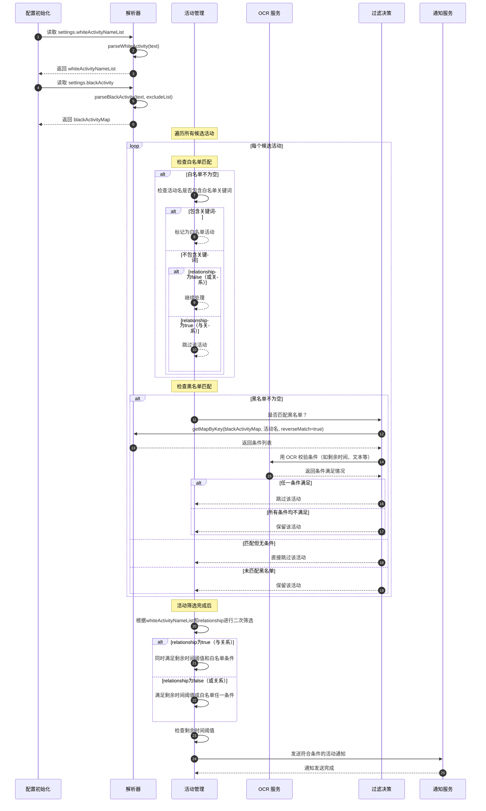
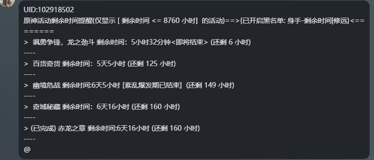

# 活动期限/周本通知器

## 项目概述

这是一个用于《原神》游戏的自动化脚本工具，主要功能是自动检测游戏内活动的剩余时间，并在活动即将结束时/每周指定日期自动提醒征讨领域减半剩余次数发送通知提醒玩家。

---

## 功能特性

- ✅ 自动返回游戏主界面并打开活动页面
- ✅ OCR识别活动列表和剩余时间
- ✅ 自动滚动浏览所有活动页面
- ✅ 智能解析剩余时间（支持"22天14小时"等格式）
- ✅ 可配置的通知阈值（默认8760小时内结束的活动）
- ✅ 支持指定特定活动进行监控
- ✅ 支持活动黑名单过滤功能（0.0.5版本,新增支持为黑名单活动设置特定条件，只有满足条件时才过滤,注：特定条件为空默认没有条件）
- ✅ 防重复检测机制
- ✅ 异常处理和错误恢复
- ✅ 自动提醒征讨领域减半剩余次数（默认`周日`提醒可配置）
- ✅ 支持独立通知功能（`0.0.4`版本新增 因BGI不支持WebSocket,需搭配bettergi-scripts-tools+开启JS HTTP
  权限使用）[前往bettergi-scripts-tools部署](https://github.com/Kirito520Asuna/bettergi-scripts-tools)
## 逻辑流程

---

## 用户使用指南

### 快速开始

#### 1. 安装与配置

- 确保游戏分辨率为 **1920×1080**（推荐分辨率）
- 将脚本导入到 BetterGI 脚本管理器中
- 在脚本设置界面进行个性化配置

#### 2. 基础设置

在 [settings.json]() 中可以配置以下参数：

| 设置项                       | 说明                                            |                     默认值                     | 开放 |
|:--------------------------|:----------------------------------------------|:------|:--:|
| `toMainUi`                | 执行前是否自动返回游戏主界面                                |                    true                     | v  |
| `noticeType`              | 通知模式（默认BGI通知-使用独立通知需要开启JS HTTP权限）             |                    BGI通知                    | v  |
| `relationship`            | 剩余时间与白名单启用`和`关系（默认`或`关系）                      |                    false                    | v  |
| `whiteActivityNameList`   | 白名单活动名称（用\|分隔）                                |                  空（监控所有活动）                  | v  |
| `blackActivity`   | 黑名单活动名称（用|分隔）- 支持条件语法：活动名-条件1,条件2                               |                  空（无黑名单活动）                  | v  |
| `notifyHoursThreshold`    | 通知时间阈值（小时）                                    |                 8760（365天）                  | v  |
| `activityKey`             | 打开活动页面的快捷键                                    |                     F5                      | v  |
| `toTopCount`              | 滑动到顶最大尝试次数                                    |                     10                      | x  |
| `scrollPageCount`         | 滑动次数/页                                        |                      4                      | x  |
| `campaignAreaKey`         | 打开征讨领域页面的快捷键                                  |                     F1                      | v  |
| `campaignAreaReminderDay` | 周本提醒日(0-6,0=周日,1=周一,2=周二,3=周三,4=周四,5=周五,6=周六) |                      0                      | v  |
| `ws_proxy_url`            | WebSocket代理URL（独立通知配置）                        | http://127.0.0.1:8081/ws-proxy/message/send | v  |
| `ws_url`                  | WebSocket客户端 URL（独立通知配置）                      |            ws://127.0.0.1:8080/             | v  |
| `ws_token`                | WebSocket客户端 token（独立通知配置）                    |                      空                      | v  |
| `action`                  | 发送类型（私聊/群聊）    （独立通知配置）                               |                     私聊                      | v  |
| `send_id`                 | 发送ID（群号或QQ号，对应发送类型） （独立通知配置）                          |                      空                      | v  |
| `at_list`                 | @某人列表使用,隔开（QQ号）      （独立通知配置）                         |                      空                      | v  |

---

### 使用流程

#### 自动模式（推荐）

1. 启动脚本后，程序会自动：
    - 检测当前是否在游戏主界面
    - 如未在主界面，自动返回主界面
    - 按设定的快捷键打开活动页面
    - 开始扫描所有活动

#### 手动模式

1. 关闭 `toMainUi` 选项
2. 确保游戏处于主界面状态
3. 启动脚本开始扫描

---

### 功能详解

#### 活动筛选

- **全部活动监控**：`whiteActivityNameList` 保持空值，监控所有有剩余时间的活动
- **指定活动监控**：填写活动关键词，如 `海灯节\|盛典`，只监控包含这些关键词的活动
- **黑名单过滤**：blackActivity 可以设置不想接收提醒的活动名称，多个活动用|分隔
- **条件黑名单过滤**：支持条件语法 活动名-条件1,条件2，只有当活动满足指定条件时才过滤

##### 使用示例
```text
普通黑名单: "活动A|活动B"
条件黑名单: "活动A-已完成|活动B-条件1,条件2"
混合使用: "活动A|活动C-已完成,已领取"
```

#### 时间通知机制

- 默认监控所有活动（`notifyHoursThreshold`=8760小时）
- 可设置阈值，如设置为24，则只通知剩余时间≤24小时的活动
- 即将结束(24小时内)的活动会在通知中标记 `<即将结束>`

#### 逻辑关系配置

- **`relationship` 为 `false`**（默认）：满足"剩余时间阈值"或"白名单活动"任一条件即发送通知
- **`relationship` 为 `true`**：必须同时满足"剩余时间阈值"和"白名单活动"两个条件才发送通知

#### 智能防重复

- 自动识别已扫描过的活动页面
- 防止因页面滚动不准确造成的重复识别
- 自动判断是否已滚动到页面底部

---

### 独立通知配置（0.0.4版本新增）

#### 配置项说明

- **`noticeType`**:
    - `BGI通知`: 使用 BetterGI 内置通知
    - `独立通知`: 通过 WebSocket 发送通知
    - `独立通知和BGI通知`: 同时使用两种方式

- **WebSocket 配置**:
    - `ws_proxy_url`: WebSocket 代理 URL，默认为 `http://127.0.0.1:8081/ws-proxy/message/send`
    - `ws_url`: WebSocket 客户端 URL，默认为 `ws://127.0.0.1:8080/`
    - `ws_token`: WebSocket 客户端认证令牌（可选）

- **发送配置**:
    - `action`: 发送类型，可选 `私聊` 或 `群聊`
    - `send_id`: 根据 `action` 类型填写群号或 QQ 号
    - `at_list`: @ 某人列表，使用逗号分隔多个 QQ 号

#### 使用要求

1. **开启权限**: 需要开启 JS HTTP 权限才能使用独立通知功能
2. **配置服务**: 需要搭建相应的 WebSocket 服务和代理服务器
3. **网络连接**: 确保能够连接到配置的 WebSocket 服务器

#### 配置示例

```json
{
  "noticeType": "独立通知",
  "ws_proxy_url": "http://127.0.0.1:8081/bgi/ws-proxy/message/send",
  "ws_url": "ws://127.0.0.1:8080/",
  "action": "群聊",
  "send_id": "123456789",
  "at_list": "987654321,111222333"
}
```

### 部署 [bettergi-scripts-tools](https://github.com/Kirito520Asuna/bettergi-scripts-tools)

#### 1.windows exe 直接运行
前往 [release](https://github.com/Kirito520Asuna/bettergi-scripts-tools/releases) 下载 带windows的zip包解压运行.exe文件即可
#### 2.java
前往 [release](https://github.com/Kirito520Asuna/bettergi-scripts-tools/releases) 下载 jar包
```shell
java -jar xxxx.jar
```
#### 3.部署docker
```shell
docker pull ghcr.io/kirito520asuna/bettergi-scripts-tools:latest
docker run -d -p 8081:8081 -v /path/to/application-prod.yml:/app/application-prod.yml --name bettergi-scripts-tools ghcr.io/kirito520asuna/bettergi-scripts-tools:latest
```

---

### 注意事项

#### 使用环境要求

- ✅ 游戏分辨率为 1920×1080（最佳兼容性）
- ✅ 游戏处于前台运行状态
- ✅ 活动页面可通过设置的快捷键正常打开

#### 运行期间注意事项

- 🚫 运行期间请勿手动操作鼠标
- 🚫 避免切换窗口或最小化游戏
- ⚠️ 如遇异常可重新启动脚本

---

### 高级配置

#### 自定义快捷键

如活动页面不是F5打开，可在 `activityKey` 中修改为对应按键。  
如冒险之书页面不是F1打开，可在 `campaignAreaKey` 中修改为对应按键。

#### 时间阈值设置

根据个人需求设置 `notifyHoursThreshold`：

- 24：只关注24小时内结束的活动
- 168：关注一周内结束的活动
- 720：关注一个月内结束的活动

#### 独立通知配置

如果需要使用独立通知功能（如发送到QQ群聊），需要：

1. 开启JS HTTP权限
2. 配置WebSocket相关参数
3. 设置发送类型和ID

---

### 输出示例

通知消息格式如下：

```
原神活动剩余时间提醒:
> 海灯节庆典 剩余时间：3天14小时<还剩 86 小时>
> 风花节活动 剩余时间：1天5小时<还剩 29 小时><即将结束>
```

---

## 文件结构

```
ActivitySwitchNotice/
├── utils/
│   ├── activity.js     # 核心活动处理逻辑
│   ├── campaignArea.js # 征讨领域提醒功能
│   ├── notice.js       # 通知发送功能
│   └── ws.js           # WebSocket通知功能
├── main.js             # 主入口文件
├── manifest.json       # 插件配置文件
├── settings.json       # 用户设置界面定义
└── README.md           # 说明文档
```

---

## 核心模块

### `activity.js` - 活动处理核心

主要包含以下功能函数：

- `scrollPage()` - 页面滚动基础函数
- `scrollPagesByActivity()` - 按页滚动活动列表
- `scrollPagesByActivityToTop()` - 滚动到活动列表顶部
- `parseRemainingTimeToHours()` - 解析剩余时间文本为小时数
- `OcrKey()` - OCR识别剩余时间
- `activityMain()` - 主流程控制函数

### `notice.js` - 通知模块

- `sendNotice()` - 发送活动提醒通知，按剩余时间排序
- `sendText()` - 发送普通通知

### `campaignArea.js` - 征讨领域模块

- `ocrWeeklyCount()` - OCR识别征讨领域周次数
- `getDayOfWeek()` - 获取当前星期信息
- `campaignAreaMain()` - 征讨领域提醒主函数

### `ws.js` - WebSocket通知模块

- `send()` - 发送WebSocket消息
- `sendText()` - 发送文本消息

---

## 配置选项

在 `settings.json` 中可配置以下参数：

| 配置项                       |   类型    | 说明                                            |
|:--------------------------|:-------:|:----------------------------------------------|
| `toMainUi`                | Boolean | 是否先返回主界面再执行                                   |
| `noticeType`              | String  | 通知模式（BGI通知/独立通知/两者都发送）                        |
| `relationship`            | Boolean | 剩余时间与白名单启用`和`关系（默认`或`关系）                      |
| `whiteActivityNameList`   | String  | 白名单活动名称（用\|分隔）                                |
| `blackActivity`   | String  | 黑名单活动名称（用\|分隔）- 支持条件语法：活动名-条件1,条件2            |
| `notifyHoursThreshold`    | Number  | 通知阈值（小时）                                      |
| `activityKey`             | String  | 打开活动页面的快捷键                                    |
| `toTopCount`              | Number  | 滑动到顶最大尝试次数                                    |
| `scrollPageCount`         | Number  | 滑动次数/页                                        |
| `campaignAreaKey`         | String  | 打开冒险之书页面的快捷键                                  |
| `campaignAreaReminderDay` | Number  | 周本提醒日(0-6,0=周日,1=周一,2=周二,3=周三,4=周四,5=周五,6=周六) |
| `ws_proxy_url`            | String  | WebSocket代理URL（独立通知配置）                        |
| `ws_url`                  | String  | WebSocket客户端 URL（独立通知配置）                      |
| `ws_token`                | String  | WebSocket客户端 token（独立通知配置）                    |
| `action`                  | String  | 发送类型（私聊/群聊）（独立通知配置）                           |
| `send_id`                 | String  | 发送ID（群号或QQ号，对应发送类型） （独立通知配置）                  |
| `at_list`                 | String  | @某人列表使用,隔开（QQ号）      （独立通知配置）                 |

---

## 工作原理

1. 自动返回游戏主界面
2. 检查是否为设置的提醒日(默认周日)，如果是则执行征讨领域提醒功能
3. 按配置快捷键打开活动页面
4. 滚动到活动列表顶部
5. 逐页扫描所有活动
6. OCR识别每个活动的剩余时间
7. 解析时间为小时数并过滤（包括黑名单过滤）
8. 发送符合条件的活动提醒

---

## 注意事项

- 请确保游戏分辨率为1920×1080以获得最佳效果
- 脚本运行期间请勿操作鼠标
- 某些特殊活动可能无法正确识别剩余时间
- 建议在游戏空闲时运行此脚本

---

## 版本历史

### 0.0.6 (2026-01-06)
- **功能优化**：新增识别uid通知提醒
实例:


### 0.0.5 (2026-01-04)

- **性能优化**：优化滚动到顶部算法，减少页面滚动次数，提升初始化效率
- **功能增强**：新增条件黑名单过滤机制，支持基于活动状态的动态过滤策略
- **代码重构**：新增 `parseBlackActivity` 函数，实现黑名单配置的结构化解析
- **架构改进**：重构黑名单匹配逻辑，引入条件匹配引擎，支持多条件复合判断
- **数据结构优化**：引入 `blackActivityMap` 配置项，使用 Map 数据结构提升查找性能
- **逻辑优化**：增强活动过滤算法，集成条件匹配验证机制
- **初始化流程**：重构配置加载流程，新增 [init]() 函数统一处理配置项初始化
- **文档完善**：更新配置项文档，补充条件黑名单语法说明

### 0.0.4 (2026-01-01)

- 新增 独立通知配置功能，支持通过 WebSocket 发送通知
- 新增 `ws.js` 模块，实现 WebSocket 通知功能
- 新增 `noticeType` 配置选项，用于选择通知模式
- 新增 `ws_proxy_url`、`ws_url`、`ws_token` 配置选项
- 新增 `action`、`send_id`、`at_list` 配置选项用于发送设置

### 0.0.3 (2025-12-29)

- 修复 修复了活动过滤逻辑问题，将`activityNameList`更改为`whiteActivityNameList`以保持一致
- 新增 黑名单与白名单的互斥过滤机制,黑名单中剔除白名单
- 新增 在配置中增加了`relationship`参数，用于控制剩余时间与白名单活动的逻辑关系
- 新增 支持剩余时间和白名单的"与"关系和"或"关系配置
- 新增 标记界面显示 `已完成` 的活动

### 0.0.2 (2025-12-22)

- 新增 征讨领域周次数提醒功能
- 新增 [campaignArea.js]() 模块，包含征讨领域相关功能
- 新增 `campaignAreaKey` 配置选项，用于自定义冒险之书页面快捷键
- 新增 `campaignAreaReminderDay` 配置选项，用于配置提醒日
- 改进 增强滚动到顶部功能的稳定性
- 新增 活动黑名单过滤功能，支持通过 `blackActivityNameList` 配置项排除不关心的活动
- 新增 特殊活动时间格式支持，针对"砺行修远"等活动提供周数显示
- 新增 额外OCR识别支持，可识别特定活动的附加信息（如"本周进度"）
- 改进 活动过滤逻辑，增强黑名单匹配准确性
- 改进 通知显示格式，增加活动描述信息展示
- 修复 若干已知问题，提升脚本稳定性

### 0.0.1 (2025-12-21)

- 新增 活动期限检测与通知功能
- 新增 OCR识别活动列表和剩余时间
- 新增 自动滚动浏览所有活动页面
- 新增 智能解析剩余时间（支持"22天14小时"等格式）
- 新增 可配置的通知阈值功能
- 新增 指定特定活动监控功能
- 新增 防重复检测机制
- 新增 异常处理和错误恢复机制

---

## 其它

作者：云端客  
脚本反馈邮箱：doutianmianxia@qq.com