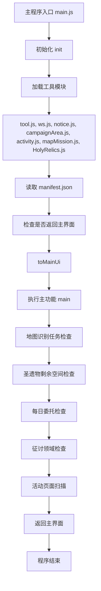
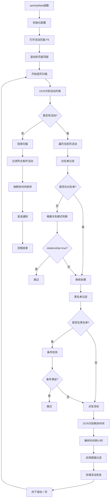
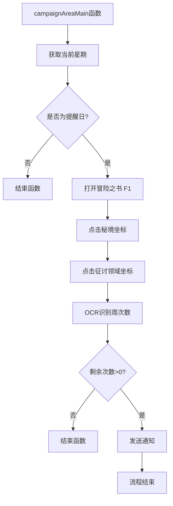
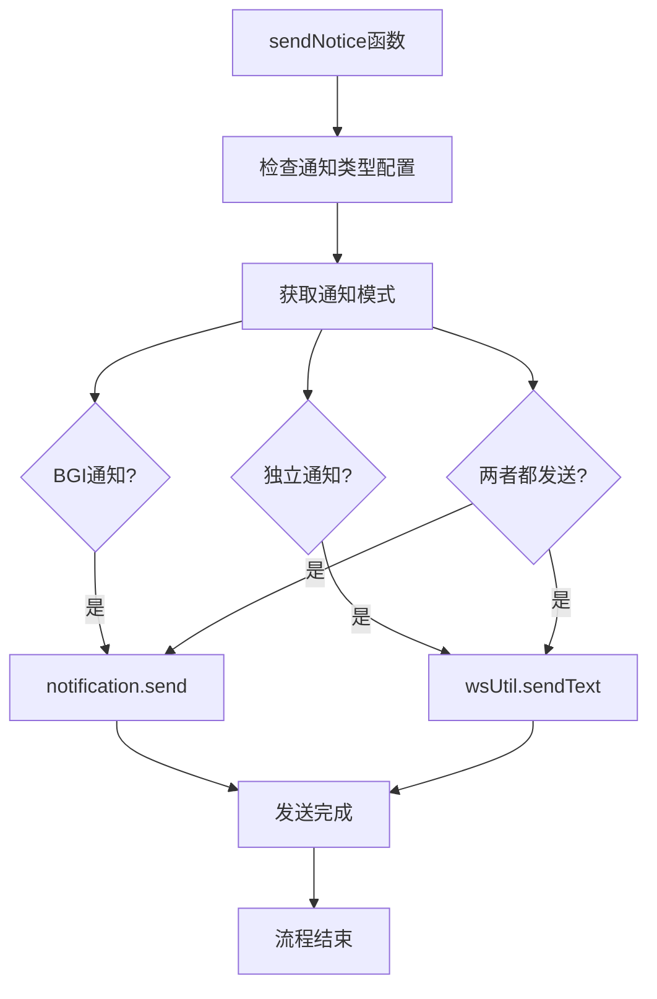
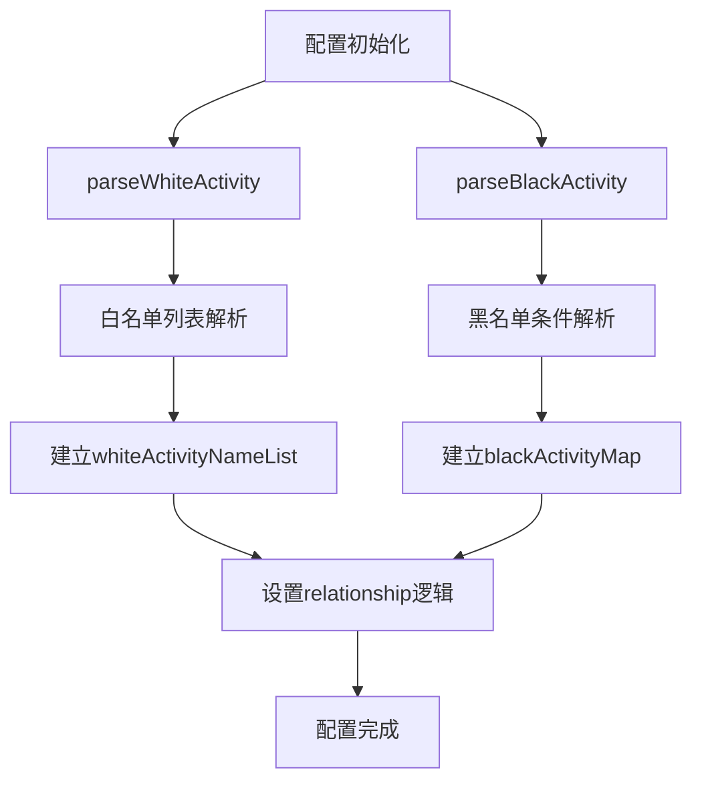
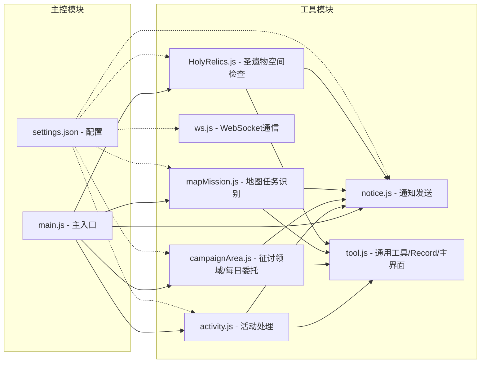
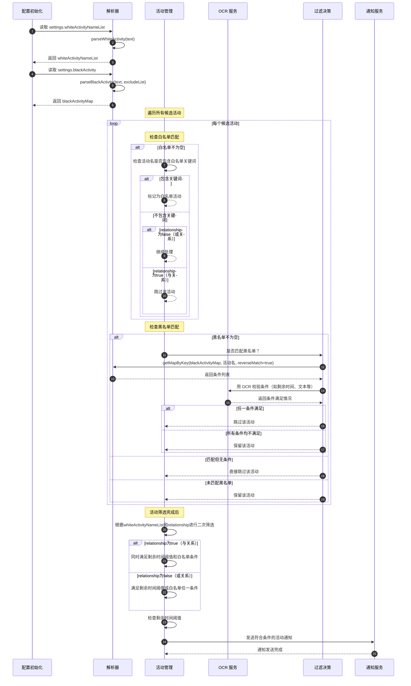
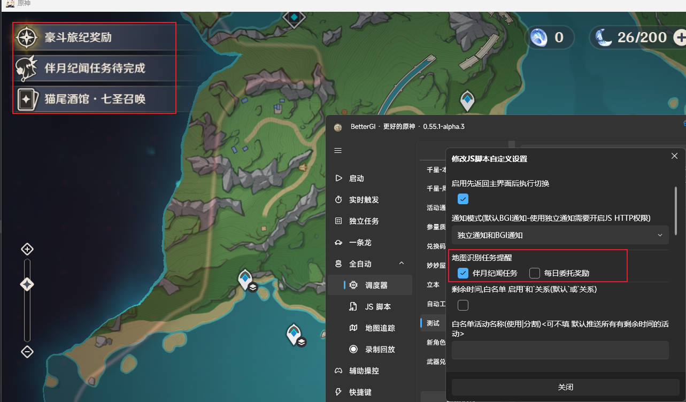
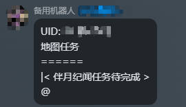
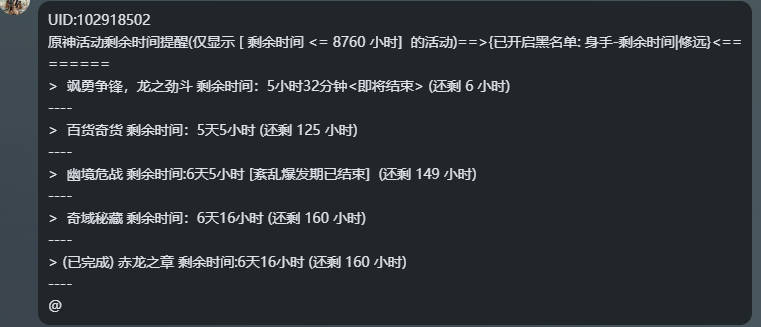

# 活动期限/周本通知器

## 项目概述

这是一个用于《原神》游戏的自动化脚本工具，主要功能是自动检测游戏内活动的剩余时间，并在活动即将结束时/每周指定日期自动提醒征讨领域减半剩余次数发送通知提醒玩家。

---

## 功能特性

- ✅ 自动返回游戏主界面并打开活动页面
- ✅ OCR识别活动列表和剩余时间
- ✅ 自动滚动浏览所有活动页面
- ✅ 智能解析剩余时间（支持"22天14小时"等格式）
- ✅ 可配置的通知阈值（默认8760小时内结束的活动）
- ✅ 支持指定特定活动进行监控
- ✅ 支持活动黑名单过滤功能（0.0.5版本,新增支持为黑名单活动设置特定条件，只有满足条件时才过滤,注：特定条件为空默认没有条件）
- ✅ 防重复检测机制
- ✅ 异常处理和错误恢复
- ✅ 自动提醒征讨领域减半剩余次数（`0.1.1`版本起支持多选提醒日）
- ✅ 每日委托奖励 / 原粹树脂 / 长期训练点提醒（`0.0.7`/`0.1.9`版本）
- ✅ 地图识别任务提醒（`0.0.8`版本）
- ✅ 圣遗物剩余空间检测提醒（`0.1.5`版本）
- ✅ 新活动通知-存储活动名称列表进行历史对比（`0.1.0`版本）
- ✅ 支持独立通知功能（`0.0.4`版本新增 因BGI不支持WebSocket,需搭配bettergi-scripts-tools+开启JS HTTP
  权限使用）[前往bettergi-scripts-tools部署](https://github.com/Kirito520Asuna/bettergi-scripts-tools)
## 核心思维导图
### 整体架构流程图

```mermaid
graph TD
    A[主程序入口 main.js] --> B[初始化 init]
    B --> C[加载工具模块]
    C --> D[tool.js, ws.js, notice.js, campaignArea.js, activity.js, mapMission.js, HolyRelics.js]
    D --> E[读取 manifest.json]
    E --> F[检查是否返回主界面]
    F --> G[toMainUi]
    G --> H[执行主功能 main]
    H --> I[地图识别任务检查]
    I --> J[圣遗物剩余空间检查]
    J --> K[每日委托检查]
    K --> L[征讨领域检查]
    L --> M[活动页面扫描]
    M --> N[返回主界面]
    N --> O[程序结束]

```
### 活动扫描核心流程

```mermaid
graph TD
    A[activityMain函数] --> B[初始化配置]
    B --> C[打开活动页面 F5]
    C --> D[滚动到页面顶部]
    D --> E[开始逐页扫描]
    E --> F[OCR识别活动列表]
    F --> G{是否有活动?}
    G -->|否| H[结束扫描]
    G -->|是| I[遍历当前页活动]
    I --> J[白名单过滤]
    J --> K{是否在白名单?}
    K -->|是| L[继续处理]
    K -->|否| M[根据关系模式判断]
    M --> N{relationship=true?}
    N -->|是| O[跳过]
    N -->|否| L[继续处理]
    L --> P[黑名单过滤]
    P --> Q{是否在黑名单?}
    Q -->|是| R[条件检测]
    Q -->|否| S[点击活动]
    R --> T{条件满足?}
    T -->|是| U[跳过]
    T -->|否| S[点击活动]
    S --> V[OCR识别剩余时间]
    V --> W[解析时间转小时]
    W --> X[应用阈值过滤]
    X --> Y[存储活动信息]
    Y --> Z[向下滚动一页]
    Z --> E
    H --> AA[过滤符合条件活动]
    AA --> BB[按剩余时间排序]
    BB --> CC[发送通知]
    CC --> DD[流程结束]
```
### 征讨领域提醒流程

```mermaid
graph TD
    A[campaignAreaMain函数] --> B[获取当前星期]
    B --> C{是否为提醒日?}
    C -->|否| D[结束函数]
    C -->|是| E[打开冒险之书 F1]
    E --> F[点击秘境坐标]
    F --> G[点击征讨领域坐标]
    G --> H[OCR识别周次数]
    H --> I{剩余次数>0?}
    I -->|否| J[结束函数]
    I -->|是| K[发送通知]
    K --> L[流程结束]

```
### 通知发送机制

```mermaid
graph TD
    A[sendNotice函数] --> B[检查通知类型配置]
    B --> C[获取通知模式]
    C --> D{BGI通知?}
    D -->|是| E[notification.send]
    C --> F{独立通知?}
    F -->|是| G[wsUtil.sendText]
    C --> H{两者都发送?}
    H -->|是| E
    H -->|是| G
    E --> I[发送完成]
    G --> I
    I --> J[流程结束]
```
### 配置解析流程

```mermaid
graph TD
    A[配置初始化] --> B[parseWhiteActivity]
    A --> C[parseBlackActivity]
    B --> D[白名单列表解析]
    C --> E[黑名单条件解析]
    D --> F[建立whiteActivityNameList]
    E --> G[建立blackActivityMap]
    F --> H[设置relationship逻辑]
    G --> H
    H --> I[配置完成]
```
### 核心组件依赖关系

```mermaid
graph LR
    subgraph "工具模块"
        A[activity.js - 活动处理]
        B[notice.js - 通知发送]
        C[campaignArea.js - 征讨领域/每日委托]
        D[ws.js - WebSocket通信]
        E[tool.js - 通用工具/Record/主界面]
        F[mapMission.js - 地图任务识别]
        G[HolyRelics.js - 圣遗物空间检查]
    end
    
    subgraph "主控模块"
        H[main.js - 主入口]
        I[settings.json - 配置]
    end
    
    H --> A
    H --> B
    H --> C
    H --> F
    H --> G
    A --> B
    A --> E
    C --> B
    C --> E
    F --> B
    F --> E
    G --> B
    G --> E
    I -.-> A
    I -.-> B
    I -.-> C
    I -.-> D
    I -.-> F
    I -.-> G

```
### 逻辑流程

```mermaid
sequenceDiagram
    autonumber
    participant Config as 配置初始化
    participant Parser as 解析器
    participant ActivityMgr as 活动管理
    participant OCRSvc as OCR 服务
    participant Filter as 过滤决策
    participant Notification as 通知服务

    Config->>Parser: 读取 settings.whiteActivityNameList
    Parser->>Parser: parseWhiteActivity(text)
    Parser-->>Config: 返回 whiteActivityNameList
    
    Config->>Parser: 读取 settings.blackActivity
    Parser->>Parser: parseBlackActivity(text, excludeList)
    Parser-->>Config: 返回 blackActivityMap

    Note over ActivityMgr: 遍历所有候选活动
    loop 每个候选活动
        Note over ActivityMgr: 检查白名单匹配
        alt 白名单不为空
            ActivityMgr->>ActivityMgr: 检查活动名是否包含白名单关键词
            alt 包含关键词
                ActivityMgr-->>ActivityMgr: 标记为白名单活动
            else 不包含关键词
                alt relationship为false（或关系）
                    ActivityMgr-->>ActivityMgr: 继续处理
                else relationship为true（与关系）
                    ActivityMgr-->>ActivityMgr: 跳过该活动
                end
            end
        end
        
        Note over ActivityMgr: 检查黑名单匹配    
        alt 黑名单不为空
            ActivityMgr->>Filter: 是否匹配黑名单？
            Filter->>Parser: getMapByKey(blackActivityMap, 活动名, reverseMatch=true)
            Parser-->>Filter: 返回条件列表
            Filter->>OCRSvc: 用 OCR 校验条件（如剩余时间、文本等）
            OCRSvc-->>Filter: 返回条件满足情况
            alt 任一条件满足
                Filter-->>ActivityMgr: 跳过该活动
            else 所有条件均不满足
                Filter-->>ActivityMgr: 保留该活动
            end
        else 匹配但无条件
            Filter-->>ActivityMgr: 直接跳过该活动
        else 未匹配黑名单
            Filter-->>ActivityMgr: 保留该活动
        end
    end

    Note over ActivityMgr: 活动筛选完成后
    ActivityMgr->>ActivityMgr: 根据whiteActivityNameList和relationship进行二次筛选
    alt relationship为true（与关系）
        ActivityMgr->>ActivityMgr: 同时满足剩余时间阈值和白名单条件
    else relationship为false（或关系）
        ActivityMgr->>ActivityMgr: 满足剩余时间阈值或白名单任一条件
    end
    ActivityMgr->>ActivityMgr: 检查剩余时间阈值
    ActivityMgr->>Notification: 发送符合条件的活动通知
    Notification-->> ActivityMgr: 通知发送完成
```
---

## 用户使用指南

### 快速开始

#### 1. 安装与配置

- 确保游戏分辨率为 **1920×1080**（推荐分辨率）
- 将脚本导入到 BetterGI 脚本管理器中
- 在脚本设置界面进行个性化配置

#### 2. 基础设置

在 [settings.json]() 中可以配置以下参数：

| 设置项                          | 说明                                                       |                     默认值                     |
|:-----------------------------|:---------------------------------------------------------|:--------------------------------------------|
| `debug`                      | 启用开发者模式（框选识别区域辅助调试）                                    |                   false                    |
| `toMainUi`                   | 执行前是否自动返回游戏主界面                                          |                    true                    |
| `noticeType`                 | 通知模式（BGI通知/独立通知/独立通知和BGI通知）                           |                  BGI通知                    |
| `newActivityNotice`          | 启用新活动通知（存储活动名称列表-历史对比）                                |                    true                    |
| `mapMissionKeys`             | 地图识别任务提醒（多选）                                           |      伴月纪闻任务,探索派遣奖励,每日委托奖励            |
| `relationship`               | 剩余时间与白名单启用`和`关系（默认`或`关系）                              |                   false                    |
| `whiteActivityNameList`      | 白名单活动名称（用\|分隔）                                          |                 空（监控所有活动）                |
| `blackActivity`              | 黑名单活动名称（用\|分隔）- 支持条件语法：活动名-条件1,条件2                     |                空（无黑名单活动）                |
| `notifyHoursThreshold`       | 通知剩余时间阈值（小时）                                            |                8760（365天）                 |
| `activityKey`                | 打开活动页面的快捷键                                              |                     F5                     |
| `campaignAreaReminderDays`   | 周本提醒日（多选）                                               |                  周六,周日                   |
| `campaignAreaKey`            | 打开冒险之证的快捷键                                              |                     F1                     |
| `openBagKey`                 | 打开背包的快捷键                                                |                     B                      |
| `checkHolyRelic`             | 启用圣遗物空间提醒                                               |                   false                    |
| `holyRelicsDiffCountThreshold` | 圣遗物剩余空间阈值                                              |                    400                     |
| `wsNoticeType`               | 独立通知配置方式（自定义通知/bgi-tools通知）                            |                  自定义通知                   |
| `http_api_access_ws_proxy`   | bgi-tools获取授权wsproxy api地址                                | http://127.0.0.1:8081/bgi/ws-proxy/access  |
| `bgi_tools_token`            | bgi_tools授权token 语法:tokenName=tokenValue                    |               Authorization=                |
| `ws_proxy_url`               | WebSocket代理URL（独立通知配置）                                   | http://127.0.0.1:8081/bgi/ws-proxy/message/send |
| `ws_url`                     | WebSocket客户端 URL（独立通知配置）                                 |            ws://127.0.0.1:8080/            |
| `ws_token`                   | WebSocket客户端 token（独立通知配置）                               |                     空                     |
| `action`                     | 发送类型（私聊/群聊）（独立通知配置）                                    |                     私聊                    |
| `send_id`                    | 发送ID（群号或QQ号，对应发送类型）（独立通知配置）                            |                     空                     |
| `at_list`                    | @某人列表使用,隔开（QQ号）（独立通知配置）                                |                     空                     |

> 注：`toTopCount`、`scrollPageCount` 已不再在设置界面开放（代码内部使用默认值 10 / 4）。

---

### 使用流程

#### 自动模式（推荐）

1. 启动脚本后，程序会自动：
    - 检测当前是否在游戏主界面
    - 如未在主界面，自动返回主界面
    - 按设定的快捷键打开活动页面
    - 开始扫描所有活动

#### 手动模式

1. 关闭 `toMainUi` 选项
2. 确保游戏处于主界面状态
3. 启动脚本开始扫描

---

### 功能详解

#### 活动筛选

- **全部活动监控**：`whiteActivityNameList` 保持空值，监控所有有剩余时间的活动
- **指定活动监控**：填写活动关键词，如 `海灯节\|盛典`，只监控包含这些关键词的活动
- **黑名单过滤**：blackActivity 可以设置不想接收提醒的活动名称，多个活动用|分隔
- **条件黑名单过滤**：支持条件语法 活动名-条件1,条件2，只有当活动满足指定条件时才过滤

##### 使用示例
```text
普通黑名单: "活动A|活动B"
条件黑名单: "活动A-已完成|活动B-条件1,条件2"
混合使用: "活动A|活动C-已完成,已领取"
```

#### 时间通知机制

- 默认监控所有活动（`notifyHoursThreshold`=8760小时）
- 可设置阈值，如设置为24，则只通知剩余时间≤24小时的活动
- 即将结束(24小时内)的活动会在通知中标记 `<即将结束>`

#### 逻辑关系配置

- **`relationship` 为 `false`**（默认）：满足"剩余时间阈值"或"白名单活动"任一条件即发送通知
- **`relationship` 为 `true`**：必须同时满足"剩余时间阈值"和"白名单活动"两个条件才发送通知

#### 智能防重复

- 自动识别已扫描过的活动页面
- 防止因页面滚动不准确造成的重复识别
- 自动判断是否已滚动到页面底部

---

### 独立通知配置（0.0.4版本新增，0.1.2版本支持bgi-tools授权）

#### 配置项说明

- **`noticeType`**:
    - `BGI通知`: 使用 BetterGI 内置通知
    - `独立通知`: 通过 WebSocket 发送通知
    - `独立通知和BGI通知`: 同时使用两种方式

- **`wsNoticeType`（独立通知配置方式，0.1.2版本新增）**:
    - `自定义通知`: 手动填写下方 WebSocket 相关参数
    - `bgi-tools通知`: 从 bettergi-scripts-tools 拉取授权 wsproxy 信息（需配置 `http_api_access_ws_proxy` 与 `bgi_tools_token`）

- **bgi-tools 授权配置（0.1.2版本新增）**:
    - `http_api_access_ws_proxy`: 获取授权 wsproxy 的 api 地址，默认为 `http://127.0.0.1:8081/bgi/ws-proxy/access`
    - `bgi_tools_token`: 授权 token，语法 `tokenName=tokenValue`（如 `Authorization=xxx`）

- **WebSocket 配置（自定义通知）**:
    - `ws_proxy_url`: WebSocket 代理 URL，默认为 `http://127.0.0.1:8081/bgi/ws-proxy/message/send`
    - `ws_url`: WebSocket 客户端 URL，默认为 `ws://127.0.0.1:8080/`
    - `ws_token`: WebSocket 客户端认证令牌（可选）

- **发送配置**:
    - `action`: 发送类型，可选 `私聊` 或 `群聊`
    - `send_id`: 根据 `action` 类型填写群号或 QQ 号
    - `at_list`: @ 某人列表，使用逗号分隔多个 QQ 号

#### 使用要求

1. **开启权限**: 需要开启 JS HTTP 权限才能使用独立通知功能
2. **配置服务**: 需要搭建相应的 WebSocket 服务和代理服务器（或部署 bettergi-scripts-tools）
3. **网络连接**: 确保能够连接到配置的 WebSocket 服务器

#### 配置示例

自定义通知：

```json
{
  "noticeType": "独立通知",
  "wsNoticeType": "自定义通知",
  "ws_proxy_url": "http://127.0.0.1:8081/bgi/ws-proxy/message/send",
  "ws_url": "ws://127.0.0.1:8080/",
  "action": "群聊",
  "send_id": "123456789",
  "at_list": "987654321,111222333"
}
```

bgi-tools通知：

```json
{
  "noticeType": "独立通知",
  "wsNoticeType": "bgi-tools通知",
  "http_api_access_ws_proxy": "http://127.0.0.1:8081/bgi/ws-proxy/access",
  "bgi_tools_token": "Authorization=xxx",
  "action": "群聊",
  "send_id": "123456789"
}
```

### 部署 [bettergi-scripts-tools](https://github.com/Kirito520Asuna/bettergi-scripts-tools)

#### 1.windows exe 直接运行
前往 [release](https://github.com/Kirito520Asuna/bettergi-scripts-tools/releases) 下载 带windows的zip包解压运行.exe文件即可
#### 2.java
前往 [release](https://github.com/Kirito520Asuna/bettergi-scripts-tools/releases) 下载 jar包
```shell
java -jar xxxx.jar
```
#### 3.部署docker
```shell
docker pull ghcr.io/kirito520asuna/bettergi-scripts-tools:latest
docker run -d -p 8081:8081 -v /path/to/application-prod.yml:/app/application-prod.yml --name bettergi-scripts-tools ghcr.io/kirito520asuna/bettergi-scripts-tools:latest
```

---

### 注意事项

#### 使用环境要求

- ✅ 游戏分辨率为 1920×1080（最佳兼容性）
- ✅ 游戏处于前台运行状态
- ✅ 活动页面可通过设置的快捷键正常打开

#### 运行期间注意事项

- 🚫 运行期间请勿手动操作鼠标
- 🚫 避免切换窗口或最小化游戏
- ⚠️ 如遇异常可重新启动脚本

---

### 高级配置

#### 自定义快捷键

如活动页面不是F5打开，可在 `activityKey` 中修改为对应按键。  
如冒险之书页面不是F1打开，可在 `campaignAreaKey` 中修改为对应按键。

#### 时间阈值设置

根据个人需求设置 `notifyHoursThreshold`：

- 24：只关注24小时内结束的活动
- 168：关注一周内结束的活动
- 720：关注一个月内结束的活动

#### 独立通知配置

如果需要使用独立通知功能（如发送到QQ群聊），需要：

1. 开启JS HTTP权限
2. 配置WebSocket相关参数
3. 设置发送类型和ID

---

### 输出示例

通知消息格式如下：

```
原神活动剩余时间提醒:
> 海灯节庆典 剩余时间：3天14小时<还剩 86 小时>
> 风花节活动 剩余时间：1天5小时<还剩 29 小时><即将结束>
```

---

## 文件结构

```
ActivitySwitchNotice/
├── utils/
│   ├── activity.js     # 核心活动处理逻辑
│   ├── campaignArea.js # 征讨领域/每日委托提醒功能
│   ├── mapMission.js   # 地图识别任务提醒功能
│   ├── HolyRelics.js   # 圣遗物剩余空间检查功能
│   ├── notice.js       # 通知发送功能
│   ├── ws.js           # WebSocket通知功能
│   └── tool.js         # 通用工具（OCR/找图/Record/主界面判断等）
├── assets/             # 模板图片资源
│   ├── paimon_menu.png # 主界面判断模板
│   └── holyRelics.jpg  # 圣遗物背包入口模板
├── config/             # 运行时生成的记录文件（activity/campaignArea/dailyCommission）
├── main.js             # 主入口文件
├── manifest.json       # 插件配置文件
├── settings.json       # 用户设置界面定义
└── README.md           # 说明文档
```

---

## 核心模块

### `activity.js` - 活动处理核心

主要包含以下功能函数：

- `scrollPage()` - 页面滚动基础函数
- `scrollPagesByActivity()` - 按页滚动活动列表
- `scrollPagesByActivityToTop()` - 滚动到活动列表顶部
- `parseRemainingTimeToHours()` - 解析剩余时间文本为小时数
- `OcrKey()` - OCR识别剩余时间
- `activityMain()` - 主流程控制函数

### `campaignArea.js` - 征讨领域/每日委托模块

- `ocrWeeklyCount()` - OCR识别征讨领域周次数
- `ocrDailyCommission()` - OCR识别每日委托与体力
- `ocrLongTermTrainingPoints()` - OCR识别长期训练点
- `campaignAreaMain()` - 征讨领域提醒主函数
- `dailyCommissionMain()` - 每日委托提醒主函数

### `mapMission.js` - 地图识别任务模块

- `ocrMapMission()` - OCR识别地图任务列表
- `mapMission()` - 地图任务提醒主函数

### `HolyRelics.js` - 圣遗物空间模块

- `checkHolyRelicsKey()` - 检查圣遗物剩余空间并提醒

### `notice.js` - 通知模块

- `sendNotice()` - 发送活动提醒通知，按剩余时间排序
- `sendText()` - 发送普通通知

### `ws.js` - WebSocket通知模块

- `send()` - 发送WebSocket消息
- `sendText()` - 发送文本消息
- `pullAccessWsProxyConfig()` - 从 bgi-tools 拉取授权 wsproxy 配置

### `tool.js` - 通用工具模块

- `findText()` / `findTextAndClick()` - 通用OCR找文本/找文本并点击
- `findImg()` / `findImgAndClick()` - 通用找图/找图并点击
- `getDayOfWeek()` - 获取当前星期信息（按游戏4点刷新校准）
- `isInMainUI()` / `toMainUi()` - 主界面判断与返回
- `openBag()` - 打开背包并处理过期物品
- `Record` - 记录文件统一读写类

---

## 配置选项

在 `settings.json` 中可配置以下参数：

| 配置项                          |      类型      | 说明                                            |
|:-----------------------------|:------------:|:----------------------------------------------|
| `debug`                      |   checkbox   | 启用开发者模式（框选识别区域辅助调试）                           |
| `toMainUi`                   |   checkbox   | 是否先返回主界面再执行                                   |
| `noticeType`                 |    select    | 通知模式（BGI通知/独立通知/独立通知和BGI通知）                  |
| `newActivityNotice`          |   checkbox   | 启用新活动通知（存储活动名称列表-历史对比）                       |
| `mapMissionKeys`             | multi-checkbox | 地图识别任务提醒（多选）                                |
| `relationship`               |   checkbox   | 剩余时间与白名单启用`和`关系（默认`或`关系）                      |
| `whiteActivityNameList`      |    String    | 白名单活动名称（用\|分隔）                                |
| `blackActivity`              |    String    | 黑名单活动名称（用\|分隔）- 支持条件语法：活动名-条件1,条件2            |
| `notifyHoursThreshold`       |    String    | 通知剩余时间阈值（小时）                                  |
| `activityKey`                |    String    | 打开活动页面的快捷键                                    |
| `campaignAreaReminderDays`   | multi-checkbox | 周本提醒日（多选，默认周六/周日）                           |
| `campaignAreaKey`            |    String    | 打开冒险之证的快捷键                                    |
| `openBagKey`                 |    String    | 打开背包的快捷键                                      |
| `checkHolyRelic`             |   checkbox   | 启用圣遗物空间提醒                                     |
| `holyRelicsDiffCountThreshold` |   String    | 圣遗物剩余空间阈值                                     |
| `wsNoticeType`               |    select    | 独立通知配置方式（自定义通知/bgi-tools通知）                    |
| `http_api_access_ws_proxy`   |    String    | bgi-tools获取授权wsproxy api地址                       |
| `bgi_tools_token`            |    String    | bgi_tools授权token 语法:tokenName=tokenValue          |
| `ws_proxy_url`               |    String    | WebSocket代理URL（独立通知配置）                        |
| `ws_url`                     |    String    | WebSocket客户端 URL（独立通知配置）                      |
| `ws_token`                   |    String    | WebSocket客户端 token（独立通知配置）                    |
| `action`                     |    select    | 发送类型（私聊/群聊）（独立通知配置）                           |
| `send_id`                    |    String    | 发送ID（群号或QQ号，对应发送类型） （独立通知配置）                  |
| `at_list`                    |    String    | @某人列表使用,隔开（QQ号）      （独立通知配置）                 |

> 注：`toTopCount`、`scrollPageCount` 已不再在设置界面开放（代码内部使用默认值 10 / 4）。

---

## 工作原理

1. 自动返回游戏主界面
2. 执行地图识别任务提醒（按配置的多选任务项）
3. 执行圣遗物剩余空间检查提醒（如启用）
4. 执行每日委托奖励 / 体力 / 长期训练点提醒
5. 检查是否为设置的提醒日(默认周六/周日)，如果是则执行征讨领域减半次数提醒
6. 按配置快捷键打开活动页面
7. 滚动到活动列表顶部
8. 逐页扫描所有活动
9. OCR识别每个活动的剩余时间
10. 解析时间为小时数并过滤（包括白名单/黑名单过滤）
11. 发送符合条件的活动提醒
12. 对比历史记录，发送新增活动提醒

---

## 注意事项

- 请确保游戏分辨率为1920×1080以获得最佳效果
- 脚本运行期间请勿操作鼠标
- 某些特殊活动可能无法正确识别剩余时间
- 建议在游戏空闲时运行此脚本

---

## 版本历史
### 0.1.9 (2026-08-16)
- 新增 长期训练点识别功能（每日委托提醒中追加长期训练点与过期时间提醒）
- 优化 地图任务 OCR 识别功能
- 重构 OCR 任务识别逻辑，提高识别准确性
- 优化 活动页面滚动扫描逻辑
- 修复 任务切换通知中的页面稳定等待问题
- 优化 活动页面滚动和鼠标操作策略
- 更新 最低 BGI 版本依赖 0.61.0 → 0.63.0
### 0.1.8 (2026-07-08)
- 重构 活动配置文件读写逻辑（新增 `Record` 类统一数据读写）
- 新增 配置文件管理和重复通知检测功能（秘境征讨/每日委托避免重复发送相同内容）
- 新增 日期格式化功能（YYYY-MM-DD）
- 优化 秘境征讨和每日委托的通知逻辑
### 0.1.7 (2026-06-05)
- 修复bug
### 0.1.6 (2026-05-30)
- uid api改本体
### 0.1.5 (2026-04-24)
- 新增圣遗物剩余空间检测提醒
### 0.1.4 (2026-04-23)
- 单例模式 配置唯一实例
### 0.1.3 (2026-03-28)
- 修复异常配置导致无法运行
### 0.1.2 (2026-03-23)
- 新增云端配置功能
- 改变wsproxy授权方式(授权token或bettergi-scripts-tools<版本需求0.0.7>授权拉取)
### 0.1.1 (2026-03-16)
- 周本提醒日 升为多选
- 适配新秘境征讨UI
### 0.1.0 (2026-02-01)
- 新增 新活动通知(存储活动名称列表-历史对比)
### 0.0.8 (2026-01-22)
- 新增 地图识别任务提醒 如:
  
  
  
### 0.0.7 (2026-01-19)
- 新增每日委托提醒
### 0.0.6 (2026-01-06)
- **功能优化**：新增识别uid通知提醒
实例:


### 0.0.5 (2026-01-04)

- **性能优化**：优化滚动到顶部算法，减少页面滚动次数，提升初始化效率
- **功能增强**：新增条件黑名单过滤机制，支持基于活动状态的动态过滤策略
- **代码重构**：新增 `parseBlackActivity` 函数，实现黑名单配置的结构化解析
- **架构改进**：重构黑名单匹配逻辑，引入条件匹配引擎，支持多条件复合判断
- **数据结构优化**：引入 `blackActivityMap` 配置项，使用 Map 数据结构提升查找性能
- **逻辑优化**：增强活动过滤算法，集成条件匹配验证机制
- **初始化流程**：重构配置加载流程，新增 [init]() 函数统一处理配置项初始化
- **文档完善**：更新配置项文档，补充条件黑名单语法说明

### 0.0.4 (2026-01-01)

- 新增 独立通知配置功能，支持通过 WebSocket 发送通知
- 新增 `ws.js` 模块，实现 WebSocket 通知功能
- 新增 `noticeType` 配置选项，用于选择通知模式
- 新增 `ws_proxy_url`、`ws_url`、`ws_token` 配置选项
- 新增 `action`、`send_id`、`at_list` 配置选项用于发送设置

### 0.0.3 (2025-12-29)

- 修复 修复了活动过滤逻辑问题，将`activityNameList`更改为`whiteActivityNameList`以保持一致
- 新增 黑名单与白名单的互斥过滤机制,黑名单中剔除白名单
- 新增 在配置中增加了`relationship`参数，用于控制剩余时间与白名单活动的逻辑关系
- 新增 支持剩余时间和白名单的"与"关系和"或"关系配置
- 新增 标记界面显示 `已完成` 的活动

### 0.0.2 (2025-12-22)

- 新增 征讨领域周次数提醒功能
- 新增 [campaignArea.js]() 模块，包含征讨领域相关功能
- 新增 `campaignAreaKey` 配置选项，用于自定义冒险之书页面快捷键
- 新增 `campaignAreaReminderDay` 配置选项，用于配置提醒日
- 改进 增强滚动到顶部功能的稳定性
- 新增 活动黑名单过滤功能，支持通过 `blackActivityNameList` 配置项排除不关心的活动
- 新增 特殊活动时间格式支持，针对"砺行修远"等活动提供周数显示
- 新增 额外OCR识别支持，可识别特定活动的附加信息（如"本周进度"）
- 改进 活动过滤逻辑，增强黑名单匹配准确性
- 改进 通知显示格式，增加活动描述信息展示
- 修复 若干已知问题，提升脚本稳定性

### 0.0.1 (2025-12-21)

- 新增 活动期限检测与通知功能
- 新增 OCR识别活动列表和剩余时间
- 新增 自动滚动浏览所有活动页面
- 新增 智能解析剩余时间（支持"22天14小时"等格式）
- 新增 可配置的通知阈值功能
- 新增 指定特定活动监控功能
- 新增 防重复检测机制
- 新增 异常处理和错误恢复机制

---

## 其它

作者：云端客  
脚本反馈邮箱：doutianmianxia@qq.com