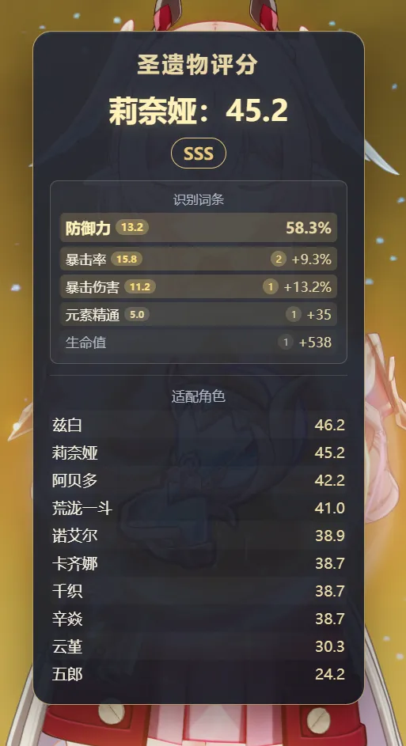

# 圣遗物实时评分

在原神角色圣遗物页面实时显示圣遗物评分

> 脚本开箱即用

## 效果展示



## 使用要求

- BetterGI 版本不低于 `0.61.0`。
- 使用原神简体中文界面。
- 推荐使用 `1920×1080`、16:9 分辨率和默认界面缩放。

## 使用方法

1. 启动“圣遗物实时评分”脚本。
2. 如图，打开角色界面的圣遗物页。  


3. 等待片刻，评分遮罩会自动出现。
4. 切换圣遗物后，脚本会重新确认部位和词条，更新结果。

结束使用时，使用 BetterGI 中的停止脚本快捷键即可。

## 两种评分模式

### 角色定向评分

脚本会在进入详情前尝试识别并缓存当前角色，支持以下标题形式：

- `水元素 / 珊瑚宫心海`
- `圣遗物 / 珊瑚宫心海`


识别成功后，浮窗的大分数会显示为“角色名：分数”。该分数会按角色的有效词条、元素及特殊评分规则计算。

旅行者会区分风、岩、雷、草、水、火元素，排行榜中也会显示为“旅行者（元素）”。

### 普通评分

如果直接进入详情页，没有识别到前置角色，浮窗会显示普通评分。

普通评分不是只计算双暴。脚本会分别计算圣遗物对所有角色的评分，并取其中前 50% 的平均值；攻击、生命、防御、精通、充能和双暴等有效词条都会参与计算。

## 浮窗内容

- 大数字：当前角色定向评分，或没有角色缓存时的普通评分。
- 档位：`D`、`C`、`B`、`A`、`S`、`SS`、`SSS`、`ACE`、`MAX`。
- 识别词条：实际传入评分模块的主词条和四条副词条。
- 适配角色：当前圣遗物评分最高的前 10 名角色。

无法可靠解析的行会显示为红色“未识别 / --”。发现识别错误时，建议等待或切换到另一件圣遗物后再切回来。

> 词条命中次数纯依赖最终值推测，可能与实际情况不符，还请谅解

## 评分数据

评分权重和角色特殊规则来源于 [miao-plugin](https://github.com/yoimiya-kokomi/miao-plugin)。评分仅用于快速筛选和参考，不代表唯一的配装结论；实际价值仍会受到队伍、武器、命座和玩法影响。

## 开发者说明

评分规则模块 `utils/artis-score-standalone.js` 完全由以下命令生成，请勿直接编辑生成文件：

```bash
node tools/crawl-standalone.js
```

可使用 `--branch` 指定 miao-plugin 分支。这个爬虫只用于更新来自 miao-plugin 的角色评分规则、权重、基础属性和特殊规则。

单条得分拆分、有效/无效标色、词条数估算等基本稳定的展示逻辑维护在 `utils/artis-score-utils.js`，不放进爬虫模板，避免更新角色规则时误覆盖。
