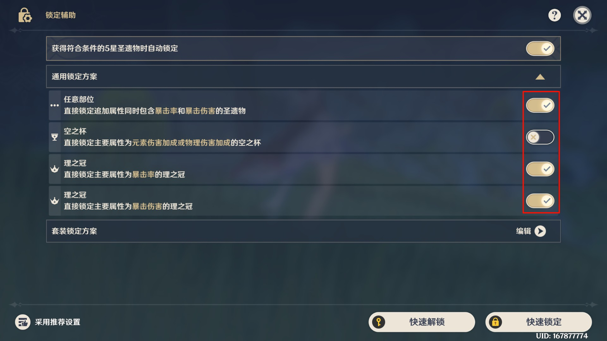

<h1 align="center">🔒 自动配置圣遗物锁定方案</h1>

## ✨ 脚本简介

本脚本用于**自动配置圣遗物锁定方案**。

锁定方案来源于 哔哩哔哩 @酸儒书生 的 [这期视频](https://www.bilibili.com/video/BV13YHQzMEAT)，脚本会自动识别游戏界面并完成所有配置操作，省去手动逐个设置的繁琐过程。

## 🚀 功能特性

- 🎯 **自动识别套装** - 通过 OCR 自动识别当前界面的圣遗物套装
- ⚙️ **批量配置方案** - 支持一次性配置多个套装的锁定方案
- 🔄 **覆盖已有方案** - 可选择是否覆盖已存在的锁定方案
- ⏱️ **延迟系数调节** - 支持自定义延迟系数，适配不同性能设备

## 📖 使用步骤

### 1️⃣ 前置要求

- 游戏分辨率设置为 **16:9** (2560x1440 或 1920x1080)

- 游戏语言设置为**简体中文**

- 圣遗物「锁定辅助」页面的「通用锁定方案」勾选上1、3、4项，如图所示

  

### 2️⃣ 配置选项

在 「调度器」 中打开脚本设置，配置以下选项：

| 选项 | 说明 |
|:---|:---|
| 覆盖已有方案 | 勾选后会删除已有方案并重新配置 |
| 延迟系数 | 默认 1.2，运行不稳定时可调高至 1.4 或更高 |
| 需要配置的圣遗物套装 | 勾选需要配置的套装，支持全选 |

### 3️⃣ 运行脚本

1. 在「调度器」中运行此脚本
2. 等待脚本自动完成所有配置

> 运行期间请勿操作鼠标键盘，脚本会自动控制游戏界面

## 🛠️ 支持的套装

脚本目前支持 1.0~月之四 的圣遗物套装

## 💬 问题反馈流程

1. 找到日志文件，路径为 BetterGI 安装目录的 `log` 目录下，日志文件名为 `better-genshin-impact年月日.log`
2. 屏幕左下角的错误日志截个图
3. https://github.com/babalae/bettergi-scripts-list/issues 创建一个 issue，**上传截图和日志**，并 @bling-yshs

## 🙏 致谢

- 锁定方案来源：[@酸儒书生](https://space.bilibili.com/10411008)

## 👥 作者

- [bling-yshs](https://github.com/bling-yshs)
- [Bedrockx](https://github.com/Bedrockx)
