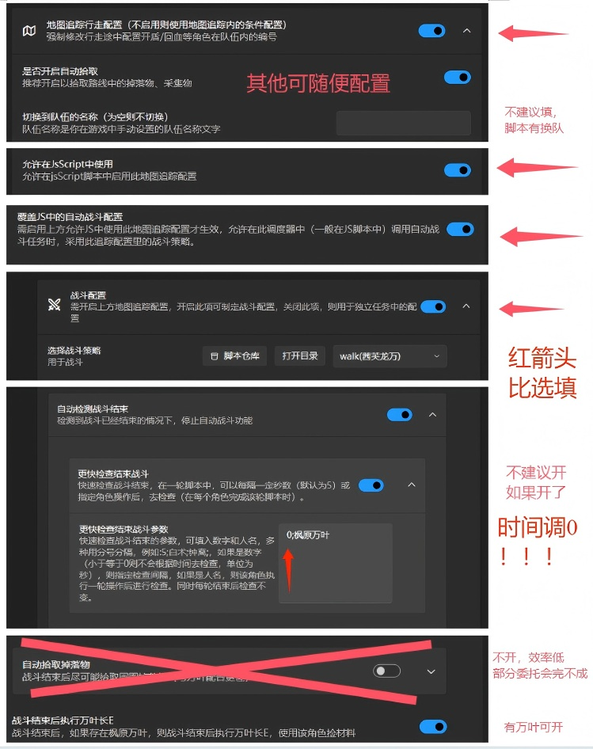

# 原神自动委托脚本

## 项目简介
这是一套基于 BetterGI 的自动化脚本，可帮助自动完成《原神》的每日委托任务。脚本能自动识别委托内容、追踪任务路径，并支持智能对话选项处理。
目前项目正处于急需人手,有意者请加QQ群（会在地图上标点或按按钮即可）。

## 快速开始

### 第一步：添加脚本到调度器
1. 订阅本脚本
2. 在将脚本添加至调度器**不要直接运行**

### 第二步：配置脚本设置
右键点击脚本，选择「修改 JS 自定义配置」：
- **不要勾选「跳过委托识别」**（这是给开发者设计的功能）
- 「切换队伍不前往七天神像」及「完成后不去安全地点」根据个人偏好设置
- 设置你的战斗队伍名称（留空表示不切换队伍）
- 设置元素采集队伍名称（队伍需要包含风、火、水元素角色和柱子对策）

### 第三步：配置调度器设置
- 战斗超时设为40-60秒
- 最好关闭自动战斗-战斗后自动拾取掉落物，避免浪费大量时间

### 第四步：运行脚本
关闭弹窗后后直接运行即可开始自动完成每日委托。

## 队伍配置建议

### 采集队伍推荐配置
采集队伍需要包含以下元素角色：
- **风元素**：必备采集元素用于特殊委托
- **火元素**：必备采集元素
- **水元素**：必备采集元素
- **柱子对策**：用于特殊委托打3+3柱子

**推荐角色组合**：钟离 + 砂糖 + 班尼特 + 芭芭拉

### 支持的角色列表
| 元素 | 角色 |
|------|------|
| 风元素 | 砂糖、鹿野院平藏、流浪者、闲云、蓝砚、枫原万叶、珐露珊、琳妮特、温迪、琴、早柚 |
| 火元素 | 烟绯、迪卢克、可莉、班尼特、香菱、托马、胡桃、迪希雅、夏沃蕾、辛焱、林尼、宵宫 |
| 水元素 | 芭芭拉、莫娜、珊瑚宫心海、玛拉妮、那维莱特、芙宁娜、妮露、坎蒂斯、行秋、神里绫人 |
| 3+3柱子对策 | 钟离、万叶、奶奶、龙王（理论，暂未支持）、香菱（理论，暂未支持） |

## 常见问题解答

### Q1: 为什么打开冒险之证脚本就出错？
请检查BGI快捷键-停止当前脚本/其他工具快捷键是否绑到F1，如果是请换一个按键，F1是打开冒险之证的快捷键。

### Q2: 为什么不打怪？
- 确保已正确配置战斗策略[战斗策略编写文档](https://bettergi.com/feats/task/domain.html)
- 直接抄我的也可以，脚本仓库-战斗脚本搜自动委托，里面的都包成功

### Q3: 为什么打不到塔上的怪？
- **你带芙芙了吗，没有快去带呀**
- 还有一些真打不到，请将战斗超时设为40-60秒（看个人练度）

### Q4: 为什么有的委托无法完成？
- 先看BGI文档能不能解决[BGI文档](https://bettergi.com/doc.html)
- 战斗委托无法完成99%都是你配队问题**你带AOE了吗**
- 还有问题请将 BetterGI/log/ 目录下当天的日志和委托任务截图反馈给作者，以便排查问题。

## 开发指南
对话委托开发文档[AutoCommission 标准对话委托制作指南](https://cnb.cool/bettergi/bettergi-scripts-list/-/tree/main/repo/js/AutoCommission/对话委托制作方法.md)。

## 反馈方法
- 1.加QQ群1053392753反馈
- 2.发送截图,日志给3302871403@qq.com
- 3.BGI QQ频道@星野

## 更新日志
### 当前版本：0.98.11 (2025-12-21)
- 修复已知问题

### 上一版本：0.98.10 (2025-10-20)
- **新增委托流程支持**：
  - 向冬日回归
- **委托流程更新，包括**：
  - *圆滚滚的大团骚乱*
    - 风角色驱散异常点后切换队伍再进入战斗
  - *说到做到*
    - 路径更新
  - *愿鲜花气息逗留* 
    - 流程更新，现在能正确的循着踪迹寻找包裹
  - *父亲能做的事*
    - 路径更新，现在可以正确的抵达教堂
  - *应急补给*
    - 支持与行走中的NPC对话
  - *一个男孩的去信*
    - 修复特定条件下与杜拉夫对话失败的问题
- 对话模块
  - 在对话中选项没有命中白名单，且没有含退出图标与气泡图标的选项，默认点击最后一个选项。

### 上一版本：0.98.7 (2025-09-29)
- 大幅优化委托流程执行效率
- 新增"把信件送给莎拉"委托自动化支持
- 完善"鸽子习惯一去不回"系列委托流程
- 优化13个委托流程配置文件，提升执行精确度
- 重构对话处理器代码逻辑，简化维护
- 改进战斗委托追踪和对话识别机制
- 总计修改16个文件（新增761行，删除505行）

### 上一版本：0.98.6
- 新增图像识别工具库（image_utils.js）
- 新增对话处理器功能增强
- 新增商店关闭功能（close-store.js）
- 新增多个委托流程支持，包括：
  - 大量新的对话委托
  - 多个新的寻路路径
  - 紧急补给系列委托
  - 各地区特殊委托优化
- 优化常数配置和主要逻辑
- 修复大量已知问题
- 总计修改105个文件

### 上一版本：0.98.5
- 懒得统计了修改了80+个文件

### 上一版本：0.98.4
- 模块化架构完成，新增 18 个对话委托、113 条流程

### 旧版本：0.98.2
- 新增 83 角色头像识别，8 个对话委托

### 旧版本：0.97
- 修复已知问题
- 完成了更多对话委托

### 旧版本：0.96
- 优化对话委托处理逻辑
- 优化战斗委托处理逻辑
- 增强NPC对话选项智能识别
- 支持自定义对话优先选项
- 新增NPC白名单功能，提高交互精确度
- 完善对话委托文档，增加JSON和简易格式说明

### 旧版本：0.95
- 完成了对话委托功能实现

### 旧版本：0.94.1
- 修复攀高危险问题
- 完成了更多对话委托
- 修复委托不存在

### 旧版本：0.94
- 修复攀高危险问题
- 新建了对话委托的文件夹

### 旧版本：0.93
- 修复已知问题

### 旧版本：0.92
- 修复部分路径命名错误
- 修复第4个委托识别失败

### 旧版本：0.91
- 修改寻路功能改为两条路径都尝试一遍
- 修复委托已完成退出错误
- 增加输入检测

### 旧版本：0.90
- 实现基本的委托识别功能
- 支持委托地点OCR识别
- 基础的委托路径追踪功能

