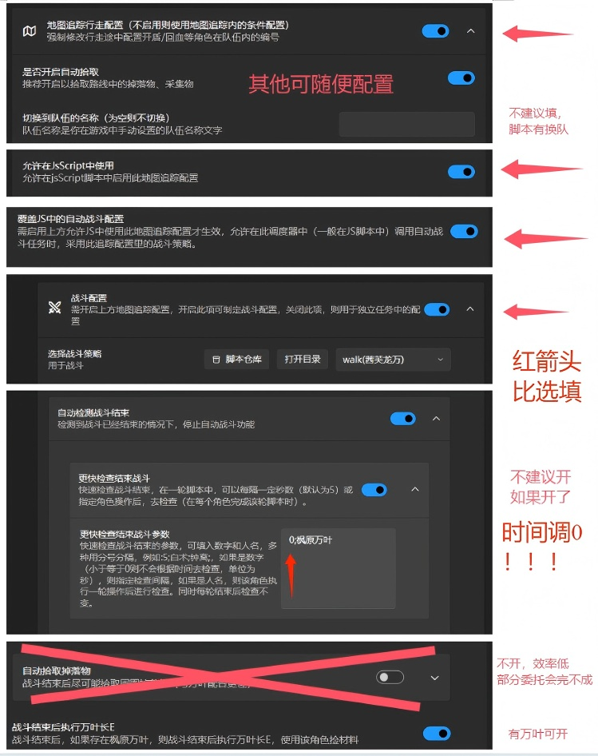

# 原神自动委托脚本

## 项目简介
这是一套基于 BetterGI 的自动化脚本，可帮助自动完成《原神》的每日委托任务。脚本能自动识别委托内容、追踪任务路径，并支持智能对话选项处理。
目前项目正处于急需人手,有意者请加QQ群（会在地图上标点或按按钮即可）。

## 快速开始

### 第一步：添加脚本到调度器
1. 订阅本脚本
2. 在将脚本添加至调度器**不要直接运行**

### 第二步：配置脚本设置
右键点击脚本，选择「修改 JS 自定义配置」：
- **不要勾选「跳过委托识别」**（这是给开发者设计的功能）
- 「切换队伍不前往七天神像」及「完成后不去安全地点」根据个人偏好设置
- 设置你的战斗队伍名称（留空表示不切换队伍）
- 设置元素采集队伍名称（队伍需要包含风、火、水元素角色和柱子对策）

### 第三步：配置调度器设置
- 战斗超时设为40-60秒
- 最好关闭自动战斗-战斗后自动拾取掉落物，避免浪费大量时间

### 第四步：运行脚本
关闭弹窗后后直接运行即可开始自动完成每日委托。

## 队伍配置建议

### 采集队伍推荐配置
采集队伍需要包含以下元素角色：
- **风元素**：必备采集元素用于特殊委托
- **火元素**：必备采集元素
- **水元素**：必备采集元素
- **柱子对策**：用于特殊委托打3+3柱子

**推荐角色组合**：钟离 + 砂糖 + 班尼特 + 芭芭拉

### 支持的角色列表
| 元素 | 角色 |
|------|------|
| 风元素 | 砂糖、鹿野院平藏、流浪者、闲云、蓝砚、枫原万叶、珐露珊、琳妮特、温迪、琴、早柚 |
| 火元素 | 烟绯、迪卢克、可莉、班尼特、香菱、托马、胡桃、迪希雅、夏沃蕾、辛焱、林尼、宵宫 |
| 水元素 | 芭芭拉、莫娜、珊瑚宫心海、玛拉妮、那维莱特、芙宁娜、妮露、坎蒂斯、行秋、神里绫人 |
| 3+3柱子对策 | 钟离、万叶、奶奶、龙王（理论，暂未支持）、香菱（理论，暂未支持） |

## 常见问题解答

### Q1: 为什么打开冒险之证脚本就出错？
请检查BGI快捷键-停止当前脚本/其他工具快捷键是否绑到F1，如果是请换一个按键，F1是打开冒险之证的快捷键。

### Q2: 为什么不打怪？
- 确保已正确配置战斗策略[战斗策略编写文档](https://bettergi.com/feats/task/domain.html)
- 直接抄我的也可以，脚本仓库-战斗脚本搜自动委托，里面的都包成功

### Q3: 为什么打不到塔上的怪？
- **你带芙芙了吗，没有快去带呀**
- 还有一些真打不到，请将战斗超时设为40-60秒（看个人练度）

### Q4: 为什么有的委托无法完成？
- 先看BGI文档能不能解决[BGI文档](https://bettergi.com/doc.html)
- 战斗委托无法完成99%都是你配队问题**你带AOE了吗**
- 还有问题请将 BetterGI/log/ 目录下当天的日志和委托任务截图反馈给作者，以便排查问题。

## 开发指南
对话委托开发文档[AutoCommission 标准对话委托制作指南](https://cnb.cool/bettergi/bettergi-scripts-list/-/tree/main/repo/js/AutoCommission/对话委托制作方法.md)。

## 反馈方法
- 1.加QQ群1053392753反馈
- 2.发送截图,日志给3302871403@qq.com
- 3.BGI QQ频道@星野

## 更新日志
### 当前版本：0.98.18 (2026-06-04)
- 修复已知问题 (2026-06-04 15:10:23 UTC)

### 上一版本：0.98.17 (2026-06-04)
- **委托流程修复与补充**：
  - *语言交流*、*诗歌交流*、*钥匙是易丢品*：补充多个地区的对话选项和流程配置，修正重试后地点更新逻辑，避免沿用上一次失败识别的委托地点。
  - *惊喜大礼*：优化寻找乔玛丽的路径，降低走过头导致交互失败的概率。
  - *西风骑士的基础知识*、*餐品订单*：优化流程中的交互与路径细节。
  - *邪恶的扩张*：将区域名从「明冠峡」更正为「明冠山地」。
- **识别与执行稳定性优化**：
  - 优化靠近 NPC 后小概率未出现对话选项时的处理。
  - 大地图位置识别改为投票机制，提升坐标判断稳定性。
  - 更新 step fallback 加载逻辑，移除冗余和易误导日志。

### 上一版本：0.98.16 (2026-01-30)
- **委托流程更新**：
  - *新的风暴尚未出现*：区域从「望风角」调整为「望风海岸」，新增前往望风角塔楼顶部的普通路径和 TP 路径。
  - 爬塔流程增加三次重试机会，减少偶发寻路或攀爬失败。
- 删除冗余流程文件，修正执行流程中参数数量不一致的问题。

### 上一版本：0.98.15 (2026-01-20)
- **委托识别优化**：
  - 新增委托名与地点名 OCR 结果校正，降低识别错误导致无法匹配流程的概率。
  - 保存识别到的委托任务时，避免任务地点被同一天上次执行失败后的地点覆盖。
- **流程与兼容性调整**：
  - 适配 BetterGI 本体 AutoSkip 相关改动。
  - 修正 *报答神明的方式* 的流程文件名。
  - 清理 *艾伯特先生别再冲了*、*艾琳，未来的骑士* 的重复/误命名流程目录。
- 修复自动同步工作流中版本号不同步的问题，并调整 PR 模板内容。

### 上一版本：0.98.14 (2026-01-07)
- **新增更新提示**：新增版本检查模块，启动时可提示当前脚本是否需要更新。
- **地图与 OCR 识别优化**：
  - 调整大地图缩放级别，修复部分委托从大地图获取坐标时报错的问题。
  - 修复委托描述检测 step 的参数检查逻辑。
  - 增加 OCR 全部结果的 debug 日志输出，便于排查识别问题。
  - 增高对话选项 OCR 识别范围，减少选项较多时漏识别的问题。
- **委托流程修复**：
  - *钥匙是易丢品*：修复晨曦酒庄支线位置偏移问题。
  - *惊喜大礼*：补充对话优先选项。
  - *语言交流*：根据后续回退结果，修正区域分支归属，避免错误匹配。
- **自动同步流程**：新增/完善同步到脚本列表仓库并创建 PR 的工作流，支持 PR 正文展示提交历史。

### 上一版本：0.98.12 (2025-12-24)
- 新增 `.gitattributes`，统一仓库换行符处理。
- 新增自动同步代码并创建 PR 的 GitHub Actions 工作流。
- *钥匙是易丢品*：更新晨曦酒庄流程配置。
- 更新 README 描述与版本相关配置。

### 上一版本：0.98.11 (2025-12-21)
- **委托流程修复**：
  - *语言交流*：修正地图追踪参数和区域分支配置。
  - *惊喜大礼*：补充对话优先选项。
  - *愿鲜花气息逗留*：解除 ban 状态，恢复流程可用性。
- **执行与对话逻辑优化**：
  - 删除冗余参数，修正对话 icon 识别范围。
  - 同步 BetterGI 主仓强制 dispose 相关改动。
  - 删除关闭商店 step，并同步更新相关委托流程。
- 更新 README、设置说明和版本号。

### 上一版本：0.98.10 (2025-10-20)
- **新增委托流程支持**：
  - 向冬日回归
- **委托流程更新，包括**：
  - *圆滚滚的大团骚乱*
    - 风角色驱散异常点后切换队伍再进入战斗
  - *说到做到*
    - 路径更新
  - *愿鲜花气息逗留* 
    - 流程更新，现在能正确的循着踪迹寻找包裹
  - *父亲能做的事*
    - 路径更新，现在可以正确的抵达教堂
  - *应急补给*
    - 支持与行走中的NPC对话
  - *一个男孩的去信*
    - 修复特定条件下与杜拉夫对话失败的问题
- 对话模块
  - 在对话中选项没有命中白名单，且没有含退出图标与气泡图标的选项，默认点击最后一个选项。

### 上一版本：0.98.7 (2025-09-29)
- 大幅优化委托流程执行效率
- 新增"把信件送给莎拉"委托自动化支持
- 完善"鸽子习惯一去不回"系列委托流程
- 优化13个委托流程配置文件，提升执行精确度
- 重构对话处理器代码逻辑，简化维护
- 改进战斗委托追踪和对话识别机制
- 总计修改16个文件（新增761行，删除505行）

### 上一版本：0.98.6
- 新增图像识别工具库（image_utils.js）
- 新增对话处理器功能增强
- 新增商店关闭功能（close-store.js）
- 新增多个委托流程支持，包括：
  - 大量新的对话委托
  - 多个新的寻路路径
  - 紧急补给系列委托
  - 各地区特殊委托优化
- 优化常数配置和主要逻辑
- 修复大量已知问题
- 总计修改105个文件

### 上一版本：0.98.5
- 懒得统计了修改了80+个文件

### 上一版本：0.98.4
- 模块化架构完成，新增 18 个对话委托、113 条流程

### 旧版本：0.98.2
- 新增 83 角色头像识别，8 个对话委托

### 旧版本：0.97
- 修复已知问题
- 完成了更多对话委托

### 旧版本：0.96
- 优化对话委托处理逻辑
- 优化战斗委托处理逻辑
- 增强NPC对话选项智能识别
- 支持自定义对话优先选项
- 新增NPC白名单功能，提高交互精确度
- 完善对话委托文档，增加JSON和简易格式说明

### 旧版本：0.95
- 完成了对话委托功能实现

### 旧版本：0.94.1
- 修复攀高危险问题
- 完成了更多对话委托
- 修复委托不存在

### 旧版本：0.94
- 修复攀高危险问题
- 新建了对话委托的文件夹

### 旧版本：0.93
- 修复已知问题

### 旧版本：0.92
- 修复部分路径命名错误
- 修复第4个委托识别失败

### 旧版本：0.91
- 修改寻路功能改为两条路径都尝试一遍
- 修复委托已完成退出错误
- 增加输入检测

### 旧版本：0.90
- 实现基本的委托识别功能
- 支持委托地点OCR识别
- 基础的委托路径追踪功能

