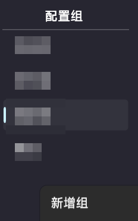
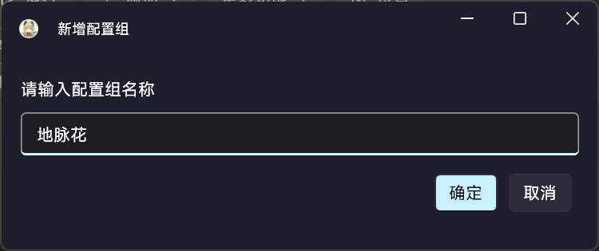
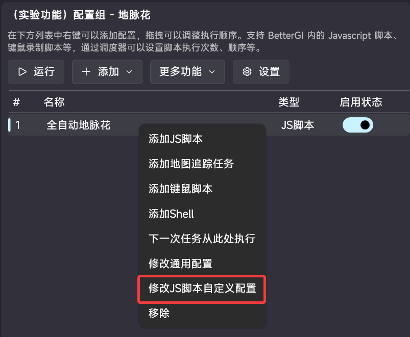
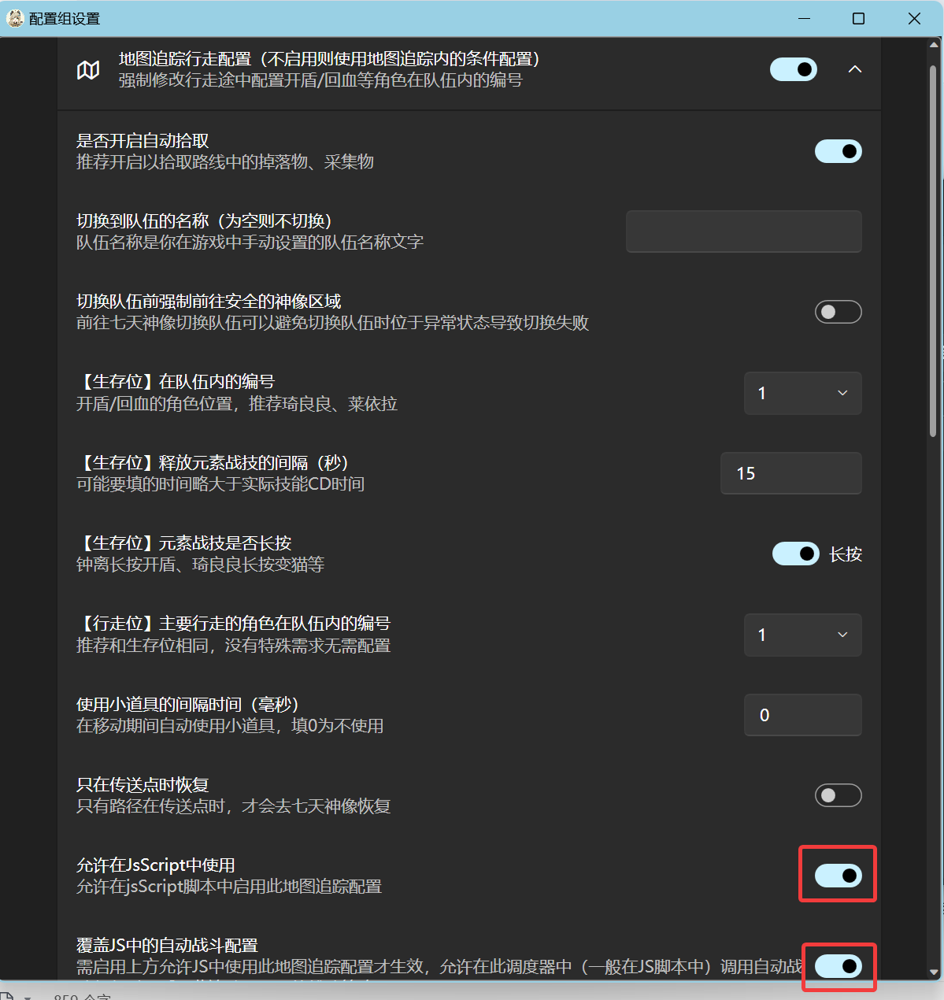
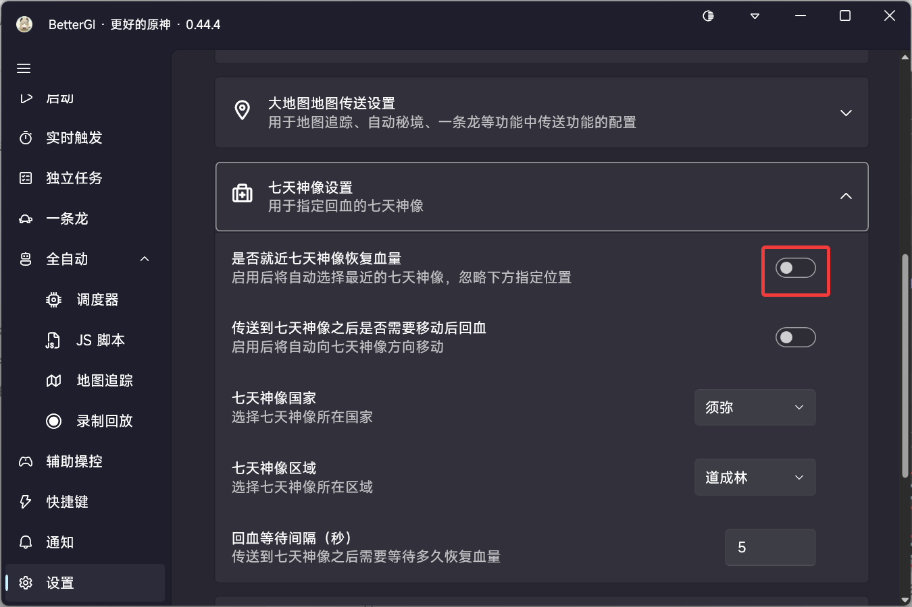
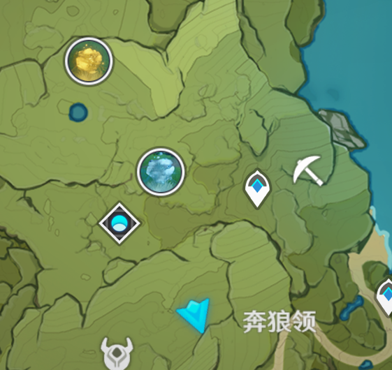

# BGI全自动地脉花脚本使用手册
**仅支持 BetterGI 0.52.0 及以上版本！**
**仅支持 Bitblt 截图方式！**
**仅支持 V4 OCR模型！**
目前脚本仍在更新，开发阶段会有很多bug，详见下方已知问题，如果遇到没有提到的bug请反馈给我们，非常感谢！
## 目录
- [配置](#配置)
  - [配置地图追踪策略和战斗策略](#配置地图追踪策略和战斗策略)
  - [七天神像](#七天神像)
- [特色介绍](#特色介绍)
- [常见问题](#常见问题)
  - [一运行就报错退出了](#一运行就报错退出了)
  - [找不到地脉花/找到地脉花，未找到策略](#找不到地脉花--找到地脉花未找到策略)
  - [走到地脉花旁边没有开启地脉花](#走到地脉花旁边没有开启地脉花)
  - [路线中途跳过了一个点位](#路线中途跳过了一个点位)
  - [跑完后大地图所有自定义的标点都没了](#跑完后大地图所有自定义的标点都没了)
- [更新日志](#更新日志)
- [路线](#路线)
  - [蒙德](#蒙德)
  - [璃月](#璃月)
  - [稻妻](#稻妻)
  - [须弥](#须弥)
  - [枫丹](#枫丹)
  - [纳塔](#纳塔)
  - [挪德卡莱](#挪德卡莱)
- [特别感谢](#特别感谢)
## 配置
使用前需要对脚本以及战斗策略进行配置
在调度器新建一个配置组，将脚本添加进来，脚本只能在配置组内使用

右键脚本选择修改js脚本自定义配置，根据你的需要对脚本进行配置。

### 配置地图追踪策略和战斗策略
点击配置组设置，开启战斗策略配置，**关闭自动检测战斗结束**，其他的根据你的队伍进行配置。
> 脚本不通过按L检查战斗是否结束，请务必关闭 **自动检测战斗结束** ，不关闭可能导致提前结束战斗!
> 也因此无法在战斗后进行拾取，配置与否均不会影响。
> 战斗超时时间一定要大于或与脚本配置内的时间一样，太短会原地罚站！
> 脚本强制启用自动拾取，开关与否均不会影响。

### 七天神像
在bgi设置内，**关闭就近七天神像**，指定一个七天神像，如无特殊要求推荐选择须弥道成林。  
如果您开启了一条龙模式，将会跳过以节约时间。  
> 不要开启**传送到七天神像之后是否需要移动后回血**，目前这个功能Bug很多！

### 开启 HTTP 权限
脚本需要开启 HTTP 权限检查是否有更新。  
在配置组内右键脚本，选择修改通用配置，将JS HTTP权限从**禁用**修改为**启用**。

## 特色介绍
- **全自动运行**：配置好之后，只需要点击运行，就可以全部打完，无需任何其他操作。
- **自动寻找地脉花**：通过大地图定位地脉花位置的方式来寻找地脉花，并执行后续的路线。
- **自动开启地脉花奖励，优先使用浓缩树脂**：领取奖励时优先选择浓缩树脂，当存在双倍奖励活动（地脉移涌或星之归还）时会优先选择双倍奖励。
- **树脂耗尽模式**：根据设置统计当前的树脂情况，计算出需要运行的次数，运行结束后再次判断，若结束后统计到未消耗的树脂则继续执行（最多3次）
- **树脂不足时自动停止**：如果领取奖励时树脂不够了，脚本会直接停止，可以配置是否使用须臾/脆弱。
- **好感队领取奖励**：领取奖励前切换到好感队，还可以领取到好感度。
## 常见问题
### 一运行就报错退出了
根据错误提示自行排查原因
### 找不到地脉花 / 找到地脉花，未找到策略
脚本还未适配，请等待脚本更新。
如果不是，请将出错的**完整游戏界面截图**反馈。
注意：为了方便截图反馈，出现该错误时不会关闭大地图界面！也不会将关闭的自定义标记按钮打开！
### 走到地脉花旁边没有开启地脉花
- 请使用bitblt截图方式，脚本只支持这个
- 请切换ocr引擎至v4，其他引擎脚本未进行适配
### 路线中途跳过了一个点位
当地脉花打完后，下一个点位已经存在另一类型的地脉花，则下一朵地脉花将跳过这个点，刷新在下一个位置。
脚本会跳过这个被占用的点位。

例如这里，摩拉花刷新在经验花的下一个位置上。
### 跑完后大地图所有自定义的标点都没了
打开大地图，点击左下角设置，开启自定义标记。
脚本非正常结束运行时会出现该问题。
## 更新日志
### 4.4
- 新增树脂耗尽模式
- 新增树脂耗尽模式下刷取次数取小值
- 新增更新提醒
- 新增一条龙模式
- BGI最低版本要求改为0.52.0
### 4.3
- 适配新的奖励领取界面
- 修复挪德卡莱识别错误及通过冒险之证寻找地脉花总会选择挪德卡莱的bug
- 修复卡在奖励领取界面无法执行其他配置的bug
- 优化冒险之征寻找地脉花的逻辑
- 新增是否使用须臾树脂配置选项
### 4.2
- 新增挪德卡莱区域
### 4.1
- 新增通过冒险之证寻找地脉花
- 修复部分报错
### 4.0
- 适配原神5.7版本更新
- 修复打开自定义标记的bug
### 3.5
- 减少部分日志输出
- 修改部分错误提示信息

### 3.4
- 重构代码结构
- 修复部分提示错误

### 3.3
- 战斗失败路线重试支持
- 导航到地脉花优化

### 3.2
- 新增通知选项

### 3.1
- 新增璃月、须弥部分路线
- 修改寻找地脉花领奖的逻辑

### 3.0
**本次更新内容很多，详情可以到[GitHub](https://github.com/babalae/bettergi-scripts-list/pull/633)上查看**
- 新增路线：地中之盐 瑶光滩 药蝶谷 踏鞴砂 海祇岛 硫晶支脉 翘枝崖 溶水域 八酝岛 彩石顶 花羽会 鸣神岛 清籁岛
稻妻与纳塔的路线已全部补全
- 优化战斗相关逻辑，通过识别挑战结果来判断战斗是否结束
- **全地脉花识别**
- 移除强制运行模式
- 优化地脉花寻找逻辑
- 优化地脉开启和领取奖励相关逻辑
- 新增优先使用双倍奖励（地脉移涌和星之归还）
### 2.1
- 重构寻找地脉花位置的方式为获取地脉花在游戏内的坐标
理论上会减少找不到地脉花的情况
- 新增 领取前可切换至好感队（需配置）
### 2.0
- 新增 枫丹新枫丹科学院 柔灯港
至此，枫丹全部线路已制作完成
- 修复 有浓缩树脂的情况下误认为树脂已用完
- 修复 无限重试
### 1.0
- 脚本发布

## 路线
打钩的代表已制作完成
### 蒙德
- [x] 1. 风起地

**地脉花总数：5**

顺序 | 怪物
--- | ---
1 | 第一波：丘丘人x3 第二波：丘丘人x1、雷箭丘丘人x2、水深渊法师x1
2 | 第一波：大型雷史莱姆x1、变异雷史莱姆x1、雷箭丘丘人x1 第二波：大型雷史莱姆x1、变异雷史莱姆x1、水丘丘萨满x1、冰箭丘丘人x2
3 | 第一波：盗宝团·斥候x2、盗宝团·掘墓者x1、盗宝团·雷之药剂师x1 第二波：盗宝团·神射手x1、盗宝团·杂工x1、盗宝团·雷之药剂师x1、盗宝团·粉碎者x1
4 | 第一波：木盾丘丘人x3、爆弹丘丘人x1、火史莱姆x2 第二波：冲锋丘丘人x4
5 | 第一波：大型水史莱姆x2、冰霜骗骗花x1 第二波：雷史莱姆x3、冰霜骗骗花x1

- [x] 2. 清泉镇

**地脉花总数：5**

顺序 | 怪物
--- | ---
1 | 第一波：大型火史莱姆x1、雷史莱姆x2 第二波：炽热骗骗花x1、雷史莱姆x3
2 | 第一波：大型火史莱姆x1、火史莱姆x4 第二波：炽热骗骗花x2
3 | 第一波：火箭丘丘人x2、风丘丘萨满x1、大型火史莱姆x1 第二波：爆弹丘丘人x2、风丘丘萨满x1、大型火史莱姆x1
4-1 | 第一波：火史莱姆x2、爆弹丘丘人x2 第二波：雷箭丘丘人x3、火深渊法师x1
4-2/5-1 | 第一波：狂风之核x1

- [x] 3. 奔狼领 （特征点少，有概率失败）

**地脉花总数：4**

顺序 | 怪物
--- | ---
1 | 第一波：盗宝团·斥候x3 第二波：盗宝团·杂工x2、盗宝团·神射手x2
2 | 第一波：遗迹守卫x1
3 | 第一波：火箭丘丘人x2、木盾丘丘人x2 第二波：火斧丘丘人x1、风丘丘萨满x1、爆弹丘丘人x3
4 | 第一波：木盾丘丘人x2、雷箭丘丘人x2、爆弹丘丘人x2 第二波：火深渊法师x2

- [x] 4. 风龙废墟

**地脉花总数：4**

顺序 | 怪物
--- | ---
1 | 第一波：盗宝团·斥候x2、盗宝团·杂工x1、盗宝团·神射手x1 第二波：盗宝团·斥候x2、盗宝团·粉碎者x1、盗宝团·火之药剂师x1、盗宝团·雷之药剂师x1
2 | 第一波：遗迹猎者x1
3 | 第一波：遗迹守卫x1
4 | 第一波：愚人众先遣队·雷锤前锋军x1、愚人众先遣队·风拳前锋军x1 第二波：愚人众先遣队·火铳游击兵x2、愚人众先遣队·水锤重卫士x1

- [x] 5. 千风神殿

**地脉花总数：5**

顺序 | 怪物
--- | ---
1 | 第一波：木盾丘丘人x2、雷箭丘丘人x1、冰箭丘丘人x1 第二波：雷箭丘丘人x1、冰箭丘丘人x1、水丘丘萨满x1、木盾丘丘人x1、木盾丘丘暴徒x1
2 | 第一波：木盾丘丘人x2、冲锋丘丘人x2 第二波：冲锋丘丘人x3、草丘丘萨满x1
3 | 第一波：盗宝团·斥候x4、盗宝团·神射手x1 第二波：盗宝团·火之药剂师x2、盗宝团·拳术家x1、盗宝团·粉碎者x1
4 | 第一波：雷史莱姆x2、冲锋丘丘人x2、木盾丘丘人x1 第二波：雷史莱姆x2、爆弹丘丘人x2、火斧丘丘暴徒x1
5 | 第一波：木盾丘丘人x2、爆弹丘丘人x2 第二波：爆弹丘丘人x2、风丘丘萨满x1、草丘丘萨满x1

- [x] 6. 望风山地

**地脉花总数：4**

顺序 | 怪物
--- | ---
1 | 第一波：大型冰史莱姆x2、大型水史莱姆x2 第二波：冰箭丘丘人x2、水深渊法师x1
2 | 第一波：爆弹丘丘人x2、风丘丘萨满x2 第二波：雷箭丘丘人x2、爆弹丘丘人x1、火斧丘丘暴徒x1
3 | 第一波：炽热骗骗花x2 第二波：雷箭丘丘人x3、火深渊法师x1
4 | 第一波：冲锋丘丘人x3 第二波：木盾丘丘暴徒x2、水丘丘萨满x2

- [x] 7. 达达乌帕谷

**地脉花总数：6**

顺序 | 怪物
--- | ---
1 | 第一波：木盾丘丘人x2、射手丘丘人x2 第二波：水深渊法师x1、冰箭丘丘人x2
2 | 第一波：打手丘丘人x3、爆弹丘丘人x1 第二波：冲锋丘丘人x3、火斧丘丘暴徒x1
3 | 第一波：打手丘丘人x2、木盾丘丘人x2、火箭丘丘人x1 第二波：火斧丘丘暴徒x2
4 | 第一波：雷箭丘丘人x2、火斧丘丘暴徒x1 第二波：火箭丘丘人x3、草丘丘萨满x1
5 | 第一波：木盾丘丘人x2、水丘丘萨满x1 第二波：木盾丘丘人x2、雷箭丘丘人x1、水深渊法师x1
6 | 第一波：大型水史莱姆x2、冰霜骗骗花x1 第二波：雷史莱姆x3、冰霜骗骗花x1

### 璃月
- [x] 1. 石门

**地脉花总数：5**

顺序 | 怪物
--- | ---
1 | 第一波：盗宝团·神射手x2、盗宝团·斥候x1、盗宝团·粉碎者x1 第二波：盗宝团·掘墓者x1、盗宝团·火之药剂师x1、盗宝团·斥候x1、盗宝团·神射手x1
2 | 第一波：大型岩史莱姆x1、岩史莱姆x3 第二波：大型岩史莱姆x2、岩史莱姆x2
3 | 第一波：火深渊法师x1、雷箭丘丘人x2 第二波：火斧丘丘人暴徒x1、冰箭丘丘人x2、水丘丘人萨满x1
4 | 第一波：木盾丘丘暴徒x2 第二波：岩盾丘丘暴徒x2
5 | 第一波：岩丘丘人萨满x2、爆弹丘丘人投手x2 第二波：岩盾丘丘人暴徒x2

- [x] 2. 地中之盐

**地脉花总数：4**

顺序 | 怪物
--- | ---
1 | 第一波：冲锋丘丘人x2、爆弹丘丘人x1、草丘丘人萨满x1 第二波：雷箭丘丘人x2、火深渊法师x1
2 | 第一波：水萤x3、大型冰史莱姆x1、冰史莱姆x1 第二波：雷萤术士x1
3 | 第一波：岩盔丘丘王x1
4 | 第一波：火箭丘丘人x2、冲锋丘丘人x1、岩丘丘人萨满x1 第二波：雷箭丘丘人x4、岩丘丘人萨满x1

- [x] 3. 瑶光滩

**地脉花总数：5**

顺序 | 怪物
--- | ---
1 | 第一波：水史莱姆x2、冰霜骗骗花x1 第二波：水萤x3、雷萤术士x1
2 | 第一波：遗迹守卫x1
3 | 第一波：盗宝团·拳术师x1、盗宝团·神射手x2、盗宝团·火之药剂师x1 第二波：盗宝团·斥候x1、盗宝团·杂工x1、盗宝团·神射手x1、盗宝团·海上男儿x1
4 | 第一波：冰箭丘丘人x2、雷箭丘丘人x1 第二波：冰深渊法师x1、雷箭丘丘人x1、水丘丘人萨满x1
5 | 第一波：大型火史莱姆x2、火史莱姆x3 第二波：炽热骗骗花x2

- [x] 4. 璃月港

**地脉花总数：7**

顺序 | 怪物
--- | ---
1 | 第一波：幼岩龙蜥x2 第二波：幼岩龙蜥x2
2 | 第一波：岩盔丘丘王x1
3 | 第一波：愚人众先遣队·水铳重卫士x1、愚人众先遣队·冰铳重卫士x1 第二波：愚人众先遣队·风拳前锋军x1、愚人众先遣队·雷锤前锋军x1
4 | 第一波：大型岩史莱姆x1、岩史莱姆x4 第二波：大型岩史莱姆x3
5 | 第一波：遗迹守卫x1
6 | 第一波：冰箭丘丘人x2、雷箭丘丘人x1 第二波：冰深渊法师x1、雷箭丘丘人x1、水丘丘人萨满x1
7 | 第一波：大型火史莱姆x2、火史莱姆x3 第二波：炽热骗骗花x2

- [x] 5. 天衡山

**地脉花总数：5**

顺序 | 怪物
--- | ---
1 | 第一波：遗迹猎者x1
2 | 第一波：大型雷史莱姆x1、变异雷史莱姆x1 第二波：大型冰史莱姆x1、冰史莱姆x3
3 | 第一波：水深渊法师x1、冰史莱姆x2 第二波：冰深渊法师x1、雷箭丘丘人x2
分支线路1：|
4 | 第一波：岩盾丘丘人x4 第二波：岩盾丘丘人暴徒x2
分支线路2：|
4 | 第一波：火斧丘丘暴徒x2 第二波：岩盾丘丘暴徒x1、岩丘丘萨满x1、爆弹丘丘人x2
 
- [x] 6. 奥藏山

**地脉花总数：7/9**

顺序 | 怪物
--- | ---
1 | 第一波：火史莱姆x3、炽热骗骗花x1 第二波：冰史莱姆x3、冰霜骗骗花x1
2 | 第一波：愚人众·火之债务处理人x1
3 | 第一波：雷史莱姆x4、炽热骗骗花x1 第二波：大型岩史莱姆x2、炽热骗骗花x1
4 | 第一波：雷史莱姆x3、冲锋丘丘人x2、岩盾丘丘人x1 第二波：火史莱姆x2、爆弹丘丘人x2、岩盾丘丘人x2
分支线路1：| 
5 | 第一波：愚人众先遣队·雷锤前锋军x1、愚人众先遣队·冰铳重卫士x1 第二波：愚人众先遣队·雷锤前锋军x1、愚人众先遣队·火铳游击兵x1、愚人众先遣队·岩使游击兵x1
6 | 第一波：岩盔丘丘王x1
7 | 第一波：雷萤术士x1、雷萤x3
分支线路2：|
5 | 第一波：雷萤x2、愚人众·火之债务处理人x1
6 | 第一波：岩盾丘丘人x1、火箭丘丘人x3 第二波：火斧丘丘人暴徒x1、爆弹丘丘人投手x2
7 | 第一波：大型雷史莱姆x1、雷史莱姆x3、水史莱姆x2 第二波：大型雷史莱姆x1、变异雷史莱姆x1、雷史莱姆x3、大型水史莱姆x2
8 | 第一波：大型冰史莱姆x2 第二波：大型水史莱姆x3
9 | 第一波：大型火史莱姆x2、火史莱姆x3 第二波：炽热骗骗花x2

- [x] 7. 遁玉陵

**地脉花总数：7**

顺序 | 怪物
--- | ---
1 | 第一波：雷萤x3、水萤x3 第二波：雷萤术士x1
2 | 第一波：盗宝团·雷之药剂师x1、盗宝团·火之药剂师x1、盗宝团·神射手x1、盗宝团·拳术师x1 第二波：盗宝团·拳术师x1、盗宝团·杂工x1、盗宝团·雷之药剂师x1、盗宝团·火之药剂师x1
3 | 第一波：大型冰史莱姆x2 第二波：冰霜骗骗花x1、大型水史莱姆x2
4 | 第一波：火深渊法师x1、雷箭丘丘人x2 第二波：冰深渊法师x1、雷箭丘丘人x3
5 | 第一波：大型冰史莱姆x2 第二波：大型水史莱姆x3
6 | 第一波：大型火史莱姆x2、火史莱姆x3 第二波：炽热骗骗花x2

- [x] 8. 南天门南

**地脉花总数：7**

顺序 | 怪物
--- | ---
1 | 第一波：遗迹守卫x2
2 | 第一波：岩盔丘丘王x1
3 | 第一波：火斧丘丘人暴徒x2 第二波：火深渊法师x1、冲锋丘丘人x3
4 | 第一波：大型雷史莱姆x1、雷史莱姆x4 第二波：炽热骗骗花x1、雷史莱姆x4
5 | 第一波：火深渊法师x1、雷箭丘丘人x2 第二波：冰深渊法师x1、雷箭丘丘人x3
6 | 第一波：大型冰史莱姆x2 第二波：大型水史莱姆x3
7 | 植物：烈焰花x4 第一波：大型火史莱姆x2、火史莱姆x3 第二波：炽热骗骗花x2

- [x] 9. 南天门东

**地脉花总数：2**

顺序 | 怪物
--- | ---
1 | 第一波：炽热骗骗花x1、火史莱姆x3 第二波：岩史莱姆x4 第三波：大型岩史莱姆x1、岩史莱姆x2
2 | 第一波：愚人众·火之债务处理人x1
分支线路1：| 
3 | 第一波：盗宝团x4 第二波：盗宝团x4
分支线路2：|
3 | 第一波：遗迹猎者x1
4 | 第一波：火斧丘丘人暴徒x1、火箭丘丘人x2 第二波：风丘丘萨满x1、雷箭丘丘人x3

- [x] 10. 绝云间

**地脉花总数：5**

顺序 | 怪物
--- | ---
1 | 第一波：岩盾丘丘人x4、爆弹丘丘人投手x1 第二波：水丘丘人萨满x2、冰深渊法师x1
2 | 第一波：岩盾丘丘人x1、火箭丘丘人x3 第二波：火斧丘丘人暴徒x1、爆弹丘丘人投手x2
3 | 第一波：大型雷史莱姆x1、雷史莱姆x3、水史莱姆x2 第二波：大型雷史莱姆x1、变异雷史莱姆x1、雷史莱姆x3、大型水史莱姆x2
4 | 第一波：大型冰史莱姆x2 第二波：大型水史莱姆x3
5 | 第一波：大型火史莱姆x2、火史莱姆x3 第二波：炽热骗骗花x2

- [x] 11. 轻策庄

**地脉花总数：6**

顺序 | 怪物
--- | ---
1 | 第一波：大型冰史莱姆x1、大型水史莱姆x2 第二波：大型雷史莱姆x1、变异雷史莱姆x1、大型火史莱姆x1
2 | 第一波：盗宝团·神射手x1、盗宝团·杂工x1、盗宝团·火之药剂师x1、盗宝团·斥候x1 第二波：盗宝团·斥候x1、盗宝团·掘墓者x1、盗宝团·粉碎者x1
3 | 第一波：岩盾丘丘人x1、雷箭丘丘人x1、冰箭丘丘人x2 第二波：雷箭丘丘人x2、冰深渊法师x1
4 | 第一波：愚人众先遣队·雷锤前锋军x1、愚人众先遣队·冰铳重卫士x1 第二波：愚人众先遣队·雷锤前锋军x1、愚人众先遣队·火铳游击兵x1、愚人众先遣队·岩使游击兵x1
5 | 第一波：岩盔丘丘王x1
6 | 第一波：雷萤术士x1、雷萤x3

- [ ] 12. 孤云阁（特征点少，录制困难）

**地脉花总数：4**

顺序 | 怪物
--- | ---
1 | 第一波：大型冰史莱姆x2、冰史莱姆x3 第二波：冰霜骗骗花x2
2 | 第一波：岩盔丘丘王x1
3 | 第一波：愚人众先遣队·水铳重卫士x1、愚人众先遣队·冰铳重卫士x1、愚人众先遣队·风拳前锋军x1 第二波：愚人众·火之债务处理人x1
4 | 第一波：水深渊法师x1、冰箭丘丘人x3 第二波：冰深渊法师x1、雷箭丘丘人x2

- [x] 13. 悬练山

**地脉花总数：4**

顺序 | 怪物
--- | ---
1 | 第一波：丘丘人x3、火斧丘丘暴徒x1 第二波：岩盾丘丘暴徒x2
2 | 第一波：雷史莱姆x2、大型雷史莱姆x2 第二波：大型水史莱姆x2
3 | 第一波：玄文兽x2 第二波：玄文兽x2
4 | 第一波：丘丘人x2、岩盾丘丘人x1、冲锋丘丘人x1、爆弹丘丘人x1 第二波：火斧丘丘暴徒x2

- [x] 14. 药蝶谷

**地脉花总数：4**

顺序 | 怪物
--- | ---
1 | 第一波：遗迹守卫x2 第二波：遗迹猎者x1
2 | 第一波：玄文兽x2 第二波：玄文兽x2
3 | 第一波：丘丘人x3、火斧丘丘暴徒x1 第二波：岩盾丘丘暴徒x2
4 | 第一波：玄文兽x2 第二波：玄文兽x2

### 稻妻
- [x] 1. 鸣神岛

**地脉花总数：4**

顺序 | 怪物
--- | ---
1 | 第一波：遗迹巡弋者x2 第二波：遗迹歼击者x2
2 | 第一波：水史莱姆x5 第二波：大型水史莱姆x2
3 | 第一波：野伏·机巧番x1、野伏·火付番x1、野伏·阵刀番x1
4 | 第一波：海乱鬼·炎威x1、海乱鬼·雷腾x1

- [x] 2. 踏鞴砂

**地脉花总数：5**

顺序 | 怪物
--- | ---
1 | 第一波：愚人众·雷萤术士x1、愚人众·藏镜仕女x1 第二波：愚人众·冰萤术士x1、愚人众·藏镜仕女x1
2 | 第一波：愚人众先遣队·岩使游击兵x1、愚人众先遣队·风拳前锋军x1 第二波：愚人众·火之债务处理人x1、愚人众·藏镜仕女x1
3 | 第一波：盗宝团·水之药剂师x2、盗宝团·海上男儿x2 第二波：盗宝团·掘墓者x1、盗宝团·粉碎者x1
4 | 第一波：遗迹侦察者x1、遗迹防卫者x1 第二波：遗迹歼击者x1、遗迹巡弋者x1
5 | 第一波：海乱鬼·雷腾x1、野伏·阵刀番x1、盗宝团·冰之药剂师x1、盗宝团·水之药剂师x1 第二波：海乱鬼·雷腾x1、盗宝团·海上男儿x1

- [x] 3. 八酝岛

**地脉花总数：4**

顺序 | 怪物
--- | ---
1 | 第一波：海乱鬼·炎威x1、海乱鬼·雷腾x1
2 | 第一波：遗迹歼击者x3
3 | 第一波：野伏·机巧番x1、野伏·火付番x1、野伏·阵刀番x1 第二波：野伏·机巧番x1、野伏·火付番x1、野伏·阵刀番x1
4 | 第一波：遗迹歼击者x3

- [x] 4. 海祇岛

**地脉花总数：5**

顺序 | 怪物
--- | ---
1 | 第一波：雷丘丘萨满x1、雷弹丘丘人x3 第二波：雷深渊法师x2
2 | 第一波：风飘浮灵x3、大型风史莱姆x1 第二波：水飘浮灵x3、大型水史莱姆x1
3 | 第一波：野伏·火付番x1、野伏·阵刀番x2 第二波：海乱鬼·炎威x1、海乱鬼·雷腾x1
4 | 第一波：愚人众先遣队·冰铳重卫士x1、愚人众先遣队·水铳重卫士x1 第二波：愚人众·雷萤术士x1、愚人众·冰萤术士x1
5 | 第一波：愚人众先遣队·冰铳重卫士x1、愚人众先遣队·雷锤前锋军x1 第二波：愚人众先遣队·风拳前锋军x1、愚人众先遣队·水铳重卫士x1、愚人众先遣队·岩使游击兵x1

- [x] 5. 清籁岛

**地脉花总数：5**

顺序 | 怪物
--- | ---
1 | 第一波：雷丘丘萨满x1、雷弹丘丘人x3 第二波：雷深渊法师x2
2 | 第一波：风飘浮灵x3、大型风史莱姆x1 第二波：水飘浮灵x3、大型水史莱姆x1
3 | 第一波：野伏·火付番x1、野伏·阵刀番x2 第二波：海乱鬼·炎威x1、海乱鬼·雷腾x1
4 | 第一波：愚人众先遣队·冰铳重卫士x1、愚人众先遣队·水铳重卫士x1 第二波：愚人众·雷萤术士x1、愚人众·冰萤术士x1
5 | 第一波：愚人众先遣队·冰铳重卫士x1、愚人众先遣队·雷锤前锋军x1 第二波：愚人众先遣队·风拳前锋军x1、愚人众先遣队·水铳重卫士x1、愚人众先遣队·岩使游击兵x1

### 须弥
- [x] 1. 无郁稠林

**地脉花总数：5**

顺序 | 怪物
--- | ---
1 | 第一波：水史莱姆x2、旋转冰蕈兽x2 第二波：有翼冰本真蕈x1
2 | 第一波：冰史莱姆x4 第二波：大型风史莱姆x2
3 | 遗迹龙兽·空巡x1
4 | 第一波：镀金旅团·机弩兵x2、镀金旅团·破阵者x1、镀金旅团·鸦喙戟手x1 第二波：镀金旅团·机弩兵x1、镀金旅团·阵前斧手x1
5 | 第一波：冲锋丘丘人x2 第二波：冲锋丘丘人x2、草丘丘萨满x1

- [x] 2. 奥摩斯港

**地脉花总数：5**

顺序 | 怪物
--- | ---
1 | 第一波：有翼冰本真蕈x1、旋转冰蕈兽x2、伸缩风蕈兽x1 第二波：陆行水本真蕈x2
2 | 第一波：有翼草本真蕈x1、伸缩火蕈兽x2、伸缩岩蕈兽x1 第二波：有翼冰本真蕈x2
3 | 第一波：有翼草本真蕈x1、浮游水蕈兽x2、旋转雷蕈兽x1 第二波：有翼冰本真蕈x2
4 | 第一波：镀金旅团·阵前斧手x2、镀金旅团·破阵者x1 第二波：镀金旅团·破阵者x1、镀金旅团·刀舞者x1
5 | 第一波：镀金旅团·机弩兵x1、镀金旅团·刀舞者x1、镀金旅团·鸦喙戟手x1 第二波：镀金旅团·机弩兵x2

- [x] 3. 禅那园

**地脉花总数：4**

顺序 | 怪物
--- | ---
1 | 第一波：遗迹龙兽·地巡x1 第二波：遗迹龙兽·空巡x1
2 | 第一波：有翼冰本真蕈x1、浮游草蕈兽x2 第二波：有翼草本真蕈x1、陆行水本真蕈x1
3 | 第一波：镀金旅团·破阵者x1、镀金旅团·阵前斧手x1、镀金旅团·鸦喙戟手x1 第二波：镀金旅团·机弩兵x2、镀金旅团·破阵者x1、镀金旅团·刀舞者x1
4 | 第一波：伸缩火蕈兽x4 第二波：大型火史莱姆x1、伸缩火蕈兽x2、旋转雷蕈兽x2

- [x] 4. 水天丛林

**地脉花总数：5**

顺序 | 怪物
--- | ---
1 | 第一波：浮游水蕈兽x3、伸缩风蕈兽x1 第二波：有翼冰本真蕈x1
2 | 第一波：浮游水蕈兽x2、浮游草蕈兽x2 第二波：有翼草本真蕈x1
3 | 第一波：镀金旅团·破阵者x1、镀金旅团·机弩兵x1、镀金旅团·鸦喙戟手x1 第二波：镀金旅团·刀舞者x1、镀金旅团·阵前斧手x1、镀金旅团·鸦喙戟手x1
4 | 第一波：镀金旅团·白日鸣雷x1 第二波：镀金旅团·炽阳凝冰x1
5 | 第一波：镀金旅团·破阵者x1、镀金旅团·机弩兵x1、镀金旅团·阵前斧手x1 第二波：镀金旅团·刀舞者x1、镀金旅团·鸦喙戟手x1

- [x] 5. 阿如村

**地脉花总数：5**

顺序 | 怪物
--- | ---
1 | 第一波：镀金旅团·机弩兵x1、盗宝团·火之药剂师x1、盗宝团·神射手x1 第二波：镀金旅团·鸦喙戟手x1、镀金旅团·阵前斧手x1、盗宝团·神射手x1
2 | 第一波：伸缩雷蕈兽x1、旋转雷蕈兽x1、伸缩岩蕈兽x1 第二波：陆行岩本真蕈x1、伸缩风蕈兽x1
3 | 第一波：镀金旅团·破阵者x1、镀金旅团·刀舞者x1、镀金旅团·阵前斧手x1、镀金旅团·机弩兵x1 第二波：镀金旅团·炽阳凝冰x1、镀金旅团·鸦喙戟手x1
4 | 第一波：伸缩火蕈兽x1、伸缩岩蕈兽x1、旋转火蕈兽x1 第二波：陆行岩本真蕈x2、伸缩岩蕈兽x1
5 | 第一波：镀金旅团·沙中净水x1 第二波：镀金旅团·白日鸣雷x1、镀金旅团·炽阳凝冰x1

- [x] 6. 荼诃落谷

**地脉花总数：4**

顺序 | 怪物
--- | ---
1 | 第一波：旋转火蕈兽x2、旋转雷蕈兽x2 第二波：陆行岩本真蕈x1、旋转火蕈兽x2
2 | 第一波：镀金旅团·鸦喙戟手x2、镀金旅团·阵前斧手x1 第二波：镀金旅团·炽阳凝冰x1、盗宝团·火之药剂师x1
3 | 第一波：镀金旅团·刀舞者x1、镀金旅团·鸦喙戟手x1、镀金旅团·破阵者x1 第二波：镀金旅团·白日鸣雷x1、镀金旅团·鸦喙戟手x2
4 | 第一波：镀金旅团·阵前斧手x1、镀金旅团·鸦喙戟手x1、盗宝团·火之药剂师x1、盗宝团·雷之药剂师x1 第二波：镀金旅团·沙中净水x1、镀金旅团·机弩兵x2

- [ ] 7. 赤王陵 （特征点少，录制困难）

**地脉花总数：5**

顺序 | 怪物
--- | ---
1 | 第一波：愚人众·火之债务处理人x1、愚人众·岩使游击兵x1、愚人众·火铳游击兵x1 第二波：愚人众·雷锤前锋军x1、愚人众·风拳前锋军x1
2 | 第一波：伸缩岩蕈兽x3、伸缩火蕈兽x1 第二波：陆行岩本真蕈x1、旋转火蕈兽x2
3 | 第一波：元能构装体·力场发生器x1 第二波：元能构装体·勘探机x1
4 | 第一波：镀金旅团·破阵者x1、镀金旅团·鸦喙戟手x1、镀金旅团·机弩兵x1、镀金旅团·阵前斧手x1 第二波：镀金旅团·灵风猎手x1
5 | 第一波：镀金旅团·魔岩役使x1、镀金旅团·白日鸣雷x1 第二波：镀金旅团·灵风猎手x1、镀金旅团·沙中净水x1

- [x] 8. 折胫谷

**地脉花总数：4**

顺序 | 怪物
--- | ---
1 | 第一波：陆行岩本真蕈x1、伸缩岩蕈兽x1 第二波：有翼草本真蕈x1、浮游草蕈兽x1
2 | 第一波：元能构装体·勘探机x1 第二波：元能构装体·重塑仪x1、元能构装体·力场发生器x1
3 | 第一波：镀金旅团·沙中净水x1、镀金旅团·白日鸣雷x1 第二波：镀金旅团·炽阳凝冰x1、镀金旅团·炽沙叙事人x1
4 | 第一波：飞蛇x3 第二波：飞蛇x1、圣骸飞蛇x1

- [x] 9. 镔铁沙丘

**地脉花总数：4**

顺序 | 怪物
--- | ---
1 | 第一波：元能构装体·力场发生器x1 第二波：元能构装体·重塑仪x1、元能构装体·勘探机x1
2 | 第一波：遗迹龙兽·地巡 第二波：遗迹龙兽·空巡
3 | 第一波：陆行岩本真蕈x1、旋转火蕈兽x1 第二波：陆行水本真蕈x1、浮游风蕈兽x1、浮游草蕈兽x1
4 | 第一波：镀金旅团·灵风猎手x1 第二波：镀金旅团·炽阳凝冰x1、镀金旅团·叶轮舞者x1

- [x] 10. 荼泥黑渊

**地脉花总数：4**

顺序 | 怪物
--- | ---
1 | 圣骸毒蝎x1
2 | 镀金旅团·炽沙叙事人x1
3 | 第一波：丘丘风行游侠x1、火箭丘丘人x2、水丘丘萨满x1 第二波：丘丘水行游侠x1、火斧丘丘暴徒x1
4 | 圣骸赤鹫x1

### 枫丹
- [x] 1. ‍秋分山西侧

**地脉花总数：5**

顺序 | 怪物
--- | ---
1 | 第一波：机关•侦察记录型（荒）x4 第二波：压制特化型机关（荒）x2
2 | 第一波：机关•地质勘探型（荒）x2、机关•灵活采集型（荒）x2 第二波：攻坚特化型机关（荒）x2
3 | 第一波：盗宝团•杂工x1、盗宝团•海上男儿x1、盗宝团•斥候x2 第二波：盗宝团•火之药剂师x2、盗宝团•雷之药剂师x1
4 | 第一波：坚盾重甲蟹x1、重甲蟹x3 第二波：坚盾重甲蟹x2
5 | 第一波：浊水粉碎幻灵x2 第二波：浊水粉碎幻灵x1、浊水喷吐幻灵x2

- [x] 2. ‍芒索斯山东麓

**地脉花总数：4**

顺序 | 怪物
--- | ---
1 | 第一波：侦察记录型·荒x1，压制特化型·荒（火）x1 第二波：侦察记录型·荒x1，歼灭特化型·荒（水）x1
2 | 第一波：风拳x1，霜役人x1 第二波：火枪x1，风役人x1
3 | 第一波：算力增幅器·芒x1，建造特化型·芒（火）x1 第二波：算力增幅器·芒x1，攻坚特化型·芒（火）x1
4 | 第一波：火枪x1，雷莹x1 第二波：风役人x1，霜役人x1

- [x] 3. ‍新枫丹科学院

**地脉花总数：4**

顺序 | 怪物
--- | ---
1 | 第一波：灵活采集型·荒x2，压制特化型·荒（火）x1 第二波：攻坚特化型·荒（雷）x1
2 | 第一波：地质勘探型·芒x2，歼灭特化型·芒（雷）x1 第二波：歼灭特化型·芒（雷）x1
3 | 第一波：歼灭特化型·芒（雷）x1，压制特化型·芒（草）x1 第二波：歼灭特化型·芒（雷）x1
4 | 第一波：算力增幅型·荒x1，侦察记录型·荒x2 第二波：建造特化型·荒（冰）x1，灵活采集型·荒x1

- [x] 4. ‍柔灯港

**地脉花总数：4**

顺序 | 怪物
--- | ---
1 | 第一波：浊水粉碎幻灵x2 第二波：浊水粉碎幻灵x2
2 | 第一波：浊水喷吐幻灵x2 第二波：浊水喷吐幻灵x2
3 | 第一波：重甲蟹x5 第二波：坚盾重甲蟹x2
4 | 第一波：大天使海兔x2 第二波： 大天使海兔x2

- [x] 5. ‍秋分山东侧

**地脉花总数：4**

顺序 | 怪物
--- | ---
1 | 第一波：风役人x1，霜役人x1 第二波：风役人x1，霜役人x1
2 | 第一波：侦察记录型·芒x3 第二波：灵活采集型·芒x2
3 | 第一波：地质勘探型·芒x2 第二波：歼灭特化型·芒（雷）x2
4 | 第一波：灵活采集型·荒x2 第二波：攻坚特化型·荒（雷）x2

- [x] 6. ‍厄里那斯

**地脉花总数：6**

顺序 | 怪物
--- | ---
1 | 第一波：火斧丘丘暴徒x1、打手丘丘人x2 第二波：丘丘风行游侠x1、雷丘丘萨满x1、
2 | 第一波：机关•地质勘探型x2 第二波：建造特化型机关x1、机关•灵活采集型x1
3 | 第一波：坚盾重甲蟹x1、重甲蟹（红）x2、重甲蟹（绿）x1 第二波：坚盾重甲蟹x2
4 | 第一波：浊水粉碎幻灵x2 第二波：浊水粉碎幻灵x2
5 | 第一波：盗宝团•海上男儿x1、盗宝团•斥候x2、盗宝团•雷之药剂师x1 第二波：盗宝团•掘墓者x1、盗宝团•海上男儿x1
6 | 第一波：攻坚特化型机关x1、机关•侦察记录型x1 第二波：歼灭特化型机关x1、机关•侦察记录型x1

### 纳塔
- [x] 1. 隆崛坡

**地脉花总数：4**

顺序 | 怪物
--- | ---
1 | 第一波：铸砂勇士·叩问人x1、铸砂勇士·碎盾者x3、幼嵴锋龙x1 第二波：嵴锋龙武士·碎晶打者x1、嵴锋龙武士·破岩锐刃x1
2 | 第一波：盗宝团·斥候x1、盗宝团·火之药剂师x1、盗宝团·水之药剂师x1 第二波：盗宝团·斥候x3、盗宝团·火之药剂师x1、盗宝团·水之药剂师x1
3 | 第一波：幼匿叶龙x2、疾讯勇士·引索客x1、疾讯勇士·荡风斥候x1 第二波：匿叶龙武士·旋锯飞叶x2
4 | 第一波：铸砂勇士·叩问人x3、铸砂勇士·碎盾者x1、铸砂勇士·投矛手x1 第二波：嵴锋龙武士·碎晶打者x1、嵴锋龙武士·破岩锐刃x1

- [x] 2. 硫晶支脉

**地脉花总数：4**

顺序 | 怪物
--- | ---
1 | 第一波：幼匿叶龙x1、疾讯勇士·荡风斥候x1、疾讯勇士·重刃讯使x1、匿叶龙武士·流火鸣空x1 第二波：疾讯勇士·引索客x1、匿叶龙武士·旋锯飞叶x1
2 | 第一波：疾讯勇士·引索客x3、幼匿叶龙x2 第二波：匿叶龙武士·流火鸣空x1、匿叶龙武士·旋锯飞叶x1
3 | 第一波：愚人众先遣队·火铳游击兵x1、愚人众先遣队·雷锤前锋军x1 第二波：愚人众先遣队·火铳游击兵x1、愚人众先遣队·雷锤前锋军x1、愚人众先遣队·冰铳重卫士x1
4 | 第一波：幼匿叶龙x2、疾讯勇士·引索客x1、疾讯勇士·荡风斥候x1 第二波：匿叶龙武士·旋锯飞叶x1、匿叶龙武士·流火鸣空x1

- [x] 3. 彩石顶

**地脉花总数：4**

顺序 | 怪物
--- | ---
1 | 第一波：熔岩游像·蚀土者x2 第二波：熔岩游像·蚀土者x2
2 | 第一波：幼嵴锋龙x1、嵴锋龙x1、铸砂勇士·投矛手x1 第二波：嵴锋龙x2、铸砂勇士·碎盾者x1、铸砂勇士·叩问人x1
3 | 第一波：幼匿叶龙x1、匿叶龙x1、匿叶龙武士·流火鸣空x1 第二波：幼匿叶龙x1、匿叶龙x2、疾讯勇士·引索客x1
4 | 第一波：幼嵴锋龙x2、铸砂勇士·投矛手x1、嵴锋龙武士·破岩锐刃x1 第二波：幼嵴锋龙x3、嵴锋龙x2、嵴锋龙武士·碎晶打者x1

- [x] 4. 溶水域

**地脉花总数：2**

顺序 | 怪物
--- | ---
1 | 第一波：幼鳍游龙x3、流刃勇士·游击人x2 第二波：鳍游龙武士·穿浪之梭x1、鳍游龙武士·裂礁之涛x1
2 | 第一波：流刃勇士·游击人x1、流刃勇士·锯脂者x1、流刃勇士·掷叉猎手x2 第二波：鳍游龙武士·穿浪之梭x1、鳍游龙武士·裂礁之涛x1

- [x] 5. 安饶之野

**地脉花总数：2**

顺序 | 怪物
--- | ---
1 | 第一波：幼突角龙x4、横蛮勇士·冲撞手x1 第二波：幼突角龙x2、突角龙x2、横蛮勇士·抓扑人x1
2 | 炉壳山鼬x1
3 | 第一波：幼突角龙x3、突角龙x1、横蛮勇士·冲撞手x1 第二波：幼突角龙x3、突角龙x2

- [x] 6. 圣火竞技场

**地脉花总数：4**

顺序 | 怪物
--- | ---
1 | 第一波：秘源机兵·寻捕械x1 第二波：秘源机兵·寻捕械x1
2 | 第一波：幼匿叶龙x1、匿叶龙x1、疾讯勇士·重刃讯使x1、匿叶龙武士·旋锯飞叶x1 第二波：幼匿叶龙x2、匿叶龙x1、疾讯勇士·重刃讯使x1
3 | 第一波：幼匿叶龙x2、疾讯勇士·引索客x1、匿叶龙武士·流火鸣空x1 第二波：幼匿叶龙x2、匿叶龙x1、匿叶龙武士·旋锯飞叶x1
4 | 第一波：幼匿叶龙x2、匿叶龙x1、匿叶龙武士·旋锯飞叶x1 第二波：幼匿叶龙x1、匿叶龙x2、匿叶龙武士·旋锯飞叶x1

- [x] 7. 烟谜主

**地脉花总数：3**

顺序 | 怪物
--- | ---
1 | 第一波：灵觉勇士·冥思者x1、灵觉勇士·执意师x1、幼暝视龙x1 第二波：灵觉勇士·冥思者x1、灵觉勇士·执意师x1、幼暝视龙x1、暝视龙武士·冰晶炮手x1
2 | 第一波：灵觉勇士·冥思者x1、灵觉勇士·控念师x1、幼暝视龙x1 第二波：灵觉勇士·冥思者x3、暝视龙武士·冰晶炮手x1
3 | 第一波：秘源机兵·寻捕械x1

- [x] 8. 花羽会

**地脉花总数：3**

顺序 | 怪物
--- | ---
1 | 第一波：焚然·大灵显化身x1
2 | 第一波：幼绒翼龙x2、结羽勇士·削羽人x1、结羽勇士·腾空士x1 第二波：幼绒翼龙x1、结羽勇士·腾空士x1、结羽勇士·驭空客x1、绒翼龙武士·膛星之锤x1
3 | 第一波：幼绒翼龙x1、结羽勇士·驭空客x1、绒翼龙武士·长空明焰x1 第二波：幼绒翼龙x1、结羽勇士·驭空客x1、结羽勇士·削羽人x1、结羽勇士·腾空士x1、绒翼龙武士·长空明焰x1

- [x] 9. 翘枝崖

**地脉花总数：4**

顺序 | 怪物
--- | ---
1 | 第一波：幼鳍游龙x3、鳍游龙x1、流刃勇士·游击人x1 第二波：幼鳍游龙x1、鳍游龙x2、流刃勇士·游击人x1
2 | 第一波：幼绒翼龙x3、绒翼龙x1、结羽勇士·驭空客x1 第二波：幼绒翼龙x2、绒翼龙x2、结羽勇士·驭空客x1
3 | 第一波：幼鳍游龙x3、鳍游龙x1、流刃勇士·锯脂者x1 第二波：幼鳍游龙x2、鳍游龙x2、流刃勇士·游击人x1
4 | 第一波：深邃拟态·嵴锋龙x1、深邃拟态·匿叶龙x1、深邃拟态·鳍游龙x1 第二波：深邃拟态·嵴锋龙x1、深邃拟态·匿叶龙x1、深邃拟态·鳍游龙x1

- [x] 10. 溶水域

**地脉花总数：4**

顺序 | 怪物
--- | ---
1 | 第一波：幼鳍游龙x3、鳍游龙x1、鳍游龙武士·裂礁之涛x1 第二波：幼鳍游龙x2、鳍游龙x2、鳍游龙武士·穿浪之梭x1
2 | 第一波：溯流·大灵显化身 第二波：溯流·大灵显化身
3 | 第一波：幼鳍游龙x3、鳍游龙x1、流刃勇士·掷叉猎手x1、流刃勇士·游击人x1 第二波：鳍游龙x2、流刃勇士·掷叉猎手x1、鳍游龙武士·裂礁之涛x1
4 | 第一波：幼鳍游龙x3、鳍游龙x1、鳍游龙武士·穿浪之梭x1 第二波：幼鳍游龙x2、鳍游龙x1、流刃勇士·掷叉猎手x1、流刃勇士·游击人x1

- [x] 11. 呼呼丘

**地脉花总数：3**

顺序 | 怪物
--- | ---
1 | 第一波：突角龙×2、幼突角龙x1、流刃勇士·掷叉猎手x1 第二波：突角龙×2、幼突角龙x1、突角龙武士·破空轰动×1
2 | 第一波：疾叶·大灵显化身 第二波：疾叶·大灵显化身
3 | 第一波：幼绒翼龙x3、绒翼龙x1、结羽勇士·驭空客x1 第二波：幼绒翼龙x1、绒翼龙x2、结羽勇士·削羽人x1、结羽勇士·腾空士x1

- [x] 12. 浪浪湾

**地脉花总数：3**

顺序 | 怪物
--- | ---
1 | 第一波：幼瞑视龙x1、瞑视龙x2、灵觉勇士·冥思者x1 第二波：幼瞑视龙x2、瞑视龙x2、灵觉勇士·冥思者x1
2 | 第一波：幼嵴锋龙x1、嵴锋龙x1、铸砂勇士·叩问人x1、铸砂勇士·投矛手x1 第二波：：幼嵴锋龙x1、嵴锋龙x2、嵴锋龙武士·碎晶打者x1
3 | 第一波：秘源机兵·寻捕械x1 第二波：秘源机兵·寻捕械x1

### 挪德卡莱
- [x] 1. ‍苔骨荒原

**地脉花总数：2**

顺序 | 怪物
--- | ---
1 | 第一波： 第二波：
2 | 第一波： 第二波：

- [x] 2. ‍蓝泊湖

**地脉花总数：2**

顺序 | 怪物
--- | ---
1 | 第一波： 第二波：
2 | 第一波： 第二波：

- [x] 3. ‍希汐岛

**地脉花总数：4**

顺序 | 怪物
--- | ---
1 | 第一波：辉电·霜夜灵嗣×1 第二波：辉电·霜夜灵嗣×1
2 | 第一波：愚人众特辖队·先锋士×2、愚人众特辖队·愈疗师×1、巡陆艇·近战斥候型×1 第二波：？？？×1、愚人众特辖队·先锋士×2、巡陆艇·强侦斥候型×1
3 | 第一波：荒野幽徒×3 第二波：荒野幽徒×2、荒野狂狩士×1
4 | 第一波：愚人众特辖队·榴铳手×2、愚人众特辖队·先锋士×1、愚人众特辖队·愈疗师×1 第二波：？？？×2、愚人众特辖队·冰雹重炮手×1、巡陆艇·强侦攻坚型×1

- [x] 4. ‍月矩力试验设计局

**地脉花总数：3**

顺序 | 怪物
--- | ---
1 | 第一波：愚人众特辖队·线列军×2、巡陆艇·近战斥候型×2 第二波：巡陆艇·近战斥候型×1、愚人众特辖队·支援兵×1、愚人众特辖队·冰雹重炮手×1
2 | 第一波：愚人众特辖队·支援兵×1、巡陆艇·近战攻坚型×1、巡陆艇·强侦攻坚型×1 第二波：愚人众特辖队·线列军×1、巡陆艇·强侦攻坚型×1、愚人众特辖队·火刃突击队×1
3 | 第一波：蕴光刃犀×1 第二波：蕴光刃犀×1

## 特别感谢
- 感谢 平面镜 制作的枫丹地脉花脚本，~~抄了很多代码，~~以及枫丹路线！
- 感谢 秋云 在脚本制作期间提供了很多功能实现的思路，开放了很多非常方便的方法，并修改优化了大量代码，这个脚本说是他写的也不为过！
- 感谢 起个名字好难的喵 协助脚本的开发，帮大忙了！
- 感谢 v7群群友 在正式发布前对脚本进行测试！~~虽然没收到几个反馈~~
- 感谢 测试群群友 帮忙制作了部分路线，提供用于制作线路的账号以及对脚本的测试！~~合格黑奴~~
- 感谢 辉鸭蛋 制作的BetterGI！