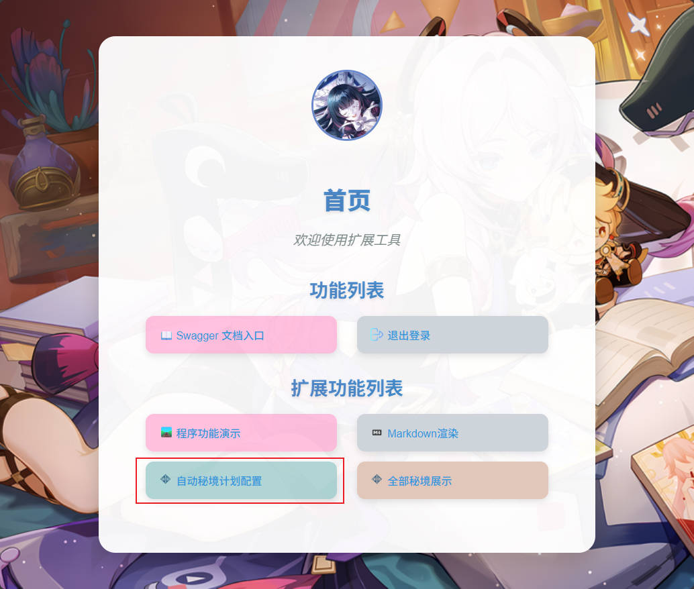
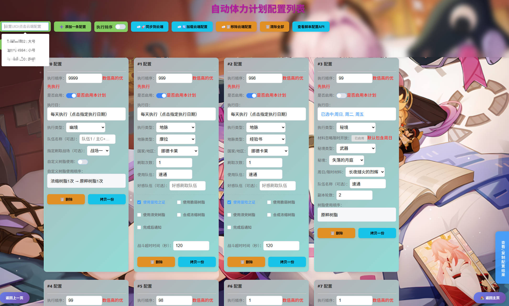
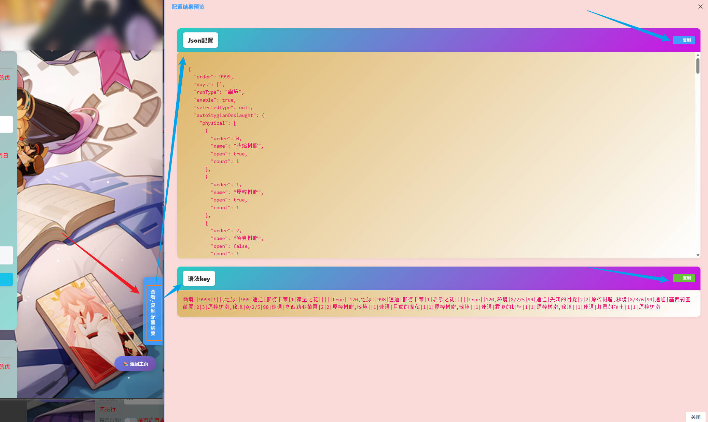
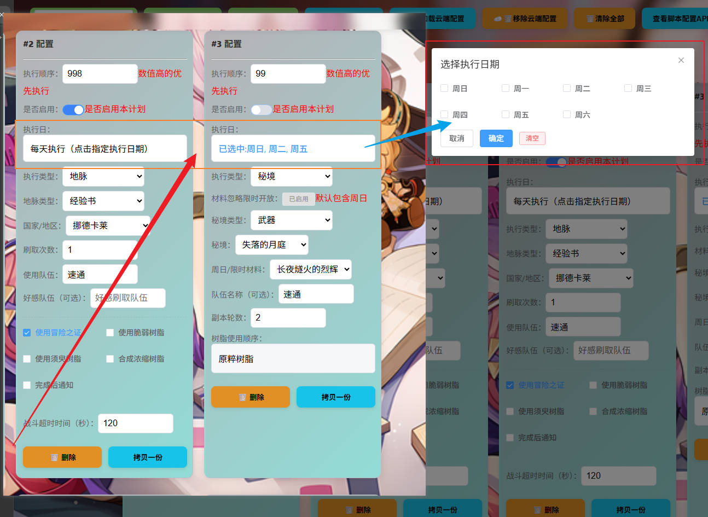

# AutoPlan自动体力计划

**自动体力计划JS**  
本脚本通过调用 **BetterGI** 本体自动秘境实现体力计划

## 功能说明

本脚本为 BetterGI 的自动秘境功能提供**计划/排期**能力，让你能：

- 为不同队伍配置不同的秘境刷取目标
- 设置刷取轮次
- 限制只在特定星期几执行（例如周日限定本、周本）
- 设置执行优先级（数字越大越先跑）
- 支持三种配置来源（输入 / UID专属 / bgi_tools远程）

## 配置项说明

脚本通过以下界面配置项进行设置（对应 settings.json）：

| 配置项                                     | 类型             | 说明                                                                                                          | 示例值                                      |
|-----------------------------------------|----------------|-------------------------------------------------------------------------------------------------------------|------------------------------------------|
| **key**                                 | input-text     | 版本密钥（必填，仔细看本文档）                                                                                             | xxxx                                     |
| **auto_load**                           | multi-checkbox | 加载模式（可多选）<br>・输入加载：使用下方 run_config 字段<br>・UID加载：读取 config/run_config.json（每个UID独立）<br>・bgi_tools加载：从远程API拉取 | 默认：["输入加载","UID加载"]                      |
| **run_config**                          | input-text     | 自动秘境计划配置（当选择“输入加载”时生效）<br>格式见下方“计划配置语法”                                                                     | 速刷\|苍白的遗荣\|3\|1-3\|0,6\|9<br>（多条用英文逗号分隔） |
| **loop_plan**                           | checkbox       | 启用循环体力计划                                                                                                    |                                          |
| **retry_count**                         | select         | 复活重试次数                                                                                                      |                                          |
| **bgi_tools_http_pull_json_config**     | input-text     | bgi_tools 拉取配置的 API 地址（当选择 bgi_tools加载 时生效）                                                                 | https://example.com/api/pull             |
| **bgi_tools_open_push**                 | checkbox       | 是否在脚本结束时推送当前全部配置给 bgi_tools（用于同步/备份）                                                                        | 勾选 = 开启推送                                |
| **bgi_tools_http_push_all_json_config** | input-text     | bgi_tools 推送全部配置的 API 地址（当开启推送时使用）                                                                          | https://example.com/api/push-all         |
| **bgi_tools_token**                     | input-text     | bgi_tools授权token 语法:tokenName=tokenValue                                                                    | tokenName=tokenValue                     |

### 计划配置语法（run_config 字段）

```
队伍名称|秘境名称/刷取物品名称|刷几轮|限时/周日(1-3和本体的一致)|周几执行(0-6)不填默认执行|树脂使用顺序|执行顺序(越大越先执行)
```

- 多条计划用 **英文半角逗号 ,** 分隔
- 字段之间用 **英文半角竖线 |** 分隔
- **必须** 填写：秘境名称/物品名称
- 其他字段可省略（留空即可，但竖线不能省）

**字段详解**

| 位置 |     字段      |  是否必填  |                   说明                   |           示例            |
|:--:|:-----------:|:------:|:--------------------------------------:|:-----------------------:|
| 1  |     类型      | **必填** |           秘境/地脉(后期支持地脉冗余字段)            |          秘境/地脉          |
| 2  |  周几执行(0-6)  |   可选   | 0=周日,1=周一,...,6=周六；可多选按`/`分割，不填=每天都可执行 |          0/3,3          |
| 3  |    执行顺序     |   可选   |         数字越大越优先执行（同时间点先跑优先级高的）         |        9 / 5 / 1        |
|    |             |        |          ***`秘境类型后几位参数说明`***           
| 4  |    队伍名称     |   可选   |       BetterGI 中已保存的队伍名称（用于切换队伍）       |      速刷 / 雷国 / 国家队      |
| 5  | 秘境名称/刷取物品名称 | **必填** |        与 BetterGI 自动秘境识别的名称保持一致        | 苍白的遗荣 / 炽烈的炎之魔女 / 辰砂往生录 |
| 6  |     刷几轮     |   可选   |          整数，执行几轮（每轮 = 1次完整秘境）          |       3 / 5 / 10        |
| 7  |    限时/周日    |   可选   |               和本体的1-3一致                |        1 / 2 / 3        |
| 8  |   树脂使用顺序    |   可选   | 原粹树脂,浓缩树脂,须臾树脂,脆弱树脂`/`分割，不填=默认执行 原粹树脂  |     原粹树脂/浓缩树脂,须臾树脂      |
|    |             |        |          ***`地脉类型后几位参数说明`***           
| 4  |    队伍名称     |   可选   |       BetterGI 中已保存的队伍名称（用于切换队伍）       |      速刷 / 雷国 / 国家队      |
| 5  |     国家      | **必填** |              识别国家（用于切换国家）              |         纳塔 ...          |
| 6  |     刷几轮     | **必填** |                  刷几轮                   |            1            |
| 7  |    地脉类型     | **必填** |               启示之花/藏金之花                |       启示之花 / 藏金之花       |
| 8  |     好感队     |   可选   |                                        |                         |
| 9  |   使用脆弱树脂    |   可选   |                启用随便填个值                 |
| 10 |   使用须臾树脂    |   可选   |                启用随便填个值                 |
| 11 |   合成浓缩树脂    |   可选   |                启用随便填个值                 |
| 12 |   使用冒险家之书   |   可选   |                启用随便填个值                 |
| 13 |    详细通知     |   可选   |                启用随便填个值                 |
| 14 |    战斗超时     |   可选   |               可选，默认 120                |

**配置示例**

```
秘境|0/3|9|速刷|苍白的遗荣|3|1,          # 优先级最高，周日,周三刷3轮遗荣
秘境||5|国家队|炽烈的炎之魔女|5||,       # 优先级次之，每天刷5轮魔女
秘境|0|2|雷国|无想之刃狭间|2|2|浓缩树脂/原粹树脂,          # 只在周日刷，优先使用浓缩树脂后使用原粹树脂，优先级较低
地脉||1||蒙德|1|启示之花|||||||120 #优先级较低 刷1轮蒙德经验书
```

（注意：最后一条也可以不带逗号）

### 计划配置语法（config/run_config.json 配置）

```json
[
  [
    "uid",
    [
      {
        "order": 1,
        // 顺序值
        "days": [
          0
        ],
        // 执行日期
        "runType": "秘境",
        // 预留地脉 类型支持。  秘境、地脉
        "autoFight": {
          "physical": [
            {
              "order": 0,
              "name": "原粹树脂",
              "open": true
            },
            {
              "order": 1,
              "name": "浓缩树脂",
              "open": false
            },
            {
              "order": 2,
              "name": "须臾树脂",
              "open": false
            },
            {
              "order": 3,
              "name": "脆弱树脂",
              "open": false
            }
          ],
          //树脂开启和使用顺序
          "domainName": undefined,
          //秘境名称
          "partyName": undefined,
          //队伍名称
          "sundaySelectedValue": undefined,
          //周日|限时选择的值
          "domainRoundNum": undefined//副本轮数
        }
        // 秘境信息对象,
        "autoLeyLineOutcrop": {
          "count": 0,
          //刷几轮
          "country": "",
          //国家
          "leyLineOutcropType": "启示之花",
          //地脉类型  启示之花/藏金之花
          "useAdventurerHandbook": false,
          //使用冒险家之书
          "friendshipTeam": "",
          //好感队伍名称
          "team": "",
          //队伍名称
          "timeout": 120,
          //战斗超时
          "isGoToSynthesizer": false,
          //合成浓缩树脂
          "useFragileResin": false,
          //使用脆弱树脂
          "useTransientResin": false,
          //使用须臾树脂
          "isNotification": false
          //详细通知
        }
        //地脉信息对象
      }
    ]
  ]
]
```

```json
[
  [
    "10000002",
    [
      {
        "order": 1,
        "days": [
          0
        ],
        "runType": "秘境",
        "autoFight": {
          "physical": [
            {
              "order": 0,
              "name": "原粹树脂",
              "open": true
            },
            {
              "order": 1,
              "name": "浓缩树脂",
              "open": false
            },
            {
              "order": 2,
              "name": "须臾树脂",
              "open": false
            },
            {
              "order": 3,
              "name": "脆弱树脂",
              "open": false
            }
          ],
          "domainName": "",
          "partyName": "",
          "sundaySelectedValue": 1,
          "domainRoundNum": 1
        }
      },
      {
        "order": 2,
        "days": [],
        "runType": "地脉",
        "autoLeyLineOutcrop": {
          "count": 1,
          "country": "纳塔",
          "leyLineOutcropType": "启示之花",
          "useAdventurerHandbook": false,
          "friendshipTeam": "",
          "team": "",
          "timeout": 120,
          "isGoToSynthesizer": false,
          "useFragileResin": false,
          "useTransientResin": false,
          "isNotification": false
        }
      }
    ]
  ]
]
```

### 如果你不想研究语法 请部署[bettergi-scripts-tools](https://github.com/Kirito520Asuna/bettergi-scripts-tools) v0.0.4以上版本

***`话不多说直接上图:`***







## 使用建议

1. 第一次使用建议只勾选「输入加载」，把计划写在 `run_config` 里测试
2. 熟练后可改为「UID加载」，把配置保存为 `config/run_config.json`（每个账号独立）
3. 如果你有自己的云端配置服务，可使用「bgi_tools加载」 + 推送功能实现多端同步
4. 确保 BetterGI 的**自动秘境**功能已正常可用（钟离识别、战斗策略等）

## 常见问题

- 计划没有执行？  
  → 检查密钥是否正确、是否勾选了对应的加载模式、秘境名称是否与 BetterGI 完全一致

- 周几限制不生效？  
  → 确认 BetterGI 系统时间正确，且格式为 0-6（0=周日）

欢迎提交 issue 或 PR 改进脚本～
祝刷本愉快！

## 版本密钥

| 版本    | 密钥                  |
|-------|---------------------|
| 0.0.1 | oiJbmjU2R0NniiwiZxh |

## 版本历史（简要）

### 0.0.1 2026.01.30

- 基本功能完成
- 支持三种配置加载方式
- 支持 bgi_tools http 拉取/推送配置
- 支持按队伍、秘境、轮次、周几、优先级执行计划

**作者**：云端客 (Kirito520Asuna)

