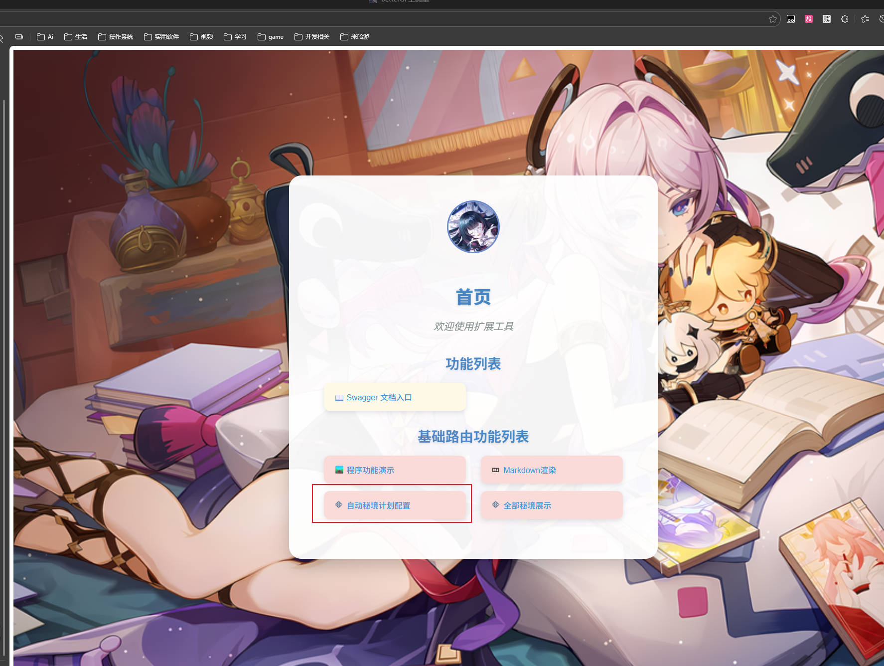

# AutoPlanDomain

**自动秘境计划JS**  
本脚本通过调用 **BetterGI** 本体自动秘境实现体力计划


## 功能说明

本脚本为 BetterGI 的自动秘境功能提供**计划/排期**能力，让你能：

- 为不同队伍配置不同的秘境刷取目标
- 设置刷取轮次
- 限制只在特定星期几执行（例如周日限定本、周本）
- 设置执行优先级（数字越大越先跑）
- 支持三种配置来源（输入 / UID专属 / bgi_tools远程）

## 配置项说明

脚本通过以下界面配置项进行设置（对应 settings.json）：

| 配置项                                | 类型              | 说明                                                                                                               | 示例值                                              |
|---------------------------------------|-------------------|------------------------------------------------------------------------------------------------------------------|--------------------------------------------------|
| **key**                               | input-text        | 版本密钥（必填，仔细看本文档）                                                                                                  | xxxx                                             |
| **auto_load**                         | multi-checkbox    | 加载模式（可多选）<br>・输入加载：使用下方 domain_config 字段<br>・UID加载：读取 config/domain_config.json（每个UID独立）<br>・bgi_tools加载：从远程API拉取 | 默认：["输入加载","UID加载"]                              |
| **domain_config**                     | input-text        | 自动秘境计划配置（当选择“输入加载”时生效）<br>格式见下方“计划配置语法”                                                                          | 速刷\|苍白的遗荣\|3\|1-3\|0,6\|9<br>（多条用英文逗号分隔）         |
| **bgi_tools_http_pull_json_config**   | input-text        | bgi_tools 拉取配置的 API 地址（当选择 bgi_tools加载 时生效）                                                                      | https://example.com/api/pull |
| **bgi_tools_open_push**               | checkbox          | 是否在脚本结束时推送当前全部配置给 bgi_tools（用于同步/备份）                                                                             | 勾选 = 开启推送                                        |
| **bgi_tools_http_push_all_json_config** | input-text      | bgi_tools 推送全部配置的 API 地址（当开启推送时使用）                                                                               | https://example.com/api/push-all                 |

### 计划配置语法（domain_config 字段）

```
队伍名称|秘境名称/刷取物品名称|刷几轮|限时/周日(1-3和本体的一致)|周几执行(0-6)不填默认执行|执行顺序(越大越先执行)
```

- 多条计划用 **英文半角逗号 ,** 分隔
- 字段之间用 **英文半角竖线 |** 分隔
- **必须** 填写：秘境名称/物品名称
- 其他字段可省略（留空即可，但竖线不能省）

**字段详解**

| 位置  | 字段               | 是否必填 |                   说明                   |           示例            |
|:---:|:---:|:---:|:--------------------------------------:|:-----------------------:|
|  1  | 队伍名称           | 可选     |       BetterGI 中已保存的队伍名称（用于切换队伍）       |      速刷 / 雷国 / 国家队      |
|  2  | 秘境名称/刷取物品名称 | **必填** |        与 BetterGI 自动秘境识别的名称保持一致        | 苍白的遗荣 / 炽烈的炎之魔女 / 辰砂往生录 |
|  3  | 刷几轮             | 可选     |          整数，执行几轮（每轮 = 1次完整秘境）          |       3 / 5 / 10        |
|  4  | 限时/周日          | 可选     |     1=周一~周六可用、2=周日可用、3=仅周日、留空=不限制      |        1 / 2 / 3        |
|  5  | 周几执行(0-6)      | 可选     | 0=周日,1=周一,...,6=周六；可多选按`/`分割，不填=每天都可执行 |          0/3,3          |
|  6  | 执行顺序           | 可选     |         数字越大越优先执行（同时间点先跑优先级高的）         |        9 / 5 / 1        |

**配置示例**

```
速刷|苍白的遗荣|3|1|0/3|9,          # 优先级最高，周日,周三刷3轮遗荣
国家队|炽烈的炎之魔女|5|||5,       # 优先级次之，每天刷5轮魔女
雷国|无想之刃狭间|2|2|0|2           # 只在周日刷，优先级较低
```
（注意：最后一条也可以不带逗号）
### 计划配置语法（config/domain_config.json 配置）
```json
[
  {
    "order": 1,      // 顺序值
    "days": [0],// 执行日期
    "autoFight": {
      "domainName": undefined,//秘境名称
      "partyName": undefined,//队伍名称
      "sundaySelectedValue": undefined,//周日|限时选择的值
      "DomainRoundNum": undefined,//副本轮数
    } // 秘境信息对象
  }
]
```
### 如果你不想研究语法 请部署[bettergi-scripts-tools](https://github.com/Kirito520Asuna/bettergi-scripts-tools) v0.0.4以上版本

***`话不多说直接上图:`***





## 使用建议

1. 第一次使用建议只勾选「输入加载」，把计划写在 `domain_config` 里测试
2. 熟练后可改为「UID加载」，把配置保存为 `config/domain_config.json`（每个账号独立）
3. 如果你有自己的云端配置服务，可使用「bgi_tools加载」 + 推送功能实现多端同步
4. 确保 BetterGI 的**自动秘境**功能已正常可用（钟离识别、战斗策略等）

## 常见问题

- 计划没有执行？  
  → 检查密钥是否正确、是否勾选了对应的加载模式、秘境名称是否与 BetterGI 完全一致

- 周几限制不生效？  
  → 确认 BetterGI 系统时间正确，且格式为 0-6（0=周日）

欢迎提交 issue 或 PR 改进脚本～
祝刷本愉快！

## 版本密钥

| 版本    | 密钥                       |
|---------|----------------------------|
| 0.0.1   | oiJbmjU2R0NniiwiZxh       |

## 版本历史（简要）

### 0.0.1 2026.01.30

- 基本功能完成
- 支持三种配置加载方式
- 支持 bgi_tools http 拉取/推送配置
- 支持按队伍、秘境、轮次、周几、优先级执行计划

**作者**：云端客 (Kirito520Asuna)

