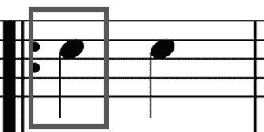
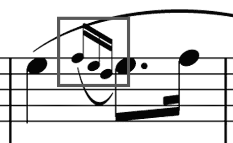
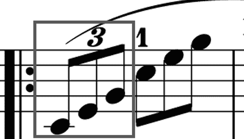
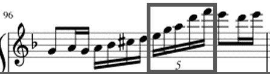
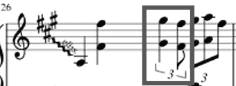
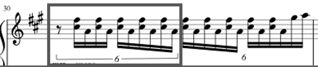
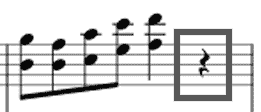
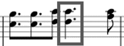

# 原琴 - AutoYuanQin

## 📑 目录

- [免责声明](#免责声明)
  - [非真人演奏声明](#非真人演奏声明)
  - [禁止参赛条款](#禁止参赛条款)
  - [反作弊机制说明](#反作弊机制说明)
- [播放演奏脚本](#播放演奏脚本)
- [如何新增曲谱(自制曲谱如何演奏)](#如何新增曲谱自制曲谱如何演奏)
- [如何上传乐谱至仓库](#如何上传乐谱至仓库)
  - [1. 由脚本作者代你上传](#1-由脚本作者代你上传)
  - [2. 自行上传（推荐）](#2-自行上传推荐)
- [MIDI制谱器](#midi制谱器)
- [五线谱制谱器](#五线谱制谱器)
- [简谱制谱器](#简谱制谱器)
- [曲谱制作解答](#曲谱制作解答)
- [曲谱文件位置](#曲谱文件位置)
- [文件结构](#文件结构)
  - [字段说明](#字段说明)
  - [文本格式](#文本格式)
  - [代码美化](#代码美化)
- [Notes 解析规则](#notes-解析规则)
  - [音符格式](#音符格式)
- [更新日志](#更新日志)

---

## 免责声明

### 非真人演奏声明

本工具通过模拟键盘输入实现自动演奏，并非真人实时演奏。使用者不得利用本工具冒充真人演奏者，亦不得以任何方式误导他人认为该演奏系人工完成，以免造成不良社会影响或损害他人权益。

### 禁止参赛条款

本工具严禁用于任何形式的原琴比赛、竞技活动或官方认可的演奏评比。若使用者违反本条款参与相关赛事，一经查实，所有后果（包括但不限于取消成绩、封禁账号、承担法律责任等）均由使用者自行承担。

### 反作弊机制说明

本工具内置了面向使用者的常规反作弊机制，其核心目的在于限制使用者参与任何形式的原琴比赛、竞技活动或官方认可的演奏评比，脚本会通过不定时按下某些无关按键作为特征。

---

## 播放演奏脚本

1. 在 **调度器** 中 **新建配置组** 或选择已有配置组，将 *AutoYuanQin* 添加至该组中。
2. 右键点击原琴脚本，选择 **修改脚本自定义配置**，根据说明填写各项参数。
3. 若在 JS 脚本配置中启用了 **游戏内控制面板**（请确保游戏使用 **无边框窗口模式** 而非全屏模式），点击运行后会弹出 HTML 遮罩界面。在界面中选择乐曲后，点击 **开始播放** 即可；若未启用控制面板，则选曲后直接开始演奏。
4. 使用游戏内控制面板演奏完成后，脚本 **不会自动结束**，您可以继续选择下一首乐曲并演奏。演奏过程中，面板会最小化至右下角，且 **不可被鼠标指针选中**，演奏完成后自动还原并可正常交互。
5. 演奏过程中按配置的快捷键（默认 `F8`）可暂停，再次按下可从当前位置继续；该操作只暂停脚本演奏，不会暂停游戏。若快捷键与游戏或其他软件冲突，可在游戏内配置面板点击快捷键输入框，然后直接按下新的单键或组合键（例如 `Ctrl+Shift+P`）。

> **提示：**
> - `AutoYuanQin/assets/tutorial_file` 目录下的制谱软件（`五线谱制谱器.html`、`简谱制谱器.html`）适合有一定五线谱或简谱基础的用户。这两个制谱器生成的乐谱最为精确，但需要投入较多时间和精力进行录入。
> - 如需更快速的方案，可使用 `AutoYuanQin/assets/tutorial_file/MIDI制谱器.html`，它能自动将 MIDI 文件转换为 *AutoYuanQin* 格式。该方案转换的乐谱在精准度上可能略有瑕疵，建议使用仅包含两个或更少通道的 MIDI 文件，但整体录谱耗时极少。
> - 下文将详细说明标准曲谱 `.json` 文件的结构，包括各字段含义及曲谱内容的格式要求。
> - **关于曲谱文件的放置与更新：**
  >   - 若 **未启用** 游戏内控制面板，请将您制作的 JSON 曲谱文件放入 `AutoYuanQin/assets/score_file` 目录，运行脚本后会自动重置 `settings.json` 并退出。
>   - 若 **已启用** 游戏内控制面板，您可以在面板中实时更新曲谱列表，无需退出脚本。
> - 如果您愿意慷慨地将自己的乐曲上传至仓库，我们将非常感激。

**附：** 如果本地曲谱数量过多，在 `JS脚本配置` 的下拉菜单中选择单曲时可能产生明显卡顿，建议改用游戏内控制面板选择乐曲，该面板支持按曲名搜索和按乐器分类筛选，操作更加流畅。

---

## 如何新增曲谱(自制曲谱如何演奏)

1. 使用电脑浏览器打开`AutoYuanQin/assets/tutorial_file`目录下的`MIDI制谱器.html`、`五线谱制谱器.html`、`简谱制谱器.html`生成曲谱JSON文件 或 手写键盘谱（键盘谱参考曲谱文件`圆号卡农`等`type`为`keyboard`的JSON曲谱文件）
2. 确认JSON曲谱文件的`name`为曲谱名，JSON文件名与`name`保持一致
3. 将该JSON文件移动到`AutoYuanQin/assets/score_file`目录下
4. 在配置组界面运行一遍JS脚本（确认打开了原神并且左下角日志显示更新成功）即可
   - 为什么要运行一遍：成功运行会自动更新`AutoYuanQin/assets/score_file`下你新增的所有曲谱文件的格式，并自动更新`settings.json`确保你新增的曲谱能被脚本正常读取

---

## 如何上传乐谱至仓库

### 1. 由脚本作者代你上传

- 将您的 JSON 曲谱放在 `AutoYuanQin/assets/score_file` 目录下（文件名会自动适配），运行脚本检查无误后，将 `小星星 - GziIvkDP.json` 格式的 JSON 文件保存。
- 完成后请联系作者（**提瓦特钓鱼玳师**）更新 JS 脚本。
- 加入 BetterGI v7 群（群号：1029539994），让群主帮您更新到仓库。
- 发送邮件至 `hijiwos@hotmail.com` 并说明，您的谱子将会在一段时间后更新到仓库（发送至邮箱可能导致延误）。

### 2. 自行上传（推荐）

1. 首先注册一个 GitHub 账号，根据 [PR 教程](https://www.bettergi.com/dev/pr.html#fork-%E5%A4%8D%E5%88%B6) 自行上传至[脚本仓库](https://github.com/babalae/bettergi-scripts-list)。
2. 上传前请检查以下文件是否正确更改：
  - `manifest.json`：将 `version` 的版本号最后一位 +1。
  - `assets/score_file` 文件夹内已经放入曲谱文件并测试正常。
  - `settings.json`：曲谱文件放入 `score_file` 文件夹后运行一遍程序，会自动更改 `settings.json`。
  - `README.md`（即本文件）：在下方更新日志中添加本次更新内容，按照历史格式书写。
3. 如果您尚未补全作者信息，请确保每首曲谱的 `author` 字段已填入您的作者名，并在 `manifest.json` 的 `authors` 列表中补全作者信息。

---

## MIDI制谱器

1. 翻谱器位于 `AutoYuanQin/assets/tutorial_file/MIDI制谱器.html`，请使用浏览器打开。
2. 点击 **选择文件**，将您想要转换的 MIDI 文件放入，网页将自动开始转换。
3. 完成转换后点击 **导出 Json**，将文件移至 `AutoYuanQin/assets/score_file` 目录下使用。
4. **请不要在不了解文件结构的情况下手动修改 JSON 文件中的信息。**

---

## 五线谱制谱器

1. 五线谱制谱器位于 `AutoYuanQin/assets/tutorial_file/五线谱制谱器.html`，请使用浏览器打开。
2. 请确保您有一定的识谱能力，否则建议使用 [MIDI制谱器](#midi制谱器)。
3. 使用步骤如下：
  - **确定音域**（共有三种音域可选，左/中/右，每个音域为一对红蓝大写字符，共 21 个键）
		- **选择音符**：点击左上角图片中的对应大写字母或 `@`，点击多个音符实现和弦。
		- **完善音符**：页面底部两行选择音符的具体类型，选好后点击按钮 **确定（完善音符）**，或确保鼠标焦点不在曲谱文本框内时按下 `Enter` 键实现相同功能。
		- **分节**：确保当前页面的音符都已完善，点击按钮 **分节**。
		- **换行**：确保当前页面的音符都已完善，点击按钮 **换行**。
		- **删除音符**：如果您写错了音符，请**手动**删除整个音符，并确保右上角代码框的末尾是 `]、|` 或一行的开头。
		  > 示例：`A[16]B[32]`，若您想写 `B[16]` 但不小心写成了三十二分音符，请删除整个 `B[32]`，删除后应为 `A[16]`，然后重新写入音符 `B`。
4. 写入曲谱信息（曲名、录谱人必填，以及 BPM、拍号）。
5. **导出曲谱**：点击按钮 **导出乐谱JSON**，曲谱文件名请确认为 `曲名.json`。
6. **读取乐谱**：如果您中途退出，下次可点击 **读取乐谱JSON** 选择上次导出的文件继续编辑。

> **附：** 按键模式默认为“按下后即刻抬起”。如需要使用“按下/抬起”模式，请确保每个音都正确抬起（如果未抬起，再次按下不会有声音），该类按键需要结合休止符来实现按下和抬起之间的时间间隔。

---

## 简谱制谱器

1. 简谱制谱器位于 `AutoYuanQin/assets/tutorial_file/简谱制谱器.html`，请使用浏览器打开。
2. 请确保您有一定的识谱能力，否则建议使用 [MIDI制谱器](#midi制谱器)。
3. 使用步骤与五线谱翻谱器类似，具体说明可在制谱器内查看。

---

## 曲谱制作解答

- `/assets/tutorial_file/五线谱注解.png` 包含了五线谱（高音区和低音区）对应的 3 组键盘键位（相邻的红蓝大写字母为一组，每组音域为三个八度）。
- 如有疑问，请参考 `/assets/tutorial_file/example.json`，该示例包含了本脚本支持的五线谱相关的大部分音符形式。

---

## 曲谱文件位置

所有曲谱文件应放置于 `AutoYuanQin/assets/score_file` 路径下。

---

## 文件结构

一个标准的曲谱 `.json` 文件的基本结构如下（五线谱制谱器 / 简谱制谱器格式）：

```json
{
  "name": "",
  "author": "",
  "instrument": "",
  "description": "",
  "type": "",
  "bpm": "",
  "time_signature": "",
  "composer": "",
  "arranger": "",
  "notes": ""
}
```

> **注意：** 以上代码中，仅双引号内的**内容**可以更改。具体的曲谱格式请参考 `/assets/tutorial_file/example.json`。

### 字段说明

| 字段 | 必要性 | 说明 |
|------|--------|------|
| `name` | **必要** | 曲谱名称 |
| `author` | 可选 | 录谱人（制作者） |
| `instrument` | 可选 | 建议使用的乐器 |
| `description` | 可选 | 曲谱描述信息 |
| `type` | **必要** | 曲谱解析方式，合法值：`yuanqin`（默认，五线谱翻谱器格式）、`midi`（MIDI制谱器格式）、`keyboard`（网络琴谱格式） |
| `bpm` | **必要** | 曲谱的 BPM（Beats Per Minute） |
| `time_signature` | `yuanqin` 类型**必要** | 拍号，例如 `3/4` 表示以四分音符为一拍每小节三拍（被设为一拍的音符仅支持 2 的幂） |
| `composer` | 可选 | 作曲者 |
| `arranger` | 可选 | 编曲者 |
| `notes` | **必要** | 曲谱内容，具体格式见下文解析规则 |

### 文本格式

- 一个完整的曲谱 `.json` 文件示例如下（仅包含几个小节）：
- 每一小节的末尾加 `|` 和换行符。
- 每一行的末尾加 `|` 和两个换行符。
- 曲谱末尾不需要加 `|` 和换行符。

示例：
```json
{
  "name": "示例曲谱",
  "author": "录谱人A",
  "bpm": "120",
  "description": "预计时长: xxxxx, 五线谱网址: xxx.xxxx.xxx",
  "time_signature": "4/4",
  "composer": "曲师B",
  "arranger": "谱师C",
  "notes": "A[4](ASD)[8]Y[8-#]F[8-#](DFG)[8]R[4-*]T[8]|/n@[4](DFG)[8](CVB)[8]D[4]A[4]|/n/nA[4](ASD)[8]Y[8-#]F[8-#](DFG)[8]R[4]T[4]|/n@[4](DFG)[8](CVB)[8]D[4]A[4]"
}
```

### 代码美化

曲谱 JSON 文件的 `notes` 值视为一个字符串，该字符串内**仅可使用换行符**美化代码。通过这种方法，您可以使用记事本等软件从 `.json` 文件中获取带有换行的曲谱代码（`notes` 内的换行符不会被脚本读取执行，因此不用担心额外的换行影响脚本）。

---

## Notes 解析规则

`notes` 字段包含乐谱内容，**必须**使用**大写字母**。乐谱内容以字符串表示，小节之间用 `|` 隔开，单个小节的解析规则如下：

### `A[4]`
表示按下 A 键，A 键视为四分音符。
<div align="center">
  
  <p>四分音符示例</p>
</div>

### `F[16-#]D[16-#]S[16-#]`
表示**装饰音·倚音**。
<div align="center">
  
  <p>装饰音·倚音示例</p>
</div>
每个装饰音的时值固定为当前拍号标准时值（如 3/4 的“标准时值”为四分音符时值）的 1/16。上例中的 `16` 没有实际意义，但必须保留。

### `Z[4-8.3]C[4-8.3]B[4-8.$]`
表示一个**三连音**（六连音用法类似，仅需将 `3` 改为 `6`，**其他类型的连音**（如五连音）也请使用 `3` 或 `6` 来表示）。连音内支持和弦。
<div align="center">
  
  <p>三连音示例</p>
</div>

- `Z[4-8.3]`：`4` 表示该三连音总时值为四分音符，`8` 表示当前音符在乐谱上显示的时值为八分音符，`3` 表示这是一个三连音的音符。
- `C[4-8.3]`：同上。
- `B[4-8.$]`：`$` 表示这是当前连音的最后一个音符。

### `D[4-16.3]G[4-16.3]H[4-16.3]W[4-16.3]R[4-16.$]`
表示一个**五连音**，同理也可以是 N 连音。
<div align="center">
  
  <p>五连音示例</p>
</div>

### `(BG)[4-4.3]/(VF/)[4-8.$]`
表示一个**三连音连音线**（与三连音用法相同，但连音线内允许出现不同类型的音符）。
<div align="center">
  
  <p>三连音连音线示例</p>
</div>

- `(BG)[4-4.3]`：第一个 `4` 表示整个三连音总时值为四分音符，第二个 `4` 表示当前音符显示时值为四分音符，`3` 表示三连音。
- `(VF)[4-8.$]`：`4` 表示总时值为四分音符，`8` 表示八分音符，`$` 表示连音结束。

### 六连音连音线示例（含休止符）
```
@[2-8.3]/(AF/)[2-16.3]N[2-16.3]/(AF/)[2-16.3]N[2-16.3]/(AF/)[2-16.3]N[2-16.3]/(AF/)[2-16.3]N[2-16.3]/(AF/)[2-16.3]N[2-16.$]
```
表示一个六连音连音线内包含 1 个八分休止符和 10 个十六分音符，与三连音规则相同，六连音的 `3` 同样表示连音类型。
<div align="center">
  
  <p>六连音连音线示例</p>
</div>

### `@[4]`
表示一个**休止符**。
<div align="center">
  
  <p>四分休止符示例</p>
</div>
中括号内标明是几分休止符，例如 `[4]` 表示四分休止符。

### `(SH)[4-*]`
表示一个**附点四分音符**。
<div align="center">
  
  <p>附点四分音符示例</p>
</div>
表示按下 S 和 H 键（和弦），这个和弦视为附点四分音符。

---

## 音符格式

中括号 `[]` 内，`-` 前表示音符类型，`-` 后用于区分特殊音符：

- `[4]` — 四分音符
- `[16]` — 十六分音符
- `[#]` — 装饰音（通常写成 `[16-#]`，其中 `16` 无实际意义）
- `[-n.3]` — 连音（使用时必须保证连音的最后一个音标记为 `.$`）
- `[-n.$]` — 连音结束

例如：
- `[16-#]` 表示十六分音符的装饰音。
- `A[4-8.3]S[4-8.3]D[4-8.$]` 表示总时值为四分音符的三连音。

---

## 更新日志

更新日志自 3.0 版本开始记录，往期更新内容请查看 Git 历史记录。

<details>
<summary>点击展开</summary>

- ver 3.7.7
  1. 添加单曲四首单曲：《Always with Me》（风物之诗琴）、《China-E》（谐律键琴）、《浮光》（谐律键琴）、《芒种》（风物之诗琴）

- ver 3.7.6
  1. 添加十八首单曲：《Despacito》《昔涟》《将世事高枕》《提瓦特民谣》《游步欣愉》《你离开的事实》《溯Reverse》《新月的摇篮曲（其一）：伴月同眠（原谱增强版）》《希望的碎片（钢琴缩编版）》《老男孩（钢琴缩编版）》《雨爱（原琴缩编版）》《念张师（原琴缩编版）》《心做し（原琴和弦版）》《Golden Hour（原琴和弦版）》《邀欢同游（芙芙角色演示曲高潮版）》《诀别书（原琴和弦版）》《开往春天的地铁》《斯露莎的歌》。
  2. 补充曲谱来源、编配方式、速度与预计时长等元数据。

- ver 3.7.5
  1. 添加单曲六首单曲：《Cry For Me》（风物之诗琴）、《Luv Letter情书》（谐律键琴）、《鸟之诗》（谐律键琴）、《溯》（谐律键琴）、《葬花》（谐律键琴）、《花之舞》（谐律键琴）

- ver 3.7.4
  1. 新增演奏暂停功能：演奏过程中按 `F8` 可暂停或继续，不会暂停游戏。
  2. 暂停时会临时释放当前按下的琴键，继续时恢复长音，并冻结曲谱计时以保持后续节奏。
  3. 暂停/继续快捷键改为点击录入，支持 `Ctrl`、`Alt`、`Shift` 与普通按键组成多键组合。
  4. 单独的 `A`～`Z` 字母键会被拒绝，组合键中的字母不受限制，避免曲谱演奏误触发暂停。
  
- ver 3.7.3
  1. 添加单曲六首单曲：《几初的智愿》（风物之诗琴）、《如果突然想起我》（风物之诗琴）、《那天下雨了》（谐律键琴）、《手写的从前》（风物之诗琴）、《晴天》（风物之诗琴）、《The Truth That You Leave 》（谐律键琴）

- ver 3.7.2
  1. 改为使用notes生成8位hash
  2. 更新README内关于添加曲谱相关的说明
  3. 启用了自动更换乐器后使用乐器会弹出`联机合奏`界面，现在支持出现该界面时自动选用`单人演奏`
  4. 添加演奏前检查步骤，如果不处于乐器界面则不会进行演奏
  5. 添加了一首单曲：《提瓦特民谣》（风物之诗琴，作者：Klopa）。

- ver 3.7.1
  1. 添加了两首单曲：《Call of silence》（谐律键琴）、《轻涟-修改版》（谐律键琴）。

- ver 3.7.0

  1. 新增7首单曲（代上传）：《lemon》（风物之诗琴）、《【原神演奏】Sparkle》（谐律键琴）、《新月的摇篮曲（其一）：伴月同眠》（风物之诗琴）、《穿越时空的思念》（风物之诗琴）、《银月之庭 (蓝花)》（风物之诗琴）、《银月之庭》（风物之诗琴）、《纳塔 Natlan》（谐律键琴）
  2. 修复了未启用游戏内面板可能导致的异常退出
  3. 注：`《新月的摇篮曲（其一）：伴月同眠》（作者：hu_hawa）`、`《【原神演奏】Sparkle》（作者：斐林）`和`《纳塔 Natlan》（作者：樱吹雪）`由于上传的MIDI曲谱版本过时，已经使用"ver 3.4.1版本的转换器(PR#3265)"结合"ms<->tick转换"转换为当前版本适配的MIDI曲谱格式
  4. 自动切换乐器功能适配千星奇域
  5. 更新曲名格式，由原先的`000X.曲名`改为`曲名-8位hash`
  6. 在游戏内控制面板显示每首曲目的预期演奏时长(基于演奏方法计算，计算结果为最短时长，实际演奏可能会耗时更久)
  7. 打开游戏内面板时仍会保留JS脚本配置内已经选择的单曲

- ver 3.6.2
  1. 将游戏内控制面板的启用改为受用户控制，启用游戏内控制面板时 JS 脚本设置内的单曲选择项不生效。
  2. 使用游戏内控制面板演奏完成后不会结束脚本，现在支持继续选择乐曲并演奏。乐曲演奏中面板会最小化至右下角并不可被鼠标指针选中，演奏完成后还原并可被选中。
  3. 添加了一个"神秘小功能": 随机节奏偏移，用来伪装真人可能出现的微小偏移量(～o￣3￣)～（仅开发者模式可用，启用此模式并不会关闭常规反作弊）`该功能未在README内做出解释`
  4. 更新了README中关于新功能的描述，添加目录并规整了格式

- ver 3.6.1
  1. 添加了三首单曲：《Nod-Krai》（谐律键琴）、《永夜的悼挽》（谐律键琴）、《滨海小城》（谐律键琴）。

- ver 3.6.0
  1. 添加了 HTML 遮罩界面。
  2. JS 脚本配置内的单曲选择功能已移动到 HTML 遮罩界面，其他配置项不受影响。

- ver 3.5.12
  1. 更新了两首单曲：《皎洁的笑颜》（风物之诗琴）、《飞鼠进行曲》（谐律键琴）。

- ver 3.5.11
  1. 更新了四首单曲：《你的名字》（谐律键琴）、《月光的赞美诗》（谐律键琴）、《让风告诉你》（谐律键琴）、《打上花火》（谐律键琴）。

- ver 3.5.10
  1. 更新了三首单曲：《你好，世界》（风物之诗琴）、《轻涟》（风物之诗琴）、《我不曾忘记》（风物之诗琴）。

- ver 3.5.9
  1. 更新了一首单曲：《圣诞快乐，劳伦斯先生》（谐律键琴）。

- ver 3.5.8
  1. 为五线谱制谱器和简谱制谱器的音符区域添加鼠标悬停效果。

- ver 3.5.7
  1. 更新了一首单曲：《爱情讯息》（跃律琴）。

- ver 3.5.6
  1. 更新了一首单曲：《大东北我的家乡》（谐律键琴）。

- ver 3.5.5
  1. 修复了单音演奏时每个音都会触发补偿延迟的问题。
  2. 开发模式额外显示曲谱实际用时。

- ver 3.5.4
  1. 修复了 MIDI 谱演奏过程中因 ver 3.4.2 对相邻同音的按下/抬起对添加补偿延迟未兼容 ver 3.4.0 的新格式致使判断逻辑混乱的问题。
  2. 修复了 MIDI 制谱器在生成 JSON 曲谱时部分相同类型按键不能正确合并的问题。
  3. 修复了原有的固定延迟导致的整曲节奏变缓的问题（使用固定值 30ms 进行缓冲并自动消除缓冲影响）。
  4. 修复了部分单曲演奏时最后一个音的时长设置错误导致异常崩溃的问题。

- ver 3.5.3
  1. 五线谱制谱器/简谱制谱器添加新功能：按键按下/按键抬起。
  2. 使用更长的固定时间间隔完全解决了吞音问题。

- ver 3.5.2
  1. MIDI 制谱器新增跳音识别。

- ver 3.5.1
  1. 新增了一首单曲：《退后》（谐律键琴）。

- ver 3.5.0
  1. MIDI 制谱器、五线谱制谱器、简谱制谱器新增 BPM 变速标记适配。
  2. 演奏脚本适配 BPM 变速标记。
  3. 优化了部分逻辑。

- ver 3.4.2
  1. 优化了 MIDI 曲谱的演奏流畅性。

- ver 3.4.1
  1. 更新了六首单曲：《关键词》（风物之诗琴）、《小酒窝》（风物之诗琴）、《心墙》（风物之诗琴）、《愿与愁》（风物之诗琴）、《红色高跟鞋》（跃律琴）、《麦恩莉》（风物之诗琴）。
  2. 更新了 README.md 内上传曲谱部分的相关说明。

- ver 3.4.0
  1. 优化了 MIDI 制谱器导出的曲谱格式（导出前会重构格式，可能与页面显示的略有差异）。
  2. 更新了本地 MIDI 曲谱的格式。
  3. 修复了 MIDI 曲谱在演奏时可能出现的吞音 bug。
  4. 五线谱制谱器与简谱制谱器生成的曲谱现在支持按键长按效果。

- ver 3.3.4
  1. 更新了十首单曲：《爱你》（谐律键琴）、《如愿》（谐律键琴）、《红色高跟鞋》（谐律键琴）、《这世界有那么多人》（谐律键琴）、《回家的路-原神五周年》（谐律键琴）、《反方向的钟》（谐律键琴）、《最伟大的作品》（谐律键琴）、《七里香》（谐律键琴）、《花海》（谐律键琴）、《蒲公英的约定(修改版)》（谐律键琴）。

- ver 3.3.3
  1. 更新了两首单曲：《オノマトペメガネ（拟声眼镜）》（风物之诗琴）、Letter（彼方的她-Aliya）（风物之诗琴）。

- ver 3.3.2
  1. 现在脚本支持在演奏前自动切换对应的乐器（可选）。
  2. 更改了 MIDI 曲谱的曲谱逻辑，现在 MIDI 曲谱同样支持通过调整 BPM 来更改播放速度。
  3. 更新了 MIDI 制谱器，现在支持多轨道合并（原先仅支持双轨）。
  4. 简化了 MIDI 的 JSON 曲谱格式。
  5. 更新了已有曲谱的格式。
  6. 隐藏了 MIDI 演奏的 note 信息显示。
  7. 更新了三首单曲：《Sis Puella Magica》（老旧的诗琴）、《尘间星旅(片段)》（「余音」,风物之诗琴）、《如生之不竭 Life is Inexhaustible》（风物之诗琴）。

- ver 3.3.1
  1. 增加了自动重命名功能，现在通过任何方式生成的 `.json` 文件（包括五线谱制谱器、简谱制谱器、MIDI 制谱器），在放入 `score_file` 文件夹前无需手动添加 `000X.` 的前缀，仅保留原始文件名即可。

- ver 3.3.0
  1. 更新了 MIDI 制谱器：
		- 可自选 MIDI 通道（支持多通道合并），并且支持 MIDI 试听功能。
		- 自动八度修正（可选）。
		- 支持选择乐器，自定义曲谱元信息。
		- 支持预览 JSON 文件和下载。
  2. 新增了简谱制谱器（底层逻辑与五线谱制谱器相同，仅配图不同）。

- ver 3.2.5
  1. 更新了两首单曲：《可不可以》（风物之诗琴）、《唯一》（风物之诗琴）。

- ver 3.2.4
  1. 修复了五线谱制谱器导出曲谱功能的乐器名称错误。
  2. 更新了一首单曲：《喜欢你》（风物之诗琴）。

- ver 3.2.3
  1. 更新了五线谱制谱器，现在可以选择乐器了。
  2. 更新了一首单曲：《DAMIDAMI》（老旧的诗琴）。

- ver 3.2.2
  1. 更新了两首单曲：《大石碎胸口 ver. “一阵强劲的音乐”》（风物之诗琴）、 《ClockParadox_Drop2》（风物之诗琴）。

- ver 3.2.1
  1. 更新了两首单曲：《蒲公英的约定》（风物之诗琴）、《枫》（风物之诗琴）。

- ver 3.2.0
  1. 修复了五线谱演奏部分连音在演奏时被跳过的问题。
  2. 添加了新曲：《Bad Apple!!》（风物之诗琴）、《我期待的不是雪，而是有你的冬天》（老旧的诗琴）、《Nod-Krai》（老旧的诗琴）。

- ver 3.1.2
  1. 修复了五线谱制谱器第三个八度音高异常的问题。
  2. 优化了五线谱制谱器的示例图片大小。
  3. 优化了五线谱制谱器的“确定（完善音符）”按键，现在可以使用 Enter 键触发（鼠标焦点不能在曲谱文本框内）而不只是用鼠标点击。

- ver 3.1.1
  1. 修复了 `music_queue` 字段的自动查找。
  2. 修改了 README.md 使其更合理。
  3. 在 `settings` 中提供了调试选项便于查看乐谱演奏信息。
  4. 新增了一些乐谱。

- ver 3.1.0
  1. 新增了解析基于字符串的按键序列的函数。
  2. 新增了执行上述函数序列化按键信息的函数。
  3. 初步完成了以上函数与原项目代码的适配。
  4. 制谱软件从 `assets` 中转移至脚本根路径的 `./tools` 文件夹下。
  5. 五线谱制谱软件的文件夹名称改为 `StaffMaker`。
  6. MIDI 制谱器从五线谱制谱器路径中移出。
  7. 修改 `manifest.name` 为 "原琴-音乐转换·自动演奏"。
  8. 修改 `settings.json`，使其更易被理解。
  9. 增加作者。
  10. 修改了 README.md。

</details>
