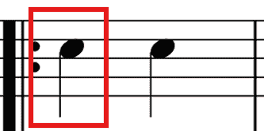
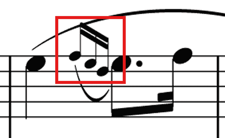
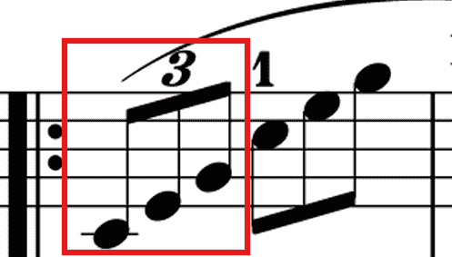
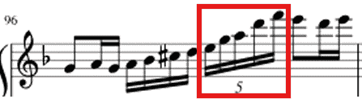
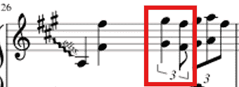
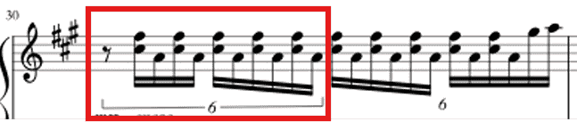
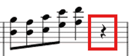
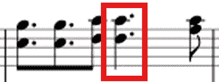

# 原琴 - AutoYuanQin

## 播放演奏脚本
1. 在全自动 - 调度器中 新建配置组/选择已有的组 将*AutoYuanQin*添加至配置组中
1. 右键原琴 - 修改脚本自定义配置 按照说明填写
1. 点击运行开始播放音乐
- tips:
  - `AutoYuanQin/assets/tutorial_file`文件夹下的制谱软件(`五线谱制谱器.html`)为早期制谱用软件
  - 现在有更自动化的`AutoYuanQin/tools/MIDI翻谱器.html`提供自动的MIDI文件转*AutoYuanQin*格式的乐谱
  - `AutoYuanQin/assets/tutorial_file`目录下有文档供曲谱制作人阅读
  - 本文档下文会详细说明一个标准格式的曲谱.json文件格式, 包括各个字段的解释以及曲谱内容的格式要求
  - 将你制作的曲谱的JSON文件置于正确的路径运行脚本时会自动重置settings并退出脚本
  - 如果你愿意慷慨的将自己的乐曲上传至仓库我们会很满足

### 上传至仓库
1. 上传到BetterGI脚本仓库的[路径](https://github.com/babalae/bettergi-scripts-list/tree/main/repo/js/AutoYuanQin/assets)下, 根据已存在的曲谱在你的文件名前添加序号`例如 10.曲名.json`, 完成后请联系BetterGI v7群主更新JS脚本
1. 联系BetterGI v7(1029539994)群主帮你更新到仓库
1. 发送邮件到*hijiwos@hotmail.com*并说明, 你的谱子将会在一段时间内更新到仓库

## MIDI翻谱器 <a id="MIDI翻谱器"></a>
1. 翻谱器位于`AutoYuanQin/tools/MIDI翻谱器.html`,请使用浏览器打开
1. 点击选择文件, 将你想要转换的MIDI文件放入, 网页将自动开启转换
1. 完成转换后点击"导出Json"后可将文件转移至`AutoYuanQin/assets/score_file`目录下使用
1. **请不要在不了解文件结构的情况下手动修改JSON文件中的信息**

## 五线谱翻谱器
1. 五线谱翻谱器位于`AutoYuanQin/assets/tutorial_file/五线谱制谱器.html`,请使用浏览器打开
1. 请确保你有一定的识谱能力, 否则本文建议使用[MIDI翻谱器](#MIDI翻谱器)
1. 使用步骤如下
	1. 确定音域(共有三种音域可选[左中右共三个], 每个音域为一对红蓝大写字符[21个])
		1. 选择音符：点击左上角图片中的对应`大写字母`或`@`, 点击多个音符实现和弦
		1. 完善音符：页面底部两行选择音符的具体类型, 选好后点击按钮```确定(完善音符)```或者确保**鼠标焦点不在曲谱文本框**时使用```Enter```键实现同样的功能
		1. 分节：确保当前页面的音符都已完善, 点击按钮```分节```
		1. 换行：确保当前页面的音符都已完善, 点击按钮```换行```
		
		1. **删除音符：** 如果您**写错了音符**, 请**手动**删除**整个音符**并确保右上角代码框的**末尾**是 ```]、|、或一行的开头```
			* 音符删除示例：```A[16]B[32]``` 比如您想写 ```B[16]``` , 一不小心写成了三十二分音符, 请删除整个音符~~B[32]~~, 删除后的示例```A[16]```, 然后再次进行音符 ```B```的写入
	1. 写入曲谱信息(曲名、录谱人必填、bpm、拍号)
	1. 导出曲谱
		点击按钮```导出乐谱JSON```, 曲谱文件名请确认是```曲名.json```
	1. 读取乐谱
		如果您写了一半, 打算下次在写, 可以使用导出曲谱功能保存曲谱, 下次要写的时候点击按钮```读取乐谱JSON```, 选择上次导出的文件即可

## 曲谱制作解答
1. `/assets/tutorial_file/五线谱注解.png` 包含了五线谱(高音区和低音区)对应的3组键盘键位(相邻的红蓝大写字母为一组, 每组音域为三个八度)
1. 有不懂的地方请在 `/assets/tutorial_file/example.json` 内找, 这个谱子内包含了该脚本的五线谱相关的所有功能

## 曲谱文件位置
1. 所有的曲谱文件应放置于 `AutoYuanQin/assets/score_file` 路径下

## 文件结构
一个标准的曲谱.json文件的基本结构如下：  
```json
{  
  "name": "",
  "author": "",
  "instrument": "",
  "description": "",
  "type":"",
  "bpm": "",
  "time_signature": "",
  "composer": "",
  "arranger": "",
  "notes": ""
}
```

**注意**：以上代码中仅 :  右侧的**双引号内**的部分可以更改, 具体的曲谱格式请参考 `/assets/tutorial_file` 路径下的 `example.json`

### 字段说明
`name`: **必要键值** 曲谱名

`author`: **可选键值** 录谱人, 制作这个.json曲谱的作者名  

`instrument`: **可选键值** 此键值对用于建议用户的乐器使用  

`description`: **可选键值** 可以随意填写关于该曲谱的描述信息  

`type`: **必要键值** 决定曲谱的解析方式, 合法的值有`yuanqin`(默认值, [五线谱翻谱器](#五线谱翻谱器)) `midi`([MIDI翻谱器](#MIDI翻谱器)) `keyboard`(你在网上看到的琴谱格式与此相似)

`bpm`: **必要键值** 曲谱的BPM (Beats Per Minute) 

`time_signature`: `yuanqin`的**必要键值** 拍号, 例如 3/4 代表 以四分音符为一拍每小节三拍(被设为一拍的音符仅支持2的幂)  

`composer`: **可选键值** 曲师

`arranger`: **可选键值** 谱师

`notes`: **必要键值** 曲谱内容,具体格式可参考以下解析规则  

### 文本格式
1. 一个完整的曲谱.json文件示例如下(供示例, 仅包含几个小节)：
1. 每一小节的末尾加|/n  
1. 每一行的末尾加|/n/n
1. 曲谱的末尾无需加|和/n

例如: 
```json
{
  "name": "示例曲谱",
  "author": "录谱人A",
  "bpm": "120",
  "description": 预计时长: xxxxx, 五线谱网址: xxx.xxxx.xxx,
  "time_signature": "4/4",
  "composer": "曲师B",
  "arranger": "谱师C",
  "notes": "A[4](ASD)[8]Y[8-#]F[8-#](DFG)[8]R[4-*]T[8]|/n@[4](DFG)[8](CVB)[8]D[4]A[4]|/n/nA[4](ASD)[8]Y[8-#]F[8-#](DFG)[8]R[4]T[4]|/n@[4](DFG)[8](CVB)[8]D[4]A[4]"
}
```
### 代码美化
曲谱JSON文件的"notes"的值视作一个字符串, 在这个字符串内仅可以使用**换行符**美化代码, 通过这种方法可以使用记事本等软件从.json文件中获取带有换行的曲谱代码(**notes内的换行符不会被读取执行**)  


## Notes 解析规则 <a id="解析规则"></a>
notes 字段中包含的是乐谱内容音符**必须**使用**大写字母**, 乐谱内容使用字符串表示, 小节之间用 | 隔开单个小节的解析规则如下：  

### `A[4]`
表示按下A键, A键视作四分音符
<div align="center">
  
  <p>四分音符示例</p>
</div>

### `F[16-#]D[16-#]S[16-#]`
表示**装饰音·倚音**  
<div align="center">
  
  <p>装饰音·倚音示例</p>
</div>

以上每个装饰音的时值固定为拍号中的标准时值(3/4的标准时值为四分音符的时值)的1/16, 也就是说以上示例中的**16没有意义, 但是必须要写**

### `Z[4-8.3]C[4-8.3]B[4-8.$]`
表示一个**三连音**(六连音用法与此相似, 仅需将3改成6, **其它类型的连音**也请使用3或6(即使是5连音))
另外, 连音内支持和弦
<div align="center">
  
  <p>三连音示例</p>
</div>

* `Z[4-8.3] ` 

	4表示该三连音的总时值相当于四分音符, 8表示当前音符在乐谱上显示的时值相当于八分音符的时值, 3表示这是一个三连音的音符
	
* `C[4-8.3] ` 

	同上
	
* `B[4-8.$]`  

	$表示这是当前连音的最后一个音符

### `D[4-16.3]G[4-16.3]H[4-16.3]W[4-16.3]R[4-16.$]`
表示一个**五连音**, 同理也可以是**N连音**
<div align="center">
  
  <p>五连音示例</p>
</div>

* `D[4-16.3]`

	4表示该连音的总时值相当于四分音符, 16表示当前音符在乐谱上显示的时值相当于十六分音符的时值, 3表示这个音符是一个连音的一部分

* `R[4-16.$]`

	$表示这是当前连音的最后一个音符
### `(BG)[4-4.3]/(VF/)[4-8.$]`
表示一个**三连音连音线**(与三连音用法相同, 但是三连音连音线允许连线内出现不同类型的音符)
<div align="center">
  
  <p>三连音连音线示例</p>
</div>

* (BG)[4-4.3]  

	第一个4表示整个三连音的总时值为一个四分音符, 第二个4表示当前音符在乐谱上显示的时值相当于四分音符的时值, 3表示这是一个三连音的音符
	
* (VF)[4-8.$]  

	4表示整个三连音的总时值为一个四分音符, 8表示这是一个八分音符, $表示这是当前连音的最后一个音符

### `@[2-8.3]/(AF/)[2-16.3]N[2-16.3]/(AF/)[2-16.3]N[2-16.3]/(AF/)[2-16.3]N[2-16.3]/(AF/)[2-16.3]N[2-16.3]/(AF/)[2-16.3]N[2-16.$]`
表示一个**六连音连音线**(乐谱上表示为一个六连音连音线内包含1个八分休止符和10个十六分音符, 与三连音相同, 六连音的.后面的数字也是3)
<div align="center">
  
  <p>六连音连音线示例</p>
</div>

* `@[2-8.3]`  

	2表示该六连音的总时值相当于一个二分音符, 8表示当前音符在乐谱上显示的时值相当于八分音符的时值, 6表示这是一个六连音
	
* `N[2-16.$] ` 

	16表示当前音符在乐谱上显示的时值相当于十六分音符的时值, $表示这是当前连音的最后一个音符

### `@[4]`
表示一个**休止符**
<div align="center">
  
  <p>四分休止符示例</p>
</div>

	中括号内表明这是几分休止符, 例如这里表示四分休止符

### `(SH)[4-*]`
表示一个**附点四分音符**
<div align="center">
  
  <p>附点四分音符示例</p>
</div>

	表示按下S和H键(和弦), 这个和弦视作附点四分音符


## 音符格式
中括号 [](- 前表示音符类型, - 后用于区分特殊音符)

* [4]  

表示四分音符  

* [16]  

表示十六分音符  

* [-#]  

表示装饰音  

* [-n.3]  

表示连音(使用时必须保证连音的最后一个音的标记为.$)  

* [-n.$]  

表示当前连音的结束  

例如：[16-#] 表示十六分音符的装饰音, A[4-8.3]S[4-8.3]D[4-8.$] 表示一个总时值为4分音符的三连音


## 更新日志
由于更新日志于3.0开始记录, 往期更新内容应该都在git的记录中, 不过我懒得翻了

- ver 3.2.5
1. 更新了两首单曲《可不可以》- 风物之诗琴、《唯一》- 风物之诗琴

- ver 3.2.4
1. 修复了五线谱制谱器导出曲谱功能的乐器名称错误
1. 更新了一首单曲《喜欢你》- 风物之诗琴

- ver 3.2.3
1. 更新了五线谱制谱器，现在可以选择乐器了
1. 更新了一首单曲《DAMIDAMI》- 老旧的诗琴

- ver 3.2.2
1. 更新了两首单曲《大石碎胸口 ver. “一阵强劲的音乐”》-风物之诗琴、 《ClockParadox_Drop2》-风物之诗琴

- ver 3.2.1
1. 更新了两首单曲《蒲公英的约定》- 风物之诗琴、《枫》-风物之诗琴

- ver 3.2.0
1. 修复了五线谱演奏部分连音在演奏时被跳过的问题
1. 添加了新曲《Bad Apple!!》- 风物之诗琴、《我期待的不是雪，而是有你的冬天》- 老旧的诗琴、《Nod-Krai》-老旧的诗琴

- ver 3.1.2
1. 修复了五线谱制谱器第三个八度音高异常的问题
1. 优化了五线谱制谱器的示例图片大小
1. 优化了五线谱制谱器的“确定（完善音符）”按键，现在可以使用Enter键触发（鼠标焦点不能在曲谱文本框内）而不只是用鼠标点击

- ver 3.1.1
1. 修复了music_queue字段的自动查找
1. 修改了README.md使其更合理
1. 在settings中提供了调试选项便于查看乐谱演奏信息
1. 新增了一些乐谱

- ver 3.1.0
1. 新增了解析基于字符串的按键序列的函数
1. 新增了执行上述函数序列化按键信息的函数
1. 初步完成了以上函数与原项目代码的适配
1. 制谱软件从assets中转移至脚本根路径的./tools文件夹下
1. 五线谱制谱软件的文件夹名称改为StaffMaker
1. MIDI翻谱器从五线谱制谱器路径中移出
1. 修改manifest.name为"原琴-音乐转换·自动演奏"
1. 修改settings.json, 使其更易被理解
1. 增加作者
1. 修改了README.md