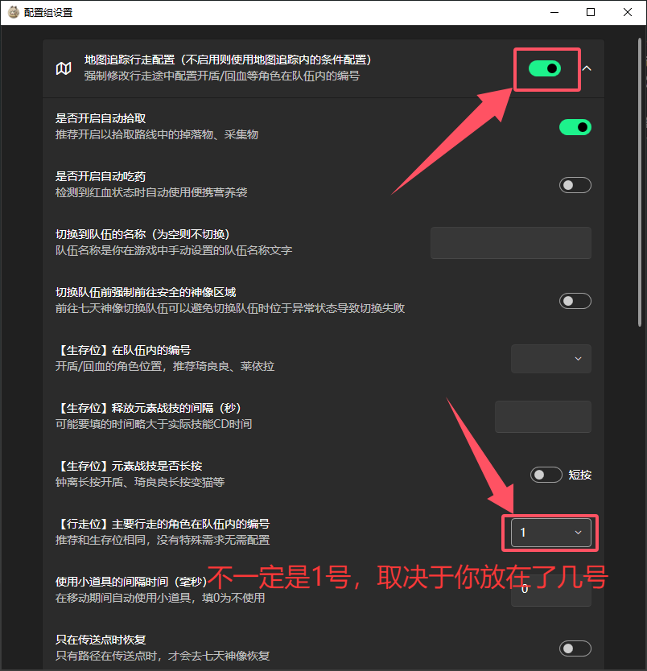

# 🦌菈乌玛兽肉采集

## 📖 脚本说明

本脚本可利用菈乌玛能够吸引挪德卡莱小动物，并让獾给自己挖肉的特性，榨干挪德卡莱生态的每一份养料。  
本脚本与纯地图追踪的版本的主要区别为自动根据天气，等待雨天结束，并能够直接判断你队伍里是否有菈乌玛🦌。  
兽肉资源每天的刷新时间为击杀后12小时，如有需要可自行规划采集

## 🚀 运行效率

- **理论收获**：13分钟可收获最多85个兽肉
- **实际收获**：常态下12分钟拾取约75个兽肉

## ⚠️ 运行须知（必看）

1. **角色要求**：运行前请确保队伍中有「菈乌玛」与「枫原万叶」，并在`调度器`设置中将`菈乌玛`设置为行走位   

2. **路线冲突**：运行前请确保今天没有跑过`虹滴晶`路线和`霜夜灵嗣`路线，这些路线与兽肉路线存在重叠
3. **传送点解锁**：苔古荒原中间的传送点处有一个需要寻找10个机器人才能解锁的飞高高装置，请解锁它
4. **游戏窗口**：请确保游戏窗口为1920x1080分辨率以减少问题发生的概率（2560暂时没发现问题）

## ⚙️ 设置选项

### 启用潮湿状态检测
- **功能**：自动检测游戏中的潮湿状态（下雨等）
- **作用**：潮湿状态下小动物会消失，脚本会自动调整时间到非潮湿状态
- **建议**：保持启用状态

### 最大等待次数
- **功能**：设置潮湿状态检测的最大尝试次数
- **默认值**：5次

### 运行高危路线
- **功能**：是否运行包含霜夜灵嗣的容易暴毙路线
- **说明**：高危路线物资丰厚，可选择性关闭
- **默认**：启用

### 队伍名称
- **功能**：设置要切换到的队伍名称
- **说明**：脚本开始时会自动切换到指定队伍，务必关闭`调度器`设置中的`切换队伍`
