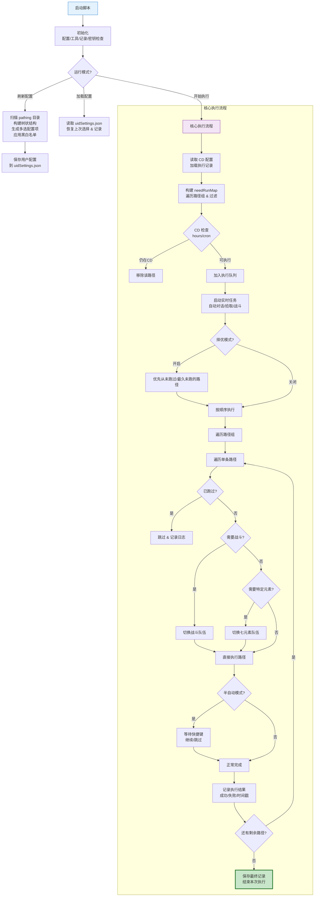
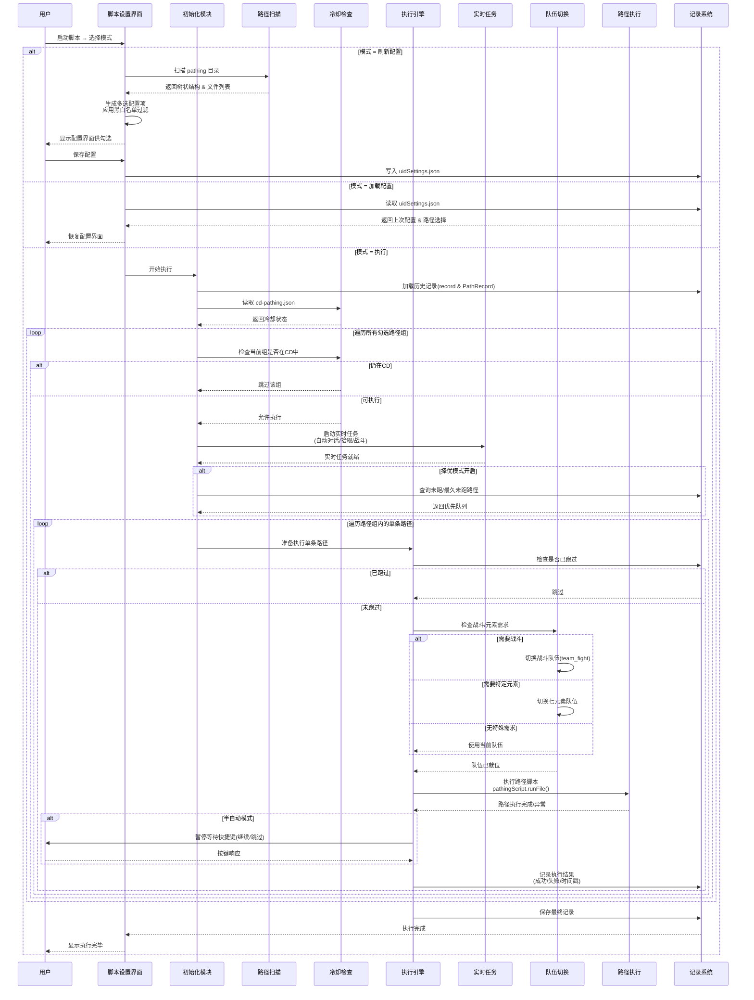

# FullyAutoAndSemiAutoTools  
**全自动 + 半自动路径任务工具箱**  
BetterGI 平台下功能最全面的路径批量执行解决方案之一

## 项目概述

FullyAutoAndSemiAutoTools 是一套高度模块化、可高度自定义的自动化路径执行工具箱，主要用于原神（BetterGI平台）的日常、周常、素材收集等重复性任务自动化。

支持**全自动**与**半自动**两种运行模式，核心目标包括：

- 智能扫描 & 多层级管理大量路径文件
- 精细的冷却时间控制（小时制 + Cron）
- 根据路径特性自动切换战斗/元素队伍
- 集成丰富的实时辅助功能
- 执行记录防重复 + 择优优先未完成路径
- 支持黑白名单、多 UID 隔离记录

### 核心亮点

- 路径树状扫描 + 多级加载（默认2级，可调）
- 小时制 & Cron 双冷却系统（支持外部 HTTP API）
- 智能队伍切换（战斗/七元素）
- 实时任务：自动对话跳过、自动拾取、自动战斗
- 择优执行 + 执行记录 + 错误路径追踪
- 半自动快捷键干预（继续/跳过）
- 开发者模式 + 详细日志 + UID自动识别

## 文件结构一览

```
FullyAutoAndSemiAutoTools/
├── config/
│   ├── SevenElement.json       # 七元素路径→队伍映射
│   ├── cd-pathing.json         # 路径冷却规则（hours/cron）
│   ├── record.json             # 本次执行记录
│   ├── PathRecord.json         # 历史路径执行记录
│   └── uidSettings.json        # 用户配置快照（多UID支持）
├── utils/
│   ├── SwitchTeam.js           # 队伍切换核心
│   ├── cron.js                 # Cron 解析工具
│   └── uid.js                  # UID 识别模块
├── pathing/                    # ★ 所有路径文件目录（需符号链接）
├── SymLink.bat                 # 一键创建 pathing 链接
├── main.js                     # 主程序入口
├── manifest.json               # 脚本元信息 & 版本标识
└── settings.json               # 配置模板（用户界面依据）
```

## 核心流程图
### 1

### 2



## 重要配置项一览（settings.json）

| 配置项                  | 类型       | 主要作用                               | 推荐默认/示例              |
|-------------------------|------------|----------------------------------------|----------------------------|
| config_run              | 下拉       | 运行模式：刷新 / 加载 / 执行           | 刷新 → 首次，加载 → 日常   |
| loading_level           | 文本       | 路径层级深度（≥1）                     | 2 或 3                     |
| config_white_list       | 文本       | 白名单（逗号分隔）                     | 晶蝶,特产                  |
| config_black_list       | 文本       | 黑名单（优先级更高）                   | 其他,锄地专区,周本         |
| open_cd                 | 复选框     | 启用冷却控制                           | 建议开启                   |
| http_api                | 文本       | Cron 解析服务地址                      | http://127.0.0.1:port/...  |
| real_time_missions      | 多选       | 实时辅助（对话/战斗/拾取）             | 至少开「自动拾取」         |
| choose_best             | 复选框     | 择优模式（优先未跑/最久未跑路径）      | 推荐开启                   |
| mode                    | 下拉       | 全自动 / 半自动                        | 全自动（日常）             |
| auto_semi_key_mode      | 下拉       | 半自动快捷键行为（继续/跳过）          | 继续运行                   |
| auto_key                | 文本       | 半自动干预快捷键                       | F10 / F11（避免冲突）      |
| team_fight              | 文本       | 战斗/通用行走队伍名称                  | 必须填写                   |
| team_seven_elements     | 文本       | 七元素队伍（矿物,火,水,风,雷,草,冰,岩）| 按顺序填写                 |
| is_debug                | 复选框     | 开发者模式（详细日志）                 | 调试时开启                 |

## CD 规则示例（cd-pathing.json）

```json
[
  {
    "name": "晶蝶",
    "type": "hours",
    "level": 2,
    "value": 12
  },
  {
    "name": "矿物",
    "type": "cron",
    "level": 1,
    "value": "0 0 0 1/3 * ?"
  },
  {
    "name": "周本",
    "type": "hours",
    "level": 3,
    "value": 168
  }
]
```

## 推荐使用流程

1. **首次准备**  
   双击 `SymLink.bat` 创建 pathing 链接  
   将所有 .json 路径文件放入 pathing 或子目录

2. **第一次完整配置**（建议花 5–10 分钟）  
   → 选择「**刷新**」模式 → 执行  
   → 设置白/黑名单、队伍、CD规则、实时任务、执行模式等  
   → 保存（自动生成 uidSettings.json）

3. **日常执行**（最常用方式）  
   → 打开设置 → 选择「**加载**」模式 → 执行  
   → 微调本次要跑的路径组  
   → 切换到「**执行**」模式 → 一键启动

4. **半自动模式建议**  
   mode = 半自动  
   设置不常用快捷键（推荐 F10/F11）  
   路径完成后暂停，等待按键决定继续或跳过

## 小技巧与实用建议

- 最省事：全自动 + 择优模式 + 自动拾取 + 冷却控制
- 最安全：半自动 + 自动拾取 + 详细日志 + 大量黑名单
- 每1–2周建议执行一次「刷新」同步新路径
- 错误路径反复出现？查看 record.json 加黑名单或修复
- 多UID用户：每个号先「刷新」一次，建立独立配置

## 注意事项

- 需要战斗的路径建议在描述中写「请配置好战斗策略」或放在战斗相关目录
- 半自动模式请确保快捷键不与 BetterGI 冲突
- Cron 模式需要网络正常并正确配置 http_api 地址
- 记录文件自动保存，支持断点续跑与多UID隔离
- 最低兼容版本：BetterGI 0.54.3+

## 版本密钥
| 版本    | 密钥        |
|:------|:----------|
| 0.0.1 | PGCSBY37NJ|

## 版本历史
### 0.0.1 (2026-01-05)
 - 基础功能已完成


**作者**：云端客 (Kirito520Asuna)

祝你使用愉快，素材永远收不完～✨
