# FullyAutoAndSemiAutoTools

**全自动 + 半自动路径任务工具箱**  

## 项目概述

FullyAutoAndSemiAutoTools 是一套高度模块化、可高度自定义的自动化路径执行工具箱。

支持**全自动**与**半自动**两种运行模式，核心目标包括：

- 智能扫描 & 多层级管理大量路径文件（支持任意深度目录结构）
- 精细的冷却时间控制（小时制 + Cron，需要外部解析服务）`根据路径的CD`
- 根据路径特性自动切换战斗/元素队伍
- 集成丰富的实时辅助功能
- 执行记录防重复 + 择优优先未完成路径
- 支持黑白名单、多 UID 隔离记录与路径缓存
## 快捷使用
- 1.(首次/刷新存储)账号刷新 设置刷新层级 运行一次 (自动识别uid存储) 先获取版本密钥
  </br>
  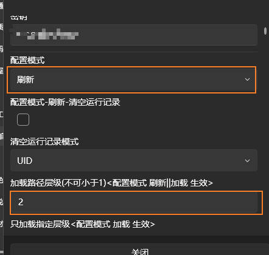</br>
- 2.执行
  **选择 全自动**</br>
  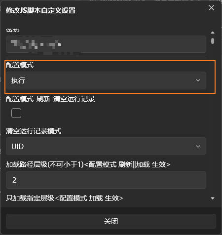</br>
  **CD算法需要部署 [bettergi-scripts-tools](https://github.com/Kirito520Asuna/bettergi-scripts-tools/releases) 并启用http</br>
   也可以开启择优模式(择优模式不依赖bettergi-scripts-tools)**</br>
  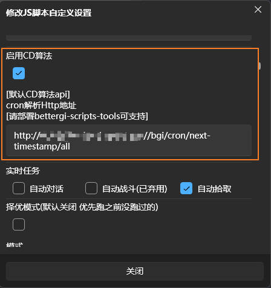</br>
  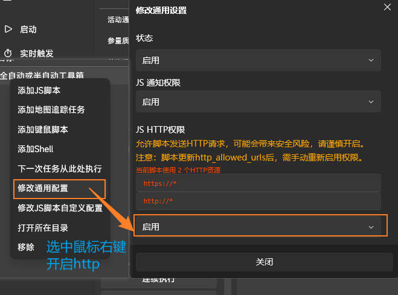</br>
  **日常选择 全自动**</br>
  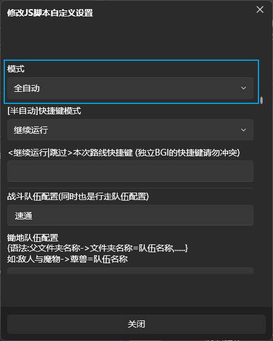</br>
  **配置队伍**</br>
   配置默认 行走队</br>
   队伍配置 实例语法对应映射: 矿物,火,水,风,雷,草,冰,岩 </br>
   队伍配置 实例语法: 矿采集,水火风雷,水火风雷,水火风雷,元素,矿采集 </br>
   没有可留空 如 矿采集,,,,,矿采集</br>
  **锄地队伍配置**</br>
  实例语法: 敌人与魔物->发条机关=速通,..... (还不清楚的看`锄地队伍配置图映射`)</br>
  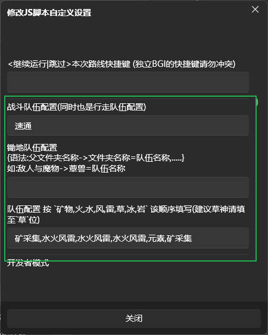</br>
  **`锄地队伍配置图映射`**</br>
  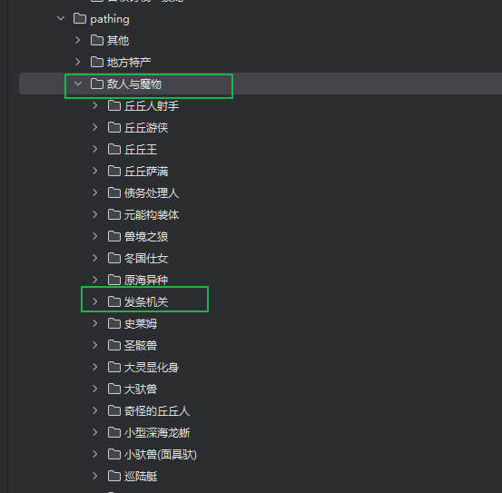</br>
  **`选中执行组`**</br>
   多选项 为或关系 </br>
   如选中 地方特产的璃月 和 璃月的石珀 会执行 地方特产的璃月下所有的路径</br>
   如需要指定 请勿选中上级目录 璃月的石珀(3级路径)->地方特产的璃月(2级路径) </br>
   如图选中下3级路径时不要选中对应的2级路径</br>
  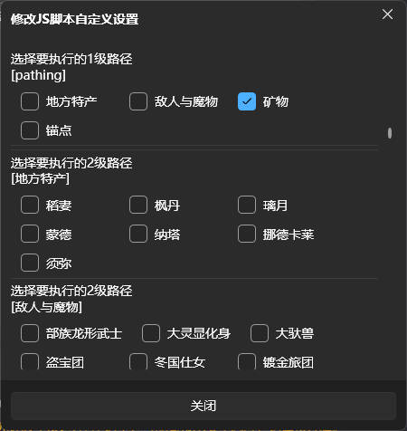</br>
  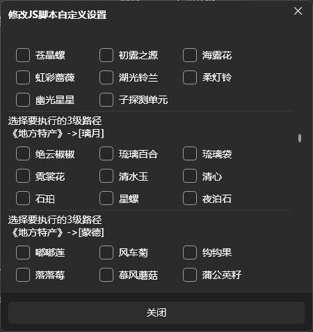</br>
- 3.高级配置请继续查看文档后续
### 核心亮点（最新版）

- **路径扫描全面重构**：支持任意层级目录，父子关系清晰，性能稳定
- **按 UID 缓存路径列表**（`path-json-by-uid.json`），多账号切换极快
- 小时制 & Cron 双冷却系统（需搭配 bettergi-scripts-tools）
- 智能队伍切换（战斗/七元素）
- 实时任务：自动对话跳过、自动拾取、自动战斗
- 择优执行 + 执行记录 + 错误路径追踪
- 半自动快捷键干预（继续/跳过）
- 开发者模式 + 详细日志 + UID自动识别

## 文件结构一览

```
FullyAutoAndSemiAutoTools/
├── config/
│   ├── SevenElement.json           # 七元素路径→队伍映射
│   ├── cd-pathing.json             # 路径冷却规则（hours/cron）
│   ├── record.json                 # 本次执行记录
│   ├── PathRecord.json             # 历史路径执行记录
│   ├── uidSettings.json            # 用户配置快照（多UID支持）
│   ├── path-json-by-uid.json       # 按UID缓存的路径JSON列表
│   └── RefreshSettings.json        # 刷新配置缓存（可选）
├── utils/
│   ├── SwitchTeam.js               # 队伍切换核心
│   ├── cron.js                     # Cron 解析工具
│   └── uid.js                      # UID 识别模块
├── pathing/                        # ★ 所有路径文件目录（需符号链接）
├── SymLink.bat                     # 一键创建 pathing 链接
├── main.js                         # 主程序入口（已重构路径扫描）
├── manifest.json                   # 脚本元信息 & 版本标识
└── settings.json                   # 配置模板（用户界面依据）
```

## 核心流程图

### 1. 整体流程图（graph TD 风格，适合看结构与分支）

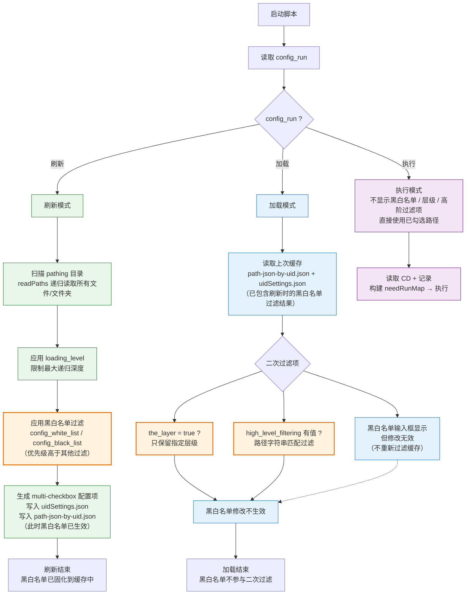

### 2. 执行时序图（sequenceDiagram 风格，适合看交互顺序）

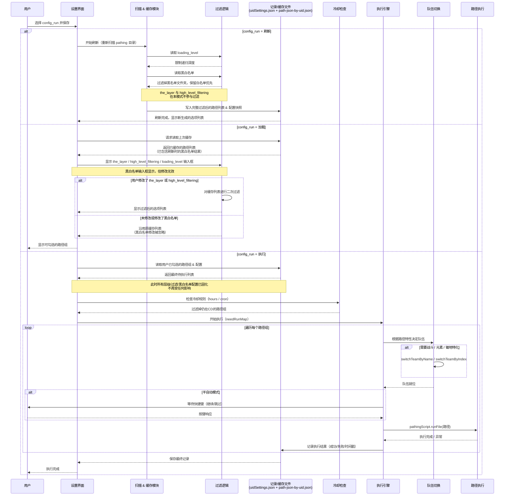

## 重要配置项一览（settings.json）

| 配置项                 | 类型  | 主要作用                                                              | 推荐默认/示例                                      |
|---------------------|-----|-------------------------------------------------------------------|----------------------------------------------|
| config_uid          | 复选框 | 当前配置uid:{无}(仅仅显示配置uid无其他作用)                                       | xxx                                          |
| key                 | 文本  | 脚本密钥                                                              | xxx                                          |
| config_run          | 下拉  | 运行模式：刷新 / 加载 / 执行                                                 | 刷新 → 首次，加载 → 日常                              |
| refresh_record      | 复选框 | 配置模式-刷新-清空运行记录                                                    |                                              |
| refresh_record_mode | 下拉  | 清空运行记录模式 全部                                                       | UID                                          |                                            |
| high_level_filtering       | 文本  | 高阶过滤                                                              |                                              |
| loading_level       | 文本  | 路径层级深度（≥1，实际支持更高深度）                                               | 2 或 3                                        |
| the_layer       | 复选框  | 只加载指定层级                                                           |                                              |
| order_rules         | 文本  | 执行顺序规则（可留空）<br>语法：父文件夹名称->文件夹名称=顺序整数,...<br>示例：食材与炼金->晶蝶=1,       | ""（默认按扫描顺序）或 "食材与炼金->晶蝶=1,pathing->地方特产=2"   |
| open_limit_max         | 复选框  | 开启执行组最大路径数配置                                                      | |
| limit_max_group         | 文本  | 配置执行组最大路径数（可留空）<br>语法：父文件夹名称->文件夹名称=最大路径数,...<br>示例：食材与炼金->晶蝶=50, | ""（默认按扫描顺序）或 "食材与炼金->晶蝶=50,pathing->地方特产=50" |
| config_white_list   | 文本  | 白名单（逗号分隔）                                                         | 晶蝶,特产                                        |
| config_black_list   | 文本  | 黑名单（优先级更高）                                                        | 其他,锄地专区,周本                                   |
| open_cd             | 复选框 | 启用冷却控制                                                            | 建议开启                                         |
| http_api            | 文本  | Cron 解析服务地址                                                       | http://127.0.0.1:8081/...                    |
| real_time_missions  | 多选  | 实时辅助（对话/战斗/拾取）                                                    | 至少开「自动拾取」                                    |
| choose_best         | 复选框 | 择优模式（优先未跑/最久未跑路径）                                                 | 推荐开启                                         |
| mode                | 下拉  | 全自动 / 半自动                                                         | 全自动（日常）                                      |
| auto_semi_key_mode  | 下拉  | 半自动快捷键行为（继续/跳过）                                                   | 继续运行                                         |
| auto_key            | 文本  | 半自动干预快捷键                                                          | F10 / F11（避免冲突）                              |
| team_fight          | 文本  | 通用行走队伍名称                                                       | 必须填写                                         |
| team_hoe_ground     | 文本  | 锄地特化队伍配置（语法：父文件夹->子文件夹=队伍名,...）                                   | 敌人与魔物->蕈兽=蕈兽队                                |
| team_seven_elements | 文本  | 七元素队伍（矿物,火,水,风,雷,草,冰,岩）                                           | 按顺序填写                                        |
| is_debug            | 复选框 | 开发者模式（详细日志）                                                       | 调试时开启                                        |


## 语法说明
- high_level_filtering 高阶过滤
```text
语法：xxx->xxx-> ..... 无限制               

实例：pathing\地方特产\
语法：地方特产
实例：pathing\地方特产\枫丹\
语法：地方特产->枫丹
实例：pathing\地方特产\枫丹\幽光星星\
语法：地方特产->枫丹->幽光星星
实例：pathing\地方特产\枫丹\幽光星星\幽光星星@jbcaaa\
语法：地方特产->枫丹->幽光星星->幽光星星@jbcaaa
```
- 以下语法风格请保持一致 ，否则会导致路径会出现异常运行 如使用 地产->nam=1 同时保持 地产->nam=队伍名1 则路径会出现异常运行
- order_rules 执行顺序规则
    1. `rootName` 根目录下层文件夹名称，`parentName` 父目录名称，`name` 文件夹名称
    2. 建议语法：`rootName->parentName->name=1,rootName->parentName->name2=2`
    3. `rootName=parentName`时 语法`rootName->parentName->name=1`不可用， 请使用 `parentName->name=1` 语法
    4. `rootName->name=1` 语法不支持
    5. 匹配精度：`rootName->parentName->name` > `parentName->name` > 默认顺序 
- team_hoe_ground 锄地特化队伍配置
    1. `rootName` 根目录下层文件夹名称，`parentName` 父目录名称，`name` 文件夹名称
    2. 建议语法：`rootName->parentName->name=队伍名,rootName->parentName->name2=队伍名`
    3. `rootName=parentName`时 语法`rootName->parentName->name=队伍名`不可用， 请使用 `parentName->name=队伍名` 语法
    4. `rootName->name=队伍名` 语法不支持
    5. 匹配精度：`rootName->parentName->name` > `parentName->name` > 默认顺序
- limit_max_group 配置执行组最大路径数
    1. `parentName` 父目录名称，`name` 文件夹名称
    2. 建议语法：`parentName->name=50,parentName->name2=50`
    3. 匹配精度： `parentName->name` > 默认顺序
## (可选)额外json配置

### 配置项order_rules

路径:config/PathOrder.json
order值越大优先级越高 `公共配置 锄地模块排序未配置 希望好心人完善  预留order 900~700`
```json
[
  {
    "uid": "",
    //账号UID
    "is_common": false,
    //是否为公共配置
    "root_name": "",
    //根文件夹下对应的文件夹名称
    "parent_name": "",
    //父文件夹名称
    "name": "",
    //文件夹名称
    "order": 0
    //顺序
  }
]
```

### 配置项team_hoe_ground

路径:config/HoeGround.json

```json
[
  {
    "uid": "",
    //账号UID
    "is_common": false,
    //是否为公共配置
    "root_name": "",
    //根文件夹下对应的文件夹名称
    "parent_name": "",
    //父文件夹名称
    "name": "",
    //文件夹名称
    "team_name": ""
    //队伍名称
  }
]
```

## CD 规则示例（cd-pathing.json）
level值越大优先级越高
```json
[
  {
    "name": "晶蝶",
    "type": "hours",
    "level": 2,
    "value": 12
  },
  {
    "name": "地方特产",
    "type": "hours",
    "level": 1,
    "value": 46
  },
  {
    "name": "矿物",
    "type": "cron",
    "level": 1,
    "value": "0 0 0 1/3 * ?"
  }
]
```
## 运行实例部分日志
实例==>运行矿物 大类 虹滴晶 运行完成 再次运行 日志截图展示：

## Cron 解析服务部署（必须）

**bettergi-scripts-tools** 是 Cron 解析的必要依赖，请至少选择一种方式部署：
> bettergi-scripts-tools 版本需要 v0.0.3
### 1. Windows 一键运行

下载 [release](https://github.com/Kirito520Asuna/bettergi-scripts-tools/releases) 中的 windows zip 包 → 解压 → 双击 .exe
运行

### 2. Java 运行

下载 jar 包 → 执行：

```bash
java -jar bettergi-scripts-tools-xxxx.jar
```

### 3. Docker 部署

```bash
docker pull ghcr.io/kirito520asuna/bettergi-scripts-tools:latest
docker run -d -p 8081:8081 --name bettergi-scripts-tools ghcr.io/kirito520asuna/bettergi-scripts-tools:latest
```

**默认 API 地址**：`http://127.0.0.1:8081/bgi/cron/next-timestamp/all`

## 推荐使用流程

1. 双击 `SymLink.bat` 创建 pathing 链接
2. 首次运行强烈建议先「刷新」一次（生成 path-json-by-uid.json 缓存）
3. 日常使用「加载」模式 → 快速恢复配置 & 路径列表
4. 微调路径组 → 切换「执行」模式 → 一键启动

**多账号特别友好**：每个 UID 都有独立路径缓存，切换账号无需重复扫描

## 小技巧与实用建议

- 最省事组合：全自动 + 择优模式 + 自动拾取 + 冷却控制
- 最安全组合：半自动 + 自动拾取 + 详细日志 + 大量黑名单
- 路径目录再深也没关系，扫描已支持任意层级
- 错误路径反复出现？查看 record.json 加黑名单或修复
- 多UID用户：首次每个号都「刷新」一次，建立独立缓存

## 注意事项

- 首次使用或升级后建议删除旧 `path-json-by-uid.json` 重新生成
- 半自动模式请确保快捷键不与 BetterGI 冲突
- Cron 模式必须部署解析服务，否则冷却检查无效
- 最低兼容版本：BetterGI 0.54.3+

## 版本密钥

| 版本    | 密钥          |
|-------|-------------|
| 0.0.1 | PGCSBY37NJA |

## 版本历史（简要）

### 0.0.1 2026.01.30

基本功能完成

**作者**：云端客 (Kirito520Asuna)

祝你使用愉快，素材永远收不完～✨
