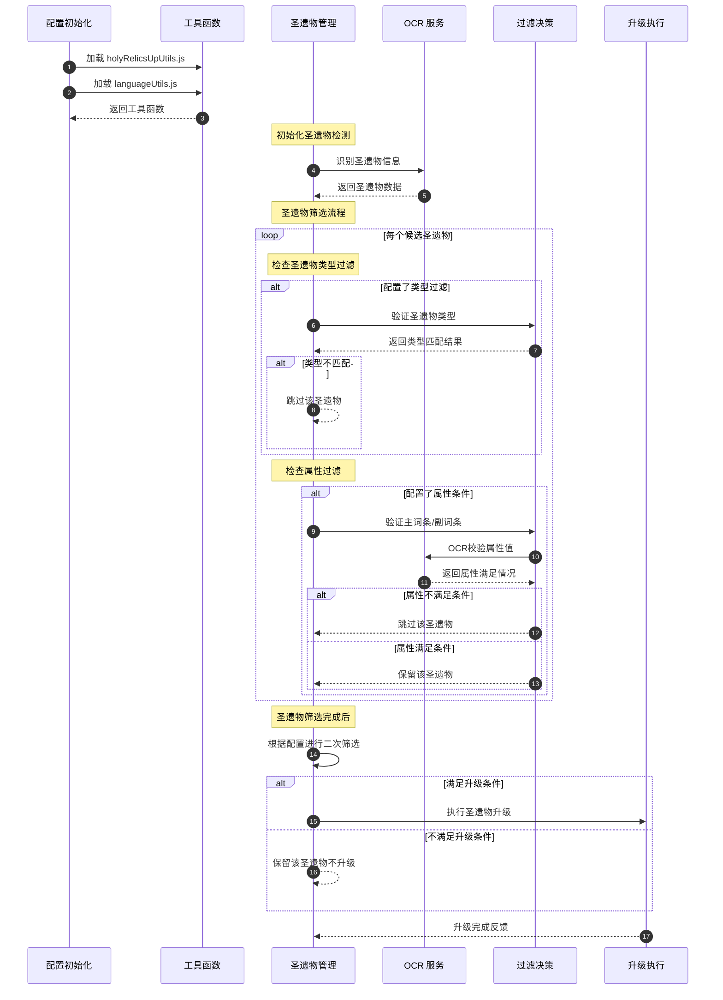

# 圣遗物批量强化

功能描述：打开背包页面、按照未满级和等级升序排列后对首个圣遗物进行循环强化直到达到你设置的最大等级后继续执行下一个。还可以设置强化多少个圣遗物。

## 注意事项

1. **分辨率建议**：请尽量确保原神游戏分辨率为1920x1080(尽量在1K下运行)。虽然脚本已兼容其他分辨率，但其他分辨率未经过充分测试。
2. **筛选问题**：圣遗物筛选时选择“全选”可能导致失败，此问题暂时无法解决。
## 核心逻辑流程

## 核心功能

1. **批量强化圣遗物**：支持对圣遗物进行批量强化，自动循环强化直到达到指定等级。
2. **素材放入方式的选择和自识别**：支持选择素材放入方式（默认：自动识别）。注意：当最大强化等级设置为4、8、16时，强制使用“阶段放入”方式。
3. **最大强化等级**：可设置强化目标等级（默认：4）。当材料不足时，强化会停止（例如：目标+20，但材料仅够+17，若选择阶段放入，会停在+16）。
4. **最大圣遗物强化个数**：支持设置需要强化的圣遗物数量。
5. **属性排序**：支持按属性排序，使用简称，格式使用`|`分隔。支持的简称如下：

| 简称 |  全称  |  简称   |   全称    |
|:--:|:----:|:-----:|:-------:|
| %  | 百分比  |  物伤   | 物理伤害加成  |
| 生命 | 生命值  |  风伤   | 风元素伤害加成 |
| 防御 | 防御力  |  水伤   | 水元素伤害加成 |
| 攻击 | 攻击力  |  雷伤   | 雷元素伤害加成 |
| 治疗 | 治疗加成 |  岩伤   | 岩元素伤害加成 |
| 精通 | 元素精通 |  草伤   | 草元素伤害加成 |
| 暴率 | 暴击率  |  冰伤   | 冰元素伤害加成 |
| 爆率 | 暴击率  |  火伤   | 火元素伤害加成 |
| 暴伤 | 暴击伤害 |  充能   | 元素充能效率  |
| 爆伤 | 暴击伤害 | ~~无~~ |  ~~无~~  |

**示例**：`生命%` 等价于 `生命值%`，均表示生命值百分比。  
**注意**：

- `生命%|防御%|攻击%|治疗` 只生效前三个（`生命%|防御%|攻击%`）。
- 重复属性（如 `生命%|生命%|攻击%`）会自动去重，仅保留 `生命%|攻击%`。
- 顺序为 `1|2|3`。

6. **圣遗物套装筛选**：支持按圣遗物套装筛选（如：`如雷|苍白`），使用模糊匹配，无次数限制。

## 配置说明

以下为脚本的配置项（基于 `settings.json`），可在脚本运行前调整：

1. **根据语言刷新设置列表** (`refreshSettingsByLanguage`) **[1.1.5 新增]**
    - 类型：复选框
    - 描述：是否根据选择的语言刷新设置列表的显示内容。
    - 默认：禁用

2. **语言选择** (`language`) **[1.1.5 新增]**
    - 类型：下拉菜单
    - 描述：选择界面显示的语言。
    - 选项：`简体中文`、`繁體中文`、`English`、`日本語`、`한국어`
    - 默认：`简体中文`

3. **启用自动进入背包** (`toBag`)
    - 类型：复选框
    - 描述：是否自动打开背包页面。
    - 默认：启用

4. **启用批量强化** (`enableBatchUp`)
    - 类型：复选框
    - 描述：启用批量强化功能。单独使用时，请确保圣遗物背包已筛选为未满级状态。
    - 默认：禁用

5. **默认强化界面** (`defaultEnhancedInterface`) **[1.1.7 新增]**
    - 类型：下拉菜单
    - 描述：选择默认进入的强化界面（详情|强化）。适配米哈游对默认强化界面的修改。
    - 选项：`详情`、`强化`
    - 默认：`强化`

6. **自动启用放入方式** (`enableInsertionMethod`)
    - 类型：复选框
    - 描述：自动选择素材放入方式（快捷放入/阶段放入）。
    - 默认：禁用

7. **放入方式** (`insertionMethod`)
    - 类型：下拉菜单
    - 描述：选择素材放入方式（默认：自动识别）。当最大强化等级为4、8、16时，强制使用“阶段放入”。
    - 选项：`默认`、`快捷放入`、`阶段放入`
    - 默认：`默认`

8. **选择素材** (`material`)
    - 类型：下拉菜单
    - 描述：选择强化使用的素材（默认：自动识别）。**注：此功能存在问题消失太快无法识别，禁用**。
    - 选项：`默认`、`1星素材`、`2星及以下素材`、`3星及以下素材`、`4星及以下素材`
    - 默认：`默认`

9. **最大圣遗物强化个数** (`upMaxCount`)
    - 类型：文本输入
    - 描述：设置需要强化的圣遗物数量。
    - 默认：空

10. **最大强化等级** (`upMax`)
    - 类型：下拉菜单
    - 描述：设置圣遗物强化的目标等级。
    - 选项：`4`、`8`、`16`、`20`
    - 默认：`4`

11. **启用命中属性** (`enableAttributeHolyRelic`)
    - 类型：复选框
    - 描述：是否启用命中属性功能（实验功能）。不支持在升序情况下使用,不支持降序选中满级|未满级条件下强化+20操作。
    - 默认：禁用

12. **启用自定义命中属性覆盖通用命中属性** (`coverAttributeHolyRelic`)
    - 类型：复选框
    - 描述：启用后，自定义命中属性将覆盖通用命中属性（以部件为单位）。若禁用，则仅使用自定义命中属性，不使用通用命中属性（实验功能）。  
      **特别说明**：假设通用命中属性为 `@花*爆率*爆伤|@羽*爆率*爆伤|@沙*爆率*爆伤|@冠#爆率#爆伤&*爆率*爆伤|@杯#物伤#风伤#水伤#火伤#雷伤#岩伤#冰伤#草伤&*爆率*爆伤`，自定义命中属性为 `@花*爆率`，启用此选项时，仅“花”部件的命中属性会被覆盖为 `@花*爆率`，其他部件仍使用通用命中属性。若禁用此选项，则仅使用自定义命中属性（如 `@花*爆率`），完全忽略通用命中属性。
    - 默认：启用

13. **通用命中属性** (`commonAttributeHolyRelic`)
    - 类型：文本输入
    - 描述：设置通用的命中属性，格式需遵循特定语法（实验功能）。  
      **语法说明**：
        - `@`：表示部件，需使用以下部件简称或全称（两者均可）：

          | 简称 | 全称 | 简称 | 全称 |
                    |:----:|:----:|:----:|:----:|
          | 羽 | 死之羽 | 花 | 生之花 |
          | 羽毛 | 死之羽 | 沙 | 时之沙 |
          | 杯 | 空之杯 | 冠 | 理之冠 |
          | 杯子 | 空之杯 |

        - `#`：表示主词条（如生命%、物伤）。主词条存在时不可忽略，需以 `&` 终止。
        - `*`：表示副词条（如爆率、爆伤）。副词条可忽略终止符 `!`，但建议添加以提高清晰度。
        - `|`：表示部件终止，多个部件时不可忽略。
        - `&`：表示主词条终止，主词条存在时不可忽略。
        - `!`：表示副词条终止，可忽略。
        - 属性排序的简称也支持命中属性。
        - **示例**：
            - `@花*生命%*攻击!|@杯#生命%#物伤&*生命%!` 表示：
                - 花：副词条为生命%、攻击。
                - 杯：主词条为生命%或物伤，副词条为生命%。
            - 简化为：`@花*生命%*攻击|@杯#生命%#物伤&*生命%`（`!` 可省略）。
            - 使用全称：`@生之花*生命%*攻击|@空之杯#生命%#物伤&*生命%`（效果同上）。
    - 默认：`@花*爆率*爆伤|@羽*爆率*爆伤|@沙*爆率*爆伤|@冠#爆率#爆伤&*爆率*爆伤|@杯#物伤#风伤#水伤#火伤#雷伤#岩伤#冰伤#草伤&*爆率*爆伤`

14. **自定义命中属性** (`inputAttributeHolyRelic`)
    - 类型：文本输入
    - 描述：设置自定义的命中属性，格式直接参考通用命中属性（`commonAttributeHolyRelic` ）的语法（实验功能）。支持使用“核心功能”中属性排序的简称表及部件简称或全称。
    - 默认：空

15. **启用筛选圣遗物自定义命中属性覆盖筛选圣遗物通用命中属性** (`coverSiftAttributeHolyRelic`) **[1.1.3 新增]**
    - 类型：复选框
    - 描述：启用后，自定义筛选圣遗物属性（`inputSiftAttributeHolyRelic`）将覆盖通用筛选圣遗物属性（ `commonSiftAttributeHolyRelic` ），以部件为单位。若禁用，则仅使用自定义筛选圣遗物属性，完全忽略通用筛选圣遗物属性（实验功能）。  
      **特别说明**：假设通用筛选属性为 `@花*爆率*爆伤|@羽*爆率*爆伤`，自定义筛选属性为 `@花*生命%`，启用此选项时，仅“花”部件的筛选属性会被覆盖为 `@花*生命%`，其他部件仍使用通用筛选属性。若禁用此选项，则仅使用自定义筛选属性（如 `@花*生命%`），完全忽略通用筛选属性。  
      **注意**：此配置仅用于强化前的第一次圣遗物筛选。
    - 默认：启用

16. **启用筛选圣遗物满足所有指定的子属性命中条件** (`meetAllSiftAttributeHolyRelic`) **[1.1.3 新增]**
    - 类型：复选框
    -
    描述：启用后，筛选圣遗物时将严格要求满足所有指定的子属性条件（实验功能）。若禁用，则筛选条件可能不要求全部子属性都满足。  
    **注意**：此配置仅用于强化前的第一次圣遗物筛选。
    - 默认：关闭

17. **筛选圣遗物通用命中属性** (`commonSiftAttributeHolyRelic`) **[1.1.3 新增]**
    - 类型：文本输入
    - 描述：设置通用的圣遗物筛选属性，格式遵循与通用命中属性（`commonAttributeHolyRelic` ）相同的语法（实验功能）。用于在强化前筛选符合条件的圣遗物。  
      **语法说明**：同 `commonAttributeHolyRelic`，支持使用“核心功能”中属性排序的简称表及部件简称或全称。  
      **示例**：`@花*生命%*攻击|@杯#生命%#物伤&*生命%`
      表示筛选“花”部件副词条包含生命%和攻击、“杯”部件主词条为生命%或物伤且副词条包含生命%的圣遗物。  
      **注意**：此配置仅用于强化前的第一次圣遗物筛选。
    - 默认：`@花*爆率*爆伤|@羽*爆率*爆伤|@沙*爆率*爆伤|@冠#爆率#爆伤&*爆率*爆伤|@杯#物伤#风伤#水伤#火伤#雷伤#岩伤#冰伤#草伤&*爆率*爆伤`

18. **筛选圣遗物自定义命中属性** (`inputSiftAttributeHolyRelic`) **[1.1.3 新增]**
    - 类型：文本输入
    - 描述：设置自定义的圣遗物筛选属性，格式直接参考通用筛选圣遗物属性（`commonSiftAttributeHolyRelic` ）的语法（实验功能）。用于在强化前筛选符合条件的圣遗物。  
      **语法说明**：同 `commonAttributeHolyRelic`，支持使用“核心功能”中属性排序的简称表及部件简称或全称。  
      **注意**：此配置仅用于强化前的第一次圣遗物筛选。
    - 默认：空

19. **启用自动排序** (`toSort`)
    - 类型：复选框
    - 描述：是否启用自动排序功能。若禁用，以下排序相关配置无效。
    - 默认：启用

20. **属性排序** (`sortAttribute`)
    - 类型：文本输入
    - 描述：设置排序属性，使用“|”分隔，支持简称（如：`生命%|雷伤|充能|通用`）。
    - 默认：空

21. **主排序** (`sortMain`)
    - 类型：下拉菜单
    - 描述：设置主排序方式。
    - 选项：`升序`、`降序`
    - 默认：`升序`

22. **辅助排序** (`sortAuxiliary`)
    - 类型：下拉菜单
    - 描述：设置辅助排序方式。
    - 选项：`等级顺序`、`品质顺序`
    - 默认：`等级顺序`

23. **启用筛选圣遗物开关** (`toSift`)
    - 类型：复选框
    - 描述：是否启用圣遗物筛选功能。若禁用，以下筛选相关配置无效。
    - 默认：启用

24. **圣遗物筛选** (`suit`)
    - 类型：文本输入
    - 描述：按圣遗物套装筛选，使用 `|` 分隔，支持模糊匹配（如：`如雷|苍白`）。
    - 默认：空

25. **筛选圣遗物界面最大翻页次数** (`countMaxByHoly`)
    - 类型：下拉菜单
    - 描述：设置筛选圣遗物时的最大翻页次数。
    - 选项：`1`、`2`、`3`、`4`、`5`、`6`、`7`、`8`
    - 默认：`4`

26. **圣遗物筛选：锁定状态（标记）** (`holyRelicsLockMark`)
    - 类型：复选框
    - 描述：筛选带有标记的圣遗物。
    - 默认：禁用

27. **圣遗物筛选：仅锁定** (`holyRelicsLockY`)
    - 类型：复选框
    - 描述：筛选已锁定的圣遗物。
    - 默认：禁用

28. **圣遗物筛选：未锁定** (`holyRelicsLockN`)
    - 类型：复选框
    - 描述：筛选未锁定的圣遗物。
    - 默认：禁用

29. **圣遗物筛选：已装备** (`holyRelicsEquipY`)
    - 类型：复选框
    - 描述：筛选已装备的圣遗物。
    - 默认：禁用

30. **圣遗物筛选：未装备** (`holyRelicsEquipN`)
    - 类型：复选框
    - 描述：筛选未装备的圣遗物。
    - 默认：禁用

31. **圣遗物筛选：来源（祝圣之霜定义）** (`holyRelicsSourceFrostSaint`)
    - 类型：复选框
    - 描述：筛选来源为“祝圣之霜定义”的圣遗物。
    - 默认：禁用

32. **打开背包按键** (`knapsackKey`)
    - 类型：文本输入
    - 描述：设置打开背包的快捷键。
    - 默认：`B`

33. **日志开关** (`log_off`)
    - 类型：复选框
    - 描述：启用日志记录，用于开发者调试。
    - 默认：禁用

## 版本历史

### 1.1.9 (2026-01-05)
- **修复**
  - 异常识别 问题
### 1.1.8 (2025-12-09)
- **新增** **[1.1.8 新增]**：
    - 使用固定分辨率值替换动态获取(应 https://github.com/babalae/bettergi-scripts-list/pull/2464 修改)

### 1.1.7 (2025-12-05)

- **新增** **[1.1.7 新增]**：
    - 添加 `defaultEnhancedInterface` 配置项，支持选择默认强化界面（详情|强化）。适配米哈游对默认强化界面的修改。
如图：

### 1.1.6 (2025-09-21)

- **新增** **[1.1.6 新增]**：
    - 新增繁体中文支持 (受到OCR影响无法支持English中间空格把词拆成了多个词)
    - 解决方案:建议同JS脚本
      ==>更改游戏语言。\n更改遊戲語言。\nChange the game language.\nゲーム言語を変更します。\n게임 언어를 변경하십시오.<==
      一同使用可解决OCR不兼容的问题
- **优化** **[1.1.6 新增]**：
    - 命中属性新增验证防止机制

### 1.1.5 (2025-09-21)

- **新增** **[1.1.5 新增]**：
    - 添加 `refreshSettingsByLanguage` 配置项，支持根据语言刷新设置列表的显示内容。
    - 添加 `language` 配置项，支持选择界面语言（简体中文、繁體中文、English、日本語、한국어）。
    - 更新界面标签，支持多语言动态显示。
- **优化** **[1.1.5 新增]**：
    - 优化多语言模块，增强语言切换的流畅性和稳定性。
    - 改进 `languageMap` 管理，支持动态加载多语言配置文件。
    - 提高错误提示的友好性，语言切换失败时提供更清晰的反馈。

### 1.1.4 (2025-09-12)

- **新增**：添加多语言模块框架，支持动态语言配置（当前仅实现简体中文 `zh-cn`，其他语言如英文 `en-us` 等尚未实现，期待其他作者贡献）。
- **适配**：
    - 优化图片路径管理，通过 `commonMap` 和 `languageMap` 实现动态路径加载，支持多语言扩展。
    - 增强模板匹配功能，新增 `templateMatchFindByJson` 和 `templateMatchClickByJson`，提高代码复用性和维护性。
    - 改进错误提示，语言配置缺失时提供支持语言列表。

### 1.1.3 (2025-09-11)

- **新增** **[1.1.3 新增]**：
    - 添加筛选圣遗物属性相关配置：
        - `coverSiftAttributeHolyRelic`：支持自定义筛选属性覆盖通用筛选属性。
        - `meetAllSiftAttributeHolyRelic`：支持严格要求满足所有子属性条件。
        - `commonSiftAttributeHolyRelic`：定义通用命中筛选属性。
        - `inputSiftAttributeHolyRelic`：支持自定义命中筛选属性。
        - 以上配置仅用于强化前的第一次圣遗物筛选。
- **适配**：
    - 圣遗物属性待激活属性适配。

## 语言对照

---
**Please refer to unsupported languages`/`未サポートの言語を参照してください`/`지원되지 않는 언어를 참조하세요**
---
| 简体中文 | 繁体中文 |   English   | 日本語 | 한국어  | Write syntax in contrast to Chinese `/`中国語と対照して文法を書く`/`중국어와 대조하여 문법 작성하기 |
|:----:|:----:|:-----------:|:---:|:----:|:------------------------------------------------------------------------:|
| 生之花  | 生之花  | Life Flower | 生の花 | 생의 꽃 |花|
| 死之羽  | 死之羽  | Death Feather | 死の羽 | 죽음의 날개 |羽|
| 时之沙  | 時之沙  | Time Sand | 時の砂 | 시의 모래 |沙|
| 空之杯  | 空之杯  | Empty Cup | 空のカップ | 빈 컵 |杯|
| 理之冠  | 理之冠  | Reason Crown | 理の冠 | 이론의 왕관 |冠|
 ---
| 简体中文 | 繁体中文 |   English   | 日本語 | 한국어  | Write syntax in contrast to Chinese `/`中国語と対照して文法を書く`/`중국어와 대조하여 문법 작성하기 |
|:----:|:----:|:-----------:|:---:|:----:|:------------------------------------------------------------------------:|
|百分比|百分比|Percentage|パーセンテージ|퍼센트|                                    %                                     |
|防御力|防禦力|Defense|防御力|방어력|                                    防御                                    |
|攻击力|攻擊力|Attack|攻撃力|공격력|                                    攻击                                    |
|生命值|生命值|HP|HP|생명력|                                    生命                                    |
|暴击率|暴擊率|Critical Rate|暴撃率|치명률|                                    暴率                                    |
|暴击伤害|暴擊傷害|Critical Damage|暴撃ダメージ|치명피해|                                    暴伤                                    |
|元素充能|元素充能|Elemental Recharge|元素チャージ|원소 충전|充能
|元素精通|元素精通|Elemental Mastery|元素達人|원소 숙련도|精通
|治疗加成|治療加成|Healing Bonus|ヒーリングボーナス|치료 보너스|治疗
|伤害加成|傷害加成|Damage Bonus|ダメージボーナス|피해 보너스|~~/~~
|元素伤害加成|元素傷害加成|Elemental Damage Bonus|元素ダメージボーナス|원소 피해 보너스|~~/~~
|物理伤害加成|物理傷害加成|Physical Damage Bonus|物理ダメージボーナス|물리 피해 보너스|物伤
|火元素伤害加成|火元素傷害加成|Pyro Damage Bonus|ファイアダメージボーナス|파이로 피해 보너스|火伤
|水元素伤害加成|水元素傷害加成|Hydro Damage Bonus|ウォーターダメージボーナス|하이드로 피해 보너스|水伤
|雷元素伤害加成|雷元素傷害加成|Electro Damage Bonus|エレクトロダメージボーナス|전기 피해 보너스|雷伤
|草元素伤害加成|草元素傷害加成|Dendro Damage Bonus|デンドロダメージボーナス|덴드로 피해 보너스|草伤
|冰元素伤害加成|冰元素傷害加成|Cryo Damage Bonus|クリオダメージボーナス|크리오 피해 보너스|冰伤
|岩元素伤害加成|岩元素傷害加成|Geo Damage Bonus|ジオダメージボーナス|지오 피해 보너스|岩伤
|风元素伤害加成|風元素傷害加成|Anemo Damage Bonus|アネモダメージボーナス|앤메오 피해 보너스|风伤
---
### **已支持`繁体中文`对照简称**

---
| 簡稱 | 全稱 | 簡稱 | 全稱 |
|:----:|:----:|:----:|:----:|
| 羽 | 死之羽 | 花 | 生之花 |
| 羽毛 | 死之羽 | 沙 | 時之沙 |
| 杯 | 空之杯 | 冠 | 理之冠 |
| 杯子 | 空之杯 |
---
| 簡稱 |  全稱  |  簡稱   |   全稱    |
|:--:|:----:|:-----:|:-------:|
| %  | 百分比  |  物傷   | 物理傷害加成  |
| 生命 | 生命值  |  风傷   | 風元素傷害加成 |
| 防禦 | 防禦力  |  水傷   | 水元素傷害加成 |
| 攻擊 | 攻擊力  |  雷傷   | 雷元素傷害加成 |
| 治療 | 治療加成 |  岩傷   | 岩元素傷害加成 |
| 精通 | 元素精通 |  草傷   | 草元素傷害加成 |
| 暴率 | 暴擊率  |  冰傷   | 冰元素傷害加成 |
| 爆率 | 暴擊率  |   火傷   | 火元素傷害加成 |
| 暴傷 | 暴擊傷害 |  充能   | 元素充能效率  |
| 爆傷 | 暴擊傷害 | ~~无~~ |  ~~无~~  |
---
## 其他

- **多语言适配(开发者)请注意**：
    - utils/languageUtils 为 多语言模块框架 的全部配置
    - assets/language/ 为 多语言模块框架 的本地语言匹配图片

- **作者**：云端客
- **脚本反馈邮箱**：doutianmianxia@qq.com