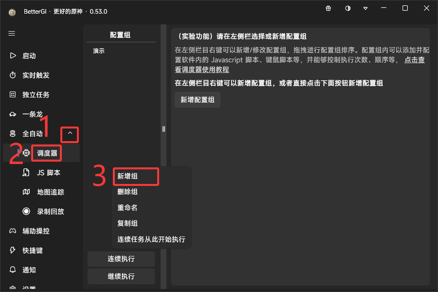
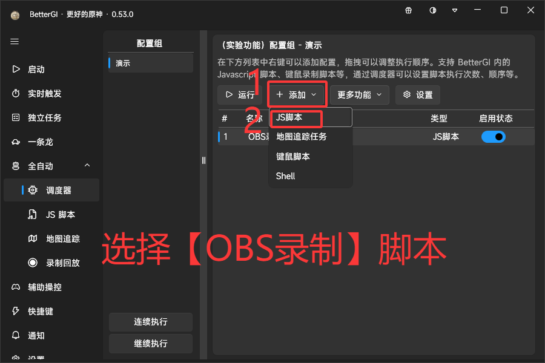
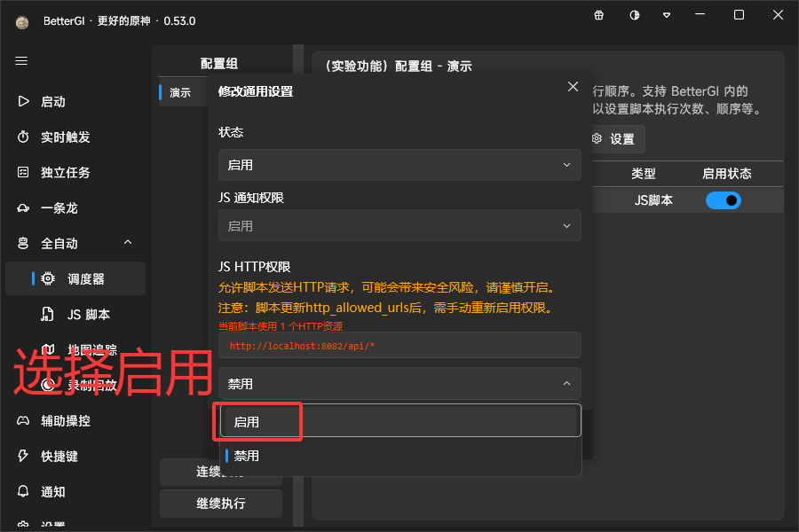
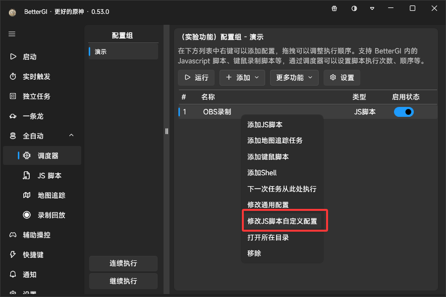
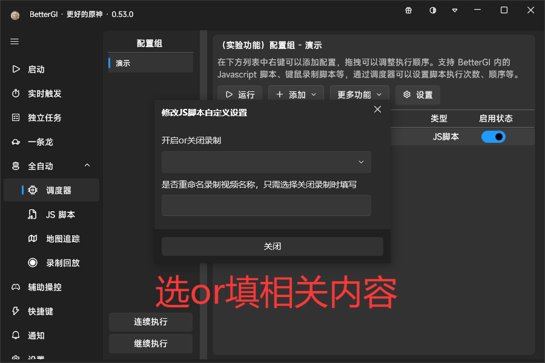

# OBS录制

## 介绍
#### 该脚本是搭配auto-bgi软件使用，进行开启本地开启OBS录制和结束
#### 不了解的可以去BetterGI的QQ频道搜索【auto-bgi】
#### 也可以电脑点击【[ABGI](https://gitee.com/wangjian0327/auto-bgi/blob/ginVue/README.md)】，进行学习，了解

------

 ## 注意
 #### 使用`OBS录制`脚本时，`ABGI`最低版本为【3.1】

------

## 使用方法

#### 在`调度器`中新建`配置组`，`配置组`添加`OBS录制`右键脚本名字，找到【修改通用配置】将里面的【JS HTTP权限】下的`禁用`选择`启用`，在【修改JS脚本自定义设置】，选or填相关内容

------

####图文教程步骤一：

####图文教程步骤二：

####图文教程步骤三：

####图文教程步骤四：

####图文教程步骤五

####图文教程步骤六

------

## 版本
#### 0.0.1
有啥不懂的，八九十群，可以艾特【古又】

