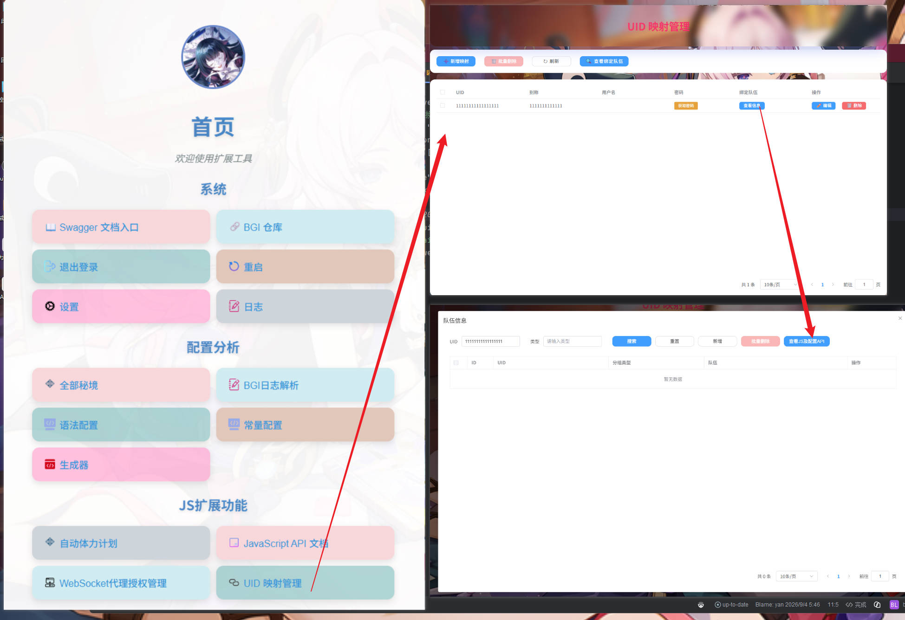
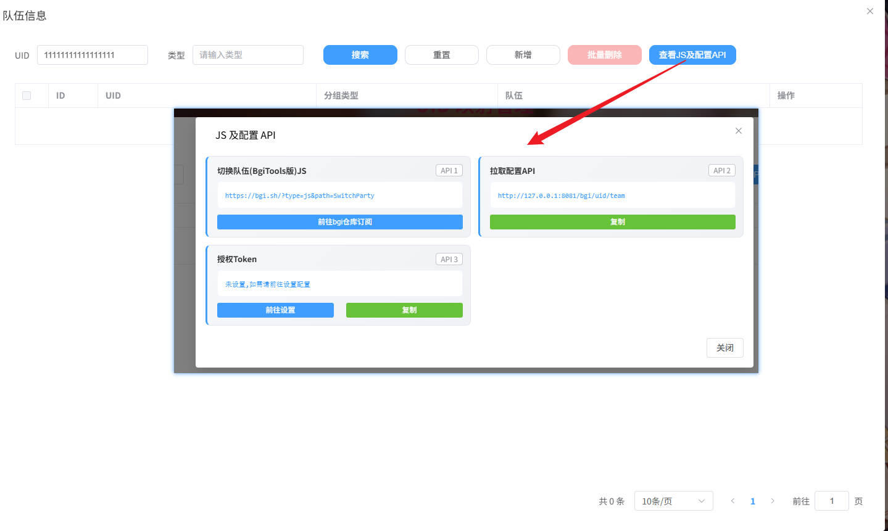

# 切换队伍（BgiTools版）

## 简介

该脚本用于 BetterGI 中自动切换原神队伍。支持两种加载模式：

- **输入加载**：手动在设置中填写队伍名称，脚本直接切换。
- **bgi_tools加载**：通过 BgiTools HTTP 接口查询当前 UID 对应的队伍信息，再自动完成切换。(需要JS HTTP权限支持)

## 功能特点

- 支持输入加载和 bgi_tools 加载两种模式
- 自动获取当前游戏 UID，并通过 HTTP 接口查询目标队伍
- 切换队伍失败时自动传送至七天神像并重试
- 支持自定义 Token 名称和值
- 完善的日志记录和错误通知

## 目录结构

```text
SwitchParty/
├── main.js                 # 脚本入口
├── manifest.json           # BetterGI 插件清单
├── settings.json           # 设置界面定义
├── assets/
│   └── ui/main_ui.png      # 主界面识别模板图
└── utils/
    ├── tools.js            # 通用工具类
    └── bgi_tools.js        # BgiTools API 请求封装
```

## 配置说明

| 设置项 | 类型 | 默认值 | 说明 |
|--------|------|--------|------|
| `auto_load` | 下拉选择 | `输入加载` | 加载模式，可选“输入加载”或“bgi_tools加载” |
| `team` | 文本框 | 空 | 队伍名称，适用于“输入加载”模式；留空表示不切换队伍 |
| `type` | 文本框 | 空 | 分组类型，适用于“bgi_tools加载”模式，会作为请求参数传给接口 |
| `bgi_tools_uid_team_api` | 文本框 | `http://127.0.0.1:8081/bgi/uid/team` | BgiTools HTTP API 地址 |
| `bgi_tools_token` | 文本框 | `Authorization= ` | BgiTools 鉴权 Token，格式为 `Token名=Token值` |

### 输入加载使用示例

- 加载模式：`输入加载`
- 队伍名称：`1`（请填写游戏内实际的队伍名称）
- 其他字段可留空

脚本会直接使用 `team` 作为目标队伍名称，调用 `genshin.switchParty(team)` 切换。

### bgi_tools 加载使用示例

- 加载模式：`bgi_tools加载`
- 分组类型：`独立`（可按需填写，用于在 BgiTools 侧分组）
- BgiTools HTTP API：`http://127.0.0.1:8081/bgi/uid/team` 请部署[bettergi-scripts-tools](https://github.com/Kirito520Asuna/bettergi-scripts-tools)(点击前往部署) v0.1.9以上版本
- Token 示例：`Authorization=你的Token值`
### bettergi-scripts-tools 使用演示



脚本运行逻辑如下：

1. 通过 `genshin.uid()` 获取当前游戏 UID。
2. 将 `uid` 和 `type` 作为查询参数请求配置的 API。
3. 从返回结果中取出 `team` 字段作为目标队伍名称。
4. 执行队伍切换。

请求格式：

```text
GET {bgi_tools_uid_team_api}?uid={uid}&type={type}
Headers:
  {Token名}: {Token值}
```

期望接口返回格式示例：

```json
{
  "code": 200,
  "message": "success",
  "data": {
    "id": "记录ID",
    "uid": "玩家UID",
    "team": "目标队伍名称",
    "type": "分组类型"
  }
}
```

> 注意：如果接口返回的 `code` 不是 `200`，脚本会记录错误日志并放弃切换。如果请求本身失败（网络异常、非 200 状态码等），同样会记录错误信息。

## 切换队伍逻辑

1. 根据配置的加载模式确定“目标队伍名称”。
2. 如果队伍名称非空，尝试调用 `genshin.switchParty(team)` 切换队伍。
3. 若切换失败，自动传送至七天神像，再次尝试切换。
4. 若依然失败或发生异常，会弹出错误通知，并返回游戏主界面，避免影响后续操作。

## 常见问题

### 1. 为什么提示“切换队伍失败”？

可能原因包括：

- 当前处于联机模式。
- 当前游戏场景不允许切换队伍，例如战斗状态或禁用区域。
- 队伍名称与游戏内实际配置不一致。
- 切换冷却时间未结束。

### 2. Token 应该怎么填？

如果 BgiTools 接口要求的鉴权头是：

```text
Authorization: xxxxx
```

则在设置中填写：

```text
Authorization=xxxxx
```

脚本会以等号分隔，将前半部分作为 Header 名称，后半部分作为 Header 值。

### 3. 接口返回正常但切换成功后又失败了？

请检查返回 JSON 中 `team` 字段是否与游戏内队伍名称完全一致，包括空格、大小写和特殊字符。

## 版本历史

- **v1.0.0**
    - 首个版本
    - 支持“输入加载”和“bgi_tools加载”两种队伍获取方式
    - 支持队伍切换失败后传送七天神像重试
