# 背包材料统计 v2.54  
作者：吉吉喵  

<!-- 新增：全局图片样式，控制连续图片同行显示 -->
<style>
  /* 1. 同行图片容器：解决Flex拉伸问题 */
  .img-row-container {
    display: flex;
    flex-wrap: wrap; /* 宽度不足时自动换行，避免挤压 */
    gap: 15px; /* 图片间距，避免紧贴 */
    justify-content: center; /* 整体居中，优化排版 */
    align-items: flex-start; /* 关键！禁止垂直拉伸，图片按自身高度排列 */
    margin: 15px 0;
    max-width: 100%; /* 避免容器超宽，适配编辑器宽度 */
  }

  /* 2. 图片核心样式：满足「X＜200px不缩放+等比例」 */
  .auto-scale-img {
    /* 小图保护：宽度＜200px时保持原始尺寸，不被拉伸 */
    width: auto; /* 禁止强制宽度，优先用原始宽度 */
    max-width: 100%; /* 小图（＜200px）时，宽度=原始宽度 */
    
    /* 大图缩放：宽度≥200px时，最大缩至600px（可自定义） */
    min-width: auto; /* 排除最小宽度限制 */
    max-width: 600px; /* 大图最大宽度，超过则等比例缩小 */
    
    /* 比例锁定：无论何种布局，都保持原始宽高比 */
    height: auto !important; /* 强制高度自动适配，覆盖所有拉伸样式 */
    object-fit: contain; /* 极端情况（如容器强制固定高度）下，确保图片完整且比例不变 */
    display: block; /* 避免图片下方多余空白 */
  }
</style>


## 一、简介  
可统计背包内养成道具、部分食物、素材的数量，并根据「设定目标数量」「材料刷新CD」自动执行挖矿、采集、刷怪等路径。  

### 核心优势  
1. **自动CD判断**：无需手动关注材料刷新状态，脚本自动识别CD是否就绪；  
2. **灵活路径管理**：支持自定义添加路径，自动排除低效/无效路径；  
3. **独立名单识别**：不与路边NPC、神像交互；可自定义识别名单（操作见「四、问题解答Q4」）；  
4. **实时弹窗保护**：内置弹窗模块（覆盖路边信件、过期物品、月卡、调查等场景），运行时全程保护路径不被弹窗干扰。  
5. **自动黑名单**：内置拾取模块，联动材料统计，可识别爆满的路径材料，自动屏蔽。  


## 二、用前须知  
1. 需具备基础电脑操作能力（如文件夹复制、路径查找）；  
2. 非1080p显示器，使用前需要根据显示器调整背包物品界面的 拖动距离 ，推荐“一次划页稍小于4行材料的距离”；  
3. 脚本不自带路径文件，需手动对目标文件夹进行操作（步骤见「三、使用方法」）。  


## 三、使用方法  
### 3.1 基础教程（路径配置）  
#### 步骤1：订阅路径文件  
在仓库中订阅所需的路径文件，参考以下截图操作：  
<div class="img-row-container">
  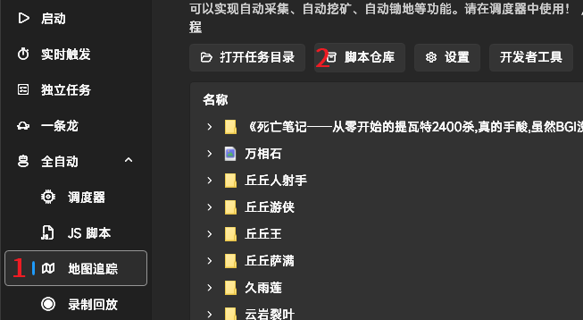
  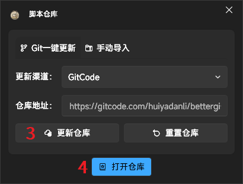
  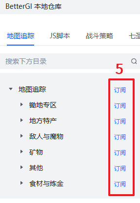
  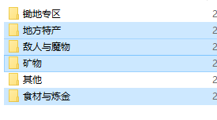
</div>

#### 步骤2：复制路径到目标文件夹  
1. 打开**路径源文件夹**（存放订阅的路径文件）：  
   ```
   BetterGI\Repos\bettergi-scripts-list-git\repo\pathing
   ```  
2. 根据需求，复制以下类型的路径文件夹（按需选择）：  
   - 地方特产  
   - 敌人与魔物  
   - 矿物  
   - 食材与炼金  
3. 粘贴到**脚本目标文件夹**（背包材料统计的路径读取目录）：  
   ```
   BetterGI\User\JsScript\背包材料统计\pathing
   ```  

#### 步骤2关键注意点  
- 手动删除重复路径（例如“萃凝晶”可能存在多个重复路径，需手动清理），参考截图：  
  <div class="img-row-container">
    
  </div>  
- `pathing` 文件夹仅支持**3层子文件夹**，若超过3层需手动削减（否则无法读取）；  
- 推荐优先配置「枫丹水下」路径：无队伍要求，但需提前开启水下锚点。  

#### 步骤3：按队伍分组管理路径  
建议复制多份「背包材料统计」脚本，按队伍功能分组存放适配路径，避免路径混乱。示例如下：  

| 分组名称               | 适配队伍组合                      | 适用场景                  | 特殊说明                          |  
|------------------------|-----------------------------------|---------------------------|-----------------------------------|  
| 背包统计采集组（生存队） | 迪希雅 + 芭芭拉 + 瑶瑶 + 草神    | 常规材料采集              | 无草神时，需批量搜索路径中“nahida_collect”并排除 |  
| 背包统计刷怪组         | 火神 + 奶奶 + 钟离 + 万叶        | 挂机刷怪（获取怪物材料、含战斗的采集）  | 确保队伍输出足够，能高效清理怪物  |  
| 背包统计附魔材料组     | 钟离 + 芭芭拉 + 久岐忍 + 砂糖/班尼特 | 附魔类采集（需特定附魔）  | 根据材料路径需求选择附魔角色，有战斗则增加输出角色      |  

分组示例与无草神排除路径操作截图：  
<div class="img-row-container">
  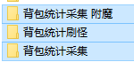
  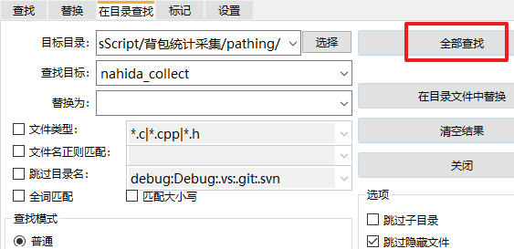
</div>

#### 步骤4：打开脚本自定义设置  
1. 找到配置组内已添加的「背包材料统计」JS；  
2. 右键点击该文件，选择「修改JS 脚本自定义设置」；  
3. 操作参考截图：  
   <div class="img-row-container">
     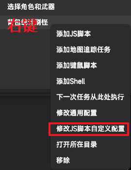
   </div>  


### 3.2 JS 自定义设置（核心配置项）  
| 配置项               | 功能说明                                                                 | 操作建议                                                                 |  
|----------------------|--------------------------------------------------------------------------|--------------------------------------------------------------------------|  
| 1. 目标数量          | 仅当背包材料数量**低于此值**时，该材料的路径才会被纳入执行序列           | 这是个统一值，管理路径下全部材料的目标数量                          |  
| 2. 优先级材料        | 无视“目标数量”限制，直接纳入执行序列顶层（最高优先级）                   | 填写当前急需材料（例：虹滴晶,巡陆艇）           |  
| 3. 时间成本          | 当一个路径有3-5次运行记录后，自动计算“单材料获取时间”；超过30秒则跳过该路径 | 保持默认30秒即可，无需频繁修改（可过滤低效路径）                          |  
| 4. 发送通知          | ① 每类材料跑完通知一次；② 全部材料跑完汇总通知一次（需开启BGI通知）      | 建议开启，方便实时了解进度（接收端如企业微信需自行配置）                   |  
| 5. 取消扫描          | 取消“每个路径执行后”的背包扫描，仅保留“全部执行前/后”2次扫描             | 有效路径记录达3条以上时可以开启，可节约运行时间                                     |  
| 6. 仅 pathing 材料   | 仅扫描 `pathing` 文件夹内的材料，跳过其他分类，大幅缩短扫描时间           | 路径配置完成后开启，提升脚本运行效率                                     |  
| 7. 弹窗名            | 不填则默认循环执行 `assets\imageClick` 文件夹下所有弹窗；填写则仅执行指定弹窗 | 推荐默认，需单独适配某类弹窗时填写（例：月卡,复苏）              |  
| 8. 采用的 CD 分类    | 不填则默认执行 `materialsCD` 文件夹内配置的CD分类；填写则仅执行指定CD分类          | 新增材料时，需在该文件夹同步配置CD规则（操作见「四、问题解答Q2」）         |  
| 9. 终止时刻    | 不填则不执行定时终止；路径无时间记录时，会预判路径耗时5分钟，且预留2分钟空闲          | 填写需要按24小时格式（例：4:10）         |  
| 10. 采用的识别名单    | 不填则默认执行 `targetText` 文件夹内配置的识别名单；填写则仅执行指定识别名单          | 新增名单时，需符合配置规则（操作见「四、问题解答Q4」）         |  
| 11. 超量阈值         | 首次扫描后，超量的路径材料，将从识别名单中剔除，默认5000          | 不推荐9999，怪物材料有几千就够了，采用默认数值，可自动避免爆背包         |  
| 12. 拖动距离         | 解决非1080p分辨率下“划页过头”问题，需调整到“一次划页≤4行”                | 拖动点建议选“第五行材料附近”；大于1080p屏可适当减小数值    |  


## 四、注意事项  
1. **禁止联机请求**：联机请求会遮挡背包菜单，导致材料识别失败。建议在本脚本前添加「AutoPermission」权限设置JS（仓库可查），默认禁止联机；  
2. **文件夹层级限制**：`pathing` 文件夹仅支持3层子文件夹，超过需手动削减（否则路径无法读取）；  
3. **食物识别强制要求**：背包食物界面**第一行必须包含8种食物**（苹果、日落果、星蕈、活化的星蕈、枯焦的星蕈、泡泡桔、烛伞蘑菇、美味的宝石闪闪），缺少则这些食物无法识别；  
4. **关键文件备份**：建议不定期备份 `pathing` 文件夹（路径文件）和 `pathing_record` 文件夹（路径运行记录），便于丢失后或记录被污染后恢复如初；  
5. **OCR配置**：默认最新，调整识别名单时，用的是V5Auto；  
6. **手动终止运行**：如果要终止JS运行，推荐在当前路径采集到当前材料前，或者采集完进入背包扫描时终止（会在扫描结束后终止），以保护当前记录；如果是【取消扫描】模式，不会储存当前记录的材料数目，就随意。  


## 五、问题解答  

### Q1：如何排除不想要的路径？  
A：1. 打开 `pathing` 文件夹（脚本路径：`BetterGI\User\JsScript\背包材料统计\pathing`）；  
   2. 直接删除/移走目标材料/怪物的路径文件夹；  
    **其他方法**：看「四、问题解答Q2」，按格式要求填入对应的材料名（或者从其他CD文件中复制过来），在「JS 自定义设置」【采用的 CD 分类】中输入新建的文件名，即可实现只加载该CD文件里材料的路径。  

### Q2：如何添加新材料？  
A：1. 打开 `materialsCD` 文件夹（脚本路径：`BetterGI\User\JsScript\背包材料统计\materialsCD`）；  
   2. 新建/编辑txt文件，按格式填写：`CD规则：材料1，材料2`（中文冒号+中文逗号，CD规则参考自带文件，例：“1次0点：月落银，宿影花，”），`材料1`或`材料2`将会作为标准名；  
   3. **关键要求**：路径文件夹名、材料图片名必须与“材料1或2”完全一致（多层文件夹默认读取最外层标准名文件夹）；  
   4. 操作参考截图：  
      <div class="img-row-container">
        
        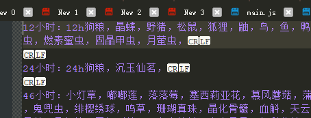
      </div>  

### Q3：如何识别不规范命名的路径文件夹（如“纳塔食材一条龙”、“果园.json”）？  
A：1. 将不规范的文件夹/文件，放入**适配的材料文件夹**中即可（路径CD由“所在材料文件夹”决定）。  
   2. 例：看「四、问题解答Q2」，① 把“纳塔食材一条龙”作为标准名，选择一个CD，② 在「JS 自定义设置」【优先级材料】里填入:纳塔食材一条龙，③将“纳塔食材一条龙”的文件夹放置到`pathing` 文件夹；锄地路径可放置到“锄地”文件夹里（没有就新建一个）**此方法无法使用 背包材料统计 的优选路径功能！**  
   3. 「JS 自定义设置」勾选【取消扫描】后，就可以运行了！**此项不勾，将无CD记录！**；  
   4. 例：“果园.json”放入“苹果”文件夹，将按“苹果”的CD规则执行。  
   操作参考截图：  
      <div class="img-row-container">
        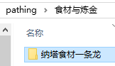
        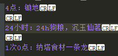
        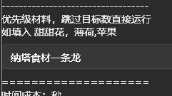
      </div>  


### Q4：如何自定义识别名单？  
A：1. 打开 `targetText` 文件夹（脚本路径：`BetterGI\User\JsScript\背包材料统计\targetText`）；  
   2. 新建/编辑txt文件，按格式填写：`自定义名称:目标1,目标2`（英文冒号+英文逗号，例：“新材料:霜盏花,便携轴承,”）；  
   3. 若需排除怪物掉落材料：找到“掉落.txt”，删除对应材料名即可；  
   4. 操作参考截图：  
      <div class="img-row-container">
        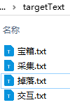
        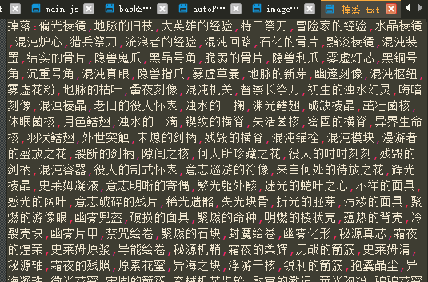
      </div>  

### Q5：如何取消路径执行后扫描背包？  
A：在「JS自定义设置」中勾选“取消扫描”（依旧会保留“全部材料执行始/末”的2次扫描）。  

### Q6：扫描背包少一行、拖动距离异常怎么办？  
A：在「JS自定义设置」中调整“拖动距离”，推荐“一次划页稍小于4行材料的距离”（拖动点建议选第5行材料附近）。  

### Q7：本地记录保存在哪里？  
A：记录文件夹位于 `BetterGI\User\JsScript\背包材料统计\` 下，各文件功能如下：  
   - `overwrite_record`：所有历史记录（按材料分类储存）；  
   - `history_record`：勾选“材料分类”后的专属记录；  
   - `latest_record.txt`：最近几种材料的记录（有上限，仅存最新数据）；  
   - `pathing_record`：单个路径的完整记录（含运行时间、收获量，需重点备份），材料收集汇总.txt（始末差值记录），标准名-0.txt（0收获记录）；  
   操作参考截图：  
   <div class="img-row-container">
     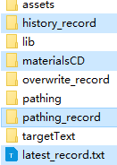
   </div>  


## 六、后言  
本脚本目前处于测试阶段，欢迎反馈问题至 QQ 频道号：bettergiv1。  


## 七、更新日志  
| 版本号  | 更新内容                                                                 |  
|---------|--------------------------------------------------------------------------|  
| v0.1    | 新增OCR名单功能，输出图片名与材料名                                      |  
| v1.0    | 新增图包（仅含素材）                                                     |  
| v1.1    | 图包扩展（素材+养成道具）                                                |  
| v1.2    | 新增识图分类功能                                                         |  
| v1.3    | 优化：加速材料寻找（新增前位材料识别）                                   |  
| v1.31   | 调整本地记录存储逻辑                                                     |  
| v1.32   | 新增后位材料识别功能                                                     |  
| v2.0    | 开发版：支持多组材料、多个分类；移除前/后位材料识别                       |  
| v2.1    | 新增CD管理功能                                                           |  
| v2.2    | 优化路径顺序、材料数量判断逻辑                                           |  
| v2.21   | 修改路径储存路径                                                         |  
| v2.22   | 精简日志输出内容                                                         |  
| v2.23   | 优化部分函数性能                                                         |  
| v2.24   | 修复“空路径无法使用背包统计”等bug                                        |  
| v2.25   | 恢复前/后位材料识别（加速扫描）；新增“仅扫描路径材料”选项（降低内存占用） |  
| v2.26   | 修复材料时间读取错误；新增路径材料时间成本计算功能                       |  
| v2.27   | 修复“材料数计算错误”“目标数量临界值异常”“3识别成三”等bug                 |  
| v2.28   | 材料变更时自动更新初始数量；排除0位移/0数量路径记录；新增材料名0后缀本地记录；新增背包弹窗识别 |  
| v2.29   | 新增排除提示；调整平均时间成本计算逻辑；过滤异常值记录                     |  
| v2.30   | 更改路径专注模式默认值；增加日志提示；移除调试日志                         |  
| v2.40   | 优化背包识别时的内存占用；新增通知功能                                   |  
| v2.41   | 修复“勾选分类的本地记录”bug；新增“仅背包统计”选项；补充记录损坏处理说明   |  
| v2.42   | 新增“无路径间扫描”“noRecord模式”（适合成熟路径）；新增怪物材料CD文件     |  
| v2.50   | 新增独立名单拾取、弹窗模块；支持怪物名识别                               |  
| v2.51   | 自定义设置新增“拖动距离/拖动点”；新增月卡弹窗识别；路径材料超量自动上黑名单；修复怪物0收获记录 |  
| v2.52   | 自定义设置新增“超量阈值”和“识别名单”输入框；新增多层弹窗逻辑              |  
| v2.54   | 自定义设置新增“终止时刻”，修复bug，新增“添加不规范命名的路径文件夹”说明，新增一个“锄地”的怪物路径CD              | 