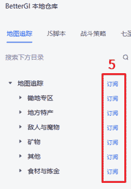
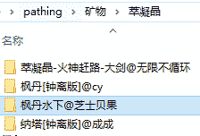
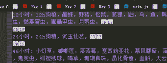

# 背包材料统计 v2.5  
作者：吉吉喵  


## 一、简介  
可统计背包内养成道具、部分食物、素材的数量，并根据「设定目标数量」「材料刷新CD」自动执行挖矿、采集、刷怪等路径。  

### 核心优势  
1. **自动CD判断**：无需手动关注材料刷新状态，脚本自动识别CD是否就绪；  
2. **灵活路径管理**：支持自定义添加路径，自动排除低效/无效路径；  
3. **独立名单识别**：不与路边NPC、神像交互；可自定义识别名单（操作见「四、问题解答」）；  
4. **实时弹窗保护**：内置弹窗模块（覆盖路边信件、过期物品、月卡、调查等场景），运行时全程保护路径不被弹窗干扰。  


## 二、用前须知  
1. 需具备基础电脑操作能力（如文件夹复制、路径查找）；  
2. 脚本不自带路径文件，需手动对目标文件夹进行操作（步骤见「三、使用方法」）。  


## 三、使用方法  
### 3.1 基础教程（路径配置）  
#### 步骤1：订阅路径文件  
在仓库中订阅所需的路径文件，参考以下截图操作：  
- 截图1：  
- 截图2：  
- 截图3：  
- 截图4：  

#### 步骤2：复制路径到目标文件夹  
1. 打开**路径源文件夹**（存放订阅的路径文件）：  
   ```
   BetterGI\Repos\bettergi-scripts-list-git\repo\pathing
   ```  
2. 根据需求，复制以下类型的路径文件夹（按需选择）：  
   - 地方特产  
   - 敌人与魔物  
   - 矿物  
   - 食材与炼金  
3. 粘贴到**脚本目标文件夹**（背包材料统计的路径读取目录）：  
   ```
   BetterGI\User\JsScript\背包材料统计\pathing
   ```  

#### 步骤2关键注意点  
- 手动删除重复路径（例如“萃凝晶”可能存在多个重复路径，需手动清理），参考截图：；  
- `pathing` 文件夹仅支持**3层子文件夹**，若超过3层需手动削减（否则无法读取）；  
- 推荐优先配置「枫丹水下」路径：无队伍要求，但需提前开启水下锚点。  

#### 步骤3：按队伍分组管理路径  
建议复制多份「背包材料统计」脚本，按队伍功能分组存放适配路径，避免路径混乱。示例如下：  

| 分组名称               | 适配队伍组合                      | 适用场景                  | 特殊说明                          |  
|------------------------|-----------------------------------|---------------------------|-----------------------------------|  
| 背包统计采集组（生存队） | 迪希雅 + 芭芭拉 + 瑶瑶 + 草神    | 常规材料采集              | 无草神时，需批量搜索路径中“nahida_collect”并排除 |  
| 背包统计刷怪组         | 火神 + 奶奶 + 钟离 + 万叶        | 挂机刷怪（获取怪物材料）  | 确保队伍输出足够，能高效清理怪物  |  
| 背包统计附魔材料组     | 钟离 + 芭芭拉 + 久岐忍 + 砂糖/班尼特 | 附魔类采集（需特定附魔）  | 适配需附魔才能获取的材料路径      |  

分组示例参考截图：  
无草神时排除路径操作参考截图：  

#### 步骤4：打开脚本自定义设置  
1. 找到「背包材料统计.js」文件；  
2. 右键点击该文件，选择「JS 修改脚本自定义设置」；  
3. 操作参考截图：  


### 3.2 JS 自定义设置（核心配置项）  
| 配置项               | 功能说明                                                                 | 操作建议                                                                 |  
|----------------------|--------------------------------------------------------------------------|--------------------------------------------------------------------------|  
| 1. 目标数量          | 仅当背包材料数量**低于此值**时，该材料的路径才会被纳入执行序列           | 这是个统一值，管理路径下全部材料的目标数量                          |  
| 2. 优先级材料        | 无视“目标数量”限制，直接纳入执行序列顶层（最高优先级）                   | 填写当前急需材料（例：“虹滴晶”“巡陆艇”）           |  
| 3. 时间成本          | 当一个路径有3-5次运行记录后，自动计算“单材料获取时间”；超过30秒则跳过该路径 | 保持默认30秒即可，无需频繁修改（可过滤低效路径）                          |  
| 4. 发送通知          | ① 每类材料跑完通知一次；② 全部材料跑完汇总通知一次（需开启BGI通知）      | 建议开启，方便实时了解进度（接收端如企业微信需自行配置）                   |  
| 5. 取消扫描          | 取消“每个路径执行后”的背包扫描，仅保留“全部执行前/后”2次扫描             | 路径记录足够多时开启，可节约运行时间                                     |  
| 6. 仅 pathing 材料   | 仅扫描 `pathing` 文件夹内的材料，跳过其他分类，大幅缩短扫描时间           | 路径配置完成后开启，提升脚本运行效率                                     |  
| 7. 弹窗名            | 不填则默认循环执行 `assets\imageClick` 文件夹下所有弹窗；填写则仅执行指定弹窗 | 推荐默认，需单独适配某类弹窗时填写（例：仅处理月卡弹窗则填：月卡）              |  
| 8. 采用的 CD 分类    | 仅执行 `materialsCD` 文件夹内配置的材料路径（支持新增CD分类txt）          | 新增材料时，需在该文件夹同步配置CD规则（操作见「四、问题解答4」）         |  
| 9. 拖动距离          | 解决非1080p分辨率下“划页过头”问题，需调整到“一次划页≤4行”                | 拖动点建议选“第五行材料附近”；大于1080p屏可适当减小数值    |  


## 四、注意事项  
1. **禁止联机请求**：联机请求会遮挡背包菜单，导致材料识别失败。建议在本脚本前添加「AutoPermission」权限设置JS（仓库可查），自动禁止联机；  
2. **文件夹层级限制**：`pathing` 文件夹仅支持3层子文件夹，超过需手动削减（否则路径无法读取）；  
3. **食物识别强制要求**：背包食物界面**第一行必须包含8种食物**（苹果、日落果、星蕈、活化的星蕈、枯焦的星蕈、泡泡桔、烛伞蘑菇、美味的宝石闪闪），缺少则这些食物无法识别；  
4. **关键文件备份**：定期备份 `pathing` 文件夹（路径文件）和 `pathing_record` 文件夹（路径运行记录），丢失后需重新配置/统计。  


## 五、问题解答  
### Q1：如何排除不想要的路径？  
A：1. 打开 `pathing` 文件夹（脚本路径：`BetterGI\User\JsScript\背包材料统计\pathing`）；  
   2. 直接删除/移走目标材料/怪物的路径文件夹；  
   3. **注意**：不要将路径文件放入 `targetText` 或 `materialsCD` 文件夹（这两个文件夹默认全部读取，也会被更新覆盖）。  

### Q2：如何增减识别名单？  
A：1. 打开 `targetText` 文件夹（脚本路径：`BetterGI\User\JsScript\背包材料统计\targetText`）；  
   2. 新建/编辑txt文件，按格式填写：`自定义名称:目标1,目标2`（英文冒号+英文逗号，例：“新材料:霜盏花,便携轴承”）；  
   3. 若需排除怪物掉落材料：找到“掉落.txt”，删除对应材料名即可；  
   4. 操作参考截图：  
      - 截图1：  
      - 截图2：  

### Q3：如何识别不规范命名的路径文件夹（如“纳塔食材一条龙”“果园.json”）？  
A：将不规范的文件夹/文件，放入**适配的材料文件夹**中即可（路径CD由“所在材料文件夹”决定）。  
   例：“果园.json”放入“苹果”文件夹，将按“苹果”的CD规则执行。  

### Q4：如何识别自带CD文件中没有的材料（如新材料、新木头）？  
A：1. 打开 `materialsCD` 文件夹（脚本路径：`BetterGI\User\JsScript\背包材料统计\materialsCD`）；  
   2. 新建/编辑txt文件，按格式填写：`CD规则：材料1，材料2`（中文冒号+中文逗号，CD规则参考自带文件，例：“1次0点：月落银，宿影花”）；  
   3. **关键要求**：路径文件夹名、材料图片名必须与“材料1/2”完全一致（多层文件夹默认读取最外层同名文件夹）；  
   4. 操作参考截图：  
      - 截图1：  
      - 截图2：  

### Q5：如何避免每次路径执行后都扫描背包？  
A：在「JS自定义设置」中勾选“取消扫描”（仅保留“全部材料执行始/末”的2次扫描，节约时间）。  

### Q6：扫描背包少一行、拖动距离异常怎么办？  
A：在「JS自定义设置」中调整“拖动距离”，直到“一次划页仅显示≤4行材料”（拖动点建议选第5行材料附近）。  

### Q7：本地记录保存在哪里？  
A：记录文件夹位于 `BetterGI\User\JsScript\背包材料统计\` 下，各文件功能如下：  
   - `overwrite_record`：所有历史记录（按材料分类储存）；  
   - `history_record`：勾选“材料分类”后的专属记录；  
   - `latest_record.txt`：最近几种材料的记录（有上限，仅存最新数据）；  
   - `pathing_record`：单个路径的完整记录（含运行时间、收获量，需重点备份）；  
   操作参考截图：  


## 六、后言  
本脚本目前处于测试阶段，欢迎反馈问题至 QQ 频道号：bettergiv1。  


## 七、更新日志  
| 版本号  | 更新内容                                                                 |  
|---------|--------------------------------------------------------------------------|  
| v0.1    | 新增OCR名单功能，输出图片名与材料名                                      |  
| v1.0    | 新增图包（仅含素材）                                                     |  
| v1.1    | 图包扩展（素材+养成道具）                                                |  
| v1.2    | 新增识图分类功能                                                         |  
| v1.3    | 优化：加速材料寻找（新增前位材料识别）                                   |  
| v1.31   | 调整本地记录存储逻辑                                                     |  
| v1.32   | 新增后位材料识别功能                                                     |  
| v2.0    | 开发版：支持多组材料、多个分类；移除前/后位材料识别                       |  
| v2.1    | 新增CD管理功能                                                           |  
| v2.2    | 优化路径顺序、材料数量判断逻辑                                           |  
| v2.21   | 修改路径储存路径                                                         |  
| v2.22   | 精简日志输出内容                                                         |  
| v2.23   | 优化部分函数性能                                                         |  
| v2.24   | 修复“空路径无法使用背包统计”等bug                                        |  
| v2.25   | 恢复前/后位材料识别（加速扫描）；新增“仅扫描路径材料”选项（降低内存占用） |  
| v2.26   | 修复材料时间读取错误；新增路径材料时间成本计算功能                       |  
| v2.27   | 修复“材料数计算错误”“目标数量临界值异常”“3识别成三”等bug                 |  
| v2.28   | 材料变更时自动更新初始数量；排除0位移/0数量路径记录；新增材料名0后缀本地记录；新增背包弹窗识别 |  
| v2.29   | 新增排除提示；调整平均时间成本计算逻辑；过滤异常值记录                     |  
| v2.30   | 更改路径专注模式默认值；增加日志提示；移除调试日志                         |  
| v2.40   | 优化背包识别时的内存占用；新增通知功能                                   |  
| v2.41   | 修复“勾选分类的本地记录”bug；新增“仅背包统计”选项；补充记录损坏处理说明   |  
| v2.42   | 新增“无路径间扫描”“noRecord模式”（适合成熟路径）；新增怪物材料CD文件     |  
| v2.50   | 新增独立名单拾取、弹窗模块；支持怪物名识别                               |  
| v2.51   | 自定义设置新增“拖动距离/拖动点”；新增月卡弹窗识别；路径材料9999自动黑名单；修复怪物0收获记录 |