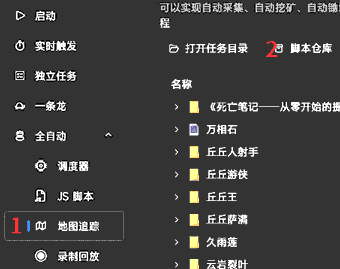
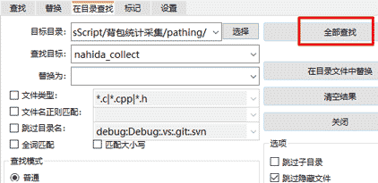

# 背包材料统计 v2.5

## 简介
可统计背包养成道具、部分食物、素材的数量；根据设定数量、根据材料刷新 CD 执行挖矿、采集、刷怪等的路径。
 **背包材料统计 v2.5优势 **
+ 1. 自动判断材料 CD，不需要管材料 CD 有没有好；
+ 2. 可以随意添加路径，能自动排除低效、无效路径；
+ 3. 有独立名单识别，不会交互路边的 NPC 或是神像；可自定义识别名单，具体方法看【问题解答】增减识别名单；
+ 4. 有实时的弹窗模块，提供了常见的几种：路边信件、过期物品、月卡、调查。

## 用前须知
要有一点的动手能力！该 JS 不提供路径文件，需要动手对文件夹一定操作。

## 使用方法：

### 基础教程
+ 1. 仓库订阅所需路径文件；   
+ 2. 打开路径所在文件夹 `BetterGI\Repos\bettergi-scripts-list-git\repo\pathing`，  根据需要将地方特产、敌人与魔物、矿物、食材与炼金 选择复制到背包材料统计 JS 目录 `BetterGI\User\JsScript\背包材料统计\pathing` 中；最好手动去除重复多余路径；`pathing` 下只能读取 3 层文件夹，如 `pathing` 文件夹下有 4 层或以上子文件夹，请削减到 3 层；
+ 3. 推荐根据队伍来把路径分组放置。例如： 
   * 背包统计采集组，生存队：迪希雅 芭芭拉 瑶瑶 草神。适合一般情况下的采集；
   * 背包统计刷怪组，适合挂机输出的队：火神 奶奶 钟离 万叶，能够胜任需要刷怪的路径；
   * 背包统计附魔材料组，附魔队：钟离 芭芭拉 久岐忍 砂糖或班尼特，适合附魔采集；
   每组都要复制一份背包材料统计，用于放置适合的路径。如果没有草神，记得在路径里批量搜索"nahida_collect"，排除需要纳西妲的路径。  
   需要手动排除重复路径，如：萃凝晶  这么多个，个人推荐 枫丹水下，无队伍要求，就是需要先开启水下锚点；

+ 4. 找到背包材料统计 JS，右键背包材料统计，选择 JS 修改脚本自定义设置。  

### JS 的自定义设置
+ 1. **目标数量**：扫描背包中材料数量，只有低于目标的材料，其路径才会被纳入执行序列；
+ 2. **优先级材料**：最高优先级，直接无视上述目标数量，纳入执行序列最顶层；
+ 3. **时间成本**：在一个路径存在 3 到 5 次记录时，会计算时间成本，单个材料获取时间超过默认 30 秒的，则跳过；
+ 4. **发送通知**：每类材料跑完会通知一次，全部材料跑完会汇总通知一次。需在 BGI 通知里开启，接收端企业微信的使用自行寻找；
+ 5. **取消扫描**：取消每个路径执行完的扫描；当大部分需要的路径都有足够多记录，可以不扫描以节约时间；但全部材料执行始末会各扫一次，以汇总材料信息；
+ 6. **仅 pathing 材料**：平衡背包材料统计和路径 CD 管理的选项；选择仅 pathing 材料，则直接无视下方勾选的材料分类，只扫描 `pathing` 文件夹已有的路径材料，没有的就不扫，以缩短扫描时间；
+ 7. **弹窗名**：不填默认 `assets\imageClick` 文件夹下所有弹窗循环执行；弹窗模块会在背包统计运行时全程保护路径，防止弹窗影响路径执行；
+ 8. **采用的 CD 分类**：不在 `materialsCD` 文件夹的不执行，这个文件夹可以按格式新增材料 CD 分类 txt，只要背包材料统计的图库里有，路径所在的文件夹名正确，就能按 CD 执行；
+ 9. **拖动距离**：显示器分辨率不是1080p的可能会出现划页过头的情况，缩小这个值，调整到一次划页小于4行；拖动点的坐标自己看着办，一般在第五行材料附近就行。

## 注意事项
+ 1. 联机请求会遮挡背包菜单导致识别不到类别，建议在背包统计JS前加一个仓库有的AutoPermission权限设置JS，以禁止联机；
+ 2. `pathing` 下只能读取 3 层文件夹，如 `pathing` 文件夹下有 4 层或以上的子文件夹，请削减到 3 层；
+ 3. 推荐根据功能需求来把路径分组放置。复制多份背包材料统计，分别加上采集、刷怪、附魔材料后缀，用于管理一般情况下的采集路径、能够胜任需要战斗的路径、需求附魔采集的路径；
+ 4. 因食物部分图片未补足，为适配快速滑页，背包食物界面，苹果、日落果、星蕈、活化的星蕈、枯焦的星蕈、泡泡桔、烛伞蘑菇、美味的宝石闪闪，这八个食物必须有，且在第一行。不然这几个食物会无法识别。

## 问题解答
+ 1. **如果不想要某些路径怎么排除？**  
  直接进 `pathing` 文件夹，把该材料名或者该怪物名路径文件夹移走或者删除；切记不要把路径文件放入 `targetText` 和 `materialsCD` 这两个文件夹。
+ 2. **如果想要增减识别名单怎么做？**  
  直接进 `targetText` 文件夹，选择或者新建一份 txt  ，名字随意，内容按格式，英文冒号前的名字可随便写；  冒号后的文字会被当成目标来识别，用英文逗号分割；如果想刷某类怪，但不想要拾取其怪物材料，可以找到掉落.txt，删除不要的材料名。
+ 3. **如果想要识别不规范命名的路径文件夹怎么做？**  
  比如纳塔食材一条龙或者果园.json。方法：把纳塔食材一条龙文件夹或者果园.json 丢进一个适配的材料文件夹里，CD 要符合，因为 CD 选择是由所在的材料名文件夹决定；果园.json 可以丢到苹果文件夹里。
+ 4. **如果想要识别自带 CD 文件中没有的材料怎么做？**  
  比如新材料新木头；打开 `materialsCD` 文件夹，  选择或者新建一份 txt，名字随意，内容按格式，中文冒号前的名字也要按格式，具体参考自带的 CD 文件，如几点，几小时，几次 0 点；  冒号后的文字会被当成目标来识别，用中文逗号分割；注意这个文字就是作为 JS 里的标准名，路径所在文件夹名和材料图片名都必须和它一致；多层套叠的文件夹会默认选择符合标准名的那个，如有同名套叠会选最外层那个。
+ 5. **如果不想要每次路径都扫描背包怎么做？**  
  具体方法看【JS 的自定义设置】取消扫描。
+ 6. **如果扫描背包少一行、拖动距离不正常距离怎么办？**  
  具体方法看【JS 的自定义设置】拖动距离。
+ 7. **本地记录在哪**    
  overwrite_record文件夹是所有的历史记录按【分类】储存；
  history_record文件夹是勾选【材料分类】的专属记录；
  latest_record.txt是最近一些记录；
  pathing_record 是单个路径的全部记录，包括运行始末时间、收获，是优选记录的核心资料，记得备份pathing文件夹和pathing_record文件夹！！！
  这些记录都有上限，尤其是latest_record.txt可能只记录最近几个材料的！！！

## 后言
本脚本目前处于测试阶段，欢迎反馈问题至 QQ 频道号: bettergiv1。

## 更新日志
+ v0.1 OCR 名单 输出图片名和材料名  
+ v1.0 图包(素材)  
+ v1.1 图包(素材+养成道具)  
+ v1.2 识图分类  
+ v1.3 加速寻找(前位材料识别)  
+ v1.31 本地保存调整  
+ v1.32 新增后位材料识别  
+ v2.0 多组材料多个分类 开发版  
- v2.0 前、后位材料识别  
+ v2.1 CD 管理版  
+ v2.2 路径顺序 材料数量优化  
+ v2.21 储存路径修改  
+ v2.22 精简 log  
+ v2.23 优化部分函数  
+ v2.24 修复不能空路径使用背包统计功能等 bug  
+ v2.25 当前、后位材料识别（加速扫描），新增只扫描路径材料名选项（内存占用更小）  
+ v2.26 修复读取材料时间错误等 bug，新增路径材料时间成本计算  
+ v2.27 修复计算材料数错误、目标数量临界值、“3”识别成“三”等 bug  
+ v2.28 材料变更时初始数量更新；正常记录排除 0 位移和 0 数量的路径记录(可能是卡路径，需手动根据 0 记录去甄别)，新增材料名 0 后缀本地记录；新增背包弹窗识别  
+ v2.29 新增排除提示；调整平均时间成本计算；过滤掉差异较大的记录  
+ v2.30 更改路径专注模式默认值，加 log 提示；去除注释掉的调试 log  
+ v2.40 优化背包识别时占用的内存；增加通知  
+ v2.41 修复勾选分类的本地记录 bug，新增仅背包统计选项；如果本地记录已经遭到破坏，比如每条路径都产生大量材料名-0.txt，就只能手动清理或者删除本地记录 pathing_record，重新跑  
+ v2.42 增加无路径间的扫描、无数量记录的 noRecord 模式，适合路径记录已经炼成的玩家。新增怪物材料 CD 文件，以支持轻度刷怪需求  
+ v2.50 增加独立名单拾取，增加弹窗模块，这两个是背包材料统计 JS 运行时实时运行。增加对怪物名的支持  
+ v2.51 自定义设置增加拖动距离、拖动点，增加月卡弹窗识别，增加路径材料9999自动黑名单，修复怪物0收获记录
